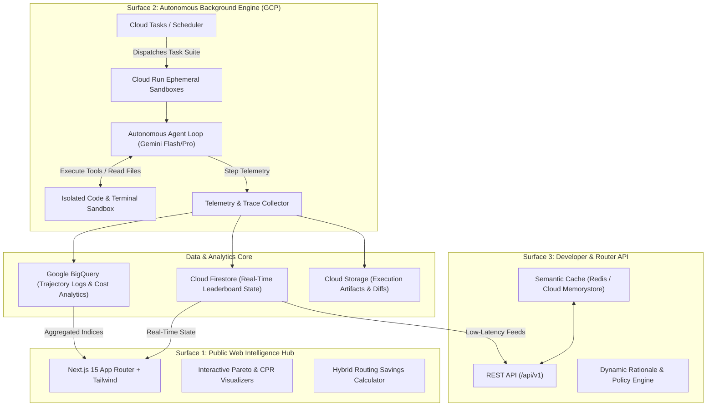
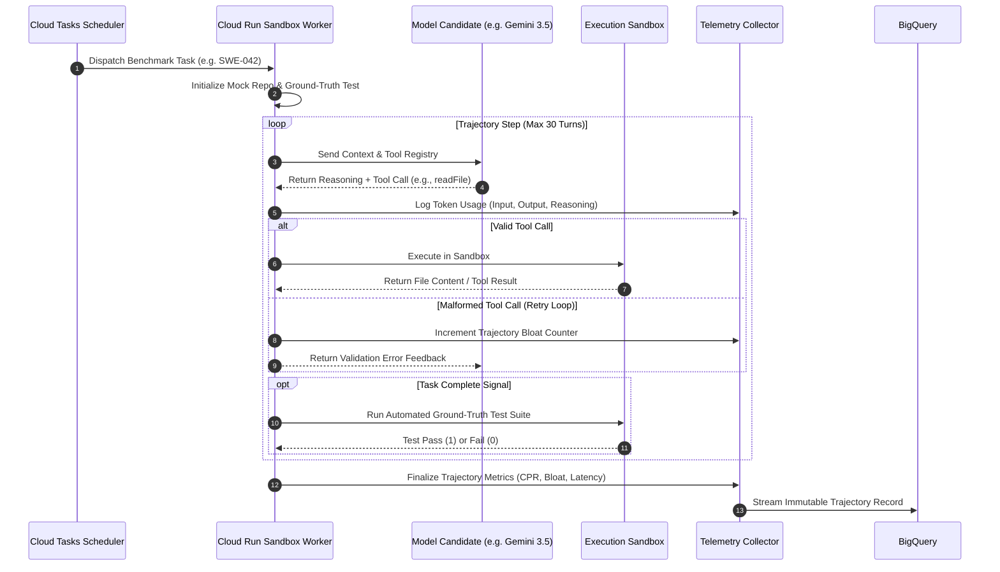

# 03. System Architecture & Technical Design

## 🏗️ High-Level System Architecture

Benchpress is engineered as a **tri-surface, distributed agentic platform** designed for high-concurrency background execution, real-time telemetry aggregation, and sub-50ms API delivery.



---

## 🎯 The Three Core Surfaces

### 1. Surface 1: Public Web Intelligence Hub
* **Frontend Framework:** Next.js 15 (React 19, App Router, TypeScript).
* **Styling & Components:** Tailwind CSS, Lucide Icons, Framer Motion animations.
* **Data Visualizations:** Recharts for dynamic Pareto efficiency frontiers, Cost Per Resolution scatterplots, and context degradation curves.
* **State Management:** Zustand for client-side filtering, custom model weighting, and instant calculation simulations.

### 2. Surface 2: Autonomous Background Trajectory Runner Engine
* **Execution Orchestrator:** Google Cloud Tasks and Cloud Run services.
* **Worker Sandboxes:** Ephemeral, isolated containers with mock file systems, git trees, terminal access, and external API simulators.
* **Agent Trajectory Loop:**
  1. **Perception:** Ingests task instruction, system prompt, and tool definitions.
  2. **Reasoning:** Dispatches prompt to candidate model (or routed model pair) with configurable `thinking_effort`.
  3. **Tool Invocation:** Intercepts function calls, validates schema, and executes in the sandbox.
  4. **Self-Healing Loop:** If a tool call fails, measures whether the agent autonomously recovers or falls into an infinite retry loop.
  5. **Resolution Verification:** Runs automated unit tests and ground-truth assertions to verify task completion (`Pass@1`).

### 3. Surface 3: Developer API & Justification Engine
* **Protocol:** OpenAPI 3.0 compliant REST API.
* **Throughput Target:** Sub-50ms response latency via edge caching and pre-computed composite indices.
* **Rationale Generator:** Generates verifiable, human-readable justification strings when model routing recommendations are queried.

---

## 🔄 Trajectory Execution Sequence



---

## 📊 BigQuery Data Schema (Trajectory Telemetry)

```sql
CREATE TABLE `benchpress.telemetry.trajectories` (
  run_id STRING NOT NULL,
  timestamp TIMESTAMP DEFAULT CURRENT_TIMESTAMP(),
  model_id STRING NOT NULL,
  model_family STRING NOT NULL,
  routing_recipe STRING, -- e.g. "Gemini-2.5-Pro + Gemini-3.5-Flash"
  task_suite STRING NOT NULL, -- e.g. "swe_bench_verified", "financial_recon", "multi_doc_ops"
  task_id STRING NOT NULL,
  task_complexity_score INT64, -- 1 to 5
  turns_count INT64 NOT NULL,
  total_input_tokens INT64 NOT NULL,
  total_output_tokens INT64 NOT NULL,
  total_reasoning_tokens INT64 NOT NULL,
  cached_tokens_read INT64,
  dollar_cost_incurred FLOAT64 NOT NULL,
  time_to_resolution_ms INT64 NOT NULL,
  tool_calls_attempted INT64 NOT NULL,
  tool_calls_failed INT64 NOT NULL,
  trajectory_bloat_ratio FLOAT64 NOT NULL,
  task_resolved_bool BOOLEAN NOT NULL,
  error_trace_json STRING
);
```

---

## ⚡ Caching & Performance Optimizations
1. **Tiered Semantic Caching:** Pre-computes leaderboard rankings, Pareto frontier coordinates, and routing recommendations every 15 minutes.
2. **Context Window Management:** Strips redundant conversation history prior to evaluating context-rot boundaries.
3. **Async Batch Flushing:** Telemetry streams write in micro-batches to BigQuery to prevent execution bottlenecks.
