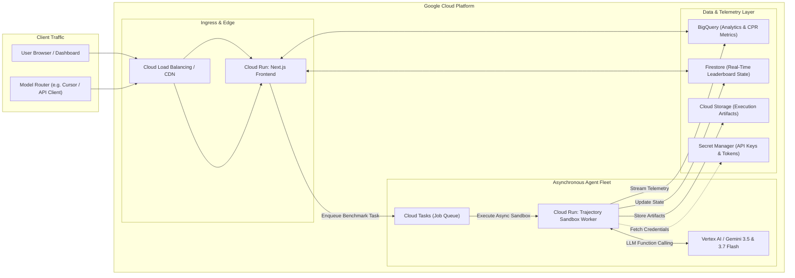

# 05. Google Cloud Infrastructure & Deployment Guide

## ☁️ Google Cloud Architecture Overview

Benchpress is designed as a **cloud-native, event-driven infrastructure** hosted entirely on Google Cloud Platform (GCP).



---

## 🛠️ GCP Services & Component Roles

| Service | Role in Benchpress Architecture |
| :--- | :--- |
| **Google Cloud Run** | Hosts both the **Next.js 15 Web Application** and the **Ephemeral Trajectory Sandbox Workers** with automatic zero-scaling and high concurrency. |
| **Google Cloud Tasks** | Manages the background task queue, ensuring thousands of evaluation runs execute asynchronously without starving web workers. |
| **Google BigQuery** | Serves as the central analytical data warehouse, running high-speed aggregate SQL queries over millions of historical token and trajectory metrics. |
| **Google Cloud Firestore** | Provides sub-millisecond document lookups for real-time leaderboard rankings, model profiles, and live execution status updates. |
| **Google Vertex AI** | Executes test trajectories across **Gemini 3.5 Flash**, **Gemini 3.7 Flash**, and **Gemini 2.5 Pro**, utilizing native function-calling and multimodal understanding. |
| **Google Cloud Storage** | Stores raw benchmark test suites, diff patches, repository snapshots, and execution logs. |
| **Google Secret Manager** | Securely manages model API keys, database credentials, and runner authentication tokens. |

---

## 🚀 Local Development Setup

### Prerequisites
* **Node.js:** v20.0.0 or higher
* **npm:** v10.0.0 or higher
* **Git:** v2.40+
* **Google Cloud SDK (`gcloud`):** (Optional for local testing with simulated mock telemetry)

### Step 1: Clone the Repository
```bash
git clone https://github.com/lx-singw/benchpress.git
cd benchpress
```

### Step 2: Install Dependencies
```bash
npm install
```

### Step 3: Configure Environment Variables
Create a `.env.local` file in the project root:
```env
# Google Gemini API / Vertex AI Configuration
GEMINI_API_KEY=your_gemini_api_key_here
NEXT_PUBLIC_APP_URL=http://localhost:3000

# Optional GCP Settings (for live telemetry streaming)
GOOGLE_CLOUD_PROJECT=your_gcp_project_id
BIGQUERY_DATASET=benchpress_telemetry
FIRESTORE_COLLECTION=leaderboard_v1
```

### Step 4: Run Development Server
```bash
npm run dev
```
Open [http://localhost:3000](http://localhost:3000) in your browser.

---

## 🚢 Google Cloud Deployment (Cloud Run)

Deploy the unified Next.js application to Google Cloud Run using the `gcloud` CLI:

```bash
# 1. Build and submit container image to Google Artifact Registry
gcloud builds submit --tag gcr.io/$GOOGLE_CLOUD_PROJECT/benchpress:latest

# 2. Deploy to Cloud Run with auto-scaling
gcloud run deploy benchpress \
  --image gcr.io/$GOOGLE_CLOUD_PROJECT/benchpress:latest \
  --platform managed \
  --region us-central1 \
  --allow-unauthenticated \
  --set-env-vars GEMINI_API_KEY=$GEMINI_API_KEY \
  --memory 2Gi \
  --cpu 2 \
  --min-instances 1 \
  --max-instances 10
```
