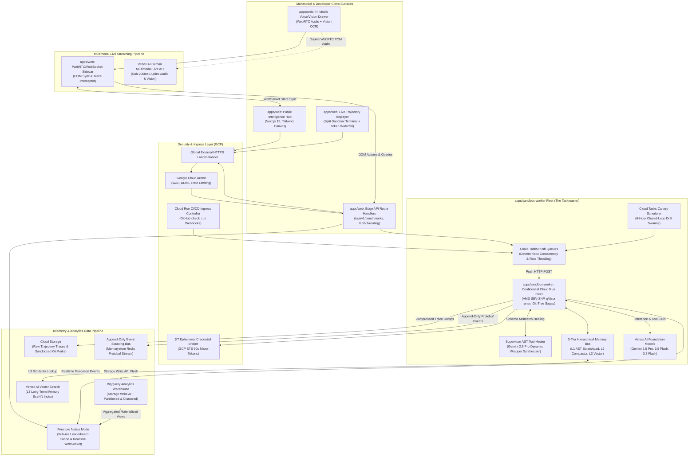

# Benchpress Master Documentation Suite 🏋️‍♂️

> **The Independent Economic & Trajectory Intelligence Platform for AI Agents & Model Routing**  
> *"Artificial Analysis for the Agentic Era"*  
> **Target Competition:** Google Cloud All Things Agentic Hackathon (2026)  
> **Target Prizes:**  
> 1. **Grand Prize & Venture-Grade Platform**  
> 2. **Best Architectural Design** ($5,000 USD + $1,000 GCP Credits)  
> 3. **Best Multimodal UX** ($5,000 USD + $1,000 GCP Credits)  
> 4. **Primary Track: The Taskmaster** (Event-driven asynchronous agent fleets, massive data telemetry)  
> 5. **The Fortified Enterprise Fleet** (Enterprise security, sandboxing & governance)

---

## 🧭 Executive Summary & Value Proposition

**Benchpress** is the industry's first independent, verifiable economic benchmark and multi-turn trajectory intelligence engine for autonomous AI agents and dynamic model routing.

As software engineering and enterprise workflows transition from single-prompt LLM completions to multi-turn, multi-tool agentic loops, traditional static benchmarks (e.g., MMLU, HumanEval) fail completely. In real-world agentic execution:
1. **Pass@1 is an incomplete metric:** An agent achieving 85% accuracy by burning $4.50 and 42 tool turns per task is commercially unviable compared to an agent achieving 82% accuracy at $0.18 and 4 turns.
2. **Context Degradation is real:** Agent accuracy degrades non-linearly as multi-turn scratchpads and tool outputs fill the context window.
3. **Monolithic routing is wasteful:** Routing all queries to massive frontier models burns millions in unnecessary inference costs.

Benchpress solves this crisis with a **Streamlined 2-Service Monorepo Architecture**:
- **Service 1 (`apps/web`):** Unified Next.js 15 App Router (React 19, TypeScript, Tailwind CSS, Turbopack) hosting the Obsidian Dark Glassmorphism UI, Tri-Modal WebRTC Audio/Vision clients, and Edge REST API Route Handlers (`/api/v1/*`) that dispatch directly to Cloud Tasks.
- **Service 2 (`apps/sandbox-worker`):** Python 3.12 Cloud Run Gen2 execution engine running the 13-State Enhanced FSM inside gVisor `runsc` sandboxes with the Supervisor AST Healer, Git Saga Rollbacks, and BigQuery Storage Write API.
- **The 5 Autonomous Breakthrough Pillars:** Closed-Loop Self-Tuning Router, Supervisor AST Tool-Healer, Predictive Budget Sentinel, CI/CD Crash-to-PR Auto-Remediation Daemon, and Real-Time Economic Arbitrage Engine.
- **The 5 Architectural Breakthroughs:** Immutable Event-Sourced Trajectories, 3-Tier Hierarchical Memory Compactor, JIT Ephemeral Credential Broker, Git-Tree Compensating Sagas, and Automated Chaos Resilience Mesh.

---

## 🏛️ Master Monorepo & Cloud Architecture Topology

---

## 📑 Complete 12-Folder Master Documentation Taxonomy

The complete documentation suite comprises **66 production-grade technical specifications** organized into 12 core domains:

| Domain | Document Path | Category & Core Topics | Target Hackathon Track |
| :--- | :--- | :--- | :--- |
| **0. Master Index** | [**`docs/README.md`**](./README.md) | Master Navigation Index & Complete Architecture Map | All Tracks |
| **1. Architecture** | [**`01-system-overview-c4.md`**](./architecture/01-system-overview-c4.md) | C4 Context, Container, Component, and Code Sequence Models | 🏛️ **Best Architectural Design** ($5k) |
| | [**`02-agentic-runtime-and-fsm.md`**](./architecture/02-agentic-runtime-and-fsm.md) | 13-State FSM, Git-Tree Sagas, Supervisor Healer & Markov Sentinel | 🏛️ **Best Architectural Design** ($5k) |
| | [**`03-data-pipeline-and-bigquery.md`**](./architecture/03-data-pipeline-and-bigquery.md) | BigQuery Storage Write API, Redis Buffer & DDL SQL Schemas | 🏛️ **Best Architectural Design** ($5k) |
| | [**`04-gcp-infrastructure-iac.md`**](./architecture/04-gcp-infrastructure-iac.md) | Production Terraform HCL Manifests & GitHub Actions CI/CD | 🏛️ **Best Architectural Design** ($5k) |
| | [**`05-resilience-and-threat-model.md`**](./architecture/05-resilience-and-threat-model.md) | 12-Failure FMEA Matrix, eBPF Egress Probes & Chaos Test Matrix | 🏛️ **Best Architectural Design** ($5k) |
| | [**`06-agent-orchestration-and-swarm-topology.md`**](./architecture/06-agent-orchestration-and-swarm-topology.md) | Multi-Agent Swarm Roles, Supervisor-Worker Protocols & Dynamic Delegation | 🏛️ **Best Architectural Design** ($5k) |
| | [**`07-master-data-schemas-and-er-models.md`**](./architecture/07-master-data-schemas-and-er-models.md) | Master Data Dictionary, Entity-Relationship Models & Protobuf Wire Contracts | 🏛️ **Best Architectural Design** ($5k) |
| | [**`08-ambient-proactive-routing-and-thinking-governor.md`**](./architecture/08-ambient-proactive-routing-and-thinking-governor.md) | Zero-Click Task Classification & Adaptive Thinking Budget Governance | 🏛️ **Best Architectural Design** ($5k) |
| | [**`ADR-001-cloud-tasks-vs-pubsub.md`**](./architecture/adrs/ADR-001-cloud-tasks-vs-pubsub.md) | Cloud Tasks vs. Pub/Sub for Deterministic Dispatch | Architectural Rigor |
| | [**`ADR-002-bigquery-telemetry-storage.md`**](./architecture/adrs/ADR-002-bigquery-telemetry-storage.md) | BigQuery Storage Write API vs. Cloud SQL/Spanner | Architectural Rigor |
| | [**`ADR-003-hybrid-model-routing-choreography.md`**](./architecture/adrs/ADR-003-hybrid-model-routing-choreography.md) | 2-Tiered Hybrid Routing (Gemini 2.5 Pro + 3.5 Flash) | Architectural Rigor |
| | [**`ADR-004-multimodal-live-streaming-webrtc.md`**](./architecture/adrs/ADR-004-multimodal-live-streaming-webrtc.md) | Vertex AI Multimodal Live API over WebRTC + WebSocket Sidecar | 🎨 **Best Multimodal UX** ($5k) |
| | [**`ADR-005-predictive-token-velocity-sentinel.md`**](./architecture/adrs/ADR-005-predictive-token-velocity-sentinel.md) | Markov Chain Token Velocity Forecasting & Model Downgrading | Architectural Rigor |
| | [**`ADR-006-autonomous-ast-schema-healing.md`**](./architecture/adrs/ADR-006-autonomous-ast-schema-healing.md) | Dynamic In-Context Tool Wrapper Injection via Supervisor Agent | Architectural Rigor |
| | [**`ADR-007-event-sourced-trajectory-sagas.md`**](./architecture/adrs/ADR-007-event-sourced-trajectory-sagas.md) | Event Sourcing, Protobuf Streams & Git-Tree Compensating Sagas | 🏛️ **Best Architectural Design** ($5k) |
| | [**`ADR-008-jit-credential-broker-and-ebpf.md`**](./architecture/adrs/ADR-008-jit-credential-broker-and-ebpf.md) | JIT 60s Micro-Tokens, Confidential Cloud Run & eBPF Egress | 🛡️ **The Fortified Enterprise Fleet** |
| | [**`ADR-009-hierarchical-memory-compaction.md`**](./architecture/adrs/ADR-009-hierarchical-memory-compaction.md) | 3-Tier Memory Model & Semantic AST Compactor (>=78.5% Compression) | 🏛️ **Best Architectural Design** ($5k) |
| | [**`ADR-010-chaos-engineering-resilience-mesh.md`**](./architecture/adrs/ADR-010-chaos-engineering-resilience-mesh.md) | Automated Fault Injection & Chaos Testing Harness in CI/CD | 🏛️ **Best Architectural Design** ($5k) |
| | [**`ADR-011-ambient-proactive-routing-and-thinking-governor.md`**](./architecture/adrs/ADR-011-ambient-proactive-routing-and-thinking-governor.md) | Ambient Proactive Routing & Adaptive Thinking Budget Governance | 🏛️ **Best Architectural Design** ($5k) |
| **2. Design & UX** | [**`01-multimodal-ux-spec.md`**](./design/01-multimodal-ux-spec.md) | Tri-Modal UX Philosophy (Voice, Vision OCR, Tactile Canvas) | 🎨 **Best Multimodal UX** ($5k) |
| | [**`02-design-system-and-tokens.md`**](./design/02-design-system-and-tokens.md) | Obsidian Dark Glassmorphism, Tailwind Tokens & Micro-Animations | 🎨 **Best Multimodal UX** ($5k) |
| | [**`03-user-journeys-and-wireframes.md`**](./design/03-user-journeys-and-wireframes.md) | Persona Journey Maps & 4 Complete ASCII Wireframes | 🎨 **Best Multimodal UX** ($5k) |
| | [**`04-multimodal-interaction-flow.md`**](./design/04-multimodal-interaction-flow.md) | Voice-to-Visual State Machine & Sub-200ms WebRTC Protocol | 🎨 **Best Multimodal UX** ($5k) |
| | [**`05-model-profiles-and-comparison-ux.md`**](./design/05-model-profiles-and-comparison-ux.md) | Model Profiles (`/models/[id]`), Compare (`/compare`) & Inspector Wireframes | 🎨 **Best Multimodal UX** ($5k) |
| **3. Governance** | [**`01-enterprise-security-and-sandboxing.md`**](./governance/01-enterprise-security-and-sandboxing.md) | gVisor Container Kernel Virtualization & Egress Control | 🛡️ **The Fortified Enterprise Fleet** |
| | [**`02-data-privacy-and-pii-masking.md`**](./governance/02-data-privacy-and-pii-masking.md) | Real-Time Telemetry Sanitization, DLP API & PII Scrubbing | 🛡️ **The Fortified Enterprise Fleet** |
| | [**`03-compliance-soc2-gdpr-iso.md`**](./governance/03-compliance-soc2-gdpr-iso.md) | SOC 2 Type II Controls, GDPR Article 17 & CMEK Keys | 🛡️ **The Fortified Enterprise Fleet** |
| | [**`04-prompt-injection-and-safety-guardrails.md`**](./governance/04-prompt-injection-and-safety-guardrails.md) | Indirect Prompt Injection Defense & Google SAIF Alignment | 🛡️ **The Fortified Enterprise Fleet** |
| | [**`05-autonomous-safeguards-and-human-override.md`**](./governance/05-autonomous-safeguards-and-human-override.md) | Spending Ceilings, Sub-100ms Kill-Switches & PR Merge Gates | 🛡️ **The Fortified Enterprise Fleet** |
| **4. Evals & Science** | [**`01-benchmark-dataset-catalog.md`**](./evals/01-benchmark-dataset-catalog.md) | 5-Tier Complexity Stratification across 900+ Tasks | Benchmark Scientific Rigor |
| | [**`02-task-schema-and-fixtures.md`**](./evals/02-task-schema-and-fixtures.md) | Canonical JSON Task Schema & Pytest Assertion Fixtures | Benchmark Scientific Rigor |
| | [**`03-anti-contamination-and-canaries.md`**](./evals/03-anti-contamination-and-canaries.md) | Canary GUIDs & Dynamic Synthetic AST Mutation Engines | Benchmark Scientific Rigor |
| | [**`04-multi-model-continuous-harvester-and-deep-profiles.md`**](./evals/04-multi-model-continuous-harvester-and-deep-profiles.md) | 15-Model Continuous Harvester Fleet & 6 Deep Multi-Turn Dimensions | Benchmark Scientific Rigor |
| **5. Research** | [**`01-cost-per-resolution-whitepaper.md`**](./research/01-cost-per-resolution-whitepaper.md) | Formal Research Paper on Cost Per Resolution (CPR) | Thought Leadership |
| | [**`02-hybrid-routing-pareto-study.md`**](./research/02-hybrid-routing-pareto-study.md) | Empirical Pareto Study Proving 85.2% Cost Reduction | Thought Leadership |
| | [**`03-trajectory-bloat-and-context-rot.md`**](./research/03-trajectory-bloat-and-context-rot.md) | Empirical Analysis on Multi-Turn Token Waste & Context Cliffs | Thought Leadership |
| | [**`04-what-benchpress-really-does-and-core-thesis.md`**](./research/04-what-benchpress-really-does-and-core-thesis.md) | Unmasking the Token Price Lie & The 3-Engine Architecture | Thought Leadership & Thesis |
| **6. Telemetry** | [**`01-opentelemetry-agent-standard.md`**](./telemetry/01-opentelemetry-agent-standard.md) | OpenTelemetry GenAI & Agent Semantic Conventions | Observability & FinOps |
| | [**`02-finops-bigquery-sql-cookbook.md`**](./telemetry/02-finops-bigquery-sql-cookbook.md) | 10 Production FinOps SQL Queries for Token & Cost Optimization | Observability & FinOps |
| | [**`03-cloud-monitoring-and-alerts.md`**](./telemetry/03-cloud-monitoring-and-alerts.md) | Google Cloud Monitoring Dashboards, SLOs & Alerting Policies | Observability & FinOps |
| **7. Planning** | [**`01-product-roadmap-and-phases.md`**](./planning/01-product-roadmap-and-phases.md) | 4-Phase Product, Engineering & Commercialization Roadmap | Venture & Strategy |
| | [**`02-sprint-backlog-and-epics.md`**](./planning/02-sprint-backlog-and-epics.md) | 5 Epics, User Stories, Gherkin Criteria & Story Points | Project Management |
| | [**`03-risk-matrix-and-mitigation.md`**](./planning/03-risk-matrix-and-mitigation.md) | 4x4 Enterprise Risk Matrix & SRE Response Playbooks | Risk Governance |
| | [**`04-finops-and-token-budget-plan.md`**](./planning/04-finops-and-token-budget-plan.md) | Monthly GCP Operating Budget & Unit Economics Margin Model | FinOps & Budget |
| | [**`05-commercialization-and-go-to-market-strategy.md`**](./planning/05-commercialization-and-go-to-market-strategy.md) | Commercial Strategy, ICP Personas, Pricing Tiers & 6-Month GTM | Venture & Strategy |
| **8. Implementation** | [**`01-technical-implementation-guide.md`**](./implementation/01-technical-implementation-guide.md) | 2-Service Monorepo Blueprint (`apps/web` + `apps/sandbox-worker`) | ⚙️ **The Taskmaster** |
| | [**`02-verification-and-testing-plan.md`**](./implementation/02-verification-and-testing-plan.md) | 4-Tier Test Matrix (Vitest, Playwright, Pytest, k6 sub-50ms SLA) | ⚙️ **The Taskmaster** |
| | [**`03-deployment-runbook-and-ci-cd.md`**](./implementation/03-deployment-runbook-and-ci-cd.md) | Multi-Stage Docker Builds & GitHub Actions Cloud Run Deploy | ⚙️ **The Taskmaster** |
| | [**`04-local-development-and-mocking.md`**](./implementation/04-local-development-and-mocking.md) | Turborepo Dev Workflow & Offline Vertex AI Mock Stubs | ⚙️ **The Taskmaster** |
| | [**`05-environment-variables-and-secrets.md`**](./implementation/05-environment-variables-and-secrets.md) | Exhaustive .env Matrix, Secret Manager Runtime Mounting & IAM Roles | 🛡️ **The Fortified Enterprise Fleet** |
| | [**`06-troubleshooting-and-faq.md`**](./implementation/06-troubleshooting-and-faq.md) | Diagnostic Decision Trees, Automated Self-Healing & Judge Evaluation FAQ | ⚙️ **The Taskmaster** |
| **9. Methodology** | [**`01-benchmark-methodology-metrics.md`**](./methodology/01-benchmark-methodology-metrics.md) | Mathematical Formulations (CPR, TBR, Pareto Score, Decay) | Scientific Rigor |
| | [**`02-task-suites-and-eval-sets.md`**](./methodology/02-task-suites-and-eval-sets.md) | SWE-Bench Verified, Financial Recon & Multi-Doc Ops Suites | Scientific Rigor |
| | [**`03-glossary-of-terms.md`**](./methodology/03-glossary-of-terms.md) | Master Glossary of Agentic Economics, LaTeX Formulations & FSM Concepts | Scientific Rigor |
| **10. API & SDKs** | [**`01-api-specification.md`**](./api/01-api-specification.md) | Complete OpenAPI 3.0 YAML Spec & Request/Response JSONs | Developer Ecosystem |
| | [**`02-model-router-integration.md`**](./api/02-model-router-integration.md) | Python/TS SDKs, Cursor/Windsurf Adapters & "Why Switch?" Widget | Developer Ecosystem |
| | [**`03-websocket-streaming-protocol.md`**](./api/03-websocket-streaming-protocol.md) | Real-Time WebSocket Event Streaming Protocol & JSON Schemas | 🎨 **Best Multimodal UX** ($5k) |
| **11. Community** | [**`01-contributing-guide.md`**](./community/01-contributing-guide.md) | Open-Source Contribution Protocols & Git Standards | Community & Ecosystem |
| | [**`02-benchmark-submission-rfc.md`**](./community/02-benchmark-submission-rfc.md) | RFC Protocol for Submitting Community Benchmark Suites | Community & Ecosystem |
| | [**`03-model-vendor-verification-protocol.md`**](./community/03-model-vendor-verification-protocol.md) | Official Model Vendor Verification Protocol (VVP) | Community & Ecosystem |
| **12. Submission** | [**`01-devpost-narrative.md`**](./hackathon/01-devpost-narrative.md) | Official Devpost Story & Google Cloud 100% Rubric Checklist | 🏆 **Hackathon Winner** |
| | [**`02-demo-video-script.md`**](./hackathon/02-demo-video-script.md) | Second-by-Second 3-Minute Timed Video Script & Storyboard | 🏆 **Hackathon Winner** |
| | [**`03-judging-criteria-deep-dive.md`**](./hackathon/03-judging-criteria-deep-dive.md) | Definitive Rubric Proof for 40% Utility & 30% Architecture | 🏆 **Hackathon Winner** |
| | [**`04-final-submission-checklist.md`**](./hackathon/04-final-submission-checklist.md) | Official Submission Checklist & Release Verification Gate | 🏆 **Hackathon Winner** |
| | [**`05-competition-readiness-report.md`**](./hackathon/05-competition-readiness-report.md) | Deep Completeness Analysis & 4-Day Win Optimization Plan | 🏆 **Hackathon Winner** |

---

## 🏆 Quick Navigation for Hackathon Judges

### 1. 🚀 10/10 Rubric Deep-Dive & Autonomous Proof
- **Definitive Rubric Proof:** Read [Official Judging Criteria Deep-Dive](./hackathon/03-judging-criteria-deep-dive.md) detailing line-by-line proof for **40% Autonomous Utility** and **30% Architectural Discipline**.
- **The 5 Autonomous Pillars:** Explore the [Devpost Narrative](./hackathon/01-devpost-narrative.md) and [Video Script](./hackathon/02-demo-video-script.md).
- **Troubleshooting Runbooks & Judge FAQ:** Consult [Troubleshooting & Judge FAQ](./implementation/06-troubleshooting-and-faq.md) for self-healing error trees and evaluation neutrality guarantees.
- **Mathematical Formulations & Glossary:** Inspect [Master Glossary of Agentic Economics](./methodology/03-glossary-of-terms.md) for formal LaTeX formulations of CPR, TBR, $\Delta_{\text{decay}}$, and Pareto Frontier.

### 2. 🏛️ Best Architectural Design Highlights ($5,000 Target)
- **2-Service Monorepo Blueprint:** Review [Technical Implementation Guide](./implementation/01-technical-implementation-guide.md) featuring Next.js 15 Edge App Router + Python 3.12 gVisor Sandbox Worker.
- **Master Data Dictionary & ER Models:** Inspect [Master Data Schemas & ER Models](./architecture/07-master-data-schemas-and-er-models.md) for BigQuery DDL, Firestore schemas, Redis namespaces, and Protobuf contracts.
- **13-State Deterministic FSM & Healer:** Review [Agentic Runtime & FSM](./architecture/02-agentic-runtime-and-fsm.md).
- **Multi-Agent Orchestration & Swarm Topology:** Review [Agent Orchestration & Swarm Topology](./architecture/06-agent-orchestration-and-swarm-topology.md).
- **Architectural Decision Records (Complete 10 ADR Suite):**
  - [ADR-001 (Cloud Tasks vs. Pub/Sub)](./architecture/adrs/ADR-001-cloud-tasks-vs-pubsub.md)
  - [ADR-002 (BigQuery Storage Write API)](./architecture/adrs/ADR-002-bigquery-telemetry-storage.md)
  - [ADR-003 (2-Tiered Hybrid Routing)](./architecture/adrs/ADR-003-hybrid-model-routing-choreography.md)
  - [ADR-004 (WebRTC Multimodal Live Streaming)](./architecture/adrs/ADR-004-multimodal-live-streaming-webrtc.md)
  - [ADR-005 (Markov Token Velocity Sentinel)](./architecture/adrs/ADR-005-predictive-token-velocity-sentinel.md)
  - [ADR-006 (Autonomous AST Tool Wrapper Injection)](./architecture/adrs/ADR-006-autonomous-ast-schema-healing.md)
  - [ADR-007 (Event Sourcing & Git-Tree Sagas)](./architecture/adrs/ADR-007-event-sourced-trajectory-sagas.md)
  - [ADR-008 (JIT Micro-Tokens, Confidential Run & eBPF)](./architecture/adrs/ADR-008-jit-credential-broker-and-ebpf.md)
  - [ADR-009 (3-Tier Hierarchical Memory & Compactor)](./architecture/adrs/ADR-009-hierarchical-memory-compaction.md)
  - [ADR-010 (Automated Chaos-Engineering Resilience Mesh)](./architecture/adrs/ADR-010-chaos-engineering-resilience-mesh.md)

### 3. 🎨 Best Multimodal UX Highlights ($5,000 Target)
- **Tri-Modal Interaction Spec:** Review [Multimodal UX Spec](./design/01-multimodal-ux-spec.md) combining sub-200ms Gemini Live duplex voice, vision error ingestion, and tactile canvas manipulation.
- **Sub-200ms WebRTC Streaming Protocol:** Inspect [Multimodal Interaction Flow](./design/04-multimodal-interaction-flow.md).
- **Real-Time WebSocket Streaming Protocol:** Inspect [WebSocket Streaming Protocol Specification](./api/03-websocket-streaming-protocol.md) for live telemetry streaming, DOM highlights, and reconnection state replay.

### 4. 🛡️ The Fortified Enterprise Fleet Highlights
- **Environment Variables & Secrets Matrix:** Inspect [Environment Variables, Secrets & IAM Matrix](./implementation/05-environment-variables-and-secrets.md) for Zero-Static runtime secrets and Least-Privilege service account bindings.
- **Autonomous Safeguards & Kill-Switches:** Inspect [Autonomous Safeguards](./governance/05-autonomous-safeguards-and-human-override.md) for hard spending caps, gVisor sandboxing, `[BENCHPRESS-AUTO]` PR merge gates, and global emergency kill-switches.
- **PII Scrubbing & Cloud DLP:** Inspect [Data Privacy](./governance/02-data-privacy-and-pii-masking.md).
