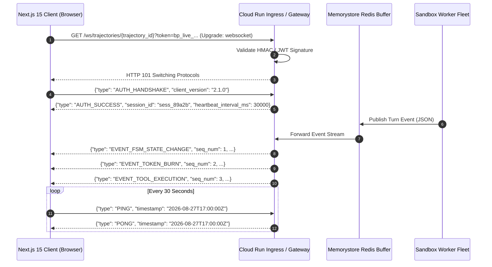
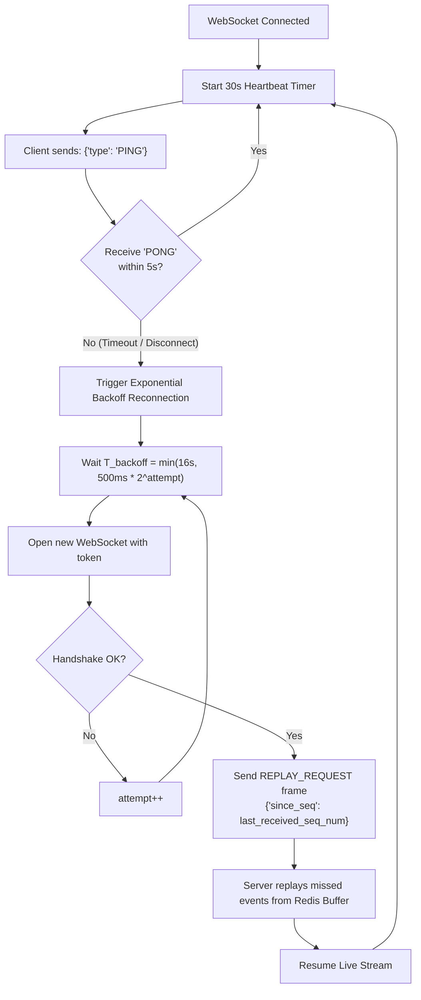

# WebSocket Real-Time Telemetry & Event Streaming Protocol Specification

> **Document ID:** `BP-API-003`  
> **Status:** Approved / Production-Grade Specification  
> **Target Track:** Best Multimodal UX & Best Architectural Design • Google Cloud All Things Agentic Hackathon (2026)  
> **Target Audience:** Frontend Engineers, Real-Time Systems Architects, Platform Integrators, API Reviewers

---

## 1. Connection Protocol & Handshake Specification

Benchpress provides a high-throughput, duplex WebSocket event streaming protocol for real-time visualization of agent trajectories, live split-terminal streaming, token burn waterflow animations, and voice-assisted DOM synchronization.



### 1.1 Connection Endpoints
- **Local Development:** `ws://localhost:8080/ws/trajectories/{trajectory_id}`
- **Production Edge Gateway:** `wss://api.benchpress.ai/ws/trajectories/{trajectory_id}`

### 1.2 Authentication & Security Handshake
Clients must authenticate using either a signed URL query parameter or an initial `AUTH_HANDSHAKE` frame within $3,000\,\text{ms}$ of opening the socket:
1. **Query Token Method (Recommended):**
   `wss://api.benchpress.ai/ws/trajectories/8f3b2c1a-5d4e-4f3a-9c2b-1e0f8a7d6c5b?token=eyJhbGciOiJIUzI1Ni...`
2. **Handshake Frame Method:**
   ```json
   {
     "type": "AUTH_HANDSHAKE",
     "auth_token": "bp_live_eyJhbGciOiJIUzI1NiIsInR5cCI6IkpXVCJ9...",
     "client_version": "2.1.0",
     "timestamp": "2026-08-27T17:00:00.000Z"
   }
   ```

---

## 2. Complete Event Message Schemas (JSON)

Every streaming message conforms to the standard envelope structure:
```json
{
  "event_id": "evt_9b1c2d3e-4f5a",
  "trajectory_id": "8f3b2c1a-5d4e-4f3a-9c2b-1e0f8a7d6c5b",
  "type": "EVENT_TYPE_NAME",
  "seq_num": 42,
  "timestamp": "2026-08-27T17:00:01.250Z",
  "payload": {}
}
```

---

### 2.1 Event: `EVENT_FSM_STATE_CHANGE`
Emitted immediately whenever the worker execution engine transitions between formal FSM states.

```json
{
  "event_id": "evt_fsm_001",
  "trajectory_id": "8f3b2c1a-5d4e-4f3a-9c2b-1e0f8a7d6c5b",
  "type": "EVENT_FSM_STATE_CHANGE",
  "seq_num": 1,
  "timestamp": "2026-08-27T17:00:01.100Z",
  "payload": {
    "previous_state": "REASONING_PLANNER",
    "current_state": "TOOL_DISPATCH_CODER",
    "turn_index": 2,
    "active_model": "gemini-2.5-flash",
    "transition_reason": "Planner completed decomposition; dispatching code patch synthesis"
  }
}
```

#### TypeScript Type Definition
```typescript
export interface FsmStateChangeEventPayload {
  previous_state: FsmState;
  current_state: FsmState;
  turn_index: number;
  active_model: string;
  transition_reason?: string;
}
```

---

### 2.2 Event: `EVENT_TOOL_EXECUTION`
Emitted when a tool executes inside the gVisor sandbox, delivering terminal stdout/stderr and file diffs.

```json
{
  "event_id": "evt_tool_002",
  "trajectory_id": "8f3b2c1a-5d4e-4f3a-9c2b-1e0f8a7d6c5b",
  "type": "EVENT_TOOL_EXECUTION",
  "seq_num": 2,
  "timestamp": "2026-08-27T17:00:02.450Z",
  "payload": {
    "turn_index": 2,
    "tool_call_id": "call_edit_file_48a9",
    "tool_name": "edit_file",
    "arguments": {
      "target_file": "django/contrib/admin/options.py",
      "start_line": 142,
      "end_line": 150,
      "replacement_content": "        if self.has_change_permission(request, obj):\n            return True"
    },
    "execution_duration_ms": 380,
    "exit_code": 0,
    "stdout": "Hunk successfully applied to django/contrib/admin/options.py",
    "stderr": "",
    "git_diff_hunk": "@@ -142,8 +142,8 @@\n-        return False\n+        if self.has_change_permission(request, obj):\n+            return True",
    "is_security_blocked": false
  }
}
```

---

### 2.3 Event: `EVENT_TOKEN_BURN`
Emitted turn-by-turn to update real-time financial expenditure and the Token Burn Waterfall Chart.

```json
{
  "event_id": "evt_token_003",
  "trajectory_id": "8f3b2c1a-5d4e-4f3a-9c2b-1e0f8a7d6c5b",
  "type": "EVENT_TOKEN_BURN",
  "seq_num": 3,
  "timestamp": "2026-08-27T17:00:03.100Z",
  "payload": {
    "turn_index": 2,
    "model_id": "gemini-2.5-flash",
    "prompt_tokens_delta": 8400,
    "completion_tokens_delta": 420,
    "reasoning_tokens_delta": 0,
    "cached_tokens_delta": 6200,
    "turn_cost_usd": 0.000756,
    "cumulative_cost_usd": 0.018256,
    "budget_limit_usd": 2.00,
    "budget_percent_consumed": 0.9128,
    "inference_latency_ms": 620.5
  }
}
```

---

### 2.4 Event: `EVENT_SUPERVISOR_HEAL`
Emitted when the Supervisor AST Healer dynamically intercepts and repairs an invalid tool call schema.

```json
{
  "event_id": "evt_heal_004",
  "trajectory_id": "8f3b2c1a-5d4e-4f3a-9c2b-1e0f8a7d6c5b",
  "type": "EVENT_SUPERVISOR_HEAL",
  "seq_num": 4,
  "timestamp": "2026-08-27T17:00:03.800Z",
  "payload": {
    "turn_index": 3,
    "original_tool_name": "modify_file_lines",
    "corrected_tool_name": "edit_file",
    "schema_violation": "Tool 'modify_file_lines' does not exist; mapped to 'edit_file' with translated line range parameters",
    "healer_latency_ms": 142,
    "healed_successfully": true,
    "diff_trace": "Renamed parameter 'lines' -> 'start_line'/'end_line'"
  }
}
```

---

### 2.5 Event: `EVENT_DOM_HIGHLIGHT`
Multimodal Live Voice / Vision command instructing the UI to focus on specific code lines or turn cards with Obsidian highlight styling.

```json
{
  "event_id": "evt_dom_005",
  "trajectory_id": "8f3b2c1a-5d4e-4f3a-9c2b-1e0f8a7d6c5b",
  "type": "EVENT_DOM_HIGHLIGHT",
  "seq_num": 5,
  "timestamp": "2026-08-27T17:00:04.200Z",
  "payload": {
    "target_turn_index": 2,
    "target_file": "django/contrib/admin/options.py",
    "line_number": 145,
    "highlight_color": "CYAN",
    "pulse_animation": true,
    "voice_caption": "Highlighting line 145 where the AST Healer normalized the permission check."
  }
}
```

---

### 2.6 Event: `EVENT_TRAJECTORY_COMPLETE`
Final summary frame signaling trajectory termination with verified resolution and full economic analytics.

```json
{
  "event_id": "evt_complete_006",
  "trajectory_id": "8f3b2c1a-5d4e-4f3a-9c2b-1e0f8a7d6c5b",
  "type": "EVENT_TRAJECTORY_COMPLETE",
  "seq_num": 6,
  "timestamp": "2026-08-27T17:00:05.900Z",
  "payload": {
    "status": "COMPLETED",
    "pass_at_1": true,
    "resolved": true,
    "total_turns": 4,
    "total_duration_ms": 4800,
    "total_cost_usd": 0.0245,
    "cpr_usd": 0.0245,
    "trajectory_bloat_ratio": 0.0,
    "context_decay_score": 0.012,
    "ast_heal_count": 1,
    "patch_diff_gcs_uri": "gs://benchpress-artifacts-dev/patches/8f3b2c1a.diff",
    "audit_signature": "hmac_sha256:7f83b1657ff1fc53b92dc18148a1d65dfc2d4b1fa3d677284addd200126d9069"
  }
}
```

---

## 3. Client Reconnection & Heartbeat Protocol

To guarantee continuous streaming across unstable mobile networks or client tab sleep cycles, Benchpress implements a strict sequence-tracked heartbeat and state reconciliation protocol.



### 3.1 Ping/Pong Frames
- **Ping Frame (Client $\rightarrow$ Server):**
  ```json
  { "type": "PING", "timestamp": "2026-08-27T17:00:30.000Z" }
  ```
- **Pong Frame (Server $\rightarrow$ Client):**
  ```json
  { "type": "PONG", "timestamp": "2026-08-27T17:00:30.010Z" }
  ```

### 3.2 Missed Event Replay (`REPLAY_REQUEST`)
If a client reconnects after a transient network interruption, it sends a `REPLAY_REQUEST` containing the last acknowledged `seq_num`. The server retrieves missed frames from the Memorystore Redis buffer:

```json
{
  "type": "REPLAY_REQUEST",
  "trajectory_id": "8f3b2c1a-5d4e-4f3a-9c2b-1e0f8a7d6c5b",
  "since_seq": 3,
  "timestamp": "2026-08-27T17:00:45.000Z"
}
```
The server responds with all events from `seq_num = 4` onward before resuming live execution streaming.
