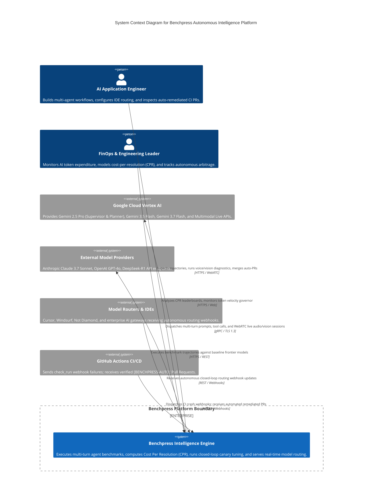
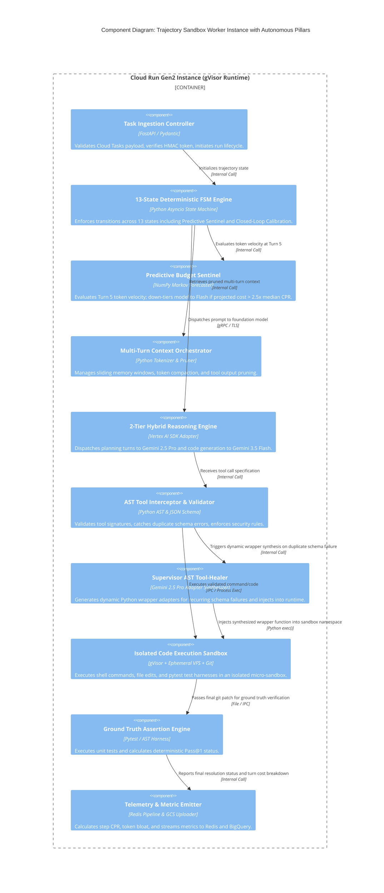
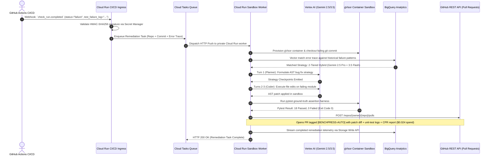

# C4 System Architecture, Autonomous Fleets & Data Topologies

> **Document ID:** `BP-ARCH-001`  
> **Status:** Approved / Production  
> **Target Track:** Best Architectural Design ($5,000) • Google Cloud All Things Agentic Hackathon (2026)

---

## 1. Architectural Philosophy & Overview

Benchpress is architected from first principles as an **event-driven, autonomous telemetry and closed-loop trajectory intelligence platform**. The system decouples interactive client surfaces from high-throughput background sandbox execution while hosting autonomous background daemons that continuously tune model routing, heal broken tool invocations, and auto-remediate CI/CD pipeline crashes.

The architecture is structured across the four standard C4 levels (Context, Container, Component, Code), ensuring unambiguous separation of concerns, high horizontal scalability on Google Cloud Platform, and millisecond-latency developer feedback loops.

---

## 2. C4 Level 1: System Context Diagram

---

## 3. C4 Level 2: Container Diagram (Enhanced with Autonomous Daemons)

```mermaid
C4Container
    title Container Architecture Diagram: Benchpress Autonomous Platform on GCP

    Person(user, "User / Developer / FinOps", "Interacts via Web Browser, IDE, or CLI")
    System_Ext(github_ci, "GitHub Actions CI/CD", "Dispatches failing test webhooks")
    System_Ext(router_client, "API Consumer (Router / IDE)", "Queries routing engine & receives policy webhooks")

    Container_Boundary(c1, "Google Cloud Platform (us-central1)") {
        
        Container(cloud_armor, "Cloud Armor & Cloud Load Balancer", "WAF, DDoS Protection, TLS Termination", "Google Cloud Armor")
        
        Container(frontend_gateway, "Public Web Hub & API Gateway", "Next.js 15 App Router & FastAPI Proxy", "Cloud Run (Serverless)")
        
        Container(ci_cd_ingress, "Autonomous CI/CD Ingress Controller", "Ingests GitHub check_run webhooks, verifies HMAC, triggers auto-remediation", "Cloud Run Service")
        
        Container(canary_scheduler, "Closed-Loop Canary Scheduler", "Dispatches 6-hour drift detection swarms across holdout suites", "Cloud Tasks Cron Queue")
        
        Container(multimodal_proxy, "WebRTC Live Audio/Vision Proxy", "Duplex audio relay, DOM sync, function call router", "Cloud Run (WebSocket / WebRTC)")
        
        Container(cloud_tasks, "Taskmaster Dispatch Queues", "Rate-limiting, backoff retries, concurrency limits", "Cloud Tasks")
        
        Container(worker_fleet, "Trajectory Sandbox Worker Fleet", "Executes multi-turn agent loops within gVisor micro-sandboxes with AST Supervisor Healer", "Cloud Run Gen2 (gVisor)")
        
        ContainerDb(redis_buffer, "Telemetry Ingestion Buffer", "Micro-batches turn telemetry metrics before warehouse flush", "Memorystore Redis 7.2")
        
        ContainerDb(bigquery, "Benchpress Analytics Warehouse", "Stores raw multi-turn traces, turn tokens, tool metrics, and CPR indices", "BigQuery (Storage Write API)")
        
        ContainerDb(firestore, "Real-time State & Leaderboard Cache", "Sub-millisecond leaderboard caching and live trajectory WebSocket push", "Firestore (Native Mode)")
        
        ContainerDb(gcs, "Artifact & Trace Repository", "Stores raw git repos, diff patches, execution logs, and audio recordings", "Cloud Storage (Standard)")
    }

    System_Ext(vertex_ai, "Vertex AI / Foundation Models", "Gemini 2.5 Pro (Supervisor), Gemini 3.5 Flash (Coder), Gemini 3.7 Flash")

    Rel(user, cloud_armor, "Accesses Leaderboard, Live Voice, and Trajectory Replayer", "HTTPS / WSS")
    Rel(github_ci, cloud_armor, "POST /api/v1/webhooks/github-ci-failure", "HTTPS / Webhook")
    Rel(router_client, cloud_armor, "POST /api/v1/routing-recommendation", "HTTPS / JSON")
    
    Rel(cloud_armor, frontend_gateway, "Routes Web/API traffic", "HTTP/2")
    Rel(cloud_armor, ci_cd_ingress, "Routes GitHub webhook payloads", "HTTP/2")
    Rel(cloud_armor, multimodal_proxy, "Routes WebRTC and WebSocket media streams", "WSS / WebRTC")

    Rel(ci_cd_ingress, cloud_tasks, "Enqueues remediation trajectory run", "gRPC")
    Rel(canary_scheduler, cloud_tasks, "Dispatches scheduled canary evaluation jobs", "gRPC")
    
    Rel(cloud_tasks, worker_fleet, "Dispatches rate-controlled tasks", "HTTP POST (Push)")
    
    Rel(worker_fleet, vertex_ai, "Invokes Gemini 2.5 Pro (Supervisor/Planner) and Gemini 3.5 Flash (Coder)", "REST / gRPC")
    Rel(worker_fleet, redis_buffer, "Pushes high-frequency turn metrics", "RESP Protocol")
    Rel(worker_fleet, firestore, "Updates live step-by-step trajectory status", "gRPC")
    Rel(worker_fleet, gcs, "Uploads raw git patches, container logs, and trace artifacts", "gRPC")

    Rel(redis_buffer, bigquery, "Flushes micro-batched telemetry records every 2 seconds", "Storage Write API")
    Rel(bigquery, frontend_gateway, "Broadcasts updated Pareto routing policy webhooks", "Webhook Dispatch")
```

---

## 4. C4 Level 3: Component Diagram (Trajectory Sandbox Worker with Supervisor AST Healer)

---

## 5. End-to-End Sequence Diagram: Autonomous CI/CD Crash-to-PR Auto-Remediation

