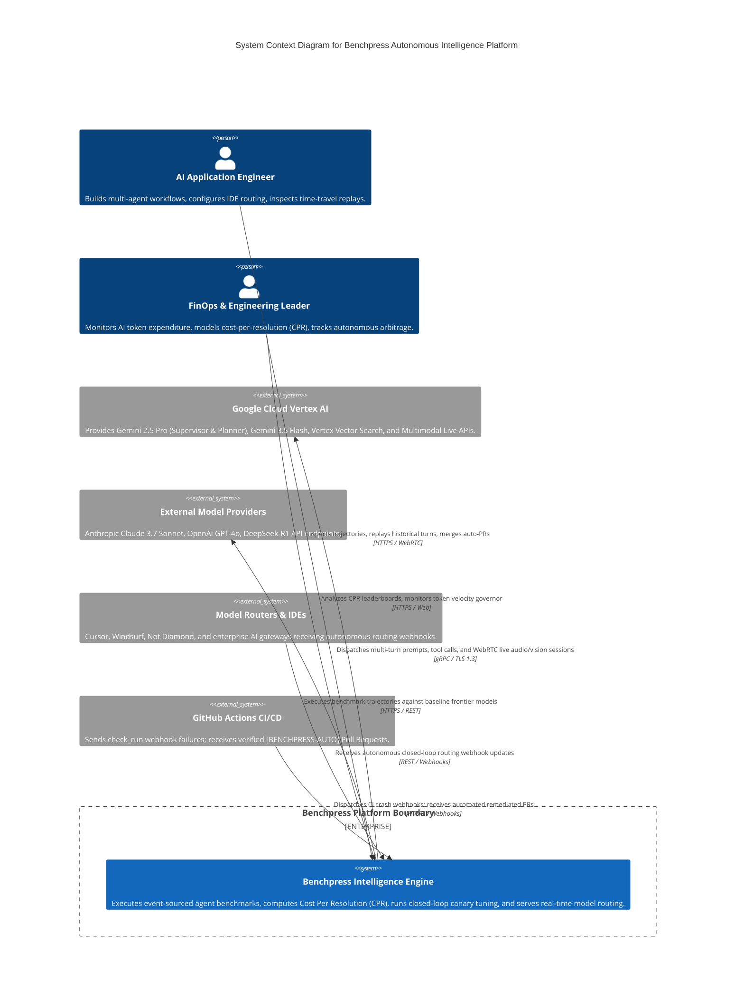
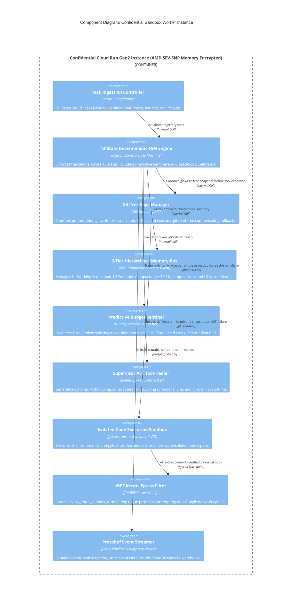

# C4 System Architecture, Event Sourcing & Production Tech Stack

> **Document ID:** `BP-ARCH-001`  
> **Status:** Approved / Production  
> **Target Track:** Best Architectural Design ($5,000) • Google Cloud All Things Agentic Hackathon (2026)

---

## 1. Architectural Philosophy & Decoupled Event-Driven Core

Benchpress is architected from first principles as an **event-sourced, asynchronous trajectory intelligence platform**. The architecture replaces mutable monolithic logs with an append-only Protobuf event bus streamed directly into BigQuery via the Storage Write API, while isolating execution inside Confidential Cloud Run (AMD SEV-SNP) and enforcing 3-tier hierarchical memory compaction.

The architecture is structured across the four standard C4 levels (Context, Container, Component, Code), ensuring unambiguous separation of concerns, high horizontal scalability on Google Cloud Platform, and millisecond-latency developer feedback loops.

---

## 2. C4 Level 1: System Context Diagram

---

## 3. C4 Level 2: Container Diagram (Enhanced with Event Bus & JIT Broker)

```mermaid
C4Container
    title Container Architecture Diagram: Benchpress Production Tech Stack on GCP

    Person(user, "User / Developer / FinOps", "Interacts via Web Browser, IDE, or CLI")
    System_Ext(github_ci, "GitHub Actions CI/CD", "Dispatches failing test webhooks")
    System_Ext(router_client, "API Consumer (Router / IDE)", "Queries routing engine & receives policy webhooks")

    Container_Boundary(c1, "Google Cloud Platform (us-central1)") {
        
        Container(cloud_armor, "Cloud Armor & Load Balancer", "WAF, DDoS Protection, TLS Termination", "Google Cloud Armor")
        
        Container(frontend_gateway, "Public Web Hub & API Gateway", "Next.js 15 App Router & FastAPI Proxy", "Cloud Run (Serverless)")
        
        Container(ci_cd_ingress, "Autonomous CI/CD Ingress Controller", "Ingests GitHub check_run webhooks, verifies HMAC, triggers auto-remediation", "Cloud Run Service")
        
        Container(jit_broker, "JIT Ephemeral Credential Broker", "Mints 60-second micro-scoped IAM OAuth2 tokens per tool call", "Cloud Run / STS")
        
        Container(canary_scheduler, "Closed-Loop Canary Scheduler", "Dispatches 6-hour drift detection swarms across holdout suites", "Cloud Tasks Cron Queue")
        
        Container(multimodal_proxy, "WebRTC Live Audio/Vision Proxy", "Duplex audio relay, DOM sync, function call router", "Cloud Run (WebSocket / WebRTC)")
        
        Container(cloud_tasks, "Taskmaster Dispatch Queues", "Rate-limiting, backoff retries, concurrency limits", "Cloud Tasks")
        
        Container(worker_fleet, "Confidential Sandbox Worker Fleet", "Executes multi-turn agent loops within AMD SEV-SNP encrypted gVisor sandboxes with Git-tree Sagas", "Confidential Cloud Run Gen2")
        
        ContainerDb(event_bus, "Append-Only Event Sourcing Bus", "Buffers Protobuf trajectory event streams before warehouse flush", "Memorystore Redis 7.2")
        
        ContainerDb(bigquery, "Benchpress Analytics Warehouse", "Stores immutable event streams, turn tokens, tool metrics, and CPR indices", "BigQuery (Storage Write API)")
        
        ContainerDb(vector_search, "Vertex AI Vector Search", "L3 Long-Term Memory indexing 100,000+ past trajectory solutions", "Vertex AI Vector Search (ScaNN)")
        
        ContainerDb(firestore, "Real-time State & Leaderboard Cache", "Sub-millisecond leaderboard caching and live trajectory WebSocket push", "Firestore (Native Mode)")
    }

    System_Ext(vertex_ai, "Vertex AI / Foundation Models", "Gemini 2.5 Pro (Supervisor), Gemini 3.5 Flash (Coder), Gemini 3.7 Flash")

    Rel(user, cloud_armor, "Accesses Leaderboard, Live Voice, and Trajectory Replayer", "HTTPS / WSS")
    Rel(github_ci, cloud_armor, "POST /api/v1/webhooks/github-ci-failure", "HTTPS / Webhook")
    Rel(router_client, cloud_armor, "POST /api/v1/routing-recommendation", "HTTPS / JSON")
    
    Rel(cloud_armor, frontend_gateway, "Routes Web/API traffic", "HTTP/2")
    Rel(cloud_armor, ci_cd_ingress, "Routes GitHub webhook payloads", "HTTP/2")
    Rel(cloud_armor, multimodal_proxy, "Routes WebRTC and WebSocket media streams", "WSS / WebRTC")

    Rel(ci_cd_ingress, cloud_tasks, "Enqueues remediation trajectory run", "gRPC")
    Rel(canary_scheduler, cloud_tasks, "Dispatches scheduled canary evaluation jobs", "gRPC")
    
    Rel(cloud_tasks, worker_fleet, "Dispatches rate-controlled tasks", "HTTP POST (Push)")
    Rel(worker_fleet, jit_broker, "Requests 60s micro-scoped IAM token", "Internal gRPC")
    
    Rel(worker_fleet, vertex_ai, "Invokes Gemini 2.5 Pro (Supervisor/Planner) and Gemini 3.5 Flash (Coder)", "REST / gRPC")
    Rel(worker_fleet, vector_search, "Queries L3 Long-Term Memory for similar error fixes", "gRPC ScaNN")
    Rel(worker_fleet, event_bus, "Pushes append-only Protobuf trajectory events", "RESP Protocol")
    Rel(worker_fleet, firestore, "Updates live step-by-step trajectory status", "gRPC")

    Rel(event_bus, bigquery, "Flushes Protobuf micro-batches every 2 seconds", "Storage Write API")
    Rel(bigquery, frontend_gateway, "Broadcasts updated Pareto routing policy webhooks", "Webhook Dispatch")
```

---

## 4. C4 Level 3: Component Diagram (Confidential Sandbox Worker with Git-Tree Sagas)

