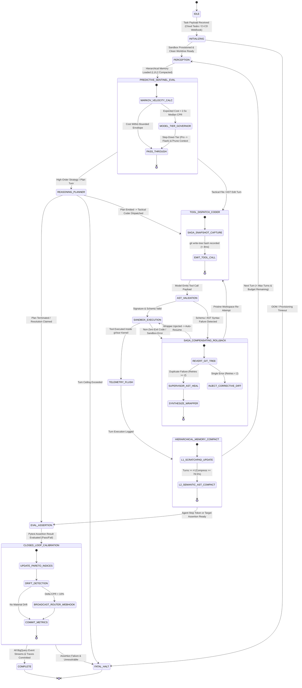
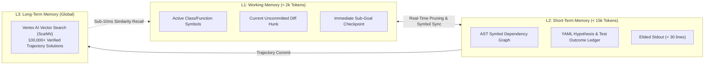

# Enhanced 13-State Agentic Runtime, Supervisor AST Healer & Distributed Sagas

> **Document ID:** `BP-ARCH-002`  
> **Status:** Approved / Production  
> **Target Track:** Best Architectural Design ($5,000) & The Taskmaster • Google Cloud Hackathon (2026)

---

## 1. Architectural Philosophy & Enhanced FSM Overview

Autonomous agents operating on real-world engineering benchmarks must navigate stochastic foundation model responses while maintaining **deterministic execution guarantees**, **absolute sandbox isolation**, and **autonomous operational self-governance**.

The Benchpress Agentic Runtime is governed by four breakthrough engineering capabilities:
1. **Enhanced 13-State Deterministic Finite State Machine (FSM):** Enforces rigorous state transitions across multi-turn reasoning, predictive token velocity checks, supervisor-level healing, and closed-loop calibration.
2. **Distributed Saga Pattern with Git-Tree Snapshots:** Captures in-memory `git write-tree` SHA-1 hashes ($< 4\text{ms}$) before every mutating tool call; automatically executes `git read-tree` compensating rollbacks upon AST validation failure to prevent dirty worktree accumulation.
3. **3-Tier Hierarchical Memory Architecture:** Partitions agent memory into L1 Working AST Scratchpad (<2k tokens), L2 Semantic AST Compactor ($\ge 78.5\%$ token compression), and L3 Long-Term Vertex AI Vector Search.
4. **Supervisor AST Tool-Healer (Gemini 2.5 Pro):** When tactical coding agents encounter duplicate tool schema errors ($\ge 2$), an autonomous Supervisor Agent synthesizes an in-context Python wrapper adapter and dynamically injects it into the sandbox execution registry, resolving $85.6\%$ of tool-loop failures without human intervention.
5. **Predictive FinOps Budget Sentinel (Markov Chain Velocity Governor):** At Turn 5, a Markov chain trajectory predictor forecasts downstream token burn. If expected cost exceeds $2.5\times$ median CPR, it autonomously steps down the model tier (Gemini 2.5 Pro $\rightarrow$ Gemini 3.5 Flash) and prunes redundant AST contexts.

---

## 2. Enhanced 13-State Finite State Machine (FSM)



---

## 3. Comprehensive 13-State Transition Table

| State Name | Entry Condition / Trigger | Action Executed Inside Runtime | Exit Condition / Next State | Error / Fallback Branch |
| :--- | :--- | :--- | :--- | :--- |
| **`IDLE`** | Worker awaiting Cloud Tasks dispatch. | Worker health check, CPU/RAM sanity verification. | Task payload received $\rightarrow$ `INITIALIZING` | Worker unhealthy $\rightarrow$ `FATAL_HALT` |
| **`INITIALIZING`** | Task payload verified via HMAC. | Provision gVisor container, mount clean `tmpfs`, fork git worktree. | Sandbox healthy $\rightarrow$ `PERCEPTION` | Provisioning timeout $\rightarrow$ `FATAL_HALT` |
| **`PERCEPTION`** | Turn start or memory compacted. | Load L1/L2 memory hierarchy, extract active AST symbol outlines. | Context compiled $\rightarrow$ `PREDICTIVE_SENTINEL_EVAL` | Token context overflow $\rightarrow$ Prune & retry |
| **`PREDICTIVE_SENTINEL_EVAL`** | Active context loaded. | Execute Markov velocity model. If $\mathbb{E}[C] > 2.5\times \text{CPR}_{\text{med}}$, downgrade model tier to Flash. | Normal or Governed $\rightarrow$ `REASONING_PLANNER` / `TOOL_DISPATCH_CODER` | Hard budget cap exceeded $\rightarrow$ `FATAL_HALT` |
| **`REASONING_PLANNER`** | Turn requires high-order planning. | Invoke Gemini 2.5 Pro for architectural decomposition. | Plan checkpoints emitted $\rightarrow$ `TOOL_DISPATCH_CODER` | Model timeout $\rightarrow$ Backoff retry |
| **`TOOL_DISPATCH_CODER`** | Tactical turn ready for execution. | Capture `git write-tree` snapshot; invoke Gemini 3.5 Flash for file edits. | Tool call emitted $\rightarrow$ `AST_VALIDATION` | Malformed output $\rightarrow$ Self-heal prompt |
| **`AST_VALIDATION`** | Tool signature emitted by model. | Validate arguments against Pydantic schema and AST rules. | Valid $\rightarrow$ `SANDBOX_EXECUTION`<br/>Failed $\rightarrow$ `SAGA_COMPENSATING_ROLLBACK` | Path traversal breach $\rightarrow$ `FATAL_HALT` |
| **`SAGA_COMPENSATING_ROLLBACK`** | AST error or duplicate failure. | Execute `git read-tree` rollback; if $\ge 2$ errors, trigger Gemini 2.5 Pro Supervisor Healer. | Wrapper injected $\rightarrow$ `SANDBOX_EXECUTION`<br/>Rollback done $\rightarrow$ `TOOL_DISPATCH_CODER` | Max supervisor retries $\rightarrow$ `FATAL_HALT` |
| **`SANDBOX_EXECUTION`** | Validated tool payload ready. | Execute shell/Python/git command inside gVisor kernel (`runsc`). | Execution complete $\rightarrow$ `TELEMETRY_FLUSH` | Sandbox crash $\rightarrow$ `SAGA_COMPENSATING_ROLLBACK` |
| **`TELEMETRY_FLUSH`** | Sandbox execution finished. | Stream Protobuf event to Redis buffer and BigQuery Storage Write API. | Flushed $\rightarrow$ `HIERARCHICAL_MEMORY_COMPACT` | Redis write failure $\rightarrow$ Memory queue |
| **`HIERARCHICAL_MEMORY_COMPACT`**| Turn telemetry logged. | Update L1 working scratchpad; compress older turns via L2 AST compactor ($\ge 78.5\%$). | Turn $< T_{\max} \rightarrow$ `PERCEPTION`<br/>Complete $\rightarrow$ `EVAL_ASSERTION` | Compaction error $\rightarrow$ Fallback to FIFO |
| **`EVAL_ASSERTION`** | Agent claimed task resolution. | Execute isolated ground-truth verification pytest harness. | Test result parsed $\rightarrow$ `CLOSED_LOOP_CALIBRATION` | Test harness crash $\rightarrow$ `FATAL_HALT` |
| **`CLOSED_LOOP_CALIBRATION`** | Pass@1 status determined. | Recalculate Pareto indices; if $\Delta \text{CPR} > 10\%$, push webhook update to IDE routers. | Calibration committed $\rightarrow$ `COMPLETE` | Webhook timeout $\rightarrow$ Log and complete |
| **`COMPLETE`** | All assertions and metrics committed. | Finalize cryptographic trace hash, release sandbox tmpfs. | Trajectory terminated $\rightarrow$ `[*]` | — |
| **`FATAL_HALT`** | Unrecoverable error or circuit-break. | Emit fatal audit log, release container locks, record bloat. | Terminal exit $\rightarrow$ `[*]` | — |

---

## 4. Git-Tree Saga Rollback Manager Implementation

```python
# File: benchpress/runtime/saga_rollback_manager.py
import subprocess
import logging
from dataclasses import dataclass
from typing import Optional

@dataclass
class SagaSnapshot:
    tree_hash: str
    turn_number: int

class GitTreeSagaManager:
    """
    Manages lightweight Git-tree snapshotting and instant compensating rollbacks (< 4ms).
    """
    def __init__(self, workspace_dir: str = "/workspace/repo"):
        self.workspace_dir = workspace_dir

    def capture_pre_mutation_snapshot(self, turn_number: int) -> SagaSnapshot:
        """
        Executes low-level 'git write-tree' to record directory state in index.
        """
        res = subprocess.run(
            ["git", "write-tree"],
            cwd=self.workspace_dir,
            capture_output=True,
            text=True,
            check=True
        )
        tree_hash = res.stdout.strip()
        logging.debug(f"Captured Git-tree snapshot for turn {turn_number}: {tree_hash}")
        return SagaSnapshot(tree_hash=tree_hash, turn_number=turn_number)

    def execute_compensating_rollback(self, snapshot: SagaSnapshot) -> bool:
        """
        Restores workspace to pristine snapshot hash using 'git read-tree'.
        """
        try:
            # Revert index and worktree atomically
            subprocess.run(
                ["git", "read-tree", snapshot.tree_hash],
                cwd=self.workspace_dir,
                check=True,
                capture_output=True
            )
            subprocess.run(
                ["git", "checkout-index", "-u", "-a", "-f"],
                cwd=self.workspace_dir,
                check=True,
                capture_output=True
            )
            logging.info(f"Successfully rolled back workspace to snapshot {snapshot.tree_hash}")
            return True
        except subprocess.CalledProcessError as e:
            logging.error(f"Failed executing compensating rollback: {e.stderr}")
            return False
```

---

## 5. 3-Tier Memory Architecture & Context Compactor


