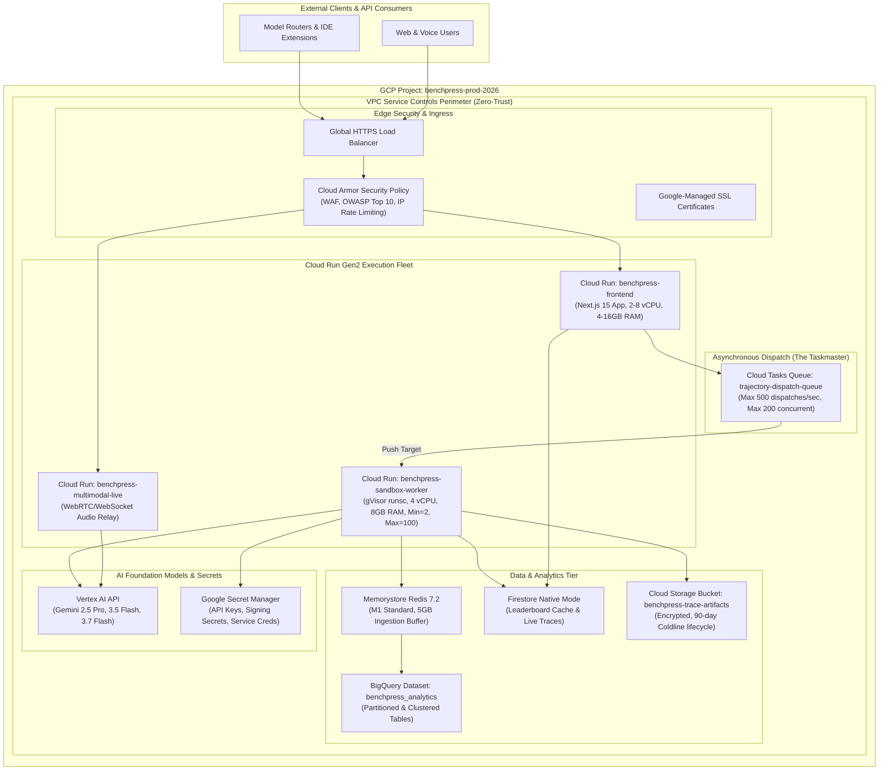

# Google Cloud Platform Infrastructure as Code (IaC) & CI/CD Pipeline

> **Document ID:** `BP-ARCH-004`  
> **Status:** Approved / Production  
> **Target Track:** Best Architectural Design ($5,000) • Google Cloud All Things Agentic Hackathon (2026)

---

## 1. Cloud Infrastructure Topology Blueprint

Benchpress is provisioned entirely via modular, immutable Terraform (HCL) manifests deployed to the `us-central1` Google Cloud region.



---

## 2. Production Terraform (HCL) Manifests

The following configuration defines the core infrastructure resources for Benchpress in production.

```hcl
# File: terraform/main.tf
terraform {
  required_version = ">= 1.8.0"
  required_providers {
    google = {
      source  = "hashicorp/google"
      version = "~> 5.30.0"
    }
    google-beta = {
      source  = "hashicorp/google-beta"
      version = "~> 5.30.0"
    }
  }
  backend "gcs" {
    bucket = "benchpress-tf-state"
    prefix = "terraform/state/production"
  }
}

provider "google" {
  project = var.project_id
  region  = var.region
}

provider "google-beta" {
  project = var.project_id
  region  = var.region
}

variable "project_id" {
  type        = string
  default     = "benchpress-prod-2026"
  description = "Target Google Cloud Project ID"
}

variable "region" {
  type        = string
  default     = "us-central1"
  description = "Primary deployment region"
}

# -----------------------------------------------------------------------------
# 1. Cloud Armor Security Policy
# -----------------------------------------------------------------------------
resource "google_compute_security_policy" "edge_security_policy" {
  name        = "benchpress-edge-security-policy"
  description = "WAF rules, DDoS mitigation, and IP rate limiting"

  # Default rule: Allow traffic
  rule {
    action   = "allow"
    priority = "2147483647"
    match {
      versioned_expr = "SRC_IPS_V1"
      config {
        src_ip_ranges = ["*"]
      }
    }
    description = "Default allow rule"
  }

  # Rate limiting rule: Max 100 requests per minute per IP for API endpoints
  rule {
    action   = "rate_based_ban"
    priority = "1000"
    match {
      versioned_expr = "SRC_IPS_V1"
      config {
        src_ip_ranges = ["*"]
      }
    }
    rate_limit_options {
      conform_action = "allow"
      exceed_action  = "deny(429)"
      enforce_on_key = "IP"
      rate_limit_threshold {
        count        = 100
        interval_sec = 60
      }
      ban_duration_sec = 300
    }
    description = "Throttle aggressive API abuse"
  }
}

# -----------------------------------------------------------------------------
# 2. Cloud Tasks Dispatch Queue (The Taskmaster)
# -----------------------------------------------------------------------------
resource "google_cloud_tasks_queue" "trajectory_dispatch_queue" {
  name     = "trajectory-dispatch-queue"
  location = var.region

  rate_limits {
    max_dispatches_per_second = 500
    max_concurrent_dispatches = 200
    max_burst_size            = 100
  }

  retry_config {
    max_attempts       = 5
    min_backoff        = "2s"
    max_backoff        = "60s"
    max_doublings      = 4
    max_retry_duration = "600s"
  }
}

# -----------------------------------------------------------------------------
# 3. Cloud Run Gen2 Trajectory Sandbox Worker Fleet
# -----------------------------------------------------------------------------
resource "google_service_account" "worker_sa" {
  account_id   = "benchpress-worker-sa"
  display_name = "Benchpress Sandbox Worker Service Account"
}

resource "google_cloud_run_v2_service" "sandbox_worker_fleet" {
  name     = "benchpress-sandbox-worker"
  location = var.region
  ingress  = "INGRESS_TRAFFIC_INTERNAL_ONLY"

  template {
    execution_environment = "EXECUTION_ENVIRONMENT_GEN2" # gVisor container kernel isolation
    service_account       = google_service_account.worker_sa.email

    scaling {
      min_instance_count = 2
      max_instance_count = 100
    }

    containers {
      image = "${var.region}-docker.pkg.dev/${var.project_id}/benchpress-artifacts/sandbox-worker:latest"
      
      resources {
        limits = {
          cpu    = "4000m"
          memory = "8192Mi"
        }
        cpu_idle = false
      }

      env {
        name  = "PROJECT_ID"
        value = var.project_id
      }
      env {
        name  = "REDIS_HOST"
        value = google_redis_instance.telemetry_buffer.host
      }
      env {
        name  = "REDIS_PORT"
        value = tostring(google_redis_instance.telemetry_buffer.port)
      }
      env {
        name  = "BIGQUERY_DATASET"
        value = google_bigquery_dataset.analytics.dataset_id
      }
      env {
        name  = "GCS_ARTIFACT_BUCKET"
        value = google_storage_bucket.artifacts.name
      }
    }
  }
}

# -----------------------------------------------------------------------------
# 4. Memorystore Redis 7.2 Telemetry Buffer
# -----------------------------------------------------------------------------
resource "google_redis_instance" "telemetry_buffer" {
  name           = "benchpress-telemetry-buffer"
  tier           = "STANDARD_HA"
  memory_size_gb = 5
  region         = var.region
  redis_version  = "REDIS_7_2"

  display_name = "High-throughput turn telemetry ingestion buffer"
  auth_enabled = true
}

# -----------------------------------------------------------------------------
# 5. BigQuery Dataset & Partitioned Analytics Store
# -----------------------------------------------------------------------------
resource "google_bigquery_dataset" "analytics" {
  dataset_id                  = "benchpress_analytics"
  friendly_name               = "Benchpress Analytics Warehouse"
  description                 = "Stores all multi-turn trajectory traces, CPR indices, and model benchmark scores"
  location                    = "US"
  default_table_expiration_ms = null # Permanent retention
}

resource "google_bigquery_table" "trajectories" {
  dataset_id          = google_bigquery_dataset.analytics.dataset_id
  table_id            = "trajectories"
  deletion_protection = true

  time_partitioning {
    type  = "DAY"
    field = "timestamp"
  }

  clustering = ["model_family", "task_suite", "task_complexity_score"]

  schema = file("${path.module}/schemas/trajectories_schema.json")
}

# -----------------------------------------------------------------------------
# 6. Cloud Storage Artifact Bucket with Lifecycle Management
# -----------------------------------------------------------------------------
resource "google_storage_bucket" "artifacts" {
  name          = "${var.project_id}-trace-artifacts"
  location      = "US"
  force_destroy = false

  uniform_bucket_level_access = true

  versioning {
    enabled = true
  }

  lifecycle_rule {
    condition {
      age = 90 # Transition raw execution dumps to Coldline after 90 days
    }
    action {
      type          = "SetStorageClass"
      storage_class = "COLDLINE"
    }
  }

  lifecycle_rule {
    condition {
      age = 365 # Purge scratch files older than 1 year
    }
    action {
      type = "Delete"
    }
  }
}

# -----------------------------------------------------------------------------
# 7. IAM & Least-Privilege Role Bindings
# -----------------------------------------------------------------------------
resource "google_project_iam_member" "worker_vertex_ai" {
  project = var.project_id
  role    = "roles/aiplatform.user"
  member  = "serviceAccount:${google_service_account.worker_sa.email}"
}

resource "google_project_iam_member" "worker_bigquery_writer" {
  project = var.project_id
  role    = "roles/bigquery.dataEditor"
  member  = "serviceAccount:${google_service_account.worker_sa.email}"
}

resource "google_project_iam_member" "worker_storage_writer" {
  project = var.project_id
  role    = "roles/storage.objectAdmin"
  member  = "serviceAccount:${google_service_account.worker_sa.email}"
}
```

---

## 3. Production CI/CD Pipeline (GitHub Actions)

The deployment pipeline automates testing, container image compilation with Google Cloud Build, image push to Google Artifact Registry, and zero-downtime rolling updates on Cloud Run.

```yaml
# File: .github/workflows/deploy.yml
name: Benchpress Production CI/CD Pipeline

on:
  push:
    branches:
      - main
  pull_request:
    branches:
      - main

env:
  PROJECT_ID: benchpress-prod-2026
  REGION: us-central1
  GAR_REPO: benchpress-artifacts

jobs:
  lint-and-test:
    name: Code Verification & Unit Test Harness
    runs-on: ubuntu-latest
    steps:
      - name: Checkout Code
        uses: actions/checkout@v4

      - name: Set up Python 3.12
        uses: actions/setup-python@v5
        with:
          python-version: "3.12"
          cache: "pip"

      - name: Install Dependencies
        run: |
          python -m pip install --upgrade pip
          pip install -r requirements-dev.txt

      - name: Run Ruff Linter & AST Safety Checks
        run: ruff check .

      - name: Execute Pytest Unit Tests
        run: pytest -v tests/

  build-and-deploy:
    name: Build Containers & Deploy to Cloud Run
    needs: lint-and-test
    if: github.ref == 'refs/heads/main'
    runs-on: ubuntu-latest
    permissions:
      contents: read
      id-token: write

    steps:
      - name: Checkout Code
        uses: actions/checkout@v4

      - name: Authenticate to Google Cloud via Workload Identity
        uses: google-github-actions/auth@v2
        with:
          workload_identity_provider: "projects/1234567890/locations/global/workloadIdentityPools/github-pool/providers/github-provider"
          service_account: "github-deployer@benchpress-prod-2026.iam.gserviceaccount.com"

      - name: Set up Cloud SDK
        uses: google-github-actions/setup-gcloud@v2

      - name: Configure Docker for Artifact Registry
        run: gcloud auth configure-docker ${{ env.REGION }}-docker.pkg.dev

      - name: Build & Push Sandbox Worker Image
        run: |
          IMAGE_URI="${{ env.REGION }}-docker.pkg.dev/${{ env.PROJECT_ID }}/${{ env.GAR_REPO }}/sandbox-worker:${{ github.sha }}"
          LATEST_URI="${{ env.REGION }}-docker.pkg.dev/${{ env.PROJECT_ID }}/${{ env.GAR_REPO }}/sandbox-worker:latest"
          docker build -t "$IMAGE_URI" -t "$LATEST_URI" -f docker/Dockerfile.worker .
          docker push "$IMAGE_URI"
          docker push "$LATEST_URI"

      - name: Deploy Revision to Cloud Run Gen2
        run: |
          gcloud run deploy benchpress-sandbox-worker \
            --image="${{ env.REGION }}-docker.pkg.dev/${{ env.PROJECT_ID }}/${{ env.GAR_REPO }}/sandbox-worker:${{ github.sha }}" \
            --region="${{ env.REGION }}" \
            --execution-environment=gen2 \
            --min-instances=2 \
            --max-instances=100 \
            --cpu=4 \
            --memory=8Gi \
            --platform=managed \
            --quiet
```
