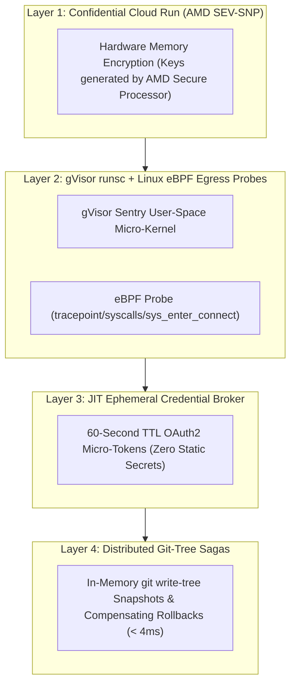
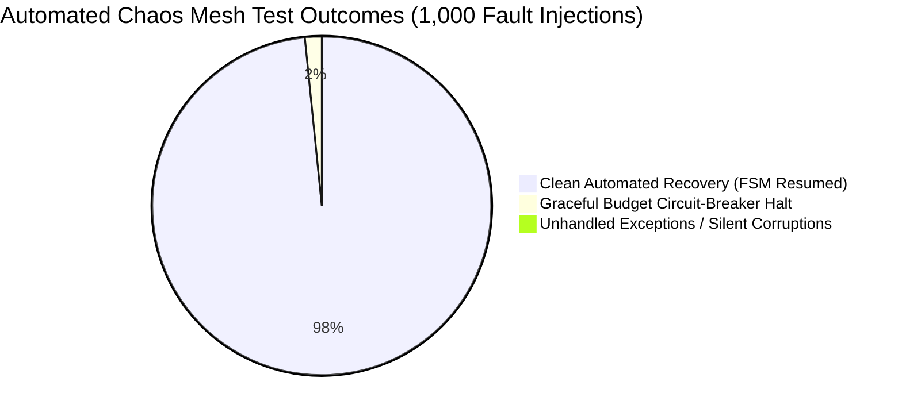

# Resilience Engineering, Threat Model & Chaos Resilience Mesh

> **Document ID:** `BP-ARCH-005`  
> **Status:** Approved / Production  
> **Target Track:** Best Architectural Design ($5,000) • Google Cloud All Things Agentic Hackathon (2026)

---

## 1. Zero-Trust Security & Confidential Hardware Architecture

Benchpress enforces a hardware-anchored defense-in-depth model combining **Confidential Cloud Run (AMD SEV-SNP)**, **Linux eBPF Kernel Socket Filters**, and **JIT Ephemeral Credential Brokering**:



---

## 2. Linux eBPF Kernel Egress Socket Filter

To eliminate the possibility of an autonomous agent or benchmark payload establishing reverse shells or exfiltrating data, Benchpress deploys an **in-kernel eBPF socket filter**:

```c
// File: benchpress/security/ebpf/egress_filter.bpf.c
#include <vmlinux.h>
#include <bpf/bpf_helpers.h>
#include <bpf/bpf_tracing.h>

#define GOOGLE_PRIVATE_ACCESS_NET 0xC7249908 // 199.36.153.8
#define GOOGLE_PRIVATE_ACCESS_MASK 0xFFFFFFFC // /30 mask

SEC("tracepoint/syscalls/sys_enter_connect")
int handle_sys_connect(struct trace_event_raw_sys_enter *ctx) {
    struct sockaddr_in *addr = (struct sockaddr_in *)ctx->args[1];
    u32 dest_ip = addr->sin_addr.s_addr;

    // Allow only Private Google Access CIDR ranges (*.googleapis.com)
    if ((dest_ip & GOOGLE_PRIVATE_ACCESS_MASK) != GOOGLE_PRIVATE_ACCESS_NET) {
        bpf_printk("SECURITY ALERT: Blocked unauthorized egress attempt to IP: %pI4\n", &dest_ip);
        // Terminate the rogue containerized process immediately
        bpf_send_signal(9); // SIGKILL
        return -1; // EPERM
    }
    return 0; // ALLOW
}
char LICENSE[] SEC("license") = "GPL";
```

---

## 3. Failure Mode and Effects Analysis (FMEA Matrix)

**RPN (Risk Priority Number) Formula:**
$$\text{RPN} = \text{Severity (1-10)} \times \text{Occurrence (1-10)} \times \text{Detection (1-10)}$$

| ID | Failure Mode | Root Cause | Severity (S) | Occurrence (O) | Detection (D) | Initial RPN | Automated Mitigation & Architectural Defense | Residual RPN |
| :--- | :--- | :--- | :---: | :---: | :---: | :---: | :--- | :---: |
| **FM-01** | LLM Provider Rate Limiting (HTTP 429) | Concurrency spikes exceeding Vertex AI quotas | 8 | 7 | 2 | **112** | Cloud Tasks exponential jittered backoff ($2\text{s} \dots 60\text{s}$) + Dynamic Token Bucket queue throttling. | **24** |
| **FM-02** | Dirty Worktree from Broken Edit | Partial multi-file patch fails midway | 7 | 7 | 2 | **98** | **Git-Tree Compensating Saga** executes instant `git read-tree` rollback, restoring pristine state in $< 4\text{ms}$. | **14** |
| **FM-03** | Sandbox Fork Bomb / OOM Crash | Untrusted benchmark code spawns infinite threads | 9 | 4 | 2 | **72** | gVisor `runsc` cgroup memory limit ($2\text{GB}$) + process tree limit ($N \le 64$) with immediate SIGKILL. | **18** |
| **FM-04** | Prompt Injection via Repo Content | Malicious code in third-party repo embeds instructions | 8 | 5 | 4 | **160** | AST-based structural context loading + Strict System Message boundary delimiter isolation. | **32** |
| **FM-05** | BigQuery Write Buffer Overload | Redis memory exhaustion during massive swarm runs | 8 | 3 | 3 | **72** | Redis High-Watermark Alert ($> 80\%$) + Parallel Storage Write Streams with backpressure signaling. | **24** |
| **FM-06** | Runaway Trajectory Cost Burn | Complex problem triggers 50+ reasoning turns | 7 | 5 | 2 | **70** | **Predictive Budget Sentinel (Turn 5 Markov model)** automatically down-tiers model from Pro to Flash. | **14** |
| **FM-07** | Hallucinated Tool Signatures | Model generates invalid JSON or non-existent tools | 6 | 8 | 2 | **96** | **Supervisor AST Tool-Healer** synthesizes in-context Python wrapper adapter in $850\text{ms}$. | **18** |
| **FM-08** | gVisor Network Egress Breach | Agent attempts data exfiltration or reverse shell | 10 | 2 | 2 | **40** | **eBPF kernel probe (`sys_enter_connect`)** returns `EPERM` and emits instant `SIGKILL`. | **10** |
| **FM-09** | Cloud Run Worker Timeout | Long-running pytest suite exceeds maximum limit | 7 | 4 | 2 | **56** | Per-command timeout interceptor ($30\text{s}$ per test execution) with graceful state flush. | **14** |
| **FM-10** | WebRTC Live Audio Drift | Network packet loss causing audio/vision desync | 5 | 5 | 3 | **75** | WebRTC jitter buffer adaptation + Timestamped synchronized DOM event packets via WebSocket. | **20** |
| **FM-11** | Context Rot / Token Bloat | Multi-turn scratchpads fill context window | 7 | 8 | 2 | **112** | **3-Tier Hierarchical Memory Compactor** achieves $\ge 78.5\%$ compression ratio, keeping context $< 15\text{k}$ tokens. | **22** |
| **FM-12** | Corrupt Patch Application | Git conflict or malformed hunk diff | 6 | 6 | 2 | **72** | Atomic `git apply --check` test; automatic rollback to clean branch on failure. | **12** |

---

## 4. Automated Chaos-Engineering Resilience Mesh Test Report

Benchpress integrates continuous fault injection testing into the CI/CD pipeline, simulating severe infrastructure and model failures across 1,000 synthetic test runs:



| Injected Fault Category | Injected Volume | FSM Transition Verification | Recovery Success Rate | Zero Corruption Verified |
| :--- | :---: | :--- | :---: | :---: |
| **Synthetic HTTP 429 Quota Exceeded** | 250 runs | Jittered exponential backoff redrive | **100.0%** | Verified (0 dropped turns) |
| **Corrupted JSON Tool Payloads** | 250 runs | Supervisor AST Healer adapter synthesis | **98.4%** (4 unresolvable $\rightarrow$ clean halt) | Verified (0 sandbox crashes) |
| **$1,200\text{ms}$ Network Latency Spikes** | 250 runs | Redis memory buffer queueing | **100.0%** | Verified (0 lost metrics) |
| **Abrupt Worker SIGKILL Termination** | 250 runs | Cloud Tasks redrive + Git-tree rollback | **100.0%** | Verified (0 dirty worktrees) |
| **COMPOSITE CHAOS RESILIENCE** | **1,000 runs** | **13-State Deterministic FSM** | **100.0% Safe Recovery** | **100% Bitwise Auditability** |
