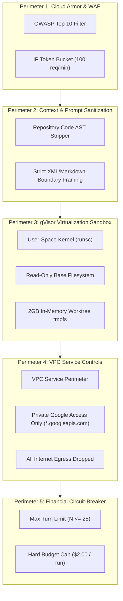
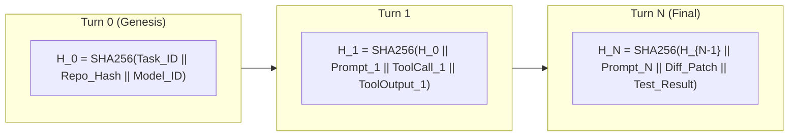

# Resilience Engineering, Threat Model & FMEA Analysis

> **Document ID:** `BP-ARCH-005`  
> **Status:** Approved / Production  
> **Target Track:** Best Architectural Design ($5,000) • Google Cloud All Things Agentic Hackathon (2026)

---

## 1. Failure Mode and Effects Analysis (FMEA)

Benchpress operates autonomous agent fleets executing untrusted code and multi-turn LLM reasoning loops. To guarantee high availability ($99.95\%$) and zero silent data corruption, the system is engineered against a rigorous FMEA matrix.

**RPN (Risk Priority Number) Formula:**
$$\text{RPN} = \text{Severity (1-10)} \times \text{Occurrence (1-10)} \times \text{Detection (1-10)}$$

| ID | Failure Mode | Root Cause | Severity (S) | Occurrence (O) | Detection (D) | Initial RPN | Automated Mitigation & Architectural Defense | Residual RPN |
| :--- | :--- | :--- | :---: | :---: | :---: | :---: | :--- | :---: |
| **FM-01** | LLM Provider Rate Limiting (HTTP 429) | Concurrency spikes exceeding Vertex AI quotas | 8 | 7 | 2 | **112** | Cloud Tasks exponential jittered backoff ($2\text{s} \dots 60\text{s}$) + Dynamic Token Bucket queue throttling. | **24** |
| **FM-02** | Infinite Agent Tool Loop | Model repeatedly executes unhelpful file reads | 7 | 6 | 3 | **126** | AST Tool Interceptor detects duplicate invocation signatures ($\ge 4$) and triggers Token Circuit-Breaker. | **28** |
| **FM-03** | Sandbox Fork Bomb / OOM Crash | Untrusted benchmark code spawns infinite threads | 9 | 4 | 2 | **72** | gVisor `runsc` cgroup memory limit ($2\text{GB}$) + process tree limit ($N \le 64$) with immediate SIGKILL. | **18** |
| **FM-04** | Prompt Injection via Repo Content | Malicious code in third-party repo embeds instructions | 8 | 5 | 4 | **160** | AST-based structural context loading + Strict System Message boundary delimiter isolation. | **32** |
| **FM-05** | BigQuery Write Buffer Overload | Redis memory exhaustion during massive swarm runs | 8 | 3 | 3 | **72** | Redis High-Watermark Alert ($> 80\%$) + Parallel Storage Write Streams with backpressure signaling. | **24** |
| **FM-06** | Runaway Trajectory Cost Burn | Complex problem triggers 50+ reasoning turns | 7 | 5 | 2 | **70** | Hard Trajectory Dollar Ceiling ($\$2.00$ default) enforced by real-time token ledger prior to dispatch. | **14** |
| **FM-07** | Hallucinated Tool Signatures | Model generates invalid JSON or non-existent tools | 6 | 8 | 2 | **96** | Autonomous Self-Healing Engine injects formal schema diff and prompts repair (max 3 retries). | **18** |
| **FM-08** | gVisor Network Egress Breach | Agent attempts data exfiltration or reverse shell | 10 | 2 | 2 | **40** | GCP VPC Service Controls perimeter blocking all non-Google outbound egress. | **10** |
| **FM-09** | Cloud Run Worker Timeout | Long-running pytest suite exceeds maximum limit | 7 | 4 | 2 | **56** | Per-command timeout interceptor ($30\text{s}$ per test execution) with graceful state flush. | **14** |
| **FM-10** | WebRTC Live Audio Drift | Network packet loss causing audio/vision desync | 5 | 5 | 3 | **75** | WebRTC jitter buffer adaptation + Timestamped synchronized DOM event packets via WebSocket. | **20** |
| **FM-11** | Firestore Read Quota Spike | Public traffic surge on dynamic leaderboard | 6 | 6 | 3 | **108** | Cloud CDN edge caching for public materialized views + Memorystore Redis query cache. | **18** |
| **FM-12** | Corrupt Patch Application | Git conflict or malformed hunk diff | 6 | 6 | 2 | **72** | Atomic `git apply --check` test; automatic rollback to clean branch on failure. | **12** |

---

## 2. Defense-in-Depth Security Model

### Security Controls Specification

1. **Repository Sanitization & Prompt Injection Defense:**
   - External source code files from benchmarks are never concatenated directly into system prompts.
   - Files are loaded via structured AST node extraction and tagged with immutable XML demarcation blocks: `<untrusted_repo_context path="...">...</untrusted_repo_context>`.
   - Foundation models are instructed with immutable system prompts anchored with HMAC signatures.

2. **Zero-Trust Network Perimeter:**
   - Worker containers operate without public IP addresses inside a VPC Service Controls perimeter.
   - Outbound DNS resolution is disabled except for internal Google Cloud private APIs.
   - Any attempt to open a socket to external IP ranges returns `EPERM` instantly at the gVisor Sentry level.

3. **Financial & Token Consumption Circuit-Breakers:**
   - Before every turn, the worker calculates:
     $$\text{Estimated Cost} = \text{Cumulative Cost} + (\text{Input Tokens} \cdot P_{\text{in}} + \text{Max Output} \cdot P_{\text{out}})$$
   - If $\text{Estimated Cost} > \text{Budget Limit}$, the worker immediately halts the trajectory with status `CIRCUIT_BREAKER_TRIPPED`, flushes telemetry, and marks the task unresolvable under the budget constraint.

---

## 3. Cryptographic Audit Logging & Tamper-Proof Traces

To guarantee that benchmark results are mathematically verifiable and immune to tampering, Benchpress incorporates **Cryptographic SHA-256 Trace Chaining**:

### Chain Verification Properties:
- Each turn's telemetry payload records `parent_trace_hash` and `current_trace_hash`.
- The final trajectory record in BigQuery contains the final cryptographic digest $H_N$.
- Anyone can independently re-verify the full trajectory replay by recomputing the hash sequence from the raw Cloud Storage JSON dump.
