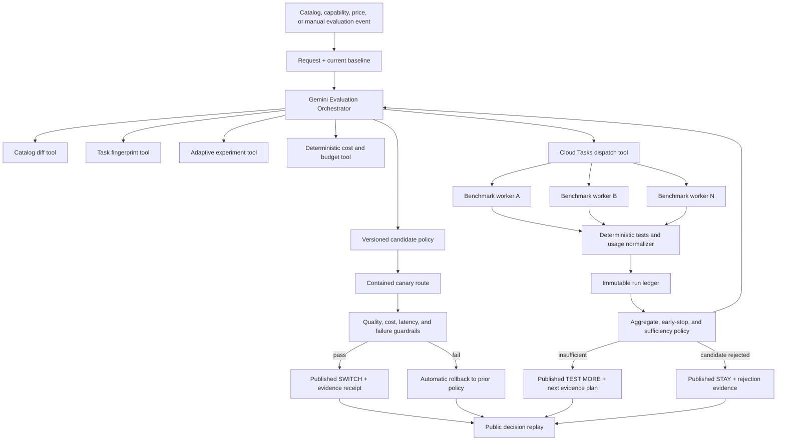

# Evaluation orchestrator and parallel worker topology

> **Document ID:** `BP-ARCH-006`
> **Status:** Authoritative target for the hackathon build
> **Decision:** One autonomous Gemini orchestrator, many controlled workers, no agent swarm
> **Target track:** The Taskmaster

## 1. Decision

Benchpress will use one bounded **Evaluation Orchestrator** powered by Gemini 3.5 or newer through an allowed Google agent framework. It will decide which evaluations are necessary, enforce the run budget, dispatch jobs, observe completion, and publish an evidence-backed `STAY`, `TEST MORE`, or `SWITCH` recommendation against the current baseline.

Benchmark executions run as independent Cloud Tasks jobs. They may execute concurrently, but they are not peer agents and do not negotiate, vote, or mutate shared policy. Deterministic code owns validation, arithmetic, scoring, and policy boundaries.

This architecture fits the official Taskmaster focus: an event-driven workflow watches for a change, decides what should happen next, interacts with multiple systems, and completes the work without step-by-step guidance.

## 2. Why not a swarm

A swarm would introduce authority conflicts, duplicate evaluations, inconsistent shared state, higher cost, harder reproducibility, and a weak answer to “why was this complexity necessary?” It would also push the submission toward the Fortified Enterprise Fleet expectations of cross-department discovery, multi-agent orchestration, long-term memory, identity, gateway policy, and enterprise governance.

Benchpress needs parallel throughput, not multiple overlapping decision-makers.

## 3. Component model



## 4. Responsibility boundaries

| Component | May do | Must not do |
|---|---|---|
| Evaluation Orchestrator | Interpret a change, select an evaluation cohort, call approved tools, explain results | Bypass budgets, invent measurements, alter test outcomes, perform destructive repository actions |
| Catalog collector | Fetch provider availability and official metadata, preserve sources and timestamps | Infer benchmark quality from marketing text |
| Task fingerprint service | Describe task type, language/framework, repository/context scale, tools, risk, and latency sensitivity | Read unrelated workspace data or infer protected traits |
| Adaptive experiment planner | Enumerate supported native configurations and select discriminating tasks/configurations | Treat cross-provider effort labels as computationally equivalent or require a full matrix by default |
| Budget engine | Estimate maximum cost, reserve budget, reject over-budget plans | Let the model override arithmetic or hard ceilings |
| Cloud Tasks dispatcher | Enqueue idempotent jobs with correlation IDs and retry metadata | Create duplicate logical runs or acknowledge work without durable ownership |
| Benchmark worker | Invoke one declared configuration, operate inside the allowed workspace, record raw usage and results | Change global routing policy, broaden tool scope, or publish conclusions |
| Test oracle | Execute frozen assertions and return pass/fail evidence | Use the evaluated model as the sole judge of its own output |
| Aggregator | Calculate CPR, success, latency, confidence and Pareto membership | Hide failed attempts or mix incompatible task cohorts |
| Evidence sufficiency policy | Stop dominated work, test thresholds, and return reject/abstain/canary eligibility | Force a winner, alter predeclared thresholds, or omit incurred cost |
| Canary policy controller | Version the candidate, route only the contained demo slice, compare guardrails, and restore the prior version | Change customer production traffic or bypass the baseline |
| Publisher | Publish versioned, provenance-labelled aggregates, receipts, and replay events | Replace a measured result with a fixture or stale result silently |

## 5. Orchestrator tools

The Gemini agent should receive a small, typed tool surface:

| Tool | Input | Output |
|---|---|---|
| `inspect_catalog_change` | Source snapshot IDs | Added, changed, deprecated models/prices/capabilities |
| `fingerprint_task` | Approved task and repository metadata | Versioned task fingerprint and risk/latency constraints |
| `list_supported_configurations` | Provider, exact model ID | Native configuration values and constraints |
| `design_adaptive_experiment` | Change, fingerprint including workflow phase, configurations, current baseline | Discriminating cohort, maximum spend, stopping rules, rationale |
| `estimate_run_cost` | Manifests and token ceilings | Maximum estimated spend and budget decision |
| `enqueue_benchmark_matrix` | Approved manifests and idempotency key | Cloud Task IDs and correlation ID |
| `check_matrix_status` | Correlation ID | Counts by queued/running/passed/failed/terminal state |
| `evaluate_stop_rules` | Current evidence and approved plan | Continue, stop configuration, stop matrix, or reject |
| `calculate_aggregates` | Completed cohort ID | Versioned metrics, confidence intervals, exclusions |
| `evaluate_evidence_sufficiency` | Aggregate and predeclared thresholds | Reject, abstain, or canary eligibility with reason |
| `create_canary_policy` | Candidate, baseline, aggregate version | Immutable contained-policy version |
| `verify_or_rollback_canary` | Canary observations and guardrails | Recommended or rolled-back policy state |
| `publish_decision_receipt` | Policy and evidence versions | Public `STAY`, `TEST MORE`, or `SWITCH`, receipt, and replay URL |

Tool schemas are strict. Invalid arguments fail closed and may be repaired only within a bounded retry count. The agent cannot synthesize and execute arbitrary wrappers in the judged path.

## 6. Workflow states

The existing FSM can be reused, but the judged workflow should expose a smaller, comprehensible lifecycle:

```text
RECEIVED
  -> VALIDATING_CHANGE
  -> FINGERPRINTING_TASK
  -> PLANNING_ADAPTIVE_EXPERIMENT
  -> CHECKING_BUDGET
  -> DISPATCHING
  -> WAITING_FOR_RESULTS
  -> APPLYING_STOP_RULES
  -> AGGREGATING
  -> CHECKING_EVIDENCE_SUFFICIENCY
  -> APPLYING_POLICY_DECISION
  -> PUBLISHING_RECEIPT
  -> COMPLETE
```

Terminal alternatives:

- `REJECTED_INVALID_SOURCE`
- `REJECTED_UNSUPPORTED_CONFIG`
- `REJECTED_QUALITY_OR_SAFETY`
- `ABSTAINED_INSUFFICIENT_EVIDENCE`
- `BUDGET_EXCEEDED`
- `PARTIAL_FAILURE`
- `FAILED_AUTH`
- `FAILED_INFRASTRUCTURE`

Every transition records its timestamp, actor, input artifact, output artifact, and correlation ID.

The execution lifecycle above drives a separate, versioned policy lifecycle:

```text
CHANGE_DETECTED
  -> EXPERIMENTAL
  -> EVALUATING
  -> REJECTED
     | ABSTAINED
     | CANARY
          -> VERIFYING
          -> ROLLED_BACK
             | RECOMMENDED
```

Transition guards are deterministic:

- `REJECTED` records an invalid, dominated, unsafe, or quality-failing candidate.
- `ABSTAINED` records why the current evidence cannot support a change.
- `CANARY` requires complete provenance, current inputs, sufficient evidence, and an approved immutable candidate version.
- `RECOMMENDED` requires the contained canary to satisfy predeclared quality, cost, latency, and infrastructure guardrails.
- `ROLLED_BACK` atomically restores the previously active policy version after a failed or incomplete canary.
- Only one current policy exists for a task segment; history is append-only.

### Internal states and user-facing decisions

The internal lifecycle remains detailed for audit and recovery. Its public expression is deliberately simple:

| Internal terminal condition | Published decision |
|---|---|
| Candidate rejected/dominated, canary rolled back, or baseline still wins | `STAY` |
| Insufficient/tied/stale/incompatible evidence | `TEST MORE` |
| Candidate passes evidence policy and contained canary | `SWITCH` |

All three paths call the publisher. Publication is not reserved for successful promotion. The web explorer stores the complete record; a Switch Decision Card, API, SDK, IDE, or gateway may surface the same published record at adoption time.

## 7. Idempotency and concurrency

The logical run key should be derived from immutable inputs:

```text
hash(
  provider
  + model_snapshot
  + native_configuration
  + task_version
  + repository_commit
  + harness_version
  + prompt_hash
  + tool_schema_hash
  + repetition_index
)
```

The database must reject duplicate logical run keys. Cloud Tasks retries the same job rather than creating another logical run. The publisher uses compare-and-swap or a version precondition so an older cohort cannot overwrite a newer recommendation.

Concurrency is bounded per provider and model family. A worker may be retried only for declared transient failures; model-invalid output remains an evaluated outcome, not an infrastructure retry.

## 8. Budget and safety boundaries

- The orchestrator proposes work; deterministic policy approves or rejects it.
- Every matrix has a maximum total spend, per-run spend, turn ceiling, wall-clock timeout, and concurrency ceiling.
- Every personalized decision names the current model/configuration or active policy version. The system cannot infer a switch benefit against an unspecified baseline.
- Usage is charged from provider-returned counters where available, not synthetic token assumptions.
- Sequential stopping may prevent future work, but it never removes incurred usage, failures, or eligible observations from the ledger.
- The worker operates only inside its assigned temporary workspace.
- External writes, package installation, Git pushes, pull requests, and destructive actions require separate authority and are outside the model-evaluation demo.
- A failed or incomplete cohort cannot be promoted as the default recommendation.
- Statistical ties, stale inputs, and insufficient samples terminate as `ABSTAINED`, not as an arbitrary recommendation.
- Canary authority is limited to the contained demo route; its previous version is always retained for rollback.
- No worker receives unrelated provider credentials.

## 9. Failure recovery

| Failure | Required behavior |
|---|---|
| Provider 429/5xx | Bounded exponential backoff; record retry cost and final state |
| Invalid native parameter | Mark configuration unsupported; do not silently substitute a different value |
| Worker timeout | Terminate, persist partial usage, and mark run failed |
| Duplicate delivery | Return the existing logical run state |
| Malformed model tool call | Validate, allow a bounded repair, then fail the run |
| Test failure | Record as model outcome; do not convert it into infrastructure retry |
| Repeated invalid tool calls | Reject or stop that configuration under the predeclared rule; preserve attempts and cost |
| Candidate is dominated | Cancel only undispatched work for that candidate; preserve evidence and the stop rationale |
| Partial matrix failure | Aggregate only under an explicit incomplete-cohort label; do not promote |
| Insufficient or tied evidence | Publish an abstention receipt and retain the current policy |
| Model alias, price, task, tool schema, or harness changes mid-run | Mark affected evidence stale; abstain or schedule a fresh experiment |
| Canary violates a guardrail | Atomically restore the prior policy and publish a rollback event |
| Canary verification is incomplete | Fail closed to the prior policy; never infer promotion |
| Publisher failure | Retry idempotently using the same aggregate version |
| Budget exhaustion | Stop undispatched jobs and preserve completed evidence |

## 10. Observability contract

One correlation ID connects:

- Trigger or source change
- Current baseline and workflow-phase fingerprint
- Orchestrator request and model metadata
- Proposed and approved evaluation plan
- Task fingerprint and stopping-rule version
- Cloud Task IDs
- Worker invocation records
- Provider usage and latency
- Test outcomes
- Aggregate version
- Evidence-sufficiency decision
- Candidate, baseline, and active policy versions
- Canary observations and any rollback event
- Published receipt, replay, and recommendation versions

The demo must show this ID in the UI, Cloud Tasks/Cloud Run logs, and the persisted record.

## 11. Hackathon evidence

The architecture is demonstrated only when the video shows:

1. A genuine change or explicitly labelled replay event.
2. A real Gemini 3.5+ orchestrator response with structured tool use.
3. A budget-approved matrix.
4. Multiple Cloud Tasks jobs executing.
5. At least two native model/thinking configurations, selected as an adaptive experiment.
6. Deterministic tests and actual usage records, including a deliberately rejected cheap failure.
7. A visible early-stop or bounded-completion decision with all incurred cost retained.
8. A stored aggregate that can reject, abstain, or authorize a contained canary.
9. A versioned canary that is promoted or automatically rolled back under guardrails.
10. An evidence receipt, public decision replay, and one published `STAY`, `TEST MORE`, or `SWITCH` outcome.
11. A visible Google Cloud deployment and shared correlation ID.

## 12. Post-hackathon multi-agent option

Multiple agents may be introduced later only when responsibilities require different context, tools, permissions, or failure boundaries:

```text
Evaluation Supervisor
  |- Catalog Intelligence Agent
  |- Benchmark Design Agent
  |- Security and Policy Agent
  `- Recommendation Explanation Agent
```

Even then, benchmark executions remain deterministic worker jobs. A new agent must have an independently testable contract and must improve a measured quality, latency, or operational outcome before joining the production path.
