# Master Data Dictionary, Entity-Relationship Models & Storage Schemas

> **Document ID:** `BP-ARCH-007`  
> **Status:** Historical target-state design — not deployed or verified
> **Target Track:** Best Architectural Design ($5,000) • Google Cloud All Things Agentic Hackathon (2026)  
> **Target Audience:** Cloud Data Architects, Site Reliability Engineers, Enterprise Security Reviewers, Hackathon Judges

---

## 1. Global Entity-Relationship (ER) Architecture

Benchpress implements an enterprise-grade, event-sourced relational and document model that bridges high-velocity streaming execution in Python workers with sub-millisecond document caching in Cloud Firestore and petabyte-scale analytical querying in Google BigQuery.

The global domain model maps the lifecycle of an evaluation: from benchmark task definitions and model profiles, through granular turn-by-turn trajectory executions and AST-validated tool invocations, to rollup leaderboard snapshots and cryptographic audit logs.

```mermaid
erDiagram
    TASK_SUITE ||--|{ TASK : contains
    MODEL_PROFILE ||--|{ TRAJECTORY_RUN : executes
    TASK ||--|{ TRAJECTORY_RUN : evaluates
    TRAJECTORY_RUN ||--|{ TRAJECTORY_TURN : generates
    TRAJECTORY_TURN ||--o{ TOOL_INVOCATION : executes
    TRAJECTORY_RUN ||--|| AUDIT_LOG : signs
    MODEL_PROFILE ||--o{ LEADERBOARD_SNAPSHOT : ranks
    TASK_SUITE ||--o{ LEADERBOARD_SNAPSHOT : scopes

    TASK_SUITE {
        string suite_id PK "Unique suite identifier (e.g., swe_bench_verified)"
        string name "Human-readable suite name"
        string version "Semantic suite version (e.g., v2.1.0)"
        string domain "Domain category (e.g., software_engineering, finance)"
        int total_tasks "Total number of curated benchmark tasks"
        float baseline_cost_usd "Estimated average cost baseline per run"
        timestamp created_at "Suite creation timestamp"
    }

    TASK {
        string task_id PK "Unique task identifier (e.g., django__django-11099)"
        string suite_id FK "References TASK_SUITE.suite_id"
        string repository "Target git repository (e.g., django/django)"
        string base_commit "Base commit SHA before patch mutation"
        string problem_statement "Detailed issue description / prompt"
        string test_patch_gcs_uri "GCS URI to ground-truth pytest evaluation harness"
        float task_complexity_score "Normalized complexity rating in range [0.0, 1.0]"
        int max_allowed_turns "Maximum permitted turn ceiling"
        float hard_budget_cap_usd "Maximum dollar cap per execution attempt"
    }

    MODEL_PROFILE {
        string model_id PK "Fully qualified model ID (e.g., gemini-2.5-pro)"
        string model_family "Model family (gemini, claude, gpt, deepseek, hybrid)"
        string vendor "Model provider organization"
        float price_input_1m "Price per 1M input tokens in USD"
        float price_output_1m "Price per 1M output tokens in USD"
        float price_reasoning_1m "Price per 1M reasoning tokens in USD"
        int context_window_limit "Maximum context token capacity"
        boolean supports_native_tool_calling "Native function calling support flag"
        boolean active_status "Whether model is enabled for routing"
    }

    TRAJECTORY_RUN {
        string trajectory_id PK "UUIDv4 uniquely identifying execution run"
        string session_id "Grouping ID for multi-model comparison swarms"
        string task_id FK "References TASK.task_id"
        string model_id FK "References MODEL_PROFILE.model_id"
        string active_coder_model "Active model used for code synthesis in hybrid mode"
        string status "Terminal status (COMPLETED, FAILED, BUDGET_EXCEEDED, FATAL_HALT)"
        boolean pass_at_1 "Deterministic ground-truth resolution indicator"
        boolean resolved "True if assertion harness verified solution"
        boolean early_halted "True if Markov sentinel halted early"
        int total_turns "Total number of completed FSM turns"
        int duration_ms "Wall-clock run duration in milliseconds"
        int total_input_tokens "Cumulative input token consumption"
        int total_output_tokens "Cumulative output token consumption"
        int total_reasoning_tokens "Cumulative reasoning token consumption"
        numeric total_cost_usd "Total dollar cost incurred"
        numeric cpr_usd "Cost Per Resolution metric"
        float trajectory_bloat_ratio "Ratio of wasted tool/retry tokens to total"
        float context_decay_score "Measured accuracy degradation index"
        int ast_heal_count "Count of AST schema repairs by Supervisor"
        string git_final_patch_uri "Cloud Storage URI to final git diff"
        timestamp started_at "UTC start timestamp"
        timestamp completed_at "UTC completion timestamp"
    }

    TRAJECTORY_TURN {
        string turn_id PK "Composite key: {trajectory_id}_turn_{turn_index}"
        string trajectory_id FK "References TRAJECTORY_RUN.trajectory_id"
        int turn_index "0-indexed sequential turn counter"
        string fsm_state "Active FSM State (REASONING_PLANNER, TOOL_DISPATCH, etc.)"
        string model_id FK "References MODEL_PROFILE.model_id"
        int prompt_tokens "Input tokens consumed in this turn"
        int completion_tokens "Output tokens generated in this turn"
        int reasoning_tokens "Reasoning tokens allocated in this turn"
        numeric turn_cost_usd "Dollar cost incurred during turn"
        numeric cumulative_cost_usd "Running total cost up to this turn"
        int latency_ms "Inference turnaround latency in milliseconds"
        boolean ast_healed "Whether AST Healer repaired payload"
        string ast_healing_trace "Diagnostic repair trace log if healed"
        string git_tree_hash "Git write-tree snapshot SHA before mutation"
        int sandbox_exit_code "Exit code returned by gVisor container"
        timestamp timestamp "UTC timestamp of turn execution"
    }

    TOOL_INVOCATION {
        string tool_call_id PK "UUIDv4 identifying specific tool execution"
        string turn_id FK "References TRAJECTORY_TURN.turn_id"
        string trajectory_id FK "References TRAJECTORY_RUN.trajectory_id"
        string tool_name "Name of invoked tool (view_file, edit_file, run_command)"
        string arguments_json "JSON serialized arguments payload"
        boolean is_schema_valid "Whether tool arguments conformed to Pydantic schema"
        boolean is_hallucinated "Whether model invoked an unregistered tool"
        boolean is_security_blocked "Whether eBPF / sandbox blocked operation"
        int execution_duration_ms "Process execution time inside gVisor sandbox"
        int exit_code "Subprocess exit code (0 = success)"
        int output_bytes "Byte length of returned stdout/stderr"
        boolean output_truncated "Whether output was compressed by memory compactor"
        timestamp timestamp "UTC invocation timestamp"
    }

    LEADERBOARD_SNAPSHOT {
        string snapshot_id PK "Composite key: {task_suite}_{model_id}_{window}"
        string task_suite FK "References TASK_SUITE.suite_id"
        string model_id FK "References MODEL_PROFILE.model_id"
        string window_period "Aggregation window (24H, 7D, 30D, ALL_TIME)"
        int total_runs_evaluated "Sample size of evaluated trajectories"
        float pass_at_1_rate "Observed Pass@1 success percentage [0.0 - 1.0]"
        numeric median_cpr_usd "50th percentile Cost Per Resolution"
        numeric p90_cpr_usd "90th percentile Cost Per Resolution"
        float mean_turns_to_resolve "Average turns needed for successful completion"
        float mean_trajectory_bloat "Average Trajectory Bloat Ratio"
        float pareto_efficiency_score "Calculated composite Pareto score [0.0 - 100.0]"
        boolean is_pareto_frontier "True if model is on the non-dominated frontier"
        string recommended_routing_tier "Assigned tier (FRONTIER, FAST_CODER, HYBRID)"
        timestamp last_updated "UTC timestamp of rollup computation"
    }

    AUDIT_LOG {
        string log_id PK "UUIDv4 identifying audit record"
        string trajectory_id FK "References TRAJECTORY_RUN.trajectory_id"
        string hmac_sha256_signature "Cryptographic signature verifying trace integrity"
        string signer_key_version "Key version used in GCP Secret Manager"
        string egress_policy_hash "Hash of active eBPF network security profile"
        string gvisor_sandbox_digest "SHA-256 digest of gVisor runsc runtime container"
        boolean tamper_evident_verified "Integrity verification status"
        timestamp recorded_at "UTC timestamp of audit log creation"
    }
```



---

## 2. Google BigQuery Production DDL & Column Definitions

All analytical tables in the `benchpress_analytics` dataset are optimized for high-throughput streaming ingestion via the **BigQuery Storage Write API** and sub-second OLAP queries through strict mandatory date partitioning and multi-column clustering.

### 2.1 Table: `benchpress_analytics.trajectories`
Stores primary trajectory runs, financial token burns, CPR calculations, and verified benchmark outcomes.

```sql
-- Production DDL: benchpress_analytics.trajectories
CREATE TABLE IF NOT EXISTS `benchpress_analytics.trajectories` (
    trajectory_id STRING NOT NULL OPTIONS(description="Globally unique UUIDv4 for the benchmark trajectory run"),
    run_session_id STRING NOT NULL OPTIONS(description="Session grouping ID for multi-model comparison swarms"),
    model_id STRING NOT NULL OPTIONS(description="Fully qualified model identifier (e.g., gemini-2.5-pro, claude-3-7-sonnet)"),
    model_family STRING NOT NULL OPTIONS(description="High-level model family: gemini, claude, gpt, deepseek, open-weights, benchpress-hybrid"),
    task_suite STRING NOT NULL OPTIONS(description="Benchmark suite identifier: swe_bench_verified, financial_recon, multi_doc_ops, cybench"),
    task_id STRING NOT NULL OPTIONS(description="Specific benchmark evaluation case ID (e.g., django__django-11099)"),
    task_complexity_score FLOAT64 NOT NULL OPTIONS(description="Normalized task complexity rating in range [0.0, 1.0]"),
    active_coder_model STRING OPTIONS(description="Active coder model ID utilized in 2-Tiered Hybrid Routing choreography"),
    
    -- Execution State & Outcome Flags
    status STRING NOT NULL OPTIONS(description="Terminal status: COMPLETED, FAILED, BUDGET_EXCEEDED, EARLY_HALTED, TIMEOUT, FATAL_HALT"),
    pass_at_1 BOOLEAN NOT NULL OPTIONS(description="True if ground-truth verification assertions succeeded on first attempt"),
    resolved BOOLEAN NOT NULL OPTIONS(description="True if task was verified resolved by deterministic pytest harness"),
    early_halted BOOLEAN NOT NULL OPTIONS(description="True if Markov Token Velocity Sentinel triggered an early circuit break"),
    halt_reason STRING OPTIONS(description="Explicit reason for early halting or termination"),
    
    -- Turn & Latency Metrics
    total_turns INT64 NOT NULL OPTIONS(description="Total agentic turns executed before resolution or halt"),
    duration_ms INT64 NOT NULL OPTIONS(description="Total wall-clock execution duration in milliseconds"),
    
    -- Economic & Token Telemetry
    total_input_tokens INT64 NOT NULL OPTIONS(description="Total prompt/input tokens consumed across all turns"),
    total_output_tokens INT64 NOT NULL OPTIONS(description="Total completion/output tokens generated across all turns"),
    total_reasoning_tokens INT64 NOT NULL OPTIONS(description="Total internal thinking/reasoning tokens allocated across all turns"),
    total_cost_usd NUMERIC NOT NULL OPTIONS(description="Total dollar cost incurred based on official provider token rate cards"),
    cpr_usd NUMERIC OPTIONS(description="Cost Per Resolution: total_cost_usd / 1.0 if pass_at_1 else total_cost_usd / empirical_pass_rate"),
    
    -- Trajectory Efficiency Indices
    trajectory_bloat_ratio FLOAT64 NOT NULL OPTIONS(description="Ratio of wasted tool error and redundant read tokens to total tokens [0.0, 1.0]"),
    context_degradation_score FLOAT64 NOT NULL OPTIONS(description="Measured accuracy decay score as context history accumulated"),
    ast_heal_count INT64 NOT NULL OPTIONS(description="Total number of malformed tool calls dynamically healed by Supervisor AST Healer"),
    git_snapshots_count INT64 NOT NULL OPTIONS(description="Total number of Git-Tree Saga snapshots captured during trajectory"),
    
    -- Artifact Storage & Auditing
    patch_diff_gcs_uri STRING OPTIONS(description="Cloud Storage URI to raw git diff patch generated by the agent"),
    stdout_log_gcs_uri STRING OPTIONS(description="Cloud Storage URI to complete sandboxed execution stdout/stderr logs"),
    client_ip_hash STRING OPTIONS(description="SHA-256 hash of client IP address for rate limiting, DDoS defense and fraud prevention"),
    timestamp TIMESTAMP NOT NULL OPTIONS(description="UTC timestamp of trajectory initiation")
)
PARTITION BY DATE(timestamp)
CLUSTER BY model_family, task_suite, task_complexity_score
OPTIONS(
    description="Primary analytical store for multi-turn agent benchmark trajectories, token economics, and CPR rankings",
    require_partition_filter=TRUE
);
```

#### JSON Schema Representation (`trajectories.json`)
```json
{
  "$schema": "https://json-schema.org/draft/2020-12/schema",
  "title": "BigQueryTrajectoriesRecord",
  "type": "object",
  "required": [
    "trajectory_id",
    "run_session_id",
    "model_id",
    "model_family",
    "task_suite",
    "task_id",
    "task_complexity_score",
    "status",
    "pass_at_1",
    "resolved",
    "early_halted",
    "total_turns",
    "duration_ms",
    "total_input_tokens",
    "total_output_tokens",
    "total_reasoning_tokens",
    "total_cost_usd",
    "trajectory_bloat_ratio",
    "context_degradation_score",
    "ast_heal_count",
    "git_snapshots_count",
    "timestamp"
  ],
  "properties": {
    "trajectory_id": { "type": "string", "format": "uuid" },
    "run_session_id": { "type": "string" },
    "model_id": { "type": "string" },
    "model_family": { "type": "string", "enum": ["gemini", "claude", "gpt", "deepseek", "open-weights", "benchpress-hybrid"] },
    "task_suite": { "type": "string" },
    "task_id": { "type": "string" },
    "task_complexity_score": { "type": "number", "minimum": 0.0, "maximum": 1.0 },
    "active_coder_model": { "type": ["string", "null"] },
    "status": { "type": "string", "enum": ["COMPLETED", "FAILED", "BUDGET_EXCEEDED", "EARLY_HALTED", "TIMEOUT", "FATAL_HALT"] },
    "pass_at_1": { "type": "boolean" },
    "resolved": { "type": "boolean" },
    "early_halted": { "type": "boolean" },
    "halt_reason": { "type": ["string", "null"] },
    "total_turns": { "type": "integer", "minimum": 0 },
    "duration_ms": { "type": "integer", "minimum": 0 },
    "total_input_tokens": { "type": "integer", "minimum": 0 },
    "total_output_tokens": { "type": "integer", "minimum": 0 },
    "total_reasoning_tokens": { "type": "integer", "minimum": 0 },
    "total_cost_usd": { "type": "number", "minimum": 0.0 },
    "cpr_usd": { "type": ["number", "null"], "minimum": 0.0 },
    "trajectory_bloat_ratio": { "type": "number", "minimum": 0.0, "maximum": 1.0 },
    "context_degradation_score": { "type": "number" },
    "ast_heal_count": { "type": "integer", "minimum": 0 },
    "git_snapshots_count": { "type": "integer", "minimum": 0 },
    "patch_diff_gcs_uri": { "type": ["string", "null"] },
    "stdout_log_gcs_uri": { "type": ["string", "null"] },
    "client_ip_hash": { "type": ["string", "null"] },
    "timestamp": { "type": "string", "format": "date-time" }
  }
}
```

---

### 2.2 Table: `benchpress_analytics.turn_telemetry`
Captures turn-level token burns, FSM transitions, reasoning token allocations, tool invocations, and supervisor repairs.

```sql
-- Production DDL: benchpress_analytics.turn_telemetry
CREATE TABLE IF NOT EXISTS `benchpress_analytics.turn_telemetry` (
    turn_id STRING NOT NULL OPTIONS(description="Composite unique identifier: {trajectory_id}_turn_{turn_index}"),
    trajectory_id STRING NOT NULL OPTIONS(description="Foreign key referencing trajectories.trajectory_id"),
    turn_index INT64 NOT NULL OPTIONS(description="Sequential 0-indexed turn position within the trajectory"),
    fsm_state STRING NOT NULL OPTIONS(description="Formal FSM state active during turn (e.g., REASONING_PLANNER, TOOL_DISPATCH_CODER)"),
    model_id STRING NOT NULL OPTIONS(description="Specific model invoked during this turn (supports dynamic hybrid routing)"),
    
    -- Token Burn Breakdown
    prompt_tokens INT64 NOT NULL OPTIONS(description="Input tokens sent to the model for this turn"),
    completion_tokens INT64 NOT NULL OPTIONS(description="Output tokens generated by the model in this turn"),
    reasoning_tokens INT64 NOT NULL OPTIONS(description="Thinking / chain-of-thought tokens allocated in this turn"),
    cached_tokens INT64 NOT NULL OPTIONS(description="Number of context tokens served from prompt cache"),
    turn_cost_usd NUMERIC NOT NULL OPTIONS(description="Dollar cost incurred exclusively during this turn"),
    cumulative_cost_usd NUMERIC NOT NULL OPTIONS(description="Total running cost of the trajectory including this turn"),
    latency_ms FLOAT64 NOT NULL OPTIONS(description="Turn turnaround latency in milliseconds"),
    
    -- Tool Invocation & AST Validation
    tool_call_name STRING OPTIONS(description="Name of tool requested: edit_file, view_file, grep_search, run_command"),
    tool_call_payload_json STRING OPTIONS(description="JSON serialized string of arguments passed to tool"),
    ast_healed BOOLEAN NOT NULL OPTIONS(description="True if Supervisor AST Healer intercepted and corrected tool arguments"),
    ast_healing_trace STRING OPTIONS(description="Structured diff trace generated during AST schema repair"),
    
    -- Sandbox & Saga Verification
    sandbox_exit_code INT64 NOT NULL OPTIONS(description="Process exit code returned by gVisor runtime sandbox"),
    git_tree_hash STRING OPTIONS(description="In-memory Git tree snapshot hash captured prior to tool execution"),
    error_message STRING OPTIONS(description="Detailed error message if turn encountered an execution exception"),
    
    timestamp TIMESTAMP NOT NULL OPTIONS(description="UTC timestamp of turn completion")
)
PARTITION BY DATE(timestamp)
CLUSTER BY trajectory_id, model_id
OPTIONS(
    description="Granular turn-by-turn state transitions, token burns, and tool execution telemetry",
    require_partition_filter=TRUE
);
```

---

### 2.3 Table: `benchpress_analytics.aggregated_model_indices`
Rollup aggregation table supporting real-time Pareto routing, public leaderboards, and sub-100ms API queries.

```sql
-- Production DDL: benchpress_analytics.aggregated_model_indices
CREATE TABLE IF NOT EXISTS `benchpress_analytics.aggregated_model_indices` (
    model_id STRING NOT NULL OPTIONS(description="Unique model identifier"),
    task_suite STRING NOT NULL OPTIONS(description="Benchmark suite: swe_bench_verified, financial_recon, cybench, multi_doc_ops"),
    window_period STRING NOT NULL OPTIONS(description="Aggregation timeframe: 24H, 7D, 30D, ALL_TIME"),
    
    -- Sample & Statistical Performance
    sample_size INT64 NOT NULL OPTIONS(description="Total trajectory runs evaluated in this aggregation window"),
    pass_at_1_rate FLOAT64 NOT NULL OPTIONS(description="Empirical Pass@1 success rate [0.0 - 1.0]"),
    resolved_count INT64 NOT NULL OPTIONS(description="Total count of successfully resolved tasks"),
    failed_count INT64 NOT NULL OPTIONS(description="Total count of failed or halted tasks"),
    
    -- Cost Per Resolution Quantiles
    median_cpr_usd NUMERIC NOT NULL OPTIONS(description="Median (p50) Cost Per Resolution in USD"),
    p90_cpr_usd NUMERIC NOT NULL OPTIONS(description="90th percentile Cost Per Resolution in USD"),
    p99_cpr_usd NUMERIC NOT NULL OPTIONS(description="99th percentile Cost Per Resolution in USD"),
    mean_cost_per_run_usd NUMERIC NOT NULL OPTIONS(description="Average gross cost per evaluation run regardless of outcome"),
    
    -- Operational & Trajectory Quality Metrics
    mean_turns_to_resolve FLOAT64 NOT NULL OPTIONS(description="Average turn count required to achieve successful resolution"),
    mean_trajectory_bloat FLOAT64 NOT NULL OPTIONS(description="Average Trajectory Bloat Ratio [0.0 - 1.0]"),
    mean_context_degradation FLOAT64 NOT NULL OPTIONS(description="Average context decay rate index"),
    ast_heal_success_rate FLOAT64 NOT NULL OPTIONS(description="Percentage of malformed tool calls successfully healed by Supervisor"),
    mean_latency_seconds FLOAT64 NOT NULL OPTIONS(description="Average wall-clock duration in seconds per trajectory"),
    
    -- Multi-Objective Pareto Optimization
    pareto_efficiency_score FLOAT64 NOT NULL OPTIONS(description="Composite Pareto efficiency index [0.0 - 100.0]"),
    is_pareto_frontier BOOLEAN NOT NULL OPTIONS(description="True if model lies on the non-dominated Pareto frontier"),
    recommended_routing_tier STRING NOT NULL OPTIONS(description="Optimal deployment tier: FRONTIER_REASONER, HIGH_SPEED_CODER, HYBRID_CHOREOGRAPHY"),
    
    last_updated TIMESTAMP NOT NULL OPTIONS(description="UTC timestamp of last rollup calculation")
)
PARTITION BY DATE(last_updated)
CLUSTER BY model_id, task_suite
OPTIONS(
    description="Materialized model benchmark metrics for sub-millisecond API responses and UI leaderboards"
);
```

---

## 3. Cloud Firestore Real-Time Document Schemas

Cloud Firestore (Native Mode) provides sub-50ms query latency for web clients, live trajectory synchronization, and global leaderboard caching.

### 3.1 Collection: `leaderboard_v1/{model_id}`
Stores real-time public ranking, Pass@1 rates, Cost Per Resolution, and provider badge metadata.

```json
{
  "$schema": "https://json-schema.org/draft/2020-12/schema",
  "title": "FirestoreLeaderboardDoc",
  "type": "object",
  "required": [
    "model_id",
    "name",
    "provider",
    "task_suite",
    "cpr_usd",
    "pass_at_1",
    "trajectory_bloat_ratio",
    "mean_latency_sec",
    "ast_healing_success_rate",
    "is_pareto_frontier",
    "recommended_tier",
    "pricing",
    "last_synced_at"
  ],
  "properties": {
    "model_id": { "type": "string", "example": "gemini-2.5-pro" },
    "name": { "type": "string", "example": "Gemini 2.5 Pro (Frontier)" },
    "provider": { "type": "string", "enum": ["Google", "Anthropic", "OpenAI", "Meta", "Benchpress Hybrid", "DeepSeek"] },
    "task_suite": { "type": "string", "enum": ["SWE_BENCH_VERIFIED", "HUMANEVAL_XL", "CYBENCH", "FINANCIAL_RECON"] },
    "cpr_usd": { "type": "number", "example": 0.0245 },
    "pass_at_1": { "type": "number", "minimum": 0.0, "maximum": 1.0, "example": 0.842 },
    "trajectory_bloat_ratio": { "type": "number", "minimum": 0.0, "maximum": 1.0, "example": 0.042 },
    "mean_latency_sec": { "type": "number", "example": 14.8 },
    "ast_healing_success_rate": { "type": "number", "example": 0.985 },
    "is_pareto_frontier": { "type": "boolean", "example": true },
    "recommended_tier": { "type": "string", "enum": ["FRONTIER_REASONER", "HIGH_SPEED_CODER", "HYBRID_CHOREOGRAPHY"] },
    "pricing": {
      "type": "object",
      "required": ["price_per_1m_input", "price_per_1m_output", "price_per_1m_reasoning"],
      "properties": {
        "price_per_1m_input": { "type": "number", "example": 1.25 },
        "price_per_1m_output": { "type": "number", "example": 5.00 },
        "price_per_1m_reasoning": { "type": "number", "example": 2.50 }
      }
    },
    "badge_metadata": {
      "type": "object",
      "properties": {
        "is_verified_vendor": { "type": "boolean", "example": true },
        "economic_champion": { "type": "boolean", "example": true },
        "badge_color": { "type": "string", "example": "emerald" }
      }
    },
    "last_synced_at": { "type": "string", "format": "date-time" }
  }
}
```

---

### 3.2 Collection: `live_runs/{trajectory_id}`
Stores active execution state, current FSM state, active turn index, and live token burn for real-time UI synchronization.

```json
{
  "$schema": "https://json-schema.org/draft/2020-12/schema",
  "title": "FirestoreLiveRunDoc",
  "type": "object",
  "required": [
    "trajectory_id",
    "task_id",
    "task_suite",
    "model_id",
    "active_coder_model",
    "current_state",
    "status",
    "current_turn",
    "max_turns",
    "accumulated_cost_usd",
    "budget_limit_usd",
    "ast_heal_count",
    "updated_at"
  ],
  "properties": {
    "trajectory_id": { "type": "string", "format": "uuid", "example": "8f3b2c1a-5d4e-4f3a-9c2b-1e0f8a7d6c5b" },
    "task_id": { "type": "string", "example": "django__django-11099" },
    "task_suite": { "type": "string", "example": "swe_bench_verified" },
    "model_id": { "type": "string", "example": "gemini-2.5-pro" },
    "active_coder_model": { "type": "string", "example": "gemini-2.5-flash" },
    "current_state": {
      "type": "string",
      "enum": [
        "IDLE",
        "INITIALIZING",
        "PERCEPTION",
        "PREDICTIVE_SENTINEL_EVAL",
        "REASONING_PLANNER",
        "TOOL_DISPATCH_CODER",
        "SAGA_SNAPSHOT_CAPTURE",
        "AST_VALIDATION",
        "SUPERVISOR_AST_HEAL",
        "SAGA_COMPENSATING_ROLLBACK",
        "SANDBOX_EXECUTION",
        "EVAL_ASSERTION",
        "TELEMETRY_FLUSH",
        "COMPLETE",
        "FATAL_HALT"
      ],
      "example": "TOOL_DISPATCH_CODER"
    },
    "status": {
      "type": "string",
      "enum": ["QUEUED", "RUNNING", "COMPLETED", "FAILED", "BUDGET_EXCEEDED", "EARLY_HALTED", "TIMEOUT"],
      "example": "RUNNING"
    },
    "current_turn": { "type": "integer", "example": 4 },
    "max_turns": { "type": "integer", "example": 20 },
    "accumulated_cost_usd": { "type": "number", "example": 0.0245 },
    "budget_limit_usd": { "type": "number", "example": 2.00 },
    "ast_heal_count": { "type": "integer", "example": 1 },
    "latest_tool_call": {
      "type": "object",
      "properties": {
        "name": { "type": "string", "example": "edit_file" },
        "duration_ms": { "type": "integer", "example": 420 },
        "exit_code": { "type": "integer", "example": 0 }
      }
    },
    "updated_at": { "type": "string", "format": "date-time" }
  }
}
```

---

## 4. Memorystore Redis Key Namespace Conventions

Benchpress utilizes Google Cloud Memorystore for Redis 7.2 as a high-concurrency micro-batch telemetry buffer, distributed lock manager, and Pareto cache.

| Key Pattern | Redis Data Structure | TTL | Eviction Policy | Purpose & Operations |
| :--- | :--- | :--- | :--- | :--- |
| `cache:pareto:v1:{task_suite}` | `STRING` (JSON Encoded) | `900s` (15 min) | `volatile-lfu` | Caches computed multi-objective Pareto Frontier points for fast routing queries. Invalidate via `DEL` on hourly BigQuery rollup. |
| `cache:leaderboard:v1:{task_suite}` | `STRING` (JSON Encoded) | `300s` (5 min) | `volatile-lfu` | Caches sorted model rankings, CPR indices, and pass rates for public hub views. |
| `telemetry:buffer:queue` | `LIST` / `STREAM` | None (Flushed on interval) | `noeviction` | High-throughput ingestion queue. Workers invoke `RPUSH` with JSON telemetry; `bq_streamer` consumes via `LPOP` / `XREADGROUP` every 2,000ms. |
| `lock:trajectory:{trajectory_id}` | `STRING` (UUID Token) | `60s` (Auto-expiring lease) | `volatile-ttl` | Distributed mutex preventing duplicate concurrent execution of the same benchmark run across multiple Cloud Run worker instances (`SET key token NX EX 60`). |
| `session:ws:{trajectory_id}:{client_id}` | `HASH` | `3600s` (1 hr) | `volatile-lru` | Tracks active WebSocket subscriber metadata, sequence offset (`seq_num`), and heartbeat timestamps. |
| `ratelimit:ip:{client_ip_hash}` | `STRING` (Integer Counter) | `60s` | `volatile-ttl` | Sliding-window API rate limiter enforcing max 120 req/min per client IP hash via atomic `INCR` and `EXPIRE`. |

---

## 5. Protocol Buffer (Protobuf) Wire Contracts

Below is the production-grade Protocol Buffer schema (`trajectory_events.proto`) governing low-latency, strongly typed event streaming between sandbox worker fleets, the Redis ingestion buffer, and the BigQuery Storage Write API.

```protobuf
syntax = "proto3";

package benchpress.telemetry.v1;

option go_package = "github.com/benchpress-ai/benchpress/gen/telemetry/v1;telemetryv1";
option java_multiple_files = true;
option java_package = "com.benchpress.telemetry.v1";

import "google/protobuf/timestamp.proto";

// Formal FSM Lifecycle States
enum FsmStateEnum {
  FSM_STATE_UNSPECIFIED = 0;
  FSM_STATE_IDLE = 1;
  FSM_STATE_INITIALIZING = 2;
  FSM_STATE_PERCEPTION = 3;
  FSM_STATE_PREDICTIVE_SENTINEL_EVAL = 4;
  FSM_STATE_REASONING_PLANNER = 5;
  FSM_STATE_TOOL_DISPATCH_CODER = 6;
  FSM_STATE_SAGA_SNAPSHOT_CAPTURE = 7;
  FSM_STATE_AST_VALIDATION = 8;
  FSM_STATE_SUPERVISOR_AST_HEAL = 9;
  FSM_STATE_SAGA_COMPENSATING_ROLLBACK = 10;
  FSM_STATE_SANDBOX_EXECUTION = 11;
  FSM_STATE_EVAL_ASSERTION = 12;
  FSM_STATE_TELEMETRY_FLUSH = 13;
  FSM_STATE_COMPLETE = 14;
  FSM_STATE_FATAL_HALT = 15;
}

// Terminal Trajectory Execution Status
enum TrajectoryStatusEnum {
  STATUS_UNSPECIFIED = 0;
  STATUS_QUEUED = 1;
  STATUS_RUNNING = 2;
  STATUS_COMPLETED = 3;
  STATUS_FAILED = 4;
  STATUS_BUDGET_EXCEEDED = 5;
  STATUS_EARLY_HALTED = 6;
  STATUS_TIMEOUT = 7;
}

// Detailed Tool Execution Record
message ToolExecutionPayload {
  string tool_call_id = 1;
  string tool_name = 2;
  string arguments_json = 3;
  bool is_schema_valid = 4;
  bool is_hallucinated = 5;
  bool is_security_blocked = 6;
  int64 execution_duration_ms = 7;
  int32 exit_code = 8;
  int64 output_byte_size = 9;
  bool output_truncated = 10;
}

// Granular Turn Telemetry Record
message TurnTelemetryEvent {
  string turn_id = 1;
  string trajectory_id = 2;
  int64 turn_index = 3;
  FsmStateEnum fsm_state = 4;
  string model_id = 5;
  
  // Token allocations
  int64 prompt_tokens = 6;
  int64 completion_tokens = 7;
  int64 reasoning_tokens = 8;
  int64 cached_tokens = 9;
  
  // Economics & Performance
  double turn_cost_usd = 10;
  double cumulative_cost_usd = 11;
  double latency_ms = 12;
  
  // AST Repair & Sagas
  ToolExecutionPayload tool_payload = 13;
  bool ast_healed = 14;
  string ast_healing_trace = 15;
  string git_tree_hash = 16;
  string error_message = 17;
  
  google.protobuf.Timestamp timestamp = 18;
}

// Trajectory Summary Record for Analytical Warehouse
message TrajectorySummaryRecord {
  string trajectory_id = 1;
  string run_session_id = 2;
  string model_id = 3;
  string model_family = 4;
  string task_suite = 5;
  string task_id = 6;
  double task_complexity_score = 7;
  string active_coder_model = 8;
  
  TrajectoryStatusEnum status = 9;
  bool pass_at_1 = 10;
  bool resolved = 11;
  bool early_halted = 12;
  string halt_reason = 13;
  
  int64 total_turns = 14;
  int64 duration_ms = 15;
  
  int64 total_input_tokens = 16;
  int64 total_output_tokens = 17;
  int64 total_reasoning_tokens = 18;
  double total_cost_usd = 19;
  double cpr_usd = 20;
  
  double trajectory_bloat_ratio = 21;
  double context_degradation_score = 22;
  int64 ast_heal_count = 23;
  int64 git_snapshots_count = 24;
  
  string patch_diff_gcs_uri = 25;
  string stdout_log_gcs_uri = 26;
  string client_ip_hash = 27;
  
  google.protobuf.Timestamp started_at = 28;
  google.protobuf.Timestamp completed_at = 29;
}

// Batch Telemetry Flush Request
message BatchTelemetryRequest {
  string batch_id = 1;
  string worker_instance_id = 2;
  repeated TurnTelemetryEvent turns = 3;
  repeated TrajectorySummaryRecord trajectories = 4;
  google.protobuf.Timestamp flushed_at = 5;
}

// Batch Telemetry Flush Response
message BatchTelemetryResponse {
  string batch_id = 1;
  bool success = 2;
  int64 records_ingested = 3;
  string error_message = 4;
}

// Streaming Service Definition
service TelemetryStreamingService {
  rpc StreamTurnEvent(TurnTelemetryEvent) returns (BatchTelemetryResponse);
  rpc FlushBatchTelemetry(BatchTelemetryRequest) returns (BatchTelemetryResponse);
}
```
