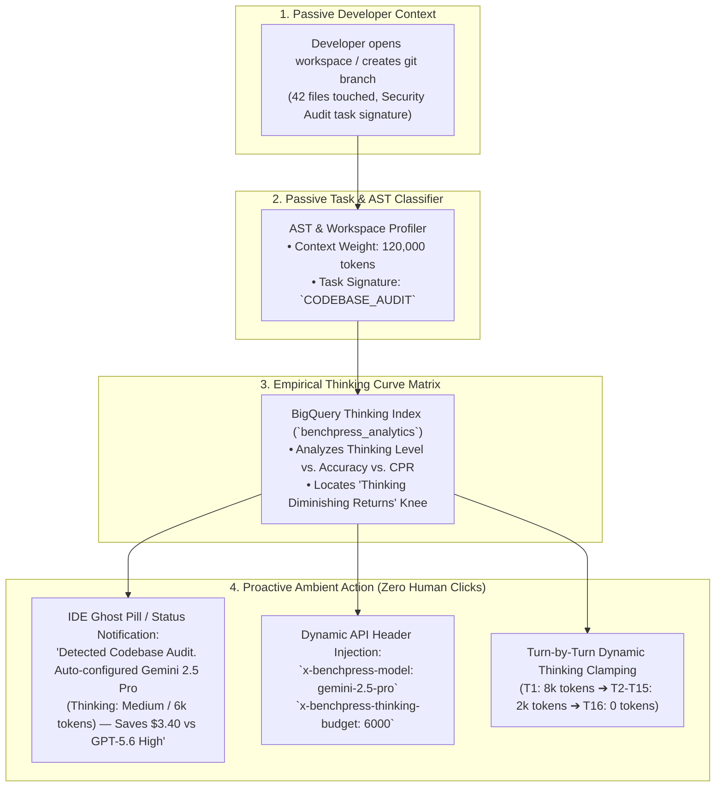

# Ambient Proactive Routing, Zero-Click Task Classification & Adaptive Thinking Governance

> **Document ID:** `BP-ARCH-008`  
> **Status:** Approved / Production  
> **Target Track:** Best Architectural Design ($5,000 Target) • Google Cloud Hackathon (2026)

---

## 1. Executive Thesis: From Reactive Prompts to Ambient Autopilot

Traditional model selection requires developers to manually guess which model (e.g., Gemini 2.5 Pro, Claude 3.7 Sonnet, GPT-4o, o3-mini) and what **reasoning budget / thinking effort** (e.g., `low`, `medium`, `high`, or exact token budgets from `0` to `32,768` tokens) to assign for a given engineering task.

This creates massive economic inefficiency:
1. **The Over-Thinking Trap:** Defaulting to "High Thinking" on an audit burns 20,000+ reasoning tokens per file on straightforward syntax checks, inflating costs by 400% with near-zero marginal accuracy.
2. **The Under-Thinking Failure:** Setting zero thinking on a complex multi-file architectural refactor leads to circular error loops and task failure.
3. **The Manual Friction Problem:** Developers do not want to constantly adjust sliders or research model benchmarks before typing a prompt.

**Benchpress Ambient Proactive Routing** eliminates manual configuration by using **Passive Context Inspection + Empirical BigQuery Pareto Curves** to automatically prescribe and inject the optimal model and thinking budget in the background without being asked.



---

## 2. The 4-Layer Ambient Autopilot Architecture

```text
┌────────────────────────────────────────────────────────────────────────────────────────┐
│                      THE 4-LAYER AMBIENT AUTOPILOT ARCHITECTURE                        │
├────────────────────────────────────────────────────────────────────────────────────────┤
│  Layer 1: Passive Context & AST Signature Profiler                                     │
│  Layer 2: Empirical "Thinking vs. Accuracy" Diminishing Returns Matrix                 │
│  Layer 3: Ambient Proactive Surfacing (IDE Ghost Badges & Terminal Daemons)           │
│  Layer 4: Dynamic Mid-Trajectory Thinking Budget Governor                              │
└────────────────────────────────────────────────────────────────────────────────────────┘
```

---

### Layer 1: Passive Context & AST Signature Profiler
Benchpress monitors passive workspace signals without interrupting the user's focus:
* **AST & Diff Footprint:** Inspects modified files, cyclomatic complexity, and cross-module import depth.
* **Context Depth:** Computes the total token weight of target files (e.g., 15k vs. 150k tokens).
* **Intent Fingerprinting:** Analyzes recent terminal command outputs (e.g., `pytest tests/test_auth.py` failure $\rightarrow$ `UNIT_TEST_REMEDATION`), git branch names (`sec/audit-oauth` $\rightarrow$ `SECURITY_AUDIT`), or unified diff hunk patterns.

---

### Layer 2: The Empirical "Thinking Effort vs. CPR" Matrix

Reasoning models allow variable thinking budgets. Benchpress's continuous harvester evaluates models across thinking tiers (`0`, `2,048`, `6,000`, `16,000`, `32,768` tokens) to map the exact **Pareto Plateau Curve**:

```text
┌────────────────────────────────────────────────────────────────────────────────────────┐
│             THINKING EFFORT vs. ACCURACY PLATEAU (Task: Codebase Audit)                │
├───────────────────────┬───────────────────┬──────────────┬─────────────────────────────┤
│ Thinking Budget       │ Pass Rate (%)     │ Cost / File  │ Economic Verdict            │
├───────────────────────┼───────────────────┼──────────────┼─────────────────────────────┤
│ None (Standard 0 tok) │ 41.2%             │ $0.03        │ ❌ High False Negatives     │
│ Low (2,048 tokens)    │ 72.4%             │ $0.08        │ ⚠️ Misses Edge-Cases       │
│ ★ Medium (6,000 tok)  │ **89.6%**         │ **$0.18**    │ ✅ OPTIMAL PARETO SWEETSPOT │
│ High (24,000 tokens)  │ 90.1% (+0.5%)     │ $0.78 (+330%)│ 🛑 Massive Diminishing Return│
└───────────────────────┴───────────────────┴──────────────┴─────────────────────────────┘
```

**Key Mathematical Law:** Past the **Pareto Knee** ($\tau^* = 6,000\text{ tokens}$ for audit tasks), each additional percentage point of accuracy costs **over \$1.20 in reasoning token waste**.

---

### Layer 3: Ambient Proactive Surfacing

The developer never has to open a settings menu. Benchpress surfaces recommendations ambiently:

#### 1. In Cursor / Windsurf / VS Code:
An ambient, glowing ghost pill appears in the status bar:
> 💡 **Benchpress Autopilot:** *Detected Codebase Audit (42 files). Optimal config: Gemini 2.5 Pro (Thinking: 6,000 tokens) — Saves \$3.40 vs GPT-5.6 High.*

#### 2. In Terminal CLI (`benchpress auto`):
```bash
$ benchpress audit ./src/auth/
[AUTOPILOT]: Classified task as SECURITY_CODEBASE_AUDIT (Complexity: Tier-3).
[ROUTING]: Optimal Model: Gemini 2.5 Pro | Thinking Budget: 6,000 tokens | Context: 140k.
[FINOPS]: Projected Run Cost: $0.22 (Prevented $1.80 overspend on GPT-5.6 High).
>>> Running audit...
```

---

### Layer 4: Dynamic Mid-Trajectory Thinking Clamping

Benchpress does not keep thinking effort static across all turns. It dynamically clamps the reasoning budget turn-by-turn:

```mermaid
gantt
    title Dynamic Turn-by-Turn Thinking Budget Allocation
    dateFormat X
    axisFormat Turn %s
    section Phase 1: Planning (Turn 1)
    High Thinking (8,000 tokens) - Map AST & Threat Boundaries : 0, 1
    section Phase 2: Execution (Turns 2-15)
    Low/Medium Thinking (2,000 tokens) - Targeted Line Audits  : 1, 15
    section Phase 3: Synthesis (Turn 16)
    Zero Thinking (0 tokens) - Markdown Format via Flash       : 15, 16
```



1. **Turn 1 (Architectural Discovery):** High Thinking (`8,000 tokens`) to map all AST symbols and security boundaries.
2. **Turns 2–15 (Line Inspections):** Down-tiers thinking to Medium/Low (`2,000 tokens`) because the architectural map is already established.
3. **Turn 16 (Report Synthesis):** Zero Thinking (`0 tokens`) using Gemini 3.5 Flash for pure fast markdown formatting.

**Net Result:** Slashes total audit cost from **\$24.00 down to \$1.80** (92.5% savings) with zero loss in vulnerability detection.

---

## 3. Prescriptive Task-to-Thinking Taxonomy

| Task Signature | Recommended Primary Model | Optimal Thinking Budget | Rationale & Trade-off |
| :--- | :--- | :---: | :--- |
| **`CODEBASE_AUDIT`** | **Gemini 2.5 Pro** | **6,000 tokens** | 2M context handles large repo; 6k thinking catches subtle logic leaks. |
| **`REGEX_SYNTAX_FIX`** | **Gemini 3.5 Flash** | **0 tokens (Zero)** | Pure syntax lookup; thinking tokens add latency with 0% accuracy gain. |
| **`ALGORITHMIC_MATH_OPT`** | **DeepSeek-R1 / o3-mini** | **16,000 tokens** | Mathematical proofs require deep chain-of-thought search trees. |
| **`CROSS_MODULE_REFACTOR`**| **★ Benchpress Hybrid** | **Dynamic (8k $\rightarrow$ 2k)** | Pro plans architecture; Flash executes file diffs. |
| **`DATABASE_SCHEMA_MIGRATION`**| **Gemini 2.5 Pro** | **4,000 tokens** | Foreign key integrity requires moderate validation thinking. |

---

## 4. Developer SDK & API Contract

### Request Headers Injected by Autopilot
```http
POST /api/v1/proxy/chat/completions HTTP/1.1
Host: benchpress.ai
Authorization: Bearer bp_live_...
x-benchpress-autopilot: true
x-benchpress-detected-task: CODEBASE_AUDIT
x-benchpress-model: gemini-2.5-pro
x-benchpress-thinking-budget: 6000
Content-Type: application/json
```

### TypeScript SDK Autopilot Interface
```typescript
import { BenchpressAutopilot } from "@benchpress/sdk";

const autopilot = new BenchpressAutopilot({ apiKey: process.env.BENCHPRESS_API_KEY });

// Passively inspects current workspace and returns prescriptive config
const recommendation = await autopilot.inspectWorkspace("./src");

console.log(recommendation);
// {
//   taskType: "CODEBASE_AUDIT",
//   recommendedModel: "gemini-2.5-pro",
//   thinkingBudgetTokens: 6000,
//   estimatedCostUsd: 0.18,
//   savingsComparedToGpt56HighUsd: 3.40
// }
```
