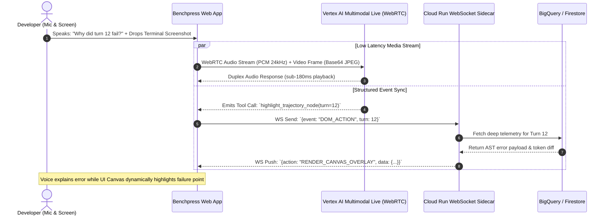

# ADR-004: Vertex AI Multimodal Live Streaming via WebRTC & WebSocket Sidecar

> **Status:** Accepted  
> **Date:** 2026-08-18  
> **Deciders:** Lead Multimodal AI UX Designer, Principal Cloud Systems Architect  
> **Consulted:** Frontend Engineering Team, Vertex AI Specialists  

---

## 1. Context & Problem Statement

To capture **Best Multimodal UX ($5,000)** in the Google Cloud Hackathon, Benchpress introduces a real-time, tri-modal developer experience allowing engineers and FinOps leaders to:
1. Speak naturally with a sub-200ms latency voice agent to debug failed agent trajectories (e.g., *"Why did Gemini 3.5 Flash fail turn 12 in the Django benchmark?"*).
2. Drag-and-drop terminal error screenshots and architecture diagrams into the viewport for immediate OCR diagnostic parsing and failure matching.
3. Observe synchronized, tactile DOM canvas updates (highlighted nodes, live token burn charts, and animated Pareto frontier shifts) synchronized precisely with the voice narration.

Traditional approaches using chained STT (Speech-to-Text) $\rightarrow$ LLM completion $\rightarrow$ TTS (Text-to-Speech) introduce $1,500 - 3,500\,\text{ms}$ of latency, destroying natural conversational cadence.

The team evaluated the **Vertex AI Gemini Multimodal Live API over WebRTC** vs. **REST/WebSocket Polling Architectures**.

---

## 2. Decision Drivers

- **End-to-End Voice Latency:** Must achieve sub-200ms glass-to-ear responsiveness for fluid speech interruption and conversational pacing.
- **True Multimodal Streaming:** Ability to stream audio PCM chunks and visual video/screenshot frames concurrently over a single unified session.
- **Client DOM & State Synchronization:** Ability to interleave structured JSON tool calls and canvas manipulation events alongside the audio stream.
- **Connection Reliability & Fallback:** Graceful degradation on poor network connections.

---

## 3. Considered Options

* **Option 1: Hybrid Architecture — Direct Duplex WebRTC to Vertex AI Multimodal Live API + Synchronized Cloud Run WebSocket Sidecar (Selected)**
* **Option 2: Cloud Run Gateway Central Duplex Proxy**
* **Option 3: Chained Cascade (Whisper STT $\rightarrow$ Gemini 2.5 Pro REST $\rightarrow$ Google Cloud TTS)**

---

## 4. Evaluation & Trade-off Analysis

| Feature / Metric | Option 1: Hybrid WebRTC + WS Sidecar | Option 2: Central Cloud Run Proxy | Option 3: Chained Cascade (STT-LLM-TTS) |
| :--- | :---: | :---: | :---: |
| **End-to-End Latency** | **$< 180\,\text{ms}$** | $250 - 450\,\text{ms}$ | $1,800 - 4,000\,\text{ms}$ |
| **Natural Voice Interruption** | **Native (Full-Duplex Echo Cancelling)** | Requires complex server VAD | Impossible / Broken |
| **Vision + Audio Concurrency** | **Native over WebRTC data/media tracks** | High server bandwidth burden | High latency batch upload |
| **DOM Canvas Manipulation** | **Instant via WebSocket Sidecar** | Multiplexed on proxy socket | Delayed until full response |
| **Architecture Complexity** | Moderate | High | High (Multiple separate services) |

---

## 5. Decision Outcome

**Chosen Option: Option 1 (Hybrid Architecture: Duplex WebRTC to Vertex AI Multimodal Live API with a Synchronized Cloud Run WebSocket Sidecar).**

### Rationale:
1. **Unrivaled Latency:** Vertex AI's native native audio-to-audio foundation model eliminates intermediate text translation steps, delivering true sub-200ms latency.
2. **Dual-Track Synergy:** Audio flows continuously over WebRTC without being blocked by analytical database queries, while the parallel WebSocket sidecar streams structured trajectory JSON to animate the interactive canvas in real time.

---

## 6. Consequences & Mitigations

### Positive Consequences:
- Unlocks an unprecedented "Iron Man / JARVIS" style debugging experience for complex multi-agent coding errors.
- Qualifies Benchpress for top honors in the **Best Multimodal UX** category.

### Mitigations for Unsupported Environments:
- The web application includes automatic feature detection: if WebRTC or microphone permissions are unavailable, the UI seamlessly falls back to a high-speed WebSocket text chat drawer with Gemini 3.5 Flash.
