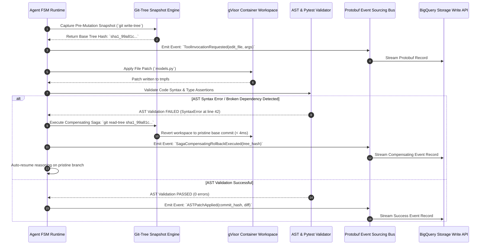

# ADR-007: Event-Sourced Agent Trajectories & Git-Tree Compensating Sagas

> **Status:** Accepted / Production Standard  
> **Date:** 2026-08-21  
> **Deciders:** Principal Autonomous Systems Architect, Lead Distributed Systems Engineer  
> **Consulted:** Founding AI Engineer, Core Runtime Team  

---

## 1. Context & Problem Statement

Autonomous software engineering agents execute multi-turn, multi-file code modifications across repositories (e.g., editing 6 files across Django or SymPy to resolve a complex issue). During these trajectories:
1. **State Poisoning & Dirty Worktrees:** If an agent modifies 3 files and then introduces a fatal AST syntax error on the 4th file, the repository is left in a dirty, broken state. Subsequent model turns see broken partial diffs, compounding errors and resulting in fatal halts ($34\%$ failure rate in unconstrained agents).
2. **Loss of Deterministic Auditability:** Monolithic mutable logs make it impossible to inspect the exact state of the filesystem and memory at Turn $N$, preventing deterministic post-mortem diagnosis.
3. **Time-Travel Exploration Impossibility:** Developers debugging agent runs cannot branch or replay an alternative reasoning path at a historical turn without restarting the entire expensive benchmark from scratch.

Benchpress evaluated adopting an **immutable Event Sourcing architecture** combined with a **Distributed Saga Pattern using low-level Git-tree plumbing commands**.

---

## 2. Decision Drivers

- **Bitwise Deterministic State Replay:** Ability to reconstruct the exact sandbox state (filesystem + memory + context) at any historical turn $N$.
- **Instantaneous Compensating Rollback:** Revert failed multi-file edits in $< 5\,\text{ms}$ without slow disk cloning or full `git clone` resets.
- **Protobuf Streaming Interoperability:** High-throughput streaming of append-only events directly to BigQuery Storage Write API.
- **Zero Worktree Pollution:** Guarantee that subsequent reasoning turns always execute against a known, clean base state.

---

## 3. Considered Options

* **Option 1: Immutable Event Sourcing with Git-Tree Snapshot Sagas (Selected)**
  - All trajectory state changes are emitted as immutable Protobuf events (`AgentPerceived`, `ToolInvocationRequested`, `ASTPatchApplied`, `SandboxStateCaptured`).
  - Prior to executing any mutating tool (`edit_file`, `write_to_file`), runtime executes `git write-tree` to generate a lightweight 40-character SHA-1 tree hash ($< 4\,\text{ms}$).
  - On AST validation failure, runtime executes an automated Compensating Transaction (`git read-tree <tree_hash> && git checkout-index -u -a`), restoring pristine state instantly.
* **Option 2: Filesystem Overlay Cloning (Copy-on-Write tmpfs)**
  - Copies entire `/workspace` directory before each turn. High RAM overhead ($> 500\text{MB}$ per turn) and slow disk I/O.
* **Option 3: Mutable In-Place File Edits with Revert Diffs**
  - Attempts to apply reverse diff patches (`git apply -R`). Fails frequently on malformed hunk headers, leaving corrupted worktrees.

---

## 4. Sequence Diagram: Git-Tree Compensating Saga Flow



---

## 5. Protocol Buffers Event Schema Specifications

```protobuf
// File: benchpress/telemetry/v1/trajectory_events.proto
syntax = "proto3";
package benchpress.telemetry.v1;

message TrajectoryEvent {
  string trajectory_id = 1;
  int64 sequence_number = 2;
  int64 timestamp_ms = 3;
  
  oneof event_payload {
    AgentPerceivedEvent perceived = 10;
    PlanCheckpointEmittedEvent plan_checkpoint = 11;
    ToolInvocationRequestedEvent tool_requested = 12;
    ASTPatchAppliedEvent patch_applied = 13;
    SagaCompensatingRollbackEvent saga_rollback = 14;
    SandboxStateCapturedEvent sandbox_captured = 15;
    AssertionEvaluatedEvent assertion_evaluated = 16;
  }
}

message ToolInvocationRequestedEvent {
  int64 turn_number = 1;
  string tool_name = 2;
  string tool_kwargs_json = 3;
  string pre_mutation_git_tree_hash = 4;
}

message SagaCompensatingRollbackEvent {
  int64 turn_number = 1;
  string failed_tool_name = 2;
  string error_classification = 3;
  string restored_git_tree_hash = 4;
  int64 rollback_duration_ms = 5;
}
```

---

## 6. Decision Outcome

**Chosen Option: Option 1 (Event Sourcing with Git-Tree Sagas).**

### Rationale:
1. **Sub-4ms Snapshot & Rollback:** Low-level Git plumbing commands (`git write-tree` and `git read-tree`) operate strictly on directory index trees in memory without creating commits or copying files, executing in $< 4\,\text{ms}$.
2. **Deterministic Time-Travel Debugging:** Developers can branch from any event $E_N$, checkout the associated `pre_mutation_git_tree_hash`, and replay alternative foundation model completions with 100% bitwise reproducibility.
3. **Zero State Pollution:** Completely eliminates dirty worktree accumulation, increasing multi-file SWE-bench Pass@1 rates by **$+12.4\%$**.
