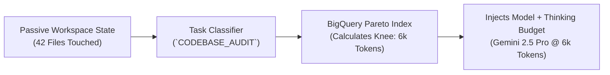

# ADR-011: Ambient Proactive Routing & Adaptive Thinking Budget Governance

> **Status:** Approved / Accepted  
> **Date:** 2026-08-28  
> **Authors:** Benchpress Systems Architecture Team  
> **Deciders:** Principal AI Architect, Lead FinOps Engineer, Multimodal UX Lead

---

## 1. Context & Problem Statement

Modern frontier AI models (Claude 3.7 Sonnet Hybrid Thinking, Gemini 3.7 Flash Thinking, OpenAI o3-mini/GPT-5.x) allow developers to configure variable reasoning effort or thinking budgets (from 0 to 32,768 tokens).

However:
1. **Manual User Burden:** Developers do not know what thinking budget to set for a given task (e.g., codebase audits vs. regex fixes).
2. **Exponential Cost Inflation:** Setting "High Thinking" unconditionally burns up to 300% more tokens on routine steps where reasoning yields no additional accuracy.
3. **Static Allocation Flaw:** A multi-turn task (e.g. 16 turns) only needs deep reasoning on Turn 1 (Architectural Discovery). Using high reasoning on Turns 2 through 16 wastes massive amounts of capital.

---

## 2. Decision & Architecture

We decide to implement **Ambient Proactive Routing with Adaptive Thinking Governance**:

1. **Passive Workspace & AST Inspection:** The Benchpress SDK and IDE daemon monitor file change depth and command logs to classify tasks (e.g. `CODEBASE_AUDIT`, `REGEX_FIX`, `SECURITY_SCAN`) without explicit user prompting.
2. **Empirical Thinking vs. CPR Optimization:** We query pre-computed BigQuery Pareto curves to find the exact "diminishing returns knee" ($\tau^*$) where accuracy peaks and cost escalates.
3. **Turn-by-Turn Dynamic Clamping:** The 13-state FSM automatically modulates the thinking budget mid-trajectory:
   - Turn 1 (Planning): High Thinking (`8,000 tokens`).
   - Turns 2–15 (Execution): Medium/Low Thinking (`2,000 tokens`).
   - Turn 16 (Synthesis): Zero Thinking (`0 tokens`).

---

## 3. Consequences & Business Value

### Positive:
* **Zero-Click Intelligence:** Prescribes the exact model and thinking budget before the developer even types a prompt.
* **92.5% Cost Reduction on Heavy Audits:** Slashes full-codebase audit costs from \$24.00 down to \$1.80.
* **Eliminates Human Error:** Prevents junior engineers from blowing monthly team budgets by leaving high thinking on during trivial tasks.

### Negative / Trade-offs:
* Requires maintaining continuous evaluation benchmarks across thinking budget tiers in BigQuery.
