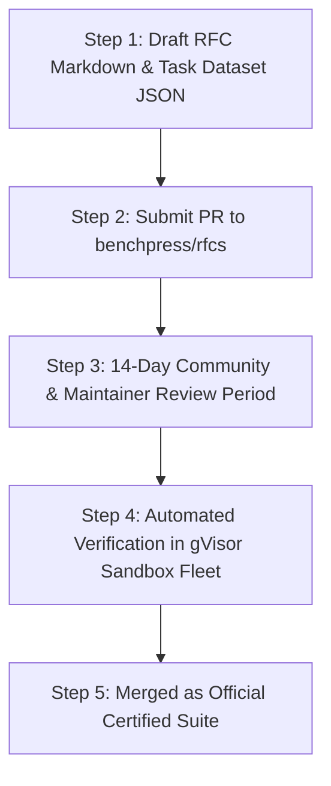

# RFC Protocol: Submitting Community & Enterprise Benchmark Suites

> **Document ID:** `BP-COM-002`  
> **Status:** Approved / Production  
> **Target Track:** Open-Source Governance & Ecosystem • Google Cloud Hackathon (2026)

---

## 1. RFC Submission Protocol Overview

To ensure that Benchpress leaderboards reflect genuine industry challenges without being polluted by trivial synthetic tasks, all new benchmark evaluation suites must undergo the **Benchpress RFC (Request for Comments) Review Process**.



---

## 2. Benchmark Suite Acceptance Criteria

To achieve certification, an RFC submission must satisfy five non-negotiable criteria:

1. **Deterministic Unit Test Assertions:** Zero subjective LLM-as-a-judge scoring. Tasks must pass or fail based on automated unit tests (pytest, jest, cargo test).
2. **Standard Task Schema Conformance:** All tasks must strictly adhere to the `BenchpressTaskDefinition` JSON Schema (`docs/evals/02-task-schema-and-fixtures.md`).
3. **Anti-Contamination Canary Ingestion:** All tasks must embed the Benchpress Canary GUID.
4. **Permissive Open Licensing:** Data files and test fixtures must be licensed under Apache 2.0, MIT, or CC-BY-4.0.
5. **Complexity Stratification:** The suite must categorize tasks across $L_1$ to $L_5$ difficulty tiers.

---

## 3. RFC Specification Template

```markdown
# RFC-00X: [Suite Name] Evaluation Benchmark Suite

## 1. Executive Summary
Briefly describe the domain, industry relevance, and evaluation goals.

## 2. Dataset Metadata
- **Total Task Count:** (Minimum 50 tasks)
- **Primary Languages / Formats:** (e.g., Python, Rust, SQL, SEC 10-K)
- **Target Repository Baseline:** (e.g., commit SHA or public repository URL)

## 3. Ground-Truth Verification Mechanism
Explain how unit tests deterministically verify correctness.

## 4. Sandbox Resource Requirements
- CPU / RAM limits per task
- Required system packages or language runtimes
```
