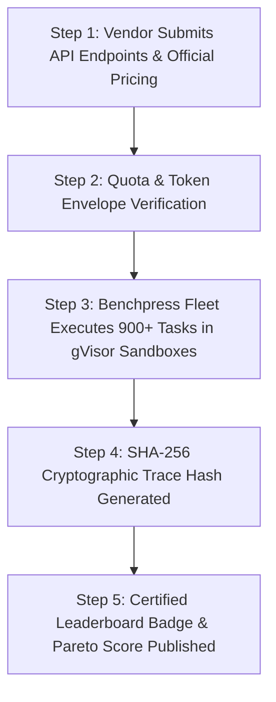

# Official Foundation Model Vendor Verification Protocol

> **Document ID:** `BP-COM-003`  
> **Status:** Approved / Production  
> **Target Track:** Open-Source Governance & Ecosystem • Google Cloud Hackathon (2026)

---

## 1. Vendor Certification & Indexing Mandate

To maintain complete objectivity and prevent vendor cherry-picking, foundation model providers (Google Cloud, Anthropic, OpenAI, Mistral, Meta) wishing to receive official **Certified Leaderboard Indexing** on Benchpress must adhere to the **Benchpress Vendor Verification Protocol (VVP)**.



---

## 2. Vendor Verification Requirements

1. **Production Endpoint Accessibility:** Vendors must provide live production API endpoints identical to those served to commercial customers (no internal unreleased fine-tunes or custom reasoning budget overrides).
2. **Official Published Pricing:** All CPR calculations are based on verifiable public pricing cards published on the vendor's official website.
3. **Reproducibility Guarantee:** Trajectory runs must achieve statistically consistent Pass@1 and token burn scores ($p < 0.05$ across 3 repeated runs).
4. **Zero Cache Injection:** Runs execute with randomized temperature seeds and dynamic synthetic AST code mutations to guarantee that models are evaluated on genuine reasoning rather than cache hits.

---

## 3. Certified Vendor Badge Specification

Models satisfying the VVP are awarded the **Benchpress Verified Badge** on public leaderboards:

```text
+-------------------------------------------------------------------------------+
|  ★ BENCHPRESS VERIFIED MODEL (VVP-2026-CERTIFIED)                             |
|  Model: Gemini 2.5 Pro (Vertex AI)                                           |
|  Verified Pass@1: 49.2% | Verified CPR: $1.620 | TBR: 14.8%                   |
|  Cryptographic Trace Root: 99a8120fa882... | Status: OFFICIALLY INDEXED       |
+-------------------------------------------------------------------------------+
```
