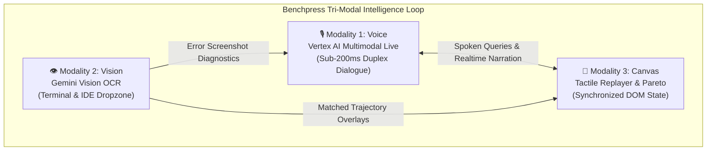

# Tri-Modal User Experience Specification (Voice, Vision, Canvas)

> **Document ID:** `BP-UX-001`  
> **Status:** Historical target-state design — not deployed or verified
> **Target Track:** Best Multimodal UX ($5,000) • Google Cloud All Things Agentic Hackathon (2026)

---

## 1. Tri-Modal Design Philosophy

Developer tools and AI benchmarks have historically been constrained to static tabular grids and dense text logs. In the multi-agent era, understanding why a model failed at turn 14 of an asynchronous 30-turn SWE-bench run requires analyzing code diffs, AST logs, token burn curves, and model thinking traces simultaneously.

Benchpress pioneers the **Tri-Modal Interaction Paradigm**—unifying **Live Spoken Dialogue**, **Computer Vision Diagnostic Ingestion**, and an **Interactive Tactile Canvas** into a continuous, synchronized feedback loop.



---

## 2. Modality 1: Live Voice Intelligence Agent (Sub-200ms)

Powered by the **Vertex AI Gemini Multimodal Live API over WebRTC**, the Benchpress Voice Intelligence Agent operates as an omnipresent engineering co-pilot directly within the browser.

### Key Capabilities:
1. **Hands-Free Trajectory Debugging:**
   - *User:* *"Why did Gemini 3.5 Flash fail turn 12 in the Django 11099 benchmark?"*
   - *Agent (Spoken Voice):* *"At turn 12, Flash attempted to apply an inline regex replace on `validators.py`, but failed because the target hunk header line numbers were misaligned by 4 lines. The system triggered self-healing, but hit the turn budget. Look at the canvas—I've highlighted the failing diff."*
   - *Synchronized Canvas Action:* The UI instantly scrolls to Turn 12, opens the diff viewer, and pulses the invalid hunk in Crimson Red (`#EF4444`).
2. **FinOps Dynamic Budget Simulations:**
   - *User:* *"Simulate a 65% token cost reduction on our Python microservice suite."*
   - *Agent (Spoken Voice):* *"Switching your pipeline from monolithic Claude 3.7 Sonnet to our 2-Tiered Hybrid Routing (Gemini 2.5 Pro Planner + Gemini 3.5 Flash Coder) yields a 74.2% cost reduction with only a 0.8% variance in Pass@1 resolution rate. I've updated the Pareto frontier curve on your screen."*
   - *Synchronized Canvas Action:* The interactive Pareto graph smoothly animates to the new weight distribution, drawing a golden ray to the optimal hybrid operating point.

---

## 3. Modality 2: Computer Vision Error & Diagram Ingestion

Developers frequently encounter cryptic stack traces in their local IDE or terminal. Rather than manually copying logs, Benchpress provides an active multimodal dropzone.

```
+-------------------------------------------------------------------------------+
|  📸 DRAG & DROP TERMINAL / IDE SCREENSHOT HERE                                |
|  [ Gemini Vision OCR Diagnostics Active ]                                     |
|                                                                               |
|  "Drop any stack trace, pytest failure, or system diagram to match against    |
|   100,000+ benchmarked agent trajectories and receive instant routing fixes." |
+-------------------------------------------------------------------------------+
```

### Multimodal Vision Pipeline:
1. **Instant OCR & AST Extraction:** The user drops an image file or pastes a clipboard screenshot into the viewport.
2. **Failure Signature Matching:** Gemini Vision extracts the error trace (`TypeError: 'NoneType' object is not subscriptable in serializers.py:142`) and vector-searches the BigQuery historical trajectory index.
3. **Automated Routing Prescription:** The system displays:
   - Historical model failure rates on this exact error pattern (e.g., *GPT-4o fails this AST pattern 62% of the time; Gemini 2.5 Pro resolves it in 2 turns*).
   - A one-click button to export the optimized routing rule directly into Cursor or Windsurf configurations.

---

## 4. Modality 3: Interactive Tactile Canvas

The tactile canvas renders high-density engineering data with sub-millisecond fluid responsiveness:

1. **Split-Screen Trajectory Replayer:**
   - Left Pane: Virtual gVisor sandbox terminal streaming colorized stdout/stderr and file tree mutations in real time.
   - Right Pane: Token burn waterfall chart breaking down Input, Output, and Reasoning tokens turn-by-turn with cost annotations.
2. **Draggable Pareto Frontier Sliders:**
   - Sliders for $\text{Weight}_{\text{Accuracy}}$, $\text{Weight}_{\text{Cost}}$, and $\text{Weight}_{\text{Latency}}$.
   - As the user drags the sliders, the Pareto curve dynamically recalculates, re-sorting the leaderboard and projecting monthly team savings in real time.
3. **Context Window Degradation Heatmap:**
   - Visual gradient showing token accumulation across turns (Green $\rightarrow$ Yellow $\rightarrow$ Crimson) with markers indicating where models begin hallucinating tool parameters.

---

## 5. Accessibility (a11y) & Multimodal Fallback Standards

Benchpress adheres strictly to **WCAG 2.1 AA** accessibility standards:

| Requirement | Implementation Detail |
| :--- | :--- |
| **Live Audio Closed Captioning** | Synchronous real-time speech-to-text captions rendered in a high-contrast bottom drawer with $< 50\text{ms}$ visual delay. |
| **Full Keyboard Navigation** | Every canvas element, slider, and audio toggle is 100% accessible via `Tab`, `Arrow` keys, and custom hotkeys (`Space` for Mic toggle, `Esc` to close drawer). |
| **Colorblind-Safe Palettes** | All status indicators pair color tokens with distinct geometric icons (e.g., Emerald Checkmark, Crimson Exclamation Diamond, Amber Alert Triangle). |
| **Text-Only & Low-Bandwidth Fallback** | Automatic degradation to a high-speed WebSocket text chat drawer powered by Gemini 3.5 Flash when WebRTC or audio permissions are unavailable. |
