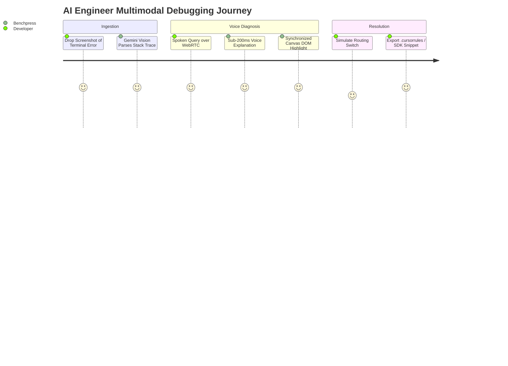

# User Journey Maps & Exhaustive ASCII Wireframes

> **Document ID:** `BP-UX-003`  
> **Status:** Historical UX concepts plus authoritative Switch Decision Card target
> **Target Track:** Best Multimodal UX ($5,000) • Google Cloud All Things Agentic Hackathon (2026)

> **Current disposition (2026-08-29):** The multimodal behavior and exact performance, savings, latency, and quality values in sections 1–2 are prototype/demo concepts, not measured facts. They must not appear in the submission without retained evidence. Section 3 preserves the valuable decision-time interaction in a truthful form aligned with the [authoritative submission plan](../hackathon/00-authoritative-submission-plan.md).

---

## 1. Persona Journey Maps

### Journey 1: The AI Application Engineer (Debugging & Route Optimization)
- **Goal:** Diagnose a failing 20-turn agent coding loop and export an optimized routing rule to eliminate $\$1,200/\text{month}$ in wasted inference spend.
- **Workflow:**
  1. *Ingest Stack Trace:* Engineer drags a terminal screenshot containing a recurring AST syntax error into the Benchpress Multimodal Drawer.
  2. *Spoken Query:* Engineer speaks: *"Show me which model resolves this error pattern with the lowest CPR."*
  3. *Multimodal Response:* Gemini Live responds over WebRTC in $160\,\text{ms}$, highlighting the failure pattern and explaining why Gemini 3.5 Flash solves it in 1 turn at $\$0.004$ vs. GPT-4o's 4 turns at $\$0.12$.
  4. *One-Click Export:* Engineer clicks "Export Cursor Rules", copying the YAML snippet directly into `.cursorrules`.



---

### Journey 2: The FinOps Leader (Pareto Optimization & Budget Modeling)
- **Goal:** Model the financial impact of migrating an enterprise agent fleet from monolithic Claude 3.7 Sonnet to Benchpress 2-Tiered Hybrid Routing (Gemini 2.5 Pro + Gemini 3.5 Flash).
- **Workflow:**
  1. *Navigate to Pareto Visualizer:* FinOps leader views the Cost Per Resolution vs. Pass@1 trade-off scatter plot.
  2. *Adjust Weights:* Sets Cost Weight to $70\%$, Accuracy Weight to $30\%$.
  3. *Inspect Projections:* System projects an annual savings of $\$142,000$ with $< 1.2\%$ delta in task success rate.
  4. *Download Executive Report:* Exports a signed PDF / CSV FinOps summary with BigQuery trace citations.

---

## 2. Exhaustive ASCII Wireframes

### Wireframe 1: Master Intelligence Hub (Leaderboard + Pareto Scatter Graph)

```text
+---------------------------------------------------------------------------------------------------------------+
| BENCHPRESS // THE ECONOMIC INTELLIGENCE PLATFORM FOR AGENTIC AI                         [🎙️ LIVE VOICE: ON]  |
+---------------------------------------------------------------------------------------------------------------+
| [ All Suites (SWE-bench / FinRecon) v ]  [ Budget Cap: $2.00 v ]  [ Timeframe: 7D v ]    [ 🔍 Search Models ] |
+---------------------------------------------------------------------------------------------------------------+
| 📊 REAL-TIME PARETO FRONTIER VISUALIZER                                                                       |
|                                                                                                               |
|  Pass@1 (%)                                                                                                   |
|    60% |                                      ● [Gemini 2.5 Pro (Monolithic)] ($1.62 CPR)                     |
|        |                                    /                                                                 |
|    50% |             ★ [HYBRID: Gemini 2.5 Pro + 3.5 Flash] ($0.24 CPR) <--- [OPTIMAL PARETO POINT]           |
|        |           /                                                                                          |
|    40% |         ● [Claude 3.7 Sonnet] ($1.85 CPR)                                                            |
|        |       /                                                                                              |
|    30% |     ● [Gemini 3.5 Flash] ($0.42 CPR)                                                                 |
|        |                                                                                                      |
|     0% +--------------------------------------------------------------------------------------------          |
|        $0.00             $0.50             $1.00             $1.50             $2.00            Cost/Res ($)  |
|                                                                                                               |
|  PARETO WEIGHTS: [ Accuracy: ===O=== (60%) ]   [ Cost: =====O= (80%) ]   [ Latency: ==O===== (30%) ]          |
+---------------------------------------------------------------------------------------------------------------+
| 🏆 VERIFIED ECONOMIC LEADERBOARD                                                                              |
+----+--------------------------------+-----------+---------+-----------+------------+-----------+--------------+
| RNK| MODEL / CHOREOGRAPHY           | PASS@1(%) | MED CPR | MEAN TURNS| BLOAT RATIO| P90 LAT   | ROUTING TIER |
+----+--------------------------------+-----------+---------+-----------+------------+-----------+--------------+
| 01 | ★ Hybrid (2.5 Pro + 3.5 Flash) | 48.6%     | $0.24   | 4.2       | 11.2%      | 2.1s      | RECOMMENDED  |
| 02 | Gemini 2.5 Pro (Monolithic)    | 49.2%     | $1.62   | 6.8       | 14.8%      | 8.4s      | FRONTIER     |
| 03 | Claude 3.7 Sonnet              | 47.9%     | $1.85   | 7.1       | 16.3%      | 9.1s      | FRONTIER     |
| 04 | GPT-4o                         | 41.2%     | $1.44   | 8.4       | 24.1%      | 6.8s      | GENERAL      |
| 05 | Gemini 3.5 Flash (Pure)        | 31.4%     | $0.42   | 9.2       | 34.7%      | 1.1s      | FAST_CODER   |
+----+--------------------------------+-----------+---------+-----------+------------+-----------+--------------+
```

---

### Wireframe 2: Live Trajectory Replayer (Split Sandbox & Token Waterfall)

```text
+---------------------------------------------------------------------------------------------------------------+
| RUN #TR-88219: django__django-11099  |  MODEL: Hybrid (Gemini 2.5 Pro + 3.5 Flash)  |  STATUS: [ PASSED ✅ ]  |
+-----------------------------------------------------------------------+---------------------------------------+
| 🖥️ GVISOR MICRO-SANDBOX TERMINAL LOG                                  | 📈 TOKEN BURN & COST WATERFALL        |
+-----------------------------------------------------------------------+---------------------------------------+
| [00:01] TURN 01 [Gemini 2.5 Pro]: Planner generating decomposition... | Turn 01: 1,420 Tokens ($0.018)  [Pro] |
| [00:03] -> Step: Locate UsernameValidator regex in validators.py      | Turn 02:   890 Tokens ($0.001)  [Fla] |
| [00:04] TURN 02 [Gemini 3.5 Flash]: `grep_search("ASCIIUsername")`    | Turn 03: 2,100 Tokens ($0.002)  [Fla] |
| [00:05] -> Found 2 matches in django/contrib/auth/validators.py       | Turn 04: 1,120 Tokens ($0.001)  [Fla] |
| [00:06] TURN 03 [Gemini 3.5 Flash]: `edit_file("validators.py", ...)` | ------------------------------------- |
| [00:07] [AST VALIDATION]: Patch parsed cleanly. 0 syntax errors.      | TOTAL TOKENS: 5,530                   |
| [00:08] TURN 04 [Gemini 3.5 Flash]: `run_command("pytest tests/")`   | TOTAL COST:   $0.022                  |
| [00:11] -> Pytest: 14 passed, 0 failed in 1.42s                       | COST SAVINGS: 87.4% vs Baseline       |
| [00:12] TRAJECTORY RESOLVED WITH GROUND-TRUTH ASSERTIONS.             | BLOAT RATIO:  4.2% (Ultra-Lean)       |
+-----------------------------------------------------------------------+---------------------------------------+
```

---

### Wireframe 3: Multimodal Voice & Vision Diagnostic Drawer

```text
+---------------------------------------------------------------------------------------------------------------+
| 🎙️ BENCHPRESS MULTIMODAL INTELLIGENCE COPILOT                          [ WebRTC Latency: 142ms // Connected ] |
+---------------------------------------------------------------------------------------------------------------+
|                                                                                                               |
|  [ 📸 DROP TERMINAL SCREENSHOT / LOG FILE HERE TO INSTANTLY DIAGNOSE ]                                        |
|  File Ingested: `error_trace_django_11099.png` (Parsed via Gemini Vision OCR)                                 |
|                                                                                                               |
|  ┌─────────────────────────────────────────────────────────────────────────────────────────────────────────┐  |
|  │ 💬 LIVE TRANSCRIPT & AUDIO NARRATION                                                                    │  |
|  │                                                                                                         │  |
|  │ User: "Why did the monolithic Flash run fail on this validator regex?"                                  │  |
|  │                                                                                                         │  |
|  │ Copilot (Gemini Live): "I analyzed your screenshot. Flash attempted a single-line regex fix without     │  |
|  │ considering Unicode null-byte escape characters. Gemini 2.5 Pro correctly identifies the RFC-3986       │  |
|  │ edge case. I recommend enabling the Hybrid Route: 2.5 Pro for planning and 3.5 Flash for file edits."  │  |
|  │                                                                                                         │  |
|  │ [ 🔊 Audio Waveform: |||||!||||||||||!||||||||!||||||| ]                                                │  |
|  └─────────────────────────────────────────────────────────────────────────────────────────────────────────┘  |
|                                                                                                               |
|  [ ⚡ Apply Recommended Route to API ]   [ 📋 Copy .cursorrules Snippet ]   [ ✕ Close Copilot Drawer ]         |
+---------------------------------------------------------------------------------------------------------------+
```

---

### Wireframe 4: IDE Model Switch Rationale Popup ("Why Switch?")

```text
+-----------------------------------------------------------------------------------------------+
| 💡 BENCHPRESS ROUTING ENGINE: MODEL SWITCH RECOMMENDATION                                    |
+-----------------------------------------------------------------------------------------------+
| CURRENT SELECTION: Claude 3.7 Sonnet Monolithic (Estimated Turn Cost: $0.184)                 |
| RECOMMENDED ROUTE: ★ Hybrid (Gemini 2.5 Pro Planner + Gemini 3.5 Flash Coder)                 |
+-----------------------------------------------------------------------------------------------+
| 📊 EMPIRICAL VERIFICATION EVIDENCE (SWE-bench Verified Dataset):                              |
|   • Task Resolution Pass@1: 48.6% (Hybrid) vs 47.9% (Current)  [ +0.7% Quality ]             |
|   • Cost Per Resolution:    $0.24 (Hybrid) vs $1.85 (Current)   [ 87.0% Cost Reduction ]      |
|   • Turn Latency:           1.4s (Hybrid) vs 8.2s (Current)     [ 5.8x Faster ]               |
+-----------------------------------------------------------------------------------------------+
| [ ✅ Switch to Hybrid Route (Save $1.61/task) ]   [ ⚙️ Configure Thresholds ]   [ Dismiss ]   |
+-----------------------------------------------------------------------------------------------+
```

## 3. Authoritative Switch Decision Card

The restored UX does not replace publication. Benchpress first publishes a versioned evidence record on the public web; the card surfaces that same record when a user is considering a model or reasoning change.

### Required states

- `STAY`: the current configuration remains the safest eligible choice.
- `TEST MORE`: the evidence cannot yet support a switch and a bounded next experiment is available.
- `SWITCH`: the candidate passed the evidence policy and contained canary.

### Required card

```text
+--------------------------------------------------------------------------------------------------+
| BENCHPRESS SWITCH DECISION                                              [OBSERVED] [CURRENT]     |
+--------------------------------------------------------------------------------------------------+
| DECISION: STAY | TEST MORE | SWITCH                 Decision v12 • measured 2026-08-29          |
|                                                                                                  |
| CURRENT BASELINE                    CANDIDATE                                                     |
| Provider/model: <exact ID>          Provider/model: <exact ID>                                  |
| Native settings: <exact values>     Native settings: <exact values>                             |
| Policy version: current-v7          Policy version: candidate-v8                                |
+--------------------------------------------------------------------------------------------------+
| TASK MATCH                                                                                       |
| TypeScript • security repair • execution phase • medium repository • high risk                  |
+--------------------------------------------------------------------------------------------------+
| MEASURED EVIDENCE                 CURRENT                 CANDIDATE                               |
| Verified quality                 <value / sample>        <value / sample>                        |
| Cost per verified resolution     <observed CPR>          <observed CPR>                          |
| Latency                          <observed range>        <observed range>                        |
| Failed guardrails                <evidence>              <evidence>                              |
| Freshness / uncertainty          <date / interval>       <date / interval>                       |
+--------------------------------------------------------------------------------------------------+
| WHY THIS DECISION: <evidence-grounded explanation>                                              |
| WHAT WOULD REVERSE IT: <specific new evidence or guardrail condition>                            |
+--------------------------------------------------------------------------------------------------+
| [View receipt] [Replay decision] [Run contained canary / Buy more evidence / Keep current]       |
+--------------------------------------------------------------------------------------------------+
```

### Interaction rules

1. The current configuration is never hidden; “do nothing” is a first-class option.
2. The card cannot say `SWITCH` without a compatible baseline and passing contained canary.
3. `TEST MORE` displays the proposed tasks, configurations, stopping rules, maximum evidence cost, and why the extra evidence could change the decision.
4. `STAY` identifies whether the candidate failed quality, safety, cost, latency, freshness, or canary guardrails.
5. “Why not cheapest?” names the failed test or risk boundary rather than treating price as sufficient.
6. Every number is labelled `OBSERVED`, `PROJECTED`, or `ILLUSTRATIVE`. Projections disclose volume, horizon, price version, evaluation/switching costs, and uncertainty.
7. The public receipt and replay remain available even when the user dismisses or overrides the recommendation.
8. Applying a route is never a silent production write. The hackathon action is limited to a contained canary; later customer deployment follows explicit policy authority.

### Phase-aware extension

The task fingerprint includes `research_planning`, `specification`, `execution`, `review`, `refinement`, or `whole_workflow`. The hackathon card compares single-model/reasoning configurations. Post-hackathon, the same card can compare an end-to-end route policy—such as planner, executor, and reviewer configurations—only after Benchpress measures handoff, repeated-context, replanning, escalation, and failure costs.
