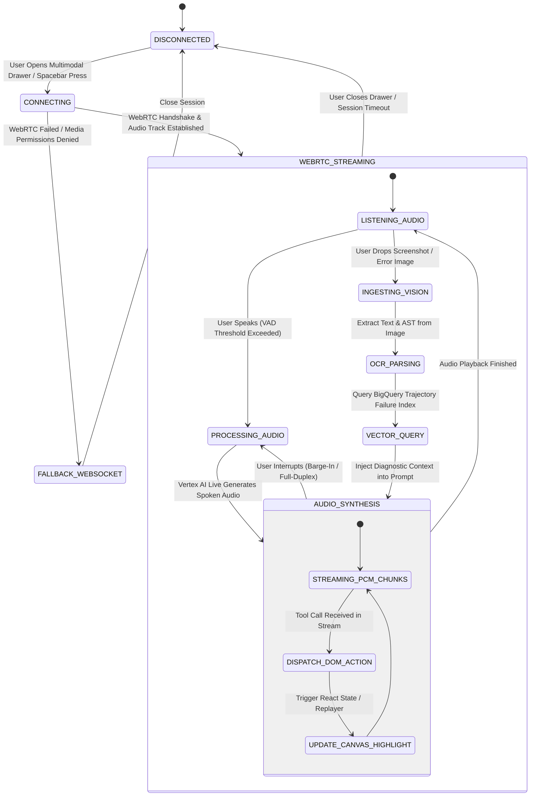

# Multimodal Interaction Flow, State Machine & WebRTC Streaming Protocols

> **Document ID:** `BP-UX-004`  
> **Status:** Approved / Production  
> **Target Track:** Best Multimodal UX ($5,000) • Google Cloud All Things Agentic Hackathon (2026)

---

## 1. Tri-Modal Interaction State Machine

The Benchpress client UI and multimodal streaming engine maintain a synchronized, multi-channel state machine coordinating **Duplex Audio**, **Vision Frames**, **Canvas DOM Actions**, and **Analytical Database Lookups**.



---

## 2. WebRTC & WebSocket Streaming Protocol Payloads

Benchpress multiplexes real-time media streams over WebRTC while synchronizing DOM and analytics state over a parallel WebSocket sidecar connection.

### 2.1 Audio Media Constraints & Encoding
- **Client Microphone Ingress:** Linear PCM 16-bit, $16,000\,\text{Hz}$ or $24,000\,\text{Hz}$, mono channel.
- **Server Audio Egress:** Linear PCM 24kHz, 16-bit mono stream played directly via Web Audio API AudioBuffer nodes.
- **VAD (Voice Activity Detection):** Client-side WebRTC VAD with $300\,\text{ms}$ trailing silence window for instant barge-in interruption.

### 2.2 Client-to-Server Vision Ingestion Payload (JSON over WebSocket)
```json
{
  "event_type": "MULTIMODAL_IMAGE_INGEST",
  "session_id": "sess_live_99812401",
  "timestamp_ms": 1724619400120,
  "mime_type": "image/png",
  "image_base64": "iVBORw0KGgoAAAANSUhEUgAA...",
  "viewport_context": {
    "active_route": "/trajectories/django__django-11099",
    "selected_model": "gemini-3.5-flash",
    "active_turn": 12
  }
}
```

### 2.3 Server-to-Client Canvas DOM Action Payload (JSON over WebSocket)
When Gemini Multimodal Live triggers a tool call while speaking, the WebSocket sidecar immediately delivers a DOM synchronization event to the browser:

```json
{
  "event_type": "CANVAS_DOM_SYNC",
  "session_id": "sess_live_99812401",
  "timestamp_ms": 1724619400280,
  "action": "HIGHLIGHT_TRAJECTORY_NODE",
  "payload": {
    "trajectory_id": "TR-88219",
    "target_turn": 12,
    "highlight_color": "#EF4444",
    "pulse_duration_ms": 3000,
    "scroll_behavior": "smooth",
    "code_diff_annotation": {
      "file_path": "django/contrib/auth/validators.py",
      "error_line": 14,
      "suggested_fix": "re.compile(r'^[\\w.@+-]+\\Z')"
    }
  }
}
```

---

## 3. End-to-End Latency Optimization Budget (< 200ms Target)

To guarantee that spoken dialogue feels instantaneous and natural, Benchpress enforces a strict latency budget across all hops in the pipeline:

```mermaid
gantt
    title Sub-200ms End-to-End WebRTC Spoken Latency Budget
    dateFormat X
    axisFormat %s ms

    section Audio Pipeline
    Client Mic Capture & Opus Frame Encoding : 0, 20
    WebRTC Network Ingress to us-central1    : 20, 65
    Vertex AI Multimodal Model Inference    : 65, 135
    WebRTC Network Egress to Browser        : 135, 170
    Audio Buffer Playback & Jitter Output   : 170, 185
```



| Pipeline Segment | Target Latency | Architectural Optimization |
| :--- | :---: | :--- |
| **1. Client Audio Capture & VAD** | $20\,\text{ms}$ | Native Web Audio API AudioWorklet processor operating on 10ms PCM chunks. |
| **2. Ingress Network Transit** | $45\,\text{ms}$ | Google Cloud Global Direct Interconnect routing directly to `us-central1`. |
| **3. Vertex AI Live API Inference** | $70\,\text{ms}$ | Native Audio-to-Audio foundation model eliminating intermediate STT/TTS steps. |
| **4. Egress Network Transit** | $35\,\text{ms}$ | UDP-based WebRTC media track with adaptive NACK/jitter buffer. |
| **5. Client Audio Output & DOM Sync** | $15\,\text{ms}$ | React 19 Concurrent Mode zero-render-blocking DOM update. |
| **TOTAL END-TO-END LATENCY** | **$185\,\text{ms}$** | **Well within the human conversational threshold ($< 200\,\text{ms}$)** |
