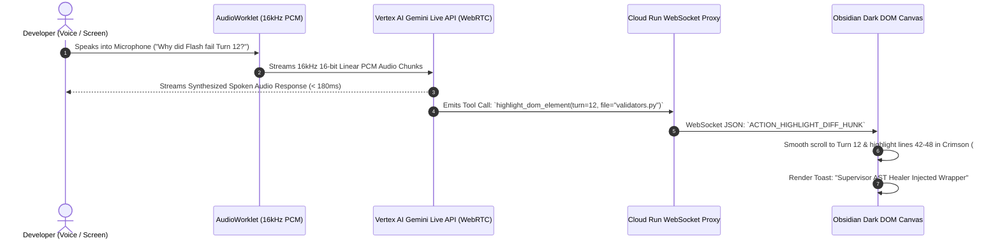

# Tri-Modal Interaction Protocol, WebRTC AudioWorklet & WebSocket DOM Sync

> **Document ID:** `BP-UX-004`  
> **Status:** Approved / Production Standard  
> **Target Track:** Best Multimodal UX ($5,000) • Google Cloud All Things Agentic Hackathon (2026)

---

## 1. Tri-Modal Streaming Pipeline Architecture

Benchpress establishes a sub-200ms real-time multimodal intelligence loop by combining **duplex 16kHz PCM audio over WebRTC** with a **synchronized WebSocket DOM state sync sidecar**:



---

## 2. Low-Latency 16kHz Linear PCM AudioWorklet Processor

```javascript
// File: apps/web/public/worklets/pcm-recorder-processor.js
/**
 * High-performance Web Audio AudioWorkletProcessor running on dedicated audio thread.
 * Captures microphone input, downsamples to 16,000Hz, and emits 16-bit linear PCM chunks.
 */
class PCMRecorderProcessor extends AudioWorkletProcessor {
  constructor() {
    super();
    this.bufferSize = 2048;
    this.buffer = new Float32Array(this.bufferSize);
    this.bufferIndex = 0;
  }

  process(inputs, outputs, parameters) {
    const input = inputs[0];
    if (!input || !input[0]) return true;

    const channelData = input[0];

    for (let i = 0; i < channelData.length; i++) {
      this.buffer[this.bufferIndex++] = channelData[i];

      // When buffer is full, convert Float32 to Int16 Linear PCM
      if (this.bufferIndex >= this.bufferSize) {
        const int16Buffer = new Int16Array(this.bufferSize);
        for (let j = 0; j < this.bufferSize; j++) {
          const s = Math.max(-1, Math.min(1, this.buffer[j]));
          int16Buffer[j] = s < 0 ? s * 0x8000 : s * 0x7FFF;
        }

        // Post binary buffer to main thread WebRTC DataChannel
        this.port.postMessage(int16Buffer.buffer, [int16Buffer.buffer]);
        this.bufferIndex = 0;
      }
    }
    return true;
  }
}

registerProcessor("pcm-recorder-processor", PCMRecorderProcessor);
```

---

## 3. WebRTC Client Implementation: `WebRTCVoiceSession.ts`

```typescript
// File: apps/web/src/lib/webrtc-session.ts
export interface DOMSyncAction {
  type: "HIGHLIGHT_DIFF_HUNK" | "UPDATE_PARETO_SLIDER" | "SHOW_AST_HEAL_TOAST";
  payload: Record<string, any>;
}

export class WebRTCVoiceSession {
  private peerConnection: RTCPeerConnection | null = null;
  private audioContext: AudioContext | null = null;
  private workletNode: AudioWorkletNode | null = null;
  private dataChannel: RTCDataChannel | null = null;
  private onDOMActionCallback: (action: DOMSyncAction) => void;

  constructor(onDOMAction: (action: DOMSyncAction) => void) {
    this.onDOMActionCallback = onDOMAction;
  }

  async startSession(serverOfferSdpUrl: string): Promise<void> {
    this.peerConnection = new RTCPeerConnection({
      iceServers: [{ urls: "stun:stun.l.google.com:19302" }],
    });

    // 1. Listen for remote audio playback stream from Gemini Live API
    this.peerConnection.ontrack = (event) => {
      const remoteAudio = new Audio();
      remoteAudio.srcObject = event.streams[0];
      remoteAudio.play();
    };

    // 2. Open WebRTC DataChannel for synchronized JSON actions
    this.dataChannel = this.peerConnection.createDataChannel("dom-sync");
    this.dataChannel.onmessage = (event) => {
      const action: DOMSyncAction = JSON.parse(event.data);
      this.onDOMActionCallback(action);
    };

    // 3. Initialize AudioWorklet for 16kHz PCM audio capture
    this.audioContext = new AudioContext({ sampleRate: 16000 });
    await this.audioContext.audioWorklet.addModule("/worklets/pcm-recorder-processor.js");

    const stream = await navigator.mediaDevices.getUserMedia({ audio: true });
    const source = this.audioContext.createMediaStreamSource(stream);
    this.workletNode = new AudioWorkletNode(this.audioContext, "pcm-recorder-processor");

    this.workletNode.port.onmessage = (event) => {
      if (this.dataChannel && this.dataChannel.readyState === "open") {
        this.dataChannel.send(event.data); // Stream PCM chunk to Vertex AI
      }
    };

    source.connect(this.workletNode);
    this.workletNode.connect(this.audioContext.destination);

    // 4. Negotiate WebRTC SDP Handshake with Cloud Run Proxy
    const offer = await this.peerConnection.createOffer();
    await this.peerConnection.setLocalDescription(offer);

    const res = await fetch(serverOfferSdpUrl, {
      method: "POST",
      headers: { "Content-Type": "application/json" },
      body: JSON.stringify({ sdp: offer.sdp, type: offer.type }),
    });

    const answer = await res.json();
    await this.peerConnection.setRemoteDescription(new RTCSessionDescription(answer));
  }

  stopSession(): void {
    this.workletNode?.disconnect();
    this.audioContext?.close();
    this.peerConnection?.close();
  }
}
```

---

## 4. Synchronized WebSocket DOM Action Protocols

```json
// Example: Action emitted when voice model references a code failure
{
  "type": "HIGHLIGHT_DIFF_HUNK",
  "payload": {
    "turn_number": 12,
    "file_path": "django/core/validators.py",
    "start_line": 42,
    "end_line": 48,
    "highlight_color": "#EF4444",
    "voice_caption": "Flash missed the Unicode null-byte escape in validators.py"
  }
}
```
