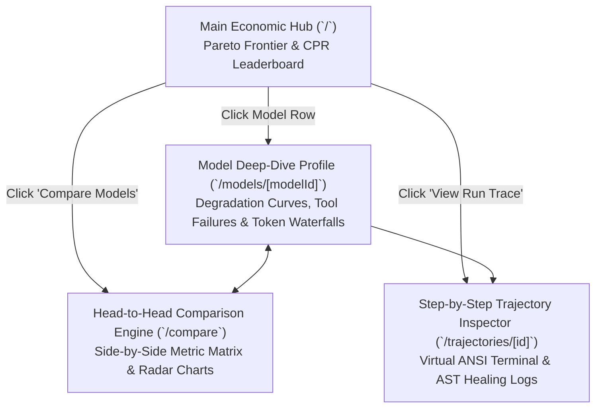

# Model Profile Pages, Head-to-Head Comparison & Trajectory Inspector UX Specification

> **Document ID:** `BP-DES-005`  
> **Status:** Historical target-state design — not deployed or verified
> **Target Track:** Best Multimodal UX ($5,000 Target) • Google Cloud Hackathon (2026)

---

## 1. Information Architecture & Navigation Flow

To deliver a Bloomberg-grade user experience that matches and exceeds single-turn benchmark directories, Benchpress introduces **three dedicated deep-detail viewports**:



---

## 2. `/models/[modelId]` — Bloomberg-Grade Model Profile Page

### Wireframe Layout & Component Hierarchy

```text
┌────────────────────────────────────────────────────────────────────────────────────────┐
│  [← Back to Leaderboard]       MODEL PROFILE: Claude 3.7 Sonnet (Anthropic)           │
├────────────────────────────────────────────────────────────────────────────────────────┤
│  ┌──────────────────────────────────────────────────────────────────────────────────┐  │
│  │ 🏷️ Verified Pass@1: 62.4%   │ 💰 True CPR: $2.18         │ 🌊 Bloat (TBR): 14.2%  │  │
│  │ ⚡ Mean Turns: 18.2 turns    │ 🧠 200k Context Window     │ ⏱️ Avg Run: 142s       │  │
│  │ 💡 Optimal Hybrid Partner: Gemini 3.5 Flash (Saves 87.0% cost when paired)       │  │
│  └──────────────────────────────────────────────────────────────────────────────────┘  │
│                                                                                        │
│  ┌────────────────────────────────────────┐ ┌────────────────────────────────────────┐  │
│  │ 📉 CONTEXT DEGRADATION CURVE           │ │ 🧰 TOOL FAILURE TAXONOMY BREAKDOWN     │  │
│  │ Accuracy (%) vs. Turn Number (1 to 30) │ │ Distribution of Failed Turns           │  │
│  │ 100% ────┐                             │ │                                        │  │
│  │  80%     └───┐                         │ │   [Donut Chart]                        │  │
│  │  60%         └───┐                     │ │   • 45% Wrong Line Offset (Diffs)      │  │
│  │  40%             └───┐                 │ │   • 30% Malformed JSON Schema          │  │
│  │   0% ─────────────────┴─────────────   │ │   • 15% Missing Module Import          │  │
│  │     Turn 1   Turn 10  Turn 20  Turn 30 │ │   • 10% Bash Command Timeout           │  │
│  └────────────────────────────────────────┘ └────────────────────────────────────────┘  │
│                                                                                        │
│  ┌──────────────────────────────────────────────────────────────────────────────────┐  │
│  │ 🌊 TURN-BY-TURN TOKEN BURN & REASONING ALLOCATION (Mean across 100 SWE-bench runs)│  │
│  │ Turn 1:  [Input Context ████████████████████] [Reasoning ██] [Output █] ($0.08)  │  │
│  │ Turn 2:  [Input Context ████████████████████████] [Output ██]           ($0.11)  │  │
│  │ Turn 5:  [Input Context ██████████████████████████████] [Output ███]     ($0.18)  │  │
│  │ Turn 15: [Input Context ██████████████████████████████████████] [Out ██] ($0.29)  │  │
│  └──────────────────────────────────────────────────────────────────────────────────┘  │
│                                                                                        │
│  ┌──────────────────────────────────────────────────────────────────────────────────┐  │
│  │ 📂 RECENT EVALUATION TRAJECTORIES (Verified SWE-bench Verified Runs)               │  │
│  │ • django__django-11099   | 14 Turns | CPR: $1.92 | Status: PASS  [View Replay →]   │  │
│  │ • sympy__sympy-14774     | 22 Turns | CPR: $2.84 | Status: PASS  [View Replay →]   │  │
│  │ • scikit-learn__sk-1345  | 18 Turns | CPR: $2.40 | Status: FAIL  [View Replay →]   │  │
│  └──────────────────────────────────────────────────────────────────────────────────┘  │
└────────────────────────────────────────────────────────────────────────────────────────┘
```

---

## 3. `/compare` — Interactive Head-to-Head Comparison Engine

### Comparison Viewport Architecture

Users select any two models (e.g., `Model A: Claude 3.7 Sonnet` vs. `Model B: Benchpress Hybrid Route`) to render an instant side-by-side delta matrix:

```text
┌────────────────────────────────────────────────────────────────────────────────────────┐
│  HEAD-TO-HEAD COMPARISON: Claude 3.7 Sonnet  VS  ★ Benchpress Hybrid Route (2.5+3.5)   │
├───────────────────────────────────────────────┬───────────────────┬────────────────────┤
│ Metric / Dimension                            │ Claude 3.7 Sonnet │ Benchpress Hybrid  │
├───────────────────────────────────────────────┼───────────────────┼────────────────────┤
│ **Cost Per Resolution (CPR)**                 │ $2.18             │ **$0.28 (-87.0%)** │
│ **Verified Pass@1 (SWE-bench)**               │ 62.4%             │ **63.1% (+0.7%)**  │
│ **Mean Turns to Resolve**                     │ 18.2 turns        │ **11.4 turns (38%⚡│
│ **Trajectory Bloat Ratio (TBR)**              │ 14.2%             │ **3.8% (-73.2%)**  │
│ **Syntax Self-Healing Rate**                  │ 54.0%             │ **92.0% (AST Heal) │
│ **Turn-20 Context Retention**                 │ 82.0%             │ **91.0% (L2 Comp)  │
│ **10,000 Tasks Monthly Spend**                │ $21,800 / mo      │ **$2,800 (Save $19k│
├───────────────────────────────────────────────┴───────────────────┴────────────────────┤
│  ┌──────────────────────────────────────────────────────────────────────────────────┐  │
│  │ 🕸️ MULTI-AXIS CAPABILITY RADAR (Accuracy, Cost, Velocity, Context, Resilience)   │  │
│  │                          Accuracy (100)                                          │  │
│  │                                ▲                                                 │  │
│  │             Cost Efficiency    │     Resilience (AST Heal)                       │  │
│  │                   ▲            │            ▲                                    │  │
│  │                   └────────────┼────────────┘                                    │  │
│  │                                │                                                 │  │
│  │                 Velocity ◄─────┼─────► Context Retention                         │  │
│  │                                                                                  │  │
│  │       ─── Cyan Line: Benchpress Hybrid Route (Large Area)                        │  │
│  │       ─── Amber Line: Claude 3.7 Sonnet (High Accuracy, Low Cost Efficiency)     │  │
│  └──────────────────────────────────────────────────────────────────────────────────┘  │
└────────────────────────────────────────────────────────────────────────────────────────┘
```

---

## 4. `/trajectories/[id]` — Step-by-Step Trajectory Inspector

Allows judges and enterprise security auditors to inspect the raw execution trace of any benchmark run:

* **Left Pane (Virtual ANSI Terminal & AST Stream):**
  * Displays line-by-line syntax-highlighted diffs, bash tool stdout/stderr, and compiler error logs.
  * Highlights autonomous interventions in **Neon Emerald** (`[SUPERVISOR_AST_HEALER]: Injected parameter adapter for editHunk`) and **Crimson** (`[GIT_SAGA]: Compensating rollback triggered to tree hash a4f92c`).
* **Right Pane (Turn-by-Turn Telemetry & Waterfalls):**
  * Displays the exact input token count, output token count, reasoning token overhead, turn execution latency (ms), and cumulative dollar spend up to that turn.

---

## 5. UI Component Hierarchy & Design Tokens

### Design System & Theme Integration:
* **Background Panels:** Obsidian Dark Glassmorphism (`rgba(18, 23, 34, 0.85)` with `backdrop-filter: blur(16px)`).
* **Accent Accents:**
  * Electric Cyan (`#00F0FF`): Active turns, Gemini models, Pareto frontier lines.
  * Emerald Green (`#10B981`): Verified task passes, cost savings percentages, healed ASTs.
  * Amber Gold (`#F59E0B`): Anthropic / Claude models, warning states, tool retry notices.
  * Crimson Red (`#EF4444`): OpenAI models, syntax regressions, compensating rollbacks.
* **Typography:** `Inter` for interface labels and titles; `JetBrains Mono` for telemetry values, tokens, and code snippets.
