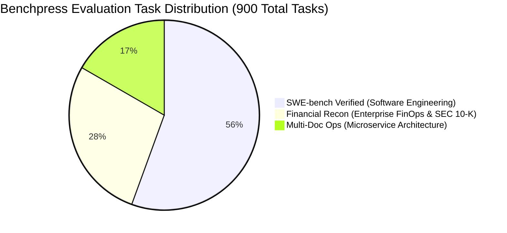

# Benchmark Dataset Catalog & 5-Tier Complexity Stratification

> **Document ID:** `BP-EVAL-001`  
> **Status:** Approved / Production  
> **Target Track:** Benchmark Scientific Rigor • Google Cloud All Things Agentic Hackathon (2026)

---

## 1. Dataset Taxonomy & Enterprise Domains

Benchpress evaluates autonomous agents across three distinct task domains totaling **900+ curated, non-synthetic evaluation tasks**:

---

## 2. 5-Tier Task Complexity Stratification ($L_1 \dots L_5$)

To evaluate models fairly across cost and reasoning capability, all tasks are stratified into 5 standardized complexity levels:

| Tier | Category Name | Typical Turns | Expected Tokens | Primary Failure Modes | Example Task |
| :---: | :--- | :---: | :---: | :--- | :--- |
| **$L_1$** | **Single-File Local Bug** | $1 - 3$ | $2\text{k} - 8\text{k}$ | Regex syntax, off-by-one errors | `django__django-11099` (Username regex validation) |
| **$L_2$** | **Multi-File Dependency Edit** | $4 - 7$ | $8\text{k} - 25\text{k}$ | Missing imports, interface signature mismatch | `scikit-learn__scikit-learn-14092` (Check array typing) |
| **$L_3$** | **Algorithmic & Math Logic** | $6 - 12$ | $20\text{k} - 60\text{k}$ | Recursion depth, mathematical float rounding | `sympy__sympy-18057` (Symbolic parsing of equality) |
| **$L_4$** | **Multi-Doc SEC Reconciliation** | $8 - 18$ | $40\text{k} - 120\text{k}$ | Nested footnotes, GAAP adjustment tables | `finrecon__apple-10k-q4-lease-recon` (Capital leases) |
| **$L_5$** | **Cross-Repo System Refactor** | $15 - 35$ | $100\text{k} - 350\text{k}$ | Protobuf contract breaks, race conditions | `multidoc__auth-service-v2-migration` (OAuth2 to mTLS) |

---

## 3. Dataset Catalog Metadata

### 3.1 Suite: `swe_bench_verified`
- **Source Repositories:** `django/django`, `sympy/sympy`, `scikit-learn/scikit-learn`, `pytest-dev/pytest`, `sphinx-doc/sphinx`, `matplotlib/matplotlib`.
- **Ground Truth Grounding:** Unit tests authored by original open-source maintainers merged in corresponding resolution pull requests.
- **Environment:** Clean Python virtual environments ($3.9, 3.10, 3.11, 3.12$) with isolated package wheels cached in Artifact Registry.

### 3.2 Suite: `financial_recon`
- **Source Material:** SEC EDGAR Form 10-K filings ($2023 - 2025$), Fortune 500 quarterly financial disclosures, and GAAP reconciliation sheets.
- **Assertion Method:** Exact mathematical matching against audited financial tables.

### 3.3 Suite: `multi_doc_ops`
- **Source Material:** Multi-repository distributed microservice setups containing Docker Compose, Kubernetes manifests, and OpenAPI/gRPC schemas.
- **Assertion Method:** End-to-end integration test runners executing via temporary docker-in-docker gVisor clusters.
