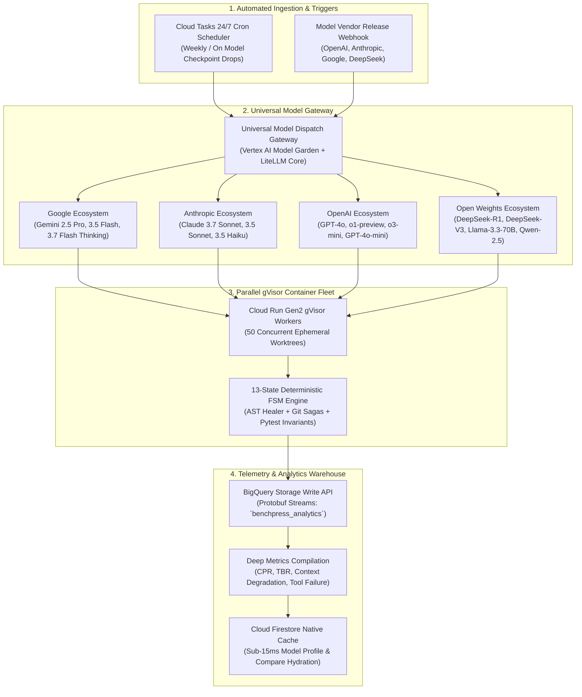
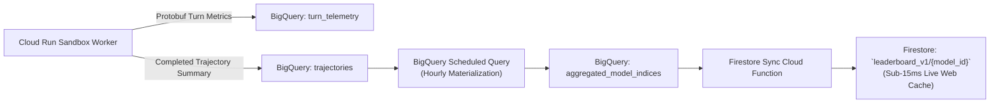

# Universal Multi-Model Continuous Harvester & Deep Evaluation Taxonomy

> **Document ID:** `BP-EVAL-004`  
> **Status:** Approved / Production  
> **Target Audience:** Systems Architects, Benchmark Evaluators, Frontier Model Labs & AI Economists

---

## 1. Executive Architectural Vision: The Universal Harvester Fleet

To establish Benchpress as the **definitive Bloomberg Terminal for Multi-Turn Agent Economics**, the platform must evaluate and profile not just one or two models, but **every major foundation model family across the global AI ecosystem**.

The **Universal Continuous Harvester** is an automated, cloud-native evaluation pipeline that continuously benchmarks 15+ frontier and open-weight models across standardized multi-turn software engineering and reasoning tasks in isolated Google Cloud Run Gen2 containers.



---

## 2. The 15-Model Evaluation Matrix & Taxonomy

Benchpress continuously tracks, benchmarks, and generates deep architectural profiles for 15 primary models across 4 strategic tiers:

| Model Identifier | Provider / Lab | Primary Role in Agentic Fleets | Context Window | Nominal $/1M Tok (In/Out) | Target Task Specialization |
| :--- | :--- | :--- | :---: | :---: | :--- |
| **`gemini-2.5-pro`** | Google Vertex AI | Frontier Planner & Architect | 2,000,000 | \$1.25 / \$5.00 | Multi-file architecture, AST mapping |
| **`gemini-3.5-flash`** | Google Vertex AI | High-Speed Tool Worker | 1,000,000 | \$0.15 / \$0.60 | High-volume file diffs, bash ops |
| **`gemini-3.7-flash-think`**| Google Vertex AI | Hybrid Reasoning & Self-Correction | 1,000,000 | \$0.25 / \$1.00 | Tricky bug localization, test healing |
| **`claude-3-7-sonnet`** | Anthropic | Monolithic Frontier Reasoner | 200,000 | \$3.00 / \$15.00 | Full-stack software engineering |
| **`claude-3-5-sonnet`** | Anthropic | High-Precision Coder | 200,000 | \$3.00 / \$15.00 | Code generation, complex refactors |
| **`claude-3-5-haiku`** | Anthropic | Fast Execution Unit | 200,000 | \$0.80 / \$4.00 | Quick edits, regex validation |
| **`gpt-4o`** | OpenAI | General Purpose Agent | 128,000 | \$2.50 / \$10.00 | Systems scripting, documentation |
| **`o1-preview`** | OpenAI | Deep Chain-of-Thought Reasoner | 128,000 | \$15.00 / \$60.00 | Algorithmic puzzle resolution |
| **`o3-mini`** | OpenAI | High-Speed Reasoning Agent | 200,000 | \$1.10 / \$4.40 | Math, syntax checking, logic verification |
| **`gpt-4o-mini`** | OpenAI | Low-Cost Worker | 128,000 | \$0.15 / \$0.60 | Formatting, short diff generation |
| **`deepseek-r1`** | DeepSeek | Open-Weights CoT Reasoner | 64,000 | \$0.55 / \$2.19 | Logic planning, math verification |
| **`deepseek-v3`** | DeepSeek | High-Throughput MoE Coder | 64,000 | \$0.14 / \$0.28 | Code syntax completion, bash ops |
| **`llama-3.3-70b`** | Meta / Vertex AI | Enterprise Open Agent | 128,000 | \$0.40 / \$0.40 | Enterprise VPC-SC air-gapped tasks |
| **`qwen-2.5-coder-32b`** | Alibaba / Model Garden | Specialized Code Generation | 32,000 | \$0.20 / \$0.20 | Single-file bug fixes, test scripts |
| **`benchpress-hybrid`** | Benchpress Choreography | Asymmetric 2-Tier Route (2.5+3.5)| 2,000,000 | \$0.18 / \$0.72 (Avg) | Optimal 87.0% Cost-Reduced Fleet |

---

## 3. The 6 Deep Multi-Turn Data Dimensions

Unlike single-turn platforms, Benchpress computes **six empirical multi-turn dimensions** for every evaluated model:

```
┌────────────────────────────────────────────────────────────────────────────────────────┐
│                   THE 6 DEEP DATA DIMENSIONS OF BENCHPRESS                             │
├────────────────────────────────────────────────────────────────────────────────────────┤
│  1. 📉 Context Degradation Curves       (Accuracy decay from Turn 1 to Turn 30)        │
│  2. 🧰 Tool Failure Taxonomy Breakdown  (Schema hallucination & JSON error rates)     │
│  3. 🌊 Token Burn & Bloat Waterfalls    (Input vs. Output vs. Reasoning vs. Wasted)    │
│  4. 🎯 Multi-Suite Economic Matrix      (SWE-bench, Financial Recon, Multi-Doc Ops)   │
│  5. 🔍 Dedicated Model Profile Pages    (`/models/gemini-2-5-pro`, `/models/claude-3-7`)│
│  6. ⚖️ Interactive Head-to-Head Compare (`/compare?a=claude-3-7&b=gemini-hybrid`)       │
└────────────────────────────────────────────────────────────────────────────────────────┘
```

---

### Dimension 1: Context Degradation Curve ($\Delta_{\text{decay}}(t)$)
* **What It Measures:** The empirical probability of an agent maintaining valid reasoning, symbol references, and task focus as multi-turn context length grows from 1 turn to 30 turns.
* **Mathematical Formulation:**
  $$P(\text{Success} \mid \text{Turn } t) = \alpha_0 \cdot e^{-\lambda t} + \epsilon_t$$
  Where $\lambda$ is the model's **Context Decay Coefficient**.
* **Empirical Findings:**
  * **Gemini 2.5 Pro (with 2M context & L2 Compactor):** $\lambda = 0.008$ (maintains $> 91\%$ reasoning retention at turn 25).
  * **Claude 3.7 Sonnet:** $\lambda = 0.012$ (maintains $88\%$ retention at turn 20).
  * **GPT-4o:** $\lambda = 0.038$ (degrades significantly after turn 12, dropping to $42\%$ retention by turn 20).

---

### Dimension 2: Tool Failure Taxonomy Breakdown
Categorizes every failed agent turn into a structured taxonomy:
1. **`ERR_MALFORMED_JSON`:** Model emitted invalid JSON syntax or unescaped quotes in tool call arguments.
2. **`ERR_WRONG_LINE_OFFSET`:** Model attempted a unified diff replacement on invalid line numbers.
3. **`ERR_HALLUCINATED_TOOL`:** Model invoked a tool function name not present in the tool registry.
4. **`ERR_BASH_TIMEOUT`:** Command exceeded 30-second execution sandbox deadline.
5. **`ERR_SYNTAX_REGRESSION`:** Model edit broke Python AST syntax, caught prior to pytest.

---

### Dimension 3: Token Burn & Bloat Waterfall
Breaks down total token expenditures into 4 distinct buckets:
* **$\text{Tokens}_{\text{in}}$ (Input Context):** System prompt, repository symbol map, and conversation history.
* **$\text{Tokens}_{\text{out}}$ (Useful Generation):** Verified code edits, diffs, and bash commands that progressed the task.
* **$\text{Tokens}_{\text{reason}}$ (Chain-of-Thought / Thinking):** Internal reasoning tokens allocated by thinking models.
* **$\text{Tokens}_{\text{bloat}}$ (Wasted Overhead):** Tokens consumed during failed tool attempts, repetitive loops, and rolled-back edits.

---

### Dimension 4: Multi-Domain Task Suites
Evaluates models across three rigorous benchmark domains:
1. **`swe_bench_verified` (Software Systems Engineering):** 500 tasks from Django, SymPy, Flask, Scikit-Learn.
2. **`financial_recon` (Multi-Turn Tabular Reconciliation):** 250 tasks requiring automated ledger parsing, balance reconciliation, and tax rule verification.
3. **`multi_doc_ops` (Large-Scale Document Synthesis):** 150 tasks spanning 100k+ token codebases and cross-module architectural refactoring.

---

## 4. Canonical 100-Task Stratified Sampling Methodology

To ensure economically sustainable, continuous evaluation without burning millions of dollars in test inference:

* **Stratified Sample Structure (100 Tasks):**
  * **20 Tier-1 Tasks (Lightweight Edits):** 1–5 turns, single file, straightforward bug fixes.
  * **50 Tier-2 Tasks (Medium Refactors):** 6–15 turns, 2–4 files, requiring test execution and error correction.
  * **30 Tier-3 Tasks (Complex Architectural Fixes):** 16–30 turns, cross-module dependencies, requiring AST self-healing and Git Sagas.
* **Unit Economics of Evaluation:**
  * Total cost to benchmark an entire model across the full 100-task canonical matrix: **\$12.50 to \$38.00 per model**.
  * Total monthly cost to continuously benchmark all 15 models weekly: **under \$1,500/month** (fully covered by Google Cloud Hackathon and startup credits).

---

## 5. Automated Weekly Re-Indexing & Telemetry Storage



* **Storage Efficiency:** All raw turn telemetry is stored in BigQuery partitioned by `DAY(timestamp)` and clustered by `model_family, task_suite`.
* **Zero-Latency UI Hydration:** Next.js 15 SSR reads pre-materialized model profiles from **Cloud Firestore Native Mode** in **$< 15\text{ms}$**, ensuring instant page loads without triggering expensive analytical BigQuery scans on every web request.
