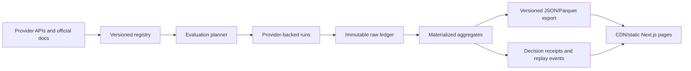

# Model registry, configuration matrix, and continuous evaluation methodology

> **Document ID:** `BP-EVAL-004`
> **Status:** Authoritative design; current harvester output remains a demo fixture until provider-backed runs replace it
> **Public commitment:** The catalog and aggregate explorer are free to browse

## 1. Product objective

Benchpress maintains two deliberately separate data layers:

1. **Provider facts:** model identifiers, capabilities, lifecycle, native controls, limits, and prices sourced from provider APIs or official documentation.
2. **Benchpress measurements:** reproducible observations generated by executing declared configurations against versioned tasks and deterministic outcome checks.

Provider facts can be collected broadly and inexpensively. Benchmark depth is selective because every real evaluation consumes provider and compute budget.

## 2. Truth classes

| Label | Meaning | May affect official ranking? |
|---|---|---|
| **Official specification** | Provider-published metadata with source and retrieval date | Descriptive fields only |
| **Benchpress measured** | Reproducible Benchpress execution with complete manifest and outcome evidence | Yes |
| **Community verified** | Submitted run that passes provenance checks and independent reproduction | Yes, in a separate or qualified cohort |
| **Experimental** | Real run with insufficient sample size or incomplete controls | No default promotion |
| **Stale** | Model, price, harness, or task changed since evaluation | No default promotion |
| **Projection** | A declared future-volume or financial scenario calculated from compatible measured inputs | No; must remain visually distinct from observed results |
| **Illustrative scenario** | Hypothetical inputs used to explain a formula or UI behavior | Never |
| **Demo fixture** | Synthetic UI/test data | Never |

The current `scripts/run_continuous_harvester.py` and hard-coded web profiles are **Demo fixtures**. They exercise product surfaces but do not establish model performance.

## 3. Provider registry acquisition

The registry collector runs on a schedule and in response to known release/deprecation events.

Preferred source order:

1. Authenticated provider model-list or capability API.
2. Official provider model documentation.
3. Official provider pricing, deprecation, and changelog pages.
4. Manual review when fields conflict or cannot be parsed reliably.

Aggregators and routing marketplaces may be used for discovery, but never as the sole source of an official provider fact.

Each source snapshot stores:

- URL or API endpoint.
- Provider account/region visibility context where relevant.
- Retrieval timestamp.
- Response/document checksum.
- Parser version.
- Raw source payload or permitted excerpt.
- Validation status and reviewer when manual intervention occurs.

## 4. Canonical registry schema

### Provider

```text
provider_id
display_name
official_domains
api_surfaces
regions
data_policy_url
last_checked_at
```

### Model version

```text
model_version_id
provider_id
native_model_id
display_name
immutable_snapshot_or_alias
alias_target_when_known
lifecycle: stable | preview | experimental | deprecated | retired
release_date
retirement_date
context_limit
output_limit
modalities
tool_capabilities
source_snapshot_id
```

### Price version

```text
price_version_id
model_version_id
service_tier
region
currency
input_per_unit
cached_input_per_unit
cache_write_per_unit
output_per_unit
reasoning_billing_rule
tool_fees
long_context_multipliers
effective_from
effective_to
source_snapshot_id
```

### Native configuration capability

```text
model_version_id
parameter_path
supported_values_or_range
default_value
constraints
incompatibilities
source_snapshot_id
```

## 5. Reasoning-control normalization

Provider-native controls are authoritative. Benchpress may expose a canonical filter for usability, but it must never imply that two providers' “medium” settings allocate equivalent computation.

Example records:

```yaml
provider: openai
native_model_id: gpt-5.6-terra
canonical_effort: medium
native_parameter: reasoning.effort
native_value: medium
```

```yaml
provider: anthropic
native_model_id: <exact-model-id>
canonical_effort: medium
native_parameter: output_config.effort
native_value: medium
```

```yaml
provider: google
native_model_id: <exact-model-id>
canonical_effort: high
native_parameter: thinkingLevel
native_value: HIGH
```

The configuration ID is a hash of the exact native request settings. Unsupported values are rejected rather than coerced silently.

## 6. Scope policy

The public catalog may include all active provider models, but the official coding leaderboard initially includes only models that:

- Accept text/code input and text or structured-tool output.
- Support the required tool or agent loop.
- Are available through a reproducible API surface.
- Have stable enough identifiers and pricing for comparison.
- Can be evaluated within the declared budget and policy constraints.

Audio, image-generation, embedding, moderation, and unrelated specialist models receive separate catalogs and task suites rather than being forced into one coding ranking.

The same underlying model served through different platforms or service tiers is a distinct **deployment configuration** when price, latency, region, limits, or request semantics differ.

## 7. What constitutes a configuration

At minimum:

```text
provider
API surface and region
exact model ID/snapshot
reasoning or thinking mode
reasoning effort/level/budget
service tier
temperature/top-p when supported and in scope
maximum output tokens
tool strategy and schemas
context/prompt policy
caching and persisted-reasoning policy
harness version
```

“All configurations” is not a finite promise once continuous sampling parameters and prompt variants are considered. Benchpress therefore evaluates a declared, versioned configuration domain and publishes the inclusion policy.

For the initial product question—“which model and thinking level is best for this coding task?”—prompt, tool schemas, temperature, and context policy should be held constant while model and native reasoning control vary.

### Configuration versus route policy

The hackathon core compares exact single-model configurations. The same evaluation model later expands the candidate unit to a versioned **route policy**:

```text
single-configuration policy
  whole_workflow -> one exact model/configuration

phase-aware policy
  planning       -> exact model/configuration A
  execution      -> exact model/configuration B
  review         -> exact model/configuration C
```

Phase-aware policies must be evaluated end to end. Their economics include handoff tokens, repeated context, replanning, escalation, tool failures, and every model invocation. Individually strong phase components do not prove that the composed workflow is strong.

## 8. Task taxonomy

Initial coding categories:

- Codebase audit
- Bug localization and repair
- Security review
- Dependency or framework migration
- Refactoring under tests
- Test generation and boundary analysis
- Repository question answering
- Small deterministic edit

Required task descriptors:

- Language and framework.
- Repository size and file count.
- Relevant-context size.
- Number of expected files touched.
- Tool requirements.
- Time, turn, and token ceilings.
- Difficulty and severity.
- Public/private origin and license.
- Contamination controls.
- Deterministic outcome oracle.

### Task fingerprint used for experiment design

Before choosing a matrix, Benchpress derives a versioned fingerprint from approved metadata:

```text
language and framework
task family: audit | repair | migration | security | question-answering | other
workflow phase: research_planning | specification | execution | review | refinement | whole_workflow
repository size and relevant-context size
expected input/output intensity and handoff requirements
expected files and edit surface
required tools and response mode
risk/severity and hard quality boundaries
latency sensitivity and maximum spend
```

The fingerprint is an experiment-planning input, not a claim that every task in a category is interchangeable. Private contents are not published; the public receipt carries only approved descriptors and hashes.

## 9. Staged evaluation strategy

Brute-force evaluation is financially wasteful and statistically careless. Benchpress uses progressive promotion.

### Adaptive experiment design

The Gemini orchestrator proposes the smallest experiment likely to resolve the decision. It selects materially distinct configurations, discriminating tasks, a baseline, maximum spend, and stopping rules. Deterministic policy validates the proposal before any job is dispatched.

For a switch decision, the exact current configuration or policy version is mandatory. It executes as the baseline unless Benchpress can reuse a fresh, compatible measured cohort with identical material inputs. A missing baseline permits public exploration but cannot produce a personalized `SWITCH` claim.

Selection should prioritize:

- Boundary configurations that reveal whether additional thinking changes verified quality.
- Tasks that distinguish correctness, tool use, security boundaries, or latency—not merely easy duplicates.
- A stable baseline and at least one plausible lower-cost candidate.
- Additional repetitions only when uncertainty could change the decision.

A full Cartesian matrix is a fallback for small domains, not the default. The planner's rationale and excluded configurations are stored so selective testing remains auditable.

### Sequential stopping and elimination

After each eligible result, deterministic rules may:

- Reject repeated invalid native settings or invalid tool behavior.
- Eliminate a candidate that is already dominated and cannot beat the baseline under the remaining budget.
- Stop a task/configuration branch after a predeclared safety or quality boundary fails.
- Stop buying samples after the confidence or non-inferiority threshold is met.
- Halt undispatched work when the fixed experiment budget is exhausted.

Stopping prevents future spend only. All completed and failed attempts remain in the ledger, economics, and eligible denominator. Rules, thresholds, and cancellation reasons are versioned before execution to prevent convenient post-hoc pruning.

### Stage A: capability smoke test

- Two or three small tasks.
- One execution per supported configuration.
- Detect invalid parameters, missing tools, authentication failures, and incompatible response formats.
- Results are labelled experimental.

### Stage B: screening

- Approximately ten stratified tasks.
- One execution per configuration.
- Hold harness variables constant.
- Eliminate dominated or consistently invalid configurations.

### Stage C: promotion

- Approximately 30–50 tasks.
- At least three repetitions when provider behavior is stochastic.
- Calculate confidence intervals and segment results.
- Promote only configurations that meet non-inferiority and operational thresholds.

### Stage D: certification

- Larger frozen private/time-split suite.
- Hidden or independent assertions.
- Full attempts and failures included in economics.
- Retained manifests and reproducible replay.

### Stage E: refresh

Re-evaluate when:

- A model snapshot or alias target changes.
- A price or billing rule changes.
- Tool behavior or supported parameters change.
- The prompt, harness, sandbox, task, or oracle changes.
- Segment drift or delayed regressions invalidate a recommendation.

Do not rerun everything daily merely because a scheduler exists.

## 10. Run manifest

Every execution stores:

```text
run_id and logical_run_key
cohort_id and repetition_index
provider, endpoint, region and exact model
all native request settings
task ID/version and repository commit
prompt, tool schema and harness hashes
workspace/sandbox description
start/end timestamps and latency decomposition
provider request identifiers when available
input, cached, cache-write, output and reasoning usage
tool and infrastructure costs
turns, retries and failure taxonomy
test command, exit code and assertion evidence
final status and exclusion reason
```

Raw prompts, code, outputs, and traces follow retention, licensing, privacy, and consent policy. Public aggregates must not expose private repository content.

## 11. Outcome and economic metrics

### Resolution rate

```text
resolved_runs / eligible_runs
```

The eligible denominator and exclusions must be published.

### Cost per verified resolution

```text
CPR = total cost of all eligible attempts / number of verified resolutions
```

Total cost includes failed attempts, retries, cached/reasoning tokens, tool fees, and in-scope worker compute. Truncating costly failures without accounting for them is prohibited.

### Latency

Report median and tail latency, at minimum P50 and P95, plus queue time when the product uses asynchronous dispatch.

### Tool reliability

Classify schema errors, hallucinated tools, invalid arguments, timeouts, command failures, and infrastructure failures separately.

### Recommendation eligibility

A configuration may be recommended only if it satisfies:

- Minimum sample size.
- Required quality/non-inferiority threshold.
- Maximum cost and latency constraints.
- Complete provenance.
- Current model, price, task, and harness versions.
- No unresolved safety or data-quality exclusion.

### Rejection and “why not cheapest?”

Price is a constraint, not the outcome oracle. A lower-cost configuration is explicitly rejected when it violates a frozen correctness, security, tool-use, or reliability boundary. Public explanations should name the failed test/risk and the observed price difference instead of hiding the candidate or implying that more reasoning is always better.

### Abstention

Benchpress returns `ABSTAIN` and preserves the current recommendation when any of the following could change the decision:

- Sample count is below the declared minimum.
- Candidates are statistically tied at the required confidence.
- The cohort does not represent the target fingerprint.
- Provider responses or usage records are incomplete.
- Infrastructure failures exceed the exclusion limit.
- Model alias, price, tool schema, task suite, harness, or oracle changes during the run.

Abstention is a valid, versioned result with a reason and proposed next evidence purchase. It is never rendered as a winner.

### Observed counterfactual cost

For the same cohort, Benchpress may show:

- Cost and verified outcomes for the recommended candidate.
- Cost incurred by the cheapest candidate that failed a quality boundary.
- Cost and marginal outcome of a higher-reasoning candidate.

Only observed compatible runs may be compared. Do not extrapolate fixture values or unexecuted configurations as “savings.”

### Observed, projected, and illustrative economics

All financial UI and exports use one of three visible labels:

- **Observed:** calculated directly from retained compatible runs.
- **Projected:** applies declared future volume and switching assumptions to observed inputs.
- **Illustrative:** explains a formula using hypothetical values and cannot support a recommendation.

Observed comparison:

```text
observed_CPR(policy)
  = total cost of all eligible attempts under policy
    / verified resolutions under policy

observed_CPR_delta
  = observed_CPR(current baseline)
    - observed_CPR(candidate)
```

Projected scenario:

```text
projected_gross_value
  = observed_CPR_delta
    * expected verified workload volume

projected_net_value
  = projected_gross_value
    - evaluation cost
    - switching/integration cost
    - expected rollback cost
```

The projection must show expected volume, time horizon, price version, confidence/uncertainty, integration assumptions, and evaluation cost. A positive token-price delta does not establish net savings or quality parity.

Arithmetic examples are validated against their declared inputs. If an example declares 150,000 input tokens, its calculation must use `0.15M`, not a different quantity. This seemingly small control is part of Benchpress's value: polished savings claims remain auditable down to each assumption.

Illustrative arithmetic recovered from the original product discussion—not a Benchpress measurement:

```text
ILLUSTRATIVE PRICES
frontier: $10/M input, $50/M output
efficient executor: $2/M input, $6/M output

planning usage: 0.10M input, 0.02M output
execution usage: 0.15M input, 0.12M output

frontier planning
  = (0.10 * $10) + (0.02 * $50)
  = $2.00

frontier execution
  = (0.15 * $10) + (0.12 * $50)
  = $7.50

monolithic illustrative total = $9.50

efficient execution
  = (0.15 * $2) + (0.12 * $6)
  = $1.02

routed illustrative total = $2.00 + $1.02 = $3.02
illustrative reduction = ($9.50 - $3.02) / $9.50 = 68.2%
```

The original discussion briefly substituted `0.10M` for the declared `0.15M` execution input while retaining the `$3.02` total. Benchpress's assumption ledger is designed to make that inconsistency visible. The example does not prove that phase-aware routing preserves quality, that the stated prices are current, or that a real workload will save 68.2%.

### User-facing decision mapping

Benchpress publishes one of three user-facing decisions while retaining the more detailed internal state:

- `STAY`: the current baseline remains eligible and the candidate was rejected, dominated, or rolled back.
- `TEST MORE`: evidence is insufficient, tied, stale, incompatible, or likely worth extending under a bounded evidence-purchase plan.
- `SWITCH`: the candidate passed evidence thresholds and the contained canary.

Every decision includes “why,” “what would reverse it,” and the current-versus-candidate evidence. Publication occurs for all three outcomes; a non-switch is still a useful result.

## 12. Public data delivery

Public browsing must not trigger provider calls or analytical warehouse scans.



Each public model/configuration page shows:

- Official facts and their sources.
- Benchpress measurements separately.
- Exact native configuration.
- Task segment and cohort.
- Sample size and uncertainty.
- Evaluation and price-effective dates.
- Harness version and known limitations.
- Experimental, stale, fixture, or verified badge.
- Current policy state/version and the previous baseline.
- User-facing `STAY`, `TEST MORE`, or `SWITCH` outcome.
- A “Why not cheapest?” explanation when a cheaper candidate was rejected.
- An observed counterfactual cost comparison when compatible runs exist.
- A decision receipt and replay timeline for reject, abstain, canary, promotion, or rollback.

The product should answer specific questions such as “best measured configuration for TypeScript codebase audits on medium repositories,” not claim a context-free universal winner.

The public explorer is not displaced by decision-time integrations. It remains the free source of provider facts, measured cohorts, methodology, aggregate downloads, current recommendations, and historical receipts. IDEs, SDKs, gateways, and internal policy tools consume and surface those published records when a switch is being considered.

### Automatic staleness

A published result loses current-default eligibility when any referenced model alias/snapshot, price, tool schema, task suite, harness, oracle, or policy constraint changes, or when a delayed regression invalidates its quality claim. The page keeps the historical receipt, displays the stale reason and detection time, and points to superseding evidence or a queued refresh. Staleness never deletes history silently.

## 13. Funding and cost control

The public explorer can be free while evaluation is funded through:

- Hackathon and cloud credits.
- Provider evaluation or launch sponsorships with disclosure.
- Batch/flex tiers for non-urgent runs.
- Carefully bounded free tiers.
- Opt-in bring-your-own-key runs.
- Enterprise private evaluations.
- Open-weight compute with full infrastructure accounting.

Provider sponsorship never permits result suppression, ranking overrides, or undisclosed cohort changes.

## 14. Community submissions

Community results remain separate until they provide:

- Signed or otherwise verifiable run manifests.
- Task, repository, prompt, tool, and harness hashes.
- Provider request/usage evidence where permitted.
- Complete failures and attempts.
- License and consent declarations.
- Successful independent reproduction.

## 15. Hackathon minimum dataset

The judged build does not need universal coverage. It needs:

- A real registry slice for Gemini models/configurations.
- An explicit current configuration baseline.
- At least two or three supported thinking configurations.
- A workflow-phase field in the task fingerprint, even when the judged task uses `whole_workflow`.
- A frozen cohort of approximately 3–10 deterministic coding tasks.
- Genuine provider usage and latency records.
- An adaptive plan with declared spend and stopping rules.
- A deliberate low-cost candidate that is rejected by a deterministic quality or safety boundary.
- A visible stop, reject, or abstention decision that retains all incurred costs.
- A versioned aggregate, policy decision, evidence receipt, and public recommendation when eligible.
- A published `STAY`, `TEST MORE`, or `SWITCH` decision for every terminal outcome.
- Explicit fixture labels on all legacy static data.

That small, honest dataset establishes the pipeline that the startup can expand after the submission.
