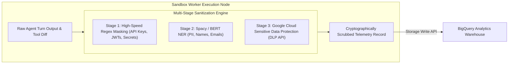

# Data Privacy, PII Scrubbing & Telemetry Sanitization

> **Document ID:** `BP-GOV-002`  
> **Status:** Historical target-state design — not deployed or verified
> **Target Track:** The Fortified Enterprise Fleet • Google Cloud All Things Agentic Hackathon (2026)

---

## 1. Zero-Retention & Privacy Mandate

When enterprise engineering teams benchmark internal repositories or route proprietary multi-agent workflows through Benchpress, telemetry logs must never expose:
- **Proprietary Source Code & Intellectual Property**
- **Hardcoded API Keys, JWTs & Cloud Credentials**
- **Personally Identifiable Information (PII)** such as employee names, email addresses, and internal server hostnames.

Benchpress implements an **In-Memory Telemetry Sanitization Pipeline** powered by regex rules, Named Entity Recognition (NER), and Google Cloud **Sensitive Data Protection (Cloud DLP)** before any record is committed to Memorystore Redis or BigQuery.



---

## 2. Real-Time Secret Masking Rules (Stage 1)

The high-speed regex pre-filter scans all agent outputs and tool payloads in $< 1.5\,\text{ms}$, replacing sensitive patterns with standardized cryptographic tokens:

| Secret Pattern | Regular Expression Matcher | Masking Replacement |
| :--- | :--- | :--- |
| **OpenAI API Key** | `sk-[a-zA-Z0-9]{48}` | `[REDACTED:OPENAI_KEY_HASH_SHA256]` |
| **Anthropic API Key** | `sk-ant-[a-zA-Z0-9]{90,}` | `[REDACTED:ANTHROPIC_KEY_HASH_SHA256]` |
| **Google Cloud API Key** | `AIza[0-9A-Za-z\\-_]{35}` | `[REDACTED:GCP_API_KEY]` |
| **AWS Access Key ID** | `AKIA[0-9A-Z]{16}` | `[REDACTED:AWS_ACCESS_KEY]` |
| **JWT Bearer Token** | `eyJ[a-zA-Z0-9_-]{10,}\.eyJ[a-zA-Z0-9_-]{10,}\.[a-zA-Z0-9_-]{10,}` | `[REDACTED:JWT_BEARER_TOKEN]` |
| **Private SSH Keys** | `-----BEGIN (RSA|OPENSSH|EC) PRIVATE KEY-----[\s\S]*?-----END \1 PRIVATE KEY-----` | `[REDACTED:PRIVATE_KEY_BLOCK]` |
| **Email Addresses** | `[a-zA-Z0-9_.+-]+@[a-zA-Z0-9-]+\.[a-zA-Z0-9-.]+` | `[REDACTED:EMAIL_ADDRESS]` |
| **IPv4 Addresses** | `\b(?:(?:25[0-5]|2[0-4][0-9]|[01]?[0-9][0-9]?)\.){3}(?:25[0-5]|2[0-4][0-9]|[01]?[0-9][0-9]?)\b` | `[REDACTED:IPV4_ADDRESS]` |

---

## 3. Google Cloud Sensitive Data Protection (Cloud DLP) Integration

For enterprise tier runs, telemetry batches are inspected via the Cloud DLP API to detect complex unstructured PII:

```python
# File: benchpress/governance/dlp_sanitizer.py
from google.cloud import dlp_v2
import os
import re

class EnterpriseTelemetrySanitizer:
    """
    Two-stage telemetry sanitizer combining local high-speed regex
    with Google Cloud Sensitive Data Protection (DLP).
    """
    def __init__(self, project_id: str):
        self.project_id = project_id
        self.dlp_client = dlp_v2.DlpServiceClient()
        self.parent = f"projects/{self.project_id}/locations/global"
        
        # InfoTypes to inspect and de-identify
        self.info_types = [
            {"name": "EMAIL_ADDRESS"},
            {"name": "PERSON_NAME"},
            {"name": "PHONE_NUMBER"},
            {"name": "AUTH_TOKEN"},
            {"name": "API_KEY"},
            {"name": "CREDIT_CARD_NUMBER"},
            {"name": "US_SOCIAL_SECURITY_NUMBER"}
        ]

    def sanitize_text(self, raw_content: str) -> str:
        """
        De-identifies sensitive data in raw agent trace content.
        """
        item = {"value": raw_content}
        inspect_config = {
            "info_types": self.info_types,
            "min_likelihood": dlp_v2.Likelihood.LIKELY,
            "limits": {"max_findings_per_item": 100}
        }
        deidentify_config = {
            "info_type_transformations": {
                "transformations": [
                    {
                        "primitive_transformation": {
                            "replace_with_info_type_config": {}
                        }
                    }
                ]
            }
        }

        response = self.dlp_client.deidentify_content(
            request={
                "parent": self.parent,
                "deidentify_config": deidentify_config,
                "inspect_config": inspect_config,
                "item": item,
            }
        )
        return response.item.value
```

---

## 4. Cryptographic Hashing & Differential Privacy

1. **Client Identifier Anonymization:**
   - Client IP addresses and organization identifiers are hashed using salt-rotated SHA-256:
     $$\text{ClientHash} = \text{HMAC-SHA256}(\text{IP}, \text{Salt}_{\text{daily}})$$
   - Salts are rotated every 24 hours in Google Secret Manager, preventing long-term correlation attacks across enterprise tenants.
2. **Differential Privacy on Aggregate Benchmarks:**
   - Public leaderboards and Pareto curves apply Laplacian noise ($\epsilon = 0.5$) to execution sample counts to guarantee that individual enterprise benchmark runs cannot be reverse-engineered from public score deltas.
