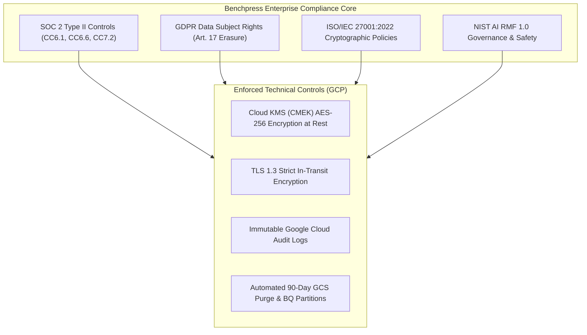

# Enterprise Compliance, SOC 2 Type II, GDPR & ISO 27001

> **Document ID:** `BP-GOV-003`  
> **Status:** Historical target-state design — not deployed or verified
> **Target Track:** The Fortified Enterprise Fleet • Google Cloud All Things Agentic Hackathon (2026)

---

## 1. Compliance Architecture Overview

Benchpress is engineered to satisfy the rigorous data governance, privacy, and security mandates of enterprise procurement. The platform maps directly to:
- **SOC 2 Type II Trust Services Criteria** (Security, Availability, Confidentiality, Processing Integrity)
- **ISO/IEC 27001:2022** Information Security Management System (ISMS)
- **GDPR (Regulation EU 2016/679)** & **CCPA/CPRA** privacy regulations
- **NIST AI Risk Management Framework (AI RMF 1.0)**



---

## 2. SOC 2 Type II Trust Services Criteria Mapping

| SOC 2 Criteria | Requirement | Benchpress Technical Implementation |
| :--- | :--- | :--- |
| **CC6.1 (Logical Access)** | Access restricted to authorized users via IAM roles. | Least-privilege IAM service accounts, Google Workload Identity Federation, mandatory MFA. |
| **CC6.6 (Boundary Protection)** | Network perimeters protect against unauthorized access. | Cloud Armor WAF, VPC Service Controls, gVisor Sentry network firewall blocking egress. |
| **CC6.7 (Data Transmission)** | Data encrypted during transmission over public networks. | Strict HTTPS/TLS 1.3, TLS termination at Google Load Balancer, WebRTC DTLS-SRTP encryption. |
| **CC6.8 (Malware Defense)** | Protection against unauthorized code execution. | Ephemeral gVisor micro-sandboxes with read-only root filesystems and AST tool interceptors. |
| **CC7.2 (Security Monitoring)** | Real-time monitoring of security anomalies and threats. | Google Cloud Monitoring, Cloud Audit Logs, and automated PagerDuty/Slack security alerts. |
| **CC8.1 (Change Management)** | Code changes tracked, reviewed, and tested in CI/CD. | Protected `main` branch, mandatory dual-engineer code reviews, automated GitHub Actions testing. |

---

## 3. GDPR & Data Privacy Rights Compliance

### 3.1 Right to Erasure ("Right to be Forgotten" - Article 17)
- Enterprise tenants can trigger automated, verified data deletion across all storage tiers:
  1. **BigQuery:** Partitioned records matching tenant `organization_id` purged via automated DDL `DELETE` statements.
  2. **Cloud Storage:** Associated git patches, trace dumps, and container logs deleted via Google Cloud Storage Object Lifecycle management.
  3. **Firestore & Redis:** Ephemeral sessions purged with TTL zero-out.

### 3.2 Data Residency & Sovereignty
- Multi-region deployment options allow enterprise clients to pin telemetry storage and agent sandbox execution strictly within EU regions (`europe-west1`, `europe-west4`) or US regions (`us-central1`, `us-east4`).

---

## 4. Cryptographic Key Management & Customer-Managed Encryption Keys (CMEK)

All data at rest is encrypted using **Cloud KMS Customer-Managed Encryption Keys (CMEK)**:

```hcl
# Terraform HCL: CMEK Key Ring & CryptoKey
resource "google_kms_key_ring" "benchpress_keyring" {
  name     = "benchpress-enterprise-keyring"
  location = var.region
}

resource "google_kms_crypto_key" "bigquery_cmek" {
  name            = "bigquery-telemetry-key"
  key_ring        = google_kms_key_ring.benchpress_keyring.id
  rotation_period = "7776000s" # 90-day automatic key rotation

  lifecycle {
    prevent_destroy = true
  }
}
```

- **In-Transit Encryption:** Enforced TLS 1.3 with modern cipher suites (`TLS_AES_256_GCM_SHA384`, `TLS_CHACHA20_POLY1305_SHA256`).
- **At-Rest Encryption:** BigQuery datasets, Cloud Storage buckets, and Memorystore Redis clusters are encrypted with tenant-specific AES-256 CMEK keys.
