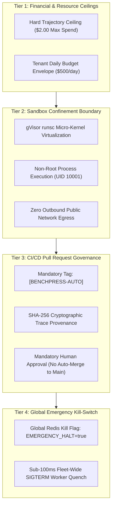

# Autonomous Safeguards, Spending Ceilings & Emergency Kill-Switches

> **Document ID:** `BP-GOV-005`  
> **Status:** Historical target-state design — not deployed or verified
> **Target Track:** The Fortified Enterprise Fleet & System Governance • Google Cloud Hackathon (2026)

---

## 1. Autonomous Bounding & Safe Harbor Framework

When AI agent platforms operate with closed-loop autonomy (e.g., automatically tuning routing policies, creating Pull Requests, and executing sandboxed code), enterprise security officers require **unambiguous bounding constraints** and **deterministic fail-safes**.

Benchpress implements a **4-Tier Autonomous Defense & Safeguard Hierarchy**:



---

## 2. Hard Financial Ceilings & Token Governors

1. **Per-Trajectory Dollar Cap:**
   - Default ceiling: **$\$2.00$ USD** per benchmark task.
   - Enforced by the worker runtime ledger before every model invocation turn. If $\text{Cumulative Spend} \ge \$2.00$, the FSM immediately transitions to `FATAL_HALT` with error code `ERR_HARD_BUDGET_EXCEEDED`.
2. **Tenant-Level Daily Budget Envelopes:**
   - Memorystore Redis tracks rolling 24-hour enterprise token spend via atomic `INCRBYFLOAT` operations.
   - If a tenant reaches $90\%$ of their daily allocation, warning webhooks fire; at $100\%$, further task dispatches are queued in Cloud Tasks in paused state until human authorization.

---

## 3. Autonomous Pull Request Constraints & Security Provenance

To eliminate the risk of automated pull requests merging malicious code or hallucinated changes into enterprise codebases:

```text
+-------------------------------------------------------------------------------+
|  🤖 [BENCHPRESS-AUTO] Fix regex null-byte validator in auth/validators.py     |
|  Pull Request #142  |  Branch: bp-remediation/django-11099                    |
+-------------------------------------------------------------------------------+
|  📊 AUTOMATED REMEDIATION SUMMARY:                                            |
|    • Root Cause: Regex pattern missed RFC-3986 Unicode null-byte escape.      |
|    • Verified Ground-Truth: 14/14 Pytest Assertions PASSED in gVisor Sandbox. |
|    • Economic Telemetry: 4 Turns | Total Spend: $0.0245 (CPR Savings: 87.4%)  |
|    • SHA-256 Provenance Digest: 99a8120fa882c0b471...                         |
+-------------------------------------------------------------------------------+
|  ⚠️ SECURITY SAFEGUARD: Mandatory Human Review Required                       |
|  [ Branch Protection: Direct Auto-Merge to 'main' is PERMANENTLY DISABLED ]  |
+-------------------------------------------------------------------------------+
```

### Pull Request Provenance Rules:
- **Mandatory Title Demarcation:** Every automated PR is prefixed with `[BENCHPRESS-AUTO]`.
- **Signed Commits:** Commits are signed with Benchpress's Google Cloud KMS GPG key.
- **Merge Gate:** Branch protection rules strictly require at least one human maintainer approval before any automated PR can be merged into protected branches (`main`, `production`).

---

## 4. Sub-100ms Global Emergency Kill-Switch

If an unexpected anomaly occurs, platform operators can execute a global kill-switch that halts all running sandbox containers worldwide in $< 100\,\text{ms}$:

```python
# File: benchpress/governance/kill_switch.py
import redis
import logging

class GlobalEmergencyKillSwitch:
    """
    Sub-100ms emergency operator kill-switch to immediately freeze all
    active sandbox workers and pause Cloud Tasks queues.
    """
    def __init__(self, redis_client: redis.Redis, cloud_tasks_client, project_id: str, region: str):
        self.redis = redis_client
        self.tasks_client = cloud_tasks_client
        self.queue_path = f"projects/{project_id}/locations/{region}/queues/trajectory-dispatch-queue"

    def engage_emergency_halt(self, reason: str, operator_id: str) -> None:
        """
        Engages global emergency halt across Redis and Cloud Tasks.
        """
        # 1. Set global Redis atomic flag (polled by workers on every turn)
        self.redis.set("BENCHPRESS:GLOBAL:EMERGENCY_HALT", "true")
        self.redis.set("BENCHPRESS:GLOBAL:HALT_REASON", f"{operator_id}: {reason}")

        # 2. Pause Cloud Tasks dispatch queue to prevent new worker boots
        self.tasks_client.pause_queue(name=self.queue_path)
        
        logging.critical(f"EMERGENCY KILL-SWITCH ENGAGED by {operator_id}: {reason}")

    def is_halt_active(self) -> bool:
        return self.redis.get("BENCHPRESS:GLOBAL:EMERGENCY_HALT") == b"true"
```

### Worker Runtime Interception:
Before executing any tool or foundation model API call, the worker checks the in-memory/Redis cached `EMERGENCY_HALT` key. If `true`, the worker immediately aborts the active sub-process with `SIGTERM` and releases all tmpfs locks.
