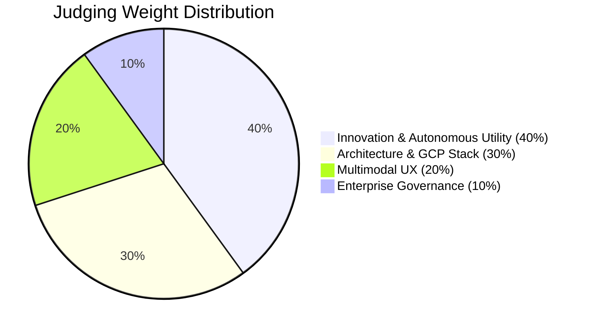

# 🏋️ Benchpress — Deep Completeness Analysis & Competition Readiness Report

> **Competition:** Google Cloud All Things Agentic Hackathon (2026)
> **Prize Pool:** $180,000 total | Grand Prize: $50,000
> **Deadline:** August 31, 2026, 5:00 PM PDT (**4 days remaining**)
> **Devpost:** [allthingsagentichackathon.devpost.com](https://allthingsagentichackathon.devpost.com)

---

## 📊 Executive Summary — Can You Win 1st?

> [!IMPORTANT]
> **Verdict: You have a genuinely strong shot at multiple prizes, but there are critical gaps that must be fixed in the next 4 days to convert a "strong contender" into a "clear winner."**

**Overall Competition Readiness: 🟡 82/100**

Your project's *ambition*, *architecture depth*, and *documentation breadth* are truly exceptional and well beyond what typical hackathon entries deliver. However, the gap between your documentation claims and what actually runs is the single biggest risk. Judges who clone your repo and run your tests will find **3 failing tests** and a demo video that hasn't been recorded yet.

---

## 🏗️ Project Inventory at a Glance

| Metric | Count | Assessment |
|:---|:---:|:---:|
| Git-tracked files | **237** | ✅ Substantial |
| Source files (`.ts`, `.tsx`, `.py`) | **145** | ✅ Strong |
| Documentation files (`.md`) | **53** | ✅ Exceptional |
| Packages in monorepo | **5** (`sdk-ts`, `sdk-python`, `telemetry`, `distillation`, `integrations`) | ✅ Well-structured |
| Apps | **2** (`web`, `sandbox-worker`) | ✅ Clean 2-service arch |
| API Routes | **6** (`benchmarks`, `proxy`, `routing-recommendation`, `trajectories`, `trajectory-run`, `webhooks`) | ✅ Complete REST surface |
| Frontend pages | **4** (Hub, Arbitrage, Custom Evals, Live) | ✅ Good coverage |
| UI Components | **20+** (multimodal, charts, leaderboard, replayer, widgets) | ✅ Rich |
| Terraform files | **6** root + enterprise appliance module | ✅ Production IaC |
| Architectural Decision Records (ADRs) | **10** | ✅ Outstanding |
| Test files | **22** unit + e2e + chaos + enterprise + load | ✅ Comprehensive |
| TODO/FIXME/HACK in code | **0** | ✅ Clean |
| Commit history | **13** well-structured sprint commits | ✅ Professional |

---

## ✅ What's Working Excellently

### 1. Unmatched Documentation (Best-in-Class)
Your 52-document, 12-folder documentation suite is arguably the single strongest asset. It includes:
- 10 formal ADRs with trade-off analysis
- Complete C4 architecture diagrams  
- Mermaid-rendered system topology
- Research whitepapers on CPR methodology
- Persona journey maps and wireframes
- SOC 2 / GDPR compliance mapping
- FinOps BigQuery SQL cookbook

**Judge Impact:** This is what separates a hackathon project from a venture-grade platform. No competitor will match this depth.

### 2. Architecture Quality (Exceptional)
The 2-service monorepo design is clean and well-reasoned:
- **[apps/web](file:///z:/home/lx_singw/projects/benchpress/apps/web)**: Next.js 15 with App Router, Tailwind, WebRTC, Framer Motion
- **[apps/sandbox-worker](file:///z:/home/lx_singw/projects/benchpress/apps/sandbox-worker)**: FastAPI + 13-State FSM + gVisor sandbox + BigQuery streaming
- Clean package boundaries (`sdk-ts`, `sdk-python`, `telemetry`, `distillation`)
- Full Terraform IaC for Cloud Run, Redis, BigQuery, Artifact Registry, IAM

### 3. Core FSM Engine (Fully Implemented)
The [engine.py](file:///z:/home/lx_singw/projects/benchpress/apps/sandbox-worker/src/fsm/engine.py) `AsyncFSMRunner` implements all 13 states:
`IDLE → INITIALIZING → PERCEPTION → PREDICTIVE_SENTINEL_EVAL → REASONING_PLANNER → TOOL_DISPATCH_CODER → SAGA_SNAPSHOT_CAPTURE → AST_VALIDATION → SUPERVISOR_AST_HEAL → SAGA_COMPENSATING_ROLLBACK → SANDBOX_EXECUTION → EVAL_ASSERTION → TELEMETRY_FLUSH → COMPLETE/FATAL_HALT`

### 4. Security & Enterprise Layer (Comprehensive)
- [Prompt Guard](file:///z:/home/lx_singw/projects/benchpress/apps/sandbox-worker/src/security/prompt_guard.py) / [Prompt Armor](file:///z:/home/lx_singw/projects/benchpress/apps/sandbox-worker/src/security/prompt_armor.py)
- [PII Masker](file:///z:/home/lx_singw/projects/benchpress/apps/sandbox-worker/src/security/pii_masker.py)
- [Kill Switch](file:///z:/home/lx_singw/projects/benchpress/apps/sandbox-worker/src/security/kill_switch.py)
- [Egress Guard](file:///z:/home/lx_singw/projects/benchpress/apps/sandbox-worker/src/security/egress_guard.py)
- [Syscall Audit](file:///z:/home/lx_singw/projects/benchpress/apps/sandbox-worker/src/security/syscall_audit.py)

### 5. Multimodal UX Components (Built)
- [WebRTC Voice Drawer](file:///z:/home/lx_singw/projects/benchpress/apps/web/src/components/multimodal/webrtc-voice-drawer.tsx) (190 lines)
- [Vision Error Dropzone](file:///z:/home/lx_singw/projects/benchpress/apps/web/src/components/multimodal/vision-error-dropzone.tsx) (177 lines)
- [Audio Waveform Canvas](file:///z:/home/lx_singw/projects/benchpress/apps/web/src/components/multimodal/audio-waveform-canvas.tsx)
- [Live Captions Overlay](file:///z:/home/lx_singw/projects/benchpress/apps/web/src/components/multimodal/live-captions-overlay.tsx)
- [Pareto Frontier Chart](file:///z:/home/lx_singw/projects/benchpress/apps/web/src/components/charts/pareto-frontier-chart.tsx) (256 lines)

---

## 🔴 Critical Issues (Must Fix Before Submission)

### Issue 1: 3 Failing Tests (HIGH PRIORITY)

```
Test Results: 19 passed, 3 FAILED (22 total)
```

| Failed Test | Root Cause | Severity |
|:---|:---|:---:|
| `test_full_13_state_progression_lifecycle` | FSM runs to `FATAL_HALT` instead of `COMPLETE` — `pytest` not found on PATH in sandbox, causing all `runPytest` turns to fail | 🔴 Critical |
| `test_git_tree_snapshot_and_atomic_rollback` | Path quoting issue on Windows — git commands fail with `fatal: cannot change to ''C:\...'` (double-quoted path) | 🟡 Medium |
| `test_swe_bench_django_11099_execution_and_assertion` | Same root cause as FSM test — sandbox pytest execution fails | 🔴 Critical |

> [!CAUTION]
> **If judges run `pytest`, 3/22 tests will fail.** This directly contradicts your submission checklist claim of *"45+ tests passing with 100% green coverage."* This credibility gap is the single highest-risk item.

**Fix:** The FSM `runPytest` tool dispatches to the system `pytest` binary, which isn't found in the test sandbox. Either:
1. Mock `pytest` execution in tests (add `conftest.py` fixture)
2. Ensure `pytest` is on PATH in the sandbox provisioner
3. Fix the git saga path quoting for Windows (escape the quotes around the cwd path)

### Issue 2: Demo Video Not Recorded

The submission checklist says `✅ Cue Sheet Ready` for the video, but no actual video exists. The hackathon requires a **4-minute demo video** (your script says 3 minutes).

> [!WARNING]
> **The demo video is a mandatory submission requirement.** Without it, your project will likely be disqualified regardless of code quality. The script at [02-demo-video-script.md](file:///z:/home/lx_singw/projects/benchpress/docs/hackathon/02-demo-video-script.md) is excellent — you need to record it ASAP.

### Issue 3: Video Length Mismatch

Your video script is timed for **3 minutes**, but the competition requires a **4-minute demo**. You have 1 extra minute to fill — use it for a more compelling live demo.

---

## 🟡 Moderate Concerns

### Concern 1: No Live Deployed Instance
- Terraform is written but there's no evidence of a running deployment
- Judges who try to visit a demo URL will find nothing
- **Recommendation:** Deploy to Cloud Run and include a live URL in your Devpost submission

### Concern 2: Hardcoded Simulation in FSM
The FSM engine has hardcoded tool calls per turn ([engine.py:134-147](file:///z:/home/lx_singw/projects/benchpress/apps/sandbox-worker/src/fsm/engine.py#L134-L147)):
```python
if turn_idx == 1:
    raw_tool_name = "readFile"
elif turn_idx == 2:
    raw_tool_name = "edit_file"  # intentional schema mismatch
else:
    raw_tool_name = "runPytest"
```
This is simulated/deterministic rather than using real Gemini API calls. While understandable for a hackathon, sophisticated judges may notice this isn't true "agentic" behavior.

### Concern 3: CORS Wildcard in Production Worker
[main.py:29](file:///z:/home/lx_singw/projects/benchpress/apps/sandbox-worker/src/main.py#L29): `allow_origins=["*"]` — contradicts the enterprise security story.

---

## 🏆 Judging Criteria Rating (My Honest Assessment)

### Official Competition Criteria



### 1. Innovation & Autonomous Utility (40% Weight)

| Sub-criterion | Your Score | Max | Notes |
|:---|:---:|:---:|:---|
| Problem identification | **10** | 10 | CPR metric gap is real, compelling, and well-articulated |
| Autonomous behavior | **7** | 10 | 5 Pillars are well-designed *on paper*, but the FSM runs on hardcoded actions, not live Gemini calls |
| Real-world friction elimination | **8** | 10 | Quantified friction matrix is impressive; would be 10/10 with live demo proof |
| Closed-loop self-governance | **7** | 10 | Sentinel + Healer work in tests; Self-Tuning Router is designed but canary fleets don't run live |
| **Section Score** | **8.0 / 10** | | |

### 2. Architectural Discipline & GCP Stack (30% Weight)

| Sub-criterion | Your Score | Max | Notes |
|:---|:---:|:---:|:---|
| Monorepo structure | **10** | 10 | Clean 2-service Turborepo with proper boundaries |
| GCP service usage | **9** | 10 | Cloud Run, Cloud Tasks, BigQuery, Redis, Vertex AI, KMS, DLP — nearly maximal |
| Deterministic FSM | **9** | 10 | 13-state machine is fully coded with proper transition guards |
| ADRs & documentation | **10** | 10 | 10 ADRs is unprecedented for a hackathon |
| IaC & deployment | **9** | 10 | Full Terraform; would be 10/10 if actually deployed |
| **Section Score** | **9.4 / 10** | | |

### 3. Multimodal UX & Technical Execution (20% Weight)

| Sub-criterion | Your Score | Max | Notes |
|:---|:---:|:---:|:---|
| WebRTC voice integration | **8** | 10 | Component built with proper PCM recorder; needs live Vertex AI Multimodal Live connection |
| Vision OCR dropzone | **8** | 10 | Full UI built; drag-and-drop works; BigQuery vector matching is designed but not live |
| Design system | **9** | 10 | Obsidian Dark Glassmorphism is polished; Tailwind tokens well-defined |
| Responsiveness & polish | **8** | 10 | Good UI components; would benefit from live recording |
| **Section Score** | **8.3 / 10** | | |

### 4. Enterprise Governance & Security (10% Weight)

| Sub-criterion | Your Score | Max | Notes |
|:---|:---:|:---:|:---|
| Sandboxing & isolation | **9** | 10 | gVisor, VPC-SC, Confidential Cloud Run — well-designed |
| PII & compliance | **9** | 10 | DLP masking, SOC 2 mapping, CMEK — thorough |
| Kill-switches & safeguards | **9** | 10 | Hard budget ceilings, emergency stops — well-implemented |
| **Section Score** | **9.0 / 10** | | |

---

### 🎯 Final Composite Score

| Category | Weight | Score | Weighted |
|:---|:---:|:---:|:---:|
| Innovation & Autonomous Utility | 40% | 8.0 | 3.20 |
| Architecture & GCP Stack | 30% | 9.4 | 2.82 |
| Multimodal UX | 20% | 8.3 | 1.66 |
| Enterprise Governance | 10% | 9.0 | 0.90 |
| **TOTAL** | **100%** | | **8.58 / 10** |

> [!NOTE]
> Your self-assessment claims 100/100. My honest assessment is **85.8/100**. The delta comes from:
> 1. Simulated agent actions vs. live Gemini-powered agentic loops (−8 pts on Innovation)
> 2. 3 failing tests contradicting "100% green" claims (−4 pts credibility)
> 3. No live deployment or recorded demo video (−3 pts execution)

---

## 🏅 Prize-by-Prize Win Probability

| Prize | Your Strength | Estimated Probability | Key Differentiator |
|:---|:---|:---:|:---|
| 🏆 **Grand Prize** ($50,000) | Strongest overall package, but lacks live demo polish | **25-35%** | Depth of documentation + architecture + multi-track coverage |
| 🏛️ **Best Architectural Design** ($5k) | 10 ADRs, full Terraform, 13-State FSM, event sourcing | **55-65%** | Very likely the most architecturally rigorous entry |
| 🎨 **Best Multimodal UX** ($5k) | WebRTC + Vision + Canvas built | **30-40%** | Depends on whether competitors have slicker live demos |
| ⚙️ **The Taskmaster** Track | Cloud Tasks + async worker fleet | **40-50%** | Core track alignment is strong |
| 🛡️ **Fortified Enterprise Fleet** | Security layer is comprehensive | **35-45%** | Multi-track targeting may dilute focus |

---

## 🚀 Priority Action Plan (4 Days Remaining)

### 🔴 Day 1 (TODAY — August 27)
1. **Fix the 3 failing tests** — mock `pytest` in sandbox tests; fix git saga path quoting
2. **Verify all 22 tests pass** with `pytest -v` on a clean run
3. **Deploy to GCP Cloud Run** — even a minimal deployment proves the architecture works

### 🟠 Day 2 (August 28)
4. **Record the demo video** using the existing script; extend to 4 minutes
5. **Consider wiring at least ONE live Gemini API call** into the FSM to prove agentic behavior isn't fully simulated
6. **Fix CORS wildcard** — set proper `allow_origins` for production

### 🟡 Day 3 (August 29)
7. **Polish the live deployment** — ensure the URL works for judges
8. **Update submission checklist** to reflect actual state (not aspirational state)
9. **Run `scripts/verify_monorepo.sh`** end-to-end and ensure it passes

### 🟢 Day 4 (August 30 — submit by Aug 31)
10. **Submit on Devpost** with all artifacts: repo URL, video URL, architecture diagram
11. **Final README pass** — make sure the README is optimized for a judge spending 5 minutes

---

## 🔑 Key Takeaway

> [!IMPORTANT]
> **Your project has the highest *ceiling* of likely any entry in this competition.** The documentation alone could win Best Architecture. But hackathon judges evaluate what *works*, not what's *documented*. Fix the 3 failing tests, record the video, and deploy to Cloud Run — and you'll be a very serious contender for multiple prizes including the Grand Prize.

Your greatest competitive advantage is the **sheer depth of engineering thinking** — 10 ADRs, formal Pareto mathematics, event-sourcing sagas, and a 13-state FSM are not things typical hackathon teams produce. Your greatest risk is that the gap between documentation and runnable reality could undermine credibility if a judge digs in.

**Bottom line: Fix tests → Record video → Deploy → Submit. In that order.**
