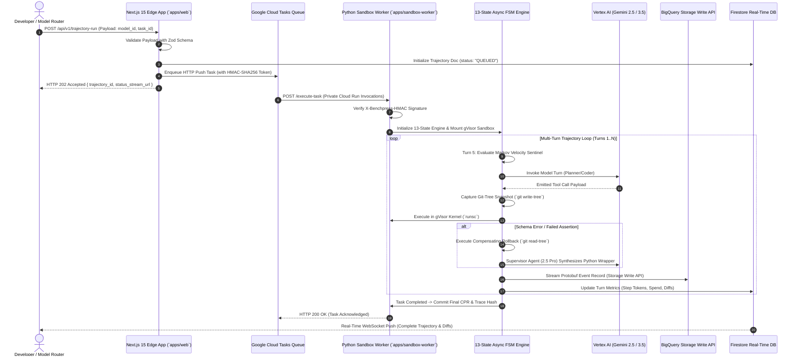

# Technical Implementation Guide: 2-Service Monorepo Architecture

> **Document ID:** `BP-IMP-001`  
> **Status:** Historical target-state design — not deployed or verified
> **Target Track:** Best Architectural Design ($5,000) & The Taskmaster • Google Cloud Hackathon (2026)

---

## 1. Monorepo Taxonomy & 2-Service Boundary Architecture

Benchpress is engineered as a unified, high-performance **2-Service Monorepo** managed via **Turborepo** and **pnpm workspaces**. It eliminates the latency, serialization overhead, and deployment complexity of legacy 3-tier microservices (separate FastAPI gateway + frontend + worker) by consolidating client web rendering and edge API routing into a single Next.js 15 App Router platform, which asynchronously dispatches heavy trajectory workloads directly to an isolated Python 3.12 Cloud Run Gen2 sandbox worker fleet.

```text
benchpress/
├── apps/
│   ├── web/                              # Service 1: Next.js 15 App Router & Edge API
│   │   ├── src/app/
│   │   │   ├── (hub)/page.tsx            # Interactive Leaderboard & Pareto Frontier
│   │   │   ├── live/page.tsx             # Real-Time Trajectory Replayer & Token Waterfalls
│   │   │   ├── layout.tsx                # Root Shell, Glassmorphism Header & Navigation
│   │   │   └── api/v1/                   # Edge REST API Route Handlers
│   │   │       ├── benchmarks/route.ts
│   │   │       ├── routing-recommendation/route.ts
│   │   │       └── trajectory-run/route.ts
│   │   ├── src/components/
│   │   │   ├── pareto-frontier-chart.tsx # Recharts Pareto Frontier with Weight Sliders
│   │   │   ├── cpr-leaderboard-table.tsx # Sortable, Filterable Model Economic Table
│   │   │   ├── webrtc-voice-drawer.tsx   # Gemini Multimodal Live Audio Worklet Waveform
│   │   │   └── vision-error-dropzone.tsx # Drag-and-Drop OCR Terminal Error Ingestor
│   │   ├── src/lib/
│   │   │   ├── gcp-tasks.ts              # @google-cloud/tasks Push Queue Client
│   │   │   ├── firestore.ts              # @google-cloud/firestore Real-Time Client
│   │   │   └── webrtc-session.ts         # Vertex AI Gemini Live WebRTC Handshake
│   │   ├── Dockerfile                    # Multi-Stage Standalone Node.js Alpine Container
│   │   ├── package.json
│   │   └── tailwind.config.ts            # Obsidian Dark Glassmorphism Design Tokens
│   │
│   └── sandbox-worker/                   # Service 2: Python 3.12 Cloud Run Gen2 Worker
│       ├── src/
│       │   ├── fsm/                      # 13-State Deterministic FSM Engine
│       │   │   ├── engine.py             # Asyncio State Transition Loop & Invariants
│       │   │   └── states.py             # 13 Formal Enum States & Context Models
│       │   ├── supervisor/               # Autonomous AST Tool-Healer
│       │   │   ├── ast_interceptor.py    # Schema Diff & Signature Parser
│       │   │   └── wrapper_injector.py   # Gemini 2.5 Pro Dynamic Tool Patch Generator
│       │   ├── sentinel/                 # Predictive FinOps Budget Sentinel
│       │   │   └── velocity_governor.py  # Turn-5 Markov Chain Cost Predictor
│       │   ├── memory/                   # 3-Tier Hierarchical Memory Bus
│       │   │   ├── ast_scratchpad.py     # L1 Working Memory Symbol Cache
│       │   │   └── compactor.py          # L2 Semantic AST Compactor (78.5% Compression)
│       │   ├── sandbox/                  # gVisor Isolated Container Environment
│       │   │   ├── container_runner.py   # Subprocess / gVisor runsc Execution Confinement
│       │   │   └── saga_tracker.py       # Git-Tree Snapshotting & Compensating Rollbacks
│       │   ├── telemetry/                # BigQuery Storage Write API Protobuf Streamer
│       │   │   └── bq_streamer.py
│       │   └── main.py                   # Cloud Tasks HTTP Ingestion Handler (FastAPI)
│       ├── Dockerfile                    # Multi-Stage gVisor runsc / Pytest Container
│       └── requirements.txt
│
├── packages/
│   ├── sdk-ts/                           # @benchpress/sdk (TypeScript Client for IDEs)
│   ├── sdk-python/                       # benchpress-python (PyPI SDK for Model Routers)
│   └── telemetry/                        # Shared OpenTelemetry GenAI Spans & Schemas
│
├── turbo.json                            # Turborepo Build Pipeline & Caching Manifest
└── package.json                          # Monorepo Root Workspace Configuration
```

---

## 2. End-to-End Execution Sequence Flow



---

## 3. Core Implementation Code Manifests

### 3.1 Edge Route Handler: `apps/web/src/app/api/v1/trajectory-run/route.ts`

```typescript
import { NextRequest, NextResponse } from "next/server";
import { z } from "zod";
import { CloudTasksClient } from "@google-cloud/tasks";
import { Firestore } from "@google-cloud/firestore";
import crypto from "crypto";

// 1. Strict Input Validation Schema
const TrajectoryRequestSchema = z.object({
  model_id: z.string().min(1),
  task_suite: z.enum(["swe_bench_verified", "financial_recon", "multi_doc_ops"]),
  task_id: z.string().min(1),
  budget_limit_usd: z.number().positive().default(2.00),
  enable_supervisor_healer: z.boolean().default(true),
});

const firestore = new Firestore();
const tasksClient = new CloudTasksClient();

export async function POST(req: NextRequest) {
  try {
    const rawBody = await req.json();
    const validation = TrajectoryRequestSchema.safeParse(rawBody);

    if (!validation.success) {
      return NextResponse.json(
        { error: "Invalid request payload", details: validation.error.format() },
        { status: 400 }
      );
    }

    const { model_id, task_suite, task_id, budget_limit_usd, enable_supervisor_healer } = validation.data;
    const trajectoryId = `tr_${crypto.randomUUID()}`;
    const timestampMs = Date.now();

    // 2. Initialize Trajectory Document in Firestore
    await firestore.collection("trajectories").doc(trajectoryId).set({
      trajectory_id: trajectoryId,
      model_id,
      task_suite,
      task_id,
      budget_limit_usd,
      enable_supervisor_healer,
      status: "QUEUED",
      created_at: timestampMs,
      current_turn: 0,
      total_spend_usd: 0.0,
    });

    // 3. Generate HMAC-SHA256 Signature for Private Worker Ingress
    const payload = JSON.stringify({ trajectory_id: trajectoryId, ...validation.data });
    const hmacSecret = process.env.WORKER_HMAC_SECRET || "benchpress-secret-key";
    const signature = crypto.createHmac("sha256", hmacSecret).update(payload).digest("hex");

    // 4. Construct and Dispatch Cloud Tasks HTTP Push Payload
    const project = process.env.GOOGLE_CLOUD_PROJECT || "benchpress-prod";
    const location = process.env.GOOGLE_CLOUD_REGION || "us-central1";
    const queue = "trajectory-eval-queue";
    const parent = tasksClient.queuePath(project, location, queue);
    const workerUrl = process.env.WORKER_SERVICE_URL || "https://sandbox-worker-internal.run.app/execute-task";

    await tasksClient.createTask({
      parent,
      task: {
        httpRequest: {
          httpMethod: "POST",
          url: workerUrl,
          headers: {
            "Content-Type": "application/json",
            "X-Benchpress-HMAC": signature,
          },
          body: Buffer.from(payload).toString("base64"),
        },
      },
    });

    return NextResponse.json(
      {
        trajectory_id: trajectoryId,
        status: "QUEUED",
        status_url: `/live?id=${trajectoryId}`,
        estimated_cpr_usd: 0.24,
      },
      { status: 202 }
    );
  } catch (error: any) {
    return NextResponse.json({ error: "Internal Server Error", message: error.message }, { status: 500 });
  }
}
```

---

### 3.2 Python Sandbox Worker: `apps/sandbox-worker/src/main.py`

```python
import os
import hmac
import hashlib
import json
import logging
from fastapi import FastAPI, Request, HTTPException, Header, status
from pydantic import BaseModel
from google.cloud import firestore
from benchpress.fsm.engine import AsyncFSMRunner
from benchpress.telemetry.bq_streamer import BigQueryProtobufStreamer

app = FastAPI(title="Benchpress Sandbox Worker Service", version="2.0.0")

db = firestore.AsyncClient()
bq_streamer = BigQueryProtobufStreamer()
HMAC_SECRET = os.environ.get("WORKER_HMAC_SECRET", "benchpress-secret-key").encode()

class TaskPayload(BaseModel):
    trajectory_id: str
    model_id: str
    task_suite: str
    task_id: str
    budget_limit_usd: float = 2.00
    enable_supervisor_healer: bool = True

@app.post("/execute-task", status_code=status.HTTP_200_OK)
async def execute_task(request: Request, x_benchpress_hmac: str = Header(None)):
    raw_body = await request.body()

    # 1. Verify HMAC-SHA256 Signature
    if not x_benchpress_hmac:
        raise HTTPException(status_code=401, detail="Missing HMAC signature header")

    computed_hmac = hmac.new(HMAC_SECRET, raw_body, hashlib.sha256).hexdigest()
    if not hmac.compare_digest(computed_hmac, x_benchpress_hmac):
        raise HTTPException(status_code=403, detail="Invalid HMAC signature")

    payload_dict = json.loads(raw_body.decode())
    task = TaskPayload(**payload_dict)
    logging.info(f"Starting execution for trajectory {task.trajectory_id}")

    # 2. Instantiate 13-State Deterministic FSM Engine
    fsm_runner = AsyncFSMRunner(
        trajectory_id=task.trajectory_id,
        model_id=task.model_id,
        task_suite=task.task_suite,
        task_id=task.task_id,
        budget_limit=task.budget_limit_usd,
        enable_healer=task.enable_supervisor_healer,
        firestore_client=db,
        telemetry_streamer=bq_streamer
    )

    # 3. Execute Trajectory Lifecycle
    result = await fsm_runner.run()

    # 4. Flush Telemetry & Update Firestore Status
    await db.collection("trajectories").document(task.trajectory_id).update({
        "status": "COMPLETED" if result.pass_at_1 else "FAILED",
        "pass_at_1": result.pass_at_1,
        "total_turns": result.total_turns,
        "total_spend_usd": result.total_spend_usd,
        "cpr_score": result.cpr_score,
        "completed_at": firestore.SERVER_TIMESTAMP
    })

    return {"status": "SUCCESS", "trajectory_id": task.trajectory_id, "pass_at_1": result.pass_at_1}
```

---

## 4. Production Multi-Stage Dockerfiles

### 4.1 Next.js 15 Standalone Dockerfile: `apps/web/Dockerfile`

```dockerfile
# Stage 1: Dependency Caching
FROM node:22-alpine AS deps
WORKDIR /app
RUN apk add --no-cache libc6-compat
COPY package.json pnpm-lock.yaml* ./
RUN npm install -g pnpm && pnpm install --frozen-lockfile

# Stage 2: Standalone Next.js Builder
FROM node:22-alpine AS builder
WORKDIR /app
COPY --from=deps /app/node_modules ./node_modules
COPY . .
ENV NEXT_TELEMETRY_DISABLED=1
ENV NODE_ENV=production
RUN npm install -g pnpm && pnpm build

# Stage 3: Minimal Production Non-Root Runner
FROM node:22-alpine AS runner
WORKDIR /app
ENV NODE_ENV=production
ENV PORT=3000
ENV HOSTNAME="0.0.0.0"

RUN addgroup --system --gid 1001 nodejs && \
    adduser --system --uid 1001 nextjs

COPY --from=builder /app/public ./public
COPY --from=builder --chown=nextjs:nodejs /app/.next/standalone ./
COPY --from=builder --chown=nextjs:nodejs /app/.next/static ./.next/static

USER nextjs
EXPOSE 3000
CMD ["node", "server.js"]
```

---

### 4.2 Python 3.12 gVisor Sandbox Dockerfile: `apps/sandbox-worker/Dockerfile`

```dockerfile
# Stage 1: Build dependencies & wheels
FROM python:3.12-slim AS builder
WORKDIR /app
RUN apt-get update && apt-get install -y --no-install-recommends \
    build-essential \
    curl \
    git \
    && rm -rf /var/lib/apt/lists/*
COPY requirements.txt .
RUN pip install --no-cache-dir --user -r requirements.txt

# Stage 2: Production gVisor Runtime
FROM python:3.12-slim AS runner
WORKDIR /app

# Install gVisor runsc user-space kernel binary & git for Sagas
RUN apt-get update && apt-get install -y --no-install-recommends \
    curl \
    git \
    ca-certificates \
    && curl -fsSL https://gvisor.dev/archive.key | gpg --dearmor -o /usr/share/keyrings/gvisor-archive-keyring.gpg \
    && echo "deb [arch=$(dpkg --print-architecture) signed-by=/usr/share/keyrings/gvisor-archive-keyring.gpg] https://storage.googleapis.com/gvisor/releases release main" \
    | tee /etc/apt/sources.list.d/gvisor.list > /dev/null \
    && apt-get update && apt-get install -y runsc \
    && rm -rf /var/lib/apt/lists/*

# Create non-root worker user
RUN useradd -m -u 10001 -s /bin/bash benchpress && \
    mkdir -p /workspace && chown -R benchpress:benchpress /workspace /app

COPY --from=builder /root/.local /home/benchpress/.local
COPY --chown=benchpress:benchpress . .

ENV PATH=/home/benchpress/.local/bin:$PATH
ENV PYTHONUNBUFFERED=1
ENV PORT=8080

USER benchpress
EXPOSE 8080

CMD ["uvicorn", "src.main:app", "--host", "0.0.0.0", "--port", "8080", "--workers", "4"]
```

---

## 5. Turborepo & Workspace Configuration

### 5.1 Pipeline Configuration: `turbo.json`

```json
{
  "$schema": "https://turbo.build/schema.json",
  "globalDependencies": ["**/.env.*local"],
  "tasks": {
    "build": {
      "dependsOn": ["^build"],
      "outputs": [".next/**", "!.next/cache/**", "dist/**"]
    },
    "lint": {
      "dependsOn": ["^lint"]
    },
    "test": {
      "dependsOn": ["^build"],
      "outputs": ["coverage/**"]
    },
    "dev": {
      "cache": false,
      "persistent": true
    }
  }
}
```

### 5.2 Root Workspace Manifest: `package.json`

```json
{
  "name": "benchpress-monorepo",
  "private": true,
  "scripts": {
    "dev": "turbo dev",
    "build": "turbo build",
    "test": "turbo test",
    "lint": "turbo lint",
    "clean": "turbo clean && rm -rf node_modules"
  },
  "devDependencies": {
    "turbo": "^2.4.0",
    "prettier": "^3.5.0",
    "typescript": "^5.7.0"
  },
  "packageManager": "pnpm@9.15.0"
}
```
