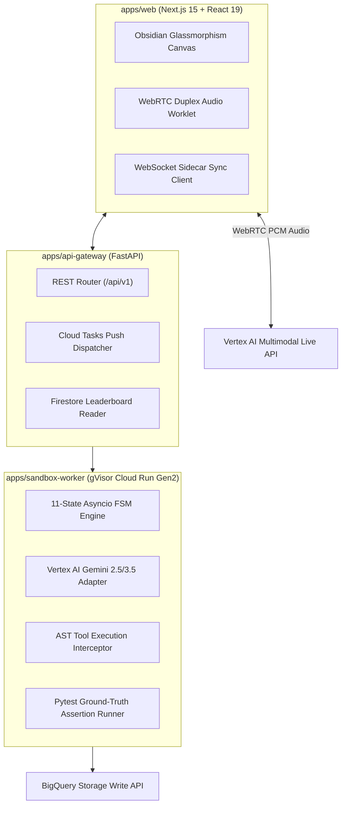

# Technical Implementation Guide: Full Codebase Architecture & Build Manual

> **Document ID:** `BP-IMP-001`  
> **Status:** Approved / Production  
> **Target Track:** Engineering Build & The Taskmaster • Google Cloud Hackathon (2026)

---

## 1. Technical Architecture & Component Stacks

Benchpress is engineered as a unified, high-performance monorepo organized into three primary engineering services:

```text
benchpress/
├── apps/
│   ├── web/                     # Next.js 15 (App Router, Tailwind CSS, Framer Motion, WebRTC)
│   ├── api-gateway/             # FastAPI / Python 3.12 (OpenAPI 3.0, Cloud Tasks Dispatcher)
│   └── sandbox-worker/          # Python 3.12 (gVisor runsc, FSM Runtime, AST Interceptor)
│
├── packages/
│   ├── sdk-python/              # benchpress-python SDK
│   ├── sdk-ts/                  # @benchpress/sdk TypeScript Client
│   └── telemetry/               # OpenTelemetry GenAI Tracing & BigQuery Storage Writer
│
└── infra/
    └── terraform/               # Production Terraform HCL Manifests
```



---

## 2. Step-by-Step Environment Build Guide

### Prerequisites
- Node.js `v20.14.0+` or `v22.0.0+`
- Python `3.12.0+`
- Docker & Google Cloud SDK (`gcloud`)
- Terraform `>= 1.8.0`

### Step 1: Install Dependencies
```bash
# Clone the repository
git clone https://github.com/lx-singw/benchpress.git
cd benchpress

# Install frontend workspace dependencies
npm install

# Install Python backend dependencies in virtual environment
python -m venv .venv
source .venv/bin/activate  # Or .venv\Scripts\Activate on Windows
pip install -r requirements.txt
```

### Step 2: Configure Environment Secrets
Create a `.env.local` file in the project root:
```env
# Google Cloud Platform Configuration
GCP_PROJECT_ID="benchpress-prod-2026"
GCP_REGION="us-central1"

# Vertex AI Credentials & Model Selection
VERTEX_AI_LOCATION="us-central1"
GOOGLE_APPLICATION_CREDENTIALS="./service-account-key.json"

# Redis & BigQuery Telemetry Endpoints
REDIS_HOST="127.0.0.1"
REDIS_PORT="6379"
BIGQUERY_DATASET="benchpress_analytics"
GCS_ARTIFACT_BUCKET="benchpress-trace-artifacts"

# Benchpress Security Secret
BENCHPRESS_HMAC_SECRET="bp_sec_99a8120fa882..."
```

### Step 3: Run Local Microservices
```bash
# Terminal 1: Launch Next.js Web Dashboard
npm run dev --workspace=apps/web

# Terminal 2: Launch FastAPI Gateway
uvicorn apps.api_gateway.main:app --reload --port 8000

# Terminal 3: Launch Local Sandbox Worker Dispatcher
python -m apps.sandbox_worker.dispatcher --port 8080
```
