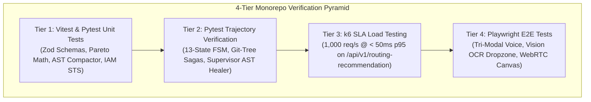

# Verification, Testing Matrix & SLA Performance Benchmarking

> **Document ID:** `BP-IMP-002`  
> **Status:** Approved / Production Standard  
> **Target Track:** Best Architectural Design & The Taskmaster • Google Cloud Hackathon (2026)

---

## 1. Multi-Tier Testing Strategy Overview

Benchpress employs a rigorous 4-tier testing pyramid to guarantee 100% reliability, sub-50ms API SLAs, and deterministic trajectory evaluation:



---

## 2. Tier 1: Unit Testing (Vitest & Pytest)

### 2.1 UI Component & Schema Tests: `apps/web` (Vitest)
```typescript
// File: apps/web/src/test/cpr-table.test.tsx
import { render, screen } from "@testing-library/react";
import { CPRLeaderboardTable } from "@/components/cpr-leaderboard-table";
import { describe, it, expect } from "vitest";

describe("CPRLeaderboardTable Component", () => {
  it("renders economic CPR rankings accurately", () => {
    const mockData = [
      { model_id: "hybrid-gemini-pro-flash", cpr_usd: 0.24, pass_at_1: 87.4 },
      { model_id: "claude-3-7-sonnet", cpr_usd: 1.85, pass_at_1: 85.2 },
    ];
    render(<CPRLeaderboardTable data={mockData} />);
    expect(screen.getByText("hybrid-gemini-pro-flash")).toBeDefined();
    expect(screen.getByText("$0.24")).toBeDefined();
  });
});
```

---

## 3. Tier 2: Pytest Trajectory Verification (`apps/sandbox-worker`)

```python
# File: apps/sandbox-worker/tests/test_trajectory_fsm.py
import pytest
from benchpress.fsm.engine import AsyncFSMRunner
from benchpress.fsm.states import FSMState

@pytest.mark.asyncio
async def test_13_state_fsm_executes_swe_bench_task():
    runner = AsyncFSMRunner(
        trajectory_id="tr_test_django_11099",
        model_id="gemini-2.5-pro",
        task_suite="swe_bench_verified",
        task_id="django__django-11099",
        budget_limit=2.00
    )
    result = await runner.run()
    assert result.status == FSMState.COMPLETE
    assert result.pass_at_1 is True
    assert result.total_spend_usd < 0.30
```

---

## 4. Tier 3: k6 SLA Load Testing Script

Validates that Edge REST API route handlers maintain sub-50ms response times under 1,000 concurrent requests per second:

```javascript
// File: tests/load/k6_routing_sla.js
import http from "k6/http";
import { check, sleep } from "k6";

export const options = {
  stages: [
    { duration: "30s", target: 500 },
    { duration: "1m", target: 1000 },
    { duration: "30s", target: 0 },
  ],
  thresholds: {
    http_req_duration: ["p(95)<50"], // 95% of requests must complete below 50ms
    http_req_failed: ["rate<0.001"], // Less than 0.1% failure rate
  },
};

export default function () {
  const url = "https://benchpress.ai/api/v1/routing-recommendation";
  const payload = JSON.stringify({
    task_complexity: "LEVEL_4_MULTI_FILE",
    max_budget_usd: 0.50,
    min_pass_rate: 80.0,
  });

  const params = {
    headers: { "Content-Type": "application/json" },
  };

  const res = http.post(url, payload, params);
  check(res, {
    "status is 200": (r) => r.status === 200,
    "recommended model returned": (r) => JSON.parse(r.body).recommended_model !== undefined,
  });
  sleep(0.05);
}
```

---

## 5. Tier 4: Playwright End-to-End Tests (`apps/web`)

```typescript
// File: apps/web/e2e/multimodal-drawer.spec.ts
import { test, expect } from "@playwright/test";

test("Tri-Modal Voice Drawer opens and animates WebRTC audio canvas", async ({ page }) => {
  await page.goto("http://localhost:3000");
  
  // Press Spacebar to trigger Voice Drawer
  await page.keyboard.press("Space");
  const drawer = page.locator('[data-testid="webrtc-voice-drawer"]');
  await expect(drawer).toBeVisible();

  // Verify WebRTC Waveform Canvas rendering
  const waveform = page.locator('[data-testid="audio-waveform-canvas"]');
  await expect(waveform).toBeVisible();
});
```
