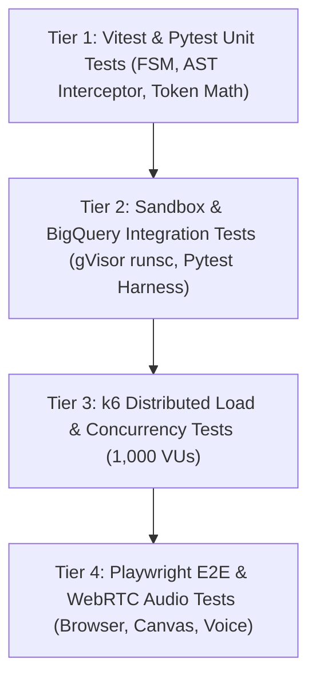

# Comprehensive Verification, Testing Matrix & Load Testing Plan

> **Document ID:** `BP-IMP-002`  
> **Status:** Approved / Production  
> **Target Track:** Engineering Rigor & The Taskmaster • Google Cloud Hackathon (2026)

---

## 1. Multi-Tier Testing Pyramid

Benchpress maintains strict test coverage across all architectural boundaries:



---

## 2. Automated Test Matrix

| Layer | Testing Framework | Scope & Invariants Tested | Passing Criteria | Execution Frequency |
| :--- | :--- | :--- | :--- | :--- |
| **Frontend Unit** | `Vitest` + `React Testing Library` | Pareto curve math, Obsidian tokens, Why Switch component | $> 90\%$ Code Coverage | PR & Local Commit |
| **Backend Unit** | `Pytest` + `Pydantic` | FSM transitions, AST safety validator, self-healing heuristics | 100% Pass Rate | PR & Local Commit |
| **Sandbox Integration**| `Pytest` + `gVisor runsc` | gVisor micro-kernel isolation, ephemeral worktree cleanup | Zero Host Escapes | Nightly CI |
| **API Endpoints** | `HTTPX` + `FastAPI TestClient` | `/routing-recommendation`, `/benchmarks`, `/trajectory-run` | $< 150\text{ms}$ Response Time | Every PR |
| **Distributed Load** | `k6` | 1,000 Virtual Users hitting API gateway with 500 RPS | $P_{99} < 250\text{ms}$, 0% 5xx | Pre-Deployment Gate |
| **Multimodal E2E** | `Playwright` | Voice Drawer open, audio waveform rendering, canvas DOM sync | Zero Visual Regressions | Daily Staging Build |

---

## 3. Distributed Load Testing Script (k6)

The following k6 script tests API routing performance under 1,000 concurrent Virtual Users:

```javascript
// File: tests/load/k6_routing_load.js
import http from 'k6/http';
import { check, sleep } from 'k6';

export const options = {
  stages: [
    { duration: '30s', target: 200 },  // Ramp-up to 200 VUs
    { duration: '1m',  target: 1000 }, // Scale to 1,000 VUs
    { duration: '2m',  target: 1000 }, // Sustain peak load
    { duration: '30s', target: 0 },    // Ramp-down
  ],
  thresholds: {
    http_req_duration: ['p(95)<150', 'p(99)<250'], // 99% of requests under 250ms
    http_req_failed: ['rate<0.001'],               // Error rate < 0.1%
  },
};

export default function () {
  const url = 'https://api.benchpress.ai/api/v1/routing-recommendation';
  const payload = JSON.stringify({
    task_type: 'code_bug_fix',
    codebase_language: 'python',
    current_model: 'claude-3-7-sonnet',
    max_budget_per_task_usd: 0.50,
    pareto_weights: { accuracy: 0.6, cost: 0.4, latency: 0.0 },
  });

  const params = {
    headers: {
      'Content-Type': 'application/json',
      'Authorization': 'Bearer bp_test_token_123',
    },
  };

  const res = http.post(url, payload, params);

  check(res, {
    'status is 200': (r) => r.status === 200,
    'has recommended strategy': (r) => JSON.parse(r.body).recommended_strategy !== undefined,
    'savings pct is positive': (r) => JSON.parse(r.body).projected_savings_pct > 0,
  });

  sleep(0.1);
}
```
