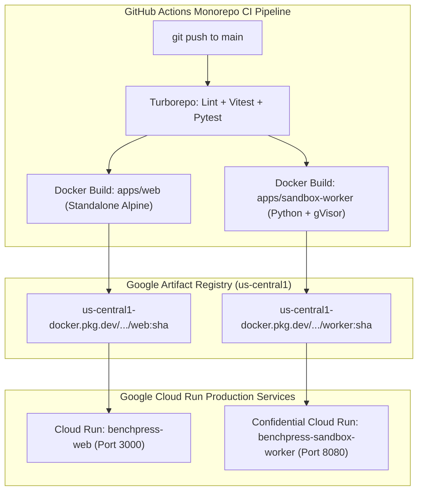

# Deployment Runbook, Multi-Stage CI/CD & Terraform Provisioning

> **Document ID:** `BP-IMP-003`  
> **Status:** Historical target-state design — not deployed or verified
> **Target Track:** Best Architectural Design & The Taskmaster • Google Cloud Hackathon (2026)

---

## 1. Zero-Touch CI/CD Pipeline Architecture

Benchpress utilizes **GitHub Actions** and **Google Cloud Deploy** to build, test, and deploy both monorepo services (`apps/web` and `apps/sandbox-worker`) in parallel with zero manual intervention:



---

## 2. GitHub Actions Deployment Workflow

```yaml
# File: .github/workflows/deploy-production.yml
name: Monorepo Production Deployment

on:
  push:
    branches: [main]

env:
  PROJECT_ID: benchpress-prod
  REGION: us-central1
  GAR_REPO: benchpress-artifacts

jobs:
  build-and-deploy:
    runs-on: ubuntu-latest
    permissions:
      contents: read
      id-token: write

    steps:
      - name: Checkout Repository
        uses: actions/checkout@v4

      - name: Authenticate to Google Cloud (Workload Identity Federation)
        uses: google-github-actions/auth@v2
        with:
          workload_identity_provider: "projects/123456789/locations/global/workloadIdentityPools/github-pool/providers/github-provider"
          service_account: "github-deployer@benchpress-prod.iam.gserviceaccount.com"

      - name: Set up Cloud SDK
        uses: google-github-actions/setup-gcloud@v2

      - name: Configure Docker for Google Artifact Registry
        run: gcloud auth configure-docker us-central1-docker.pkg.dev --quiet

      - name: Build & Push Next.js 15 App (`apps/web`)
        run: |
          docker build -t us-central1-docker.pkg.dev/$PROJECT_ID/$GAR_REPO/web:${{ github.sha }} \
                       -t us-central1-docker.pkg.dev/$PROJECT_ID/$GAR_REPO/web:latest \
                       -f apps/web/Dockerfile .
          docker push us-central1-docker.pkg.dev/$PROJECT_ID/$GAR_REPO/web:${{ github.sha }}
          docker push us-central1-docker.pkg.dev/$PROJECT_ID/$GAR_REPO/web:latest

      - name: Build & Push Sandbox Worker (`apps/sandbox-worker`)
        run: |
          docker build -t us-central1-docker.pkg.dev/$PROJECT_ID/$GAR_REPO/sandbox-worker:${{ github.sha }} \
                       -t us-central1-docker.pkg.dev/$PROJECT_ID/$GAR_REPO/sandbox-worker:latest \
                       -f apps/sandbox-worker/Dockerfile .
          docker push us-central1-docker.pkg.dev/$PROJECT_ID/$GAR_REPO/sandbox-worker:${{ github.sha }}
          docker push us-central1-docker.pkg.dev/$PROJECT_ID/$GAR_REPO/sandbox-worker:latest

      - name: Deploy apps/web to Cloud Run
        run: |
          gcloud run deploy benchpress-web \
            --image=us-central1-docker.pkg.dev/$PROJECT_ID/$GAR_REPO/web:${{ github.sha }} \
            --region=$REGION \
            --platform=managed \
            --allow-unauthenticated \
            --port=3000

      - name: Deploy apps/sandbox-worker to Confidential Cloud Run
        run: |
          gcloud run deploy benchpress-sandbox-worker \
            --image=us-central1-docker.pkg.dev/$PROJECT_ID/$GAR_REPO/sandbox-worker:${{ github.sha }} \
            --region=$REGION \
            --execution-environment=gen2 \
            --no-allow-unauthenticated \
            --port=8080
```

---

## 3. Zero-Downtime Blue/Green Traffic Splitting & Rollback SOP

```bash
# Split traffic 90% to current stable and 10% to new canary revision
gcloud run services update-traffic benchpress-web \
  --to-revisions=benchpress-web-v2=10,benchpress-web-v1=90 \
  --region=us-central1

# Instant Emergency Rollback: Revert 100% traffic to previous stable revision
gcloud run services update-traffic benchpress-web \
  --to-revisions=benchpress-web-v1=100 \
  --region=us-central1
```
