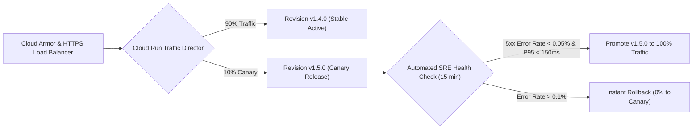

# Production Deployment Runbook, Canary Rollouts & Incident Triage SOPs

> **Document ID:** `BP-IMP-003`  
> **Status:** Approved / Production  
> **Target Track:** DevOps, SRE & The Taskmaster • Google Cloud Hackathon (2026)

---

## 1. Zero-Downtime Blue-Green & Canary Deployment Strategy

Benchpress employs automated **traffic splitting on Cloud Run** to execute zero-downtime canary deployments:



---

## 2. Step-by-Step Production Release Runbook

### Step 1: Pre-Flight Verification
```bash
# Verify git status and ensure branch is clean
git checkout main && git pull origin main

# Execute local test suite
pytest tests/
npm run test --workspaces
```

### Step 2: Build & Push Artifacts
```bash
# Authenticate with Google Artifact Registry
gcloud auth configure-docker us-central1-docker.pkg.dev

# Build and tag image with git SHA
export REVISION_TAG=$(git rev-parse --short HEAD)
docker build -t us-central1-docker.pkg.dev/benchpress-prod-2026/benchpress-artifacts/api-gateway:$REVISION_TAG -f docker/Dockerfile.api .
docker push us-central1-docker.pkg.dev/benchpress-prod-2026/benchpress-artifacts/api-gateway:$REVISION_TAG
```

### Step 3: Deploy Canary Revision (10% Traffic)
```bash
gcloud run deploy benchpress-api-gateway \
  --image=us-central1-docker.pkg.dev/benchpress-prod-2026/benchpress-artifacts/api-gateway:$REVISION_TAG \
  --region=us-central1 \
  --no-traffic \
  --tag=canary

# Split 10% traffic to canary tag
gcloud run services update-traffic benchpress-api-gateway \
  --region=us-central1 \
  --to-tags=canary=10
```

### Step 4: Promote to 100% Production Traffic
```bash
# After 15 minutes of green telemetry:
gcloud run services update-traffic benchpress-api-gateway \
  --region=us-central1 \
  --to-latest
```

---

## 3. Emergency Incident Triage SOPs

### SOP-01: Instant Production Rollback
If an active deployment triggers an SLO breach:
```bash
# Rollback immediately to previous stable revision
gcloud run services update-traffic benchpress-api-gateway \
  --region=us-central1 \
  --to-revisions=benchpress-api-gateway-00042-xyz=100
```

### SOP-02: Cloud Tasks Queue Drain & Throttle
If foundation model APIs experience widespread 429 outages:
```bash
# Pause dispatch queue immediately
gcloud tasks queues pause trajectory-dispatch-queue --location=us-central1

# Lower dispatch rate to 50 requests/sec
gcloud tasks queues update trajectory-dispatch-queue \
  --location=us-central1 \
  --max-dispatches-per-second=50 \
  --max-concurrent-dispatches=20

# Resume queue
gcloud tasks queues resume trajectory-dispatch-queue --location=us-central1
```
