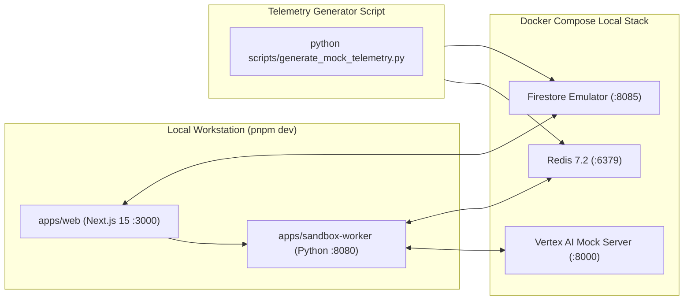

# Local Development, Docker Compose Stack & Mock Telemetry Generator

> **Document ID:** `BP-IMP-004`  
> **Status:** Approved / Production Standard  
> **Target Track:** Best Architectural Design & The Taskmaster • Google Cloud Hackathon (2026)

---

## 1. Local Monorepo Architecture Overview

Benchpress provides a zero-dependency local development workflow powered by **Docker Compose emulators** (Firestore, Redis 7.2), an **in-memory Vertex AI mock server**, and a **Python mock telemetry streaming generator**:



---

## 2. Docker Compose Local Stack: `docker-compose.dev.yml`

```yaml
version: "3.8"

services:
  firestore-emulator:
    image: google/cloud-sdk:emulators
    container_name: benchpress-firestore-emulator
    command: gcloud beta emulators firestore start --host-port=0.0.0.0:8085
    ports:
      - "8085:8085"
    environment:
      - FIRESTORE_PROJECT_ID=benchpress-dev

  redis-emulator:
    image: redis:7.2-alpine
    container_name: benchpress-redis-emulator
    command: redis-server --appendonly yes
    ports:
      - "6379:6379"

  vertex-ai-mock:
    image: python:3.12-slim
    container_name: benchpress-vertex-mock
    volumes:
      - ./tests/mocks/vertex_mock_server.py:/app/mock_server.py
    command: python /app/mock_server.py
    ports:
      - "8000:8000"
```

---

## 3. Mock Telemetry Streaming Generator: `scripts/generate_mock_telemetry.py`

```python
#!/usr/bin/env python3
"""
Simulates multi-turn agent telemetry streams into Firestore and Redis,
enabling offline UI testing of the Live Trajectory Replayer and CPR Leaderboard.
"""
import time
import uuid
import random
import redis
from google.cloud import firestore

# Connect to local emulators
db = firestore.Client(project="benchpress-dev")
r = redis.Redis(host="localhost", port=6379, db=0)

MODELS = ["gemini-2.5-pro", "gemini-3.5-flash", "hybrid-gemini-pro-flash", "claude-3-7-sonnet"]
SUITES = ["swe_bench_verified", "financial_recon", "multi_doc_ops"]

def generate_mock_trajectory():
    trajectory_id = f"tr_{uuid.uuid4().hex[:12]}"
    model_id = random.choice(MODELS)
    suite = random.choice(SUITES)
    task_id = "django__django-11099" if suite == "swe_bench_verified" else "fin_q4_recon"

    print(f"[*] Emitting mock trajectory: {trajectory_id} ({model_id} on {suite})")

    # 1. Initialize Firestore Document
    doc_ref = db.collection("trajectories").document(trajectory_id)
    doc_ref.set({
        "trajectory_id": trajectory_id,
        "model_id": model_id,
        "task_suite": suite,
        "task_id": task_id,
        "status": "RUNNING",
        "current_turn": 0,
        "total_spend_usd": 0.0,
        "created_at": firestore.SERVER_TIMESTAMP
    })

    total_spend = 0.0
    turns = random.randint(3, 8)

    # 2. Simulate Multi-Turn Execution Loop
    for turn in range(1, turns + 1):
        time.sleep(0.8) # Simulate thinking latency
        step_cost = round(random.uniform(0.015, 0.045), 4)
        total_spend += step_cost

        # Buffer turn event into Redis
        event_payload = f"TURN:{turn}|MODEL:{model_id}|COST:{step_cost}|STATUS:EXEC_OK"
        r.rpush(f"events:{trajectory_id}", event_payload)

        # Update Firestore Live State
        doc_ref.update({
            "current_turn": turn,
            "total_spend_usd": round(total_spend, 4),
            "last_action": f"Executed AST tool 'edit_file' at turn {turn}"
        })
        print(f"  -> Turn {turn}/{turns} emitted (Spend: ${total_spend:.4f})")

    # 3. Finalize Trajectory
    pass_at_1 = random.random() > 0.15
    cpr = round(total_spend if pass_at_1 else total_spend * 3.5, 4)

    doc_ref.update({
        "status": "COMPLETED" if pass_at_1 else "FAILED",
        "pass_at_1": pass_at_1,
        "total_turns": turns,
        "cpr_score": cpr,
        "completed_at": firestore.SERVER_TIMESTAMP
    })
    print(f"[✓] Trajectory {trajectory_id} finished (Pass@1: {pass_at_1}, CPR: ${cpr})\n")

if __name__ == "__main__":
    print("Starting Benchpress Mock Telemetry Generator (Ctrl+C to stop)...")
    try:
        while True:
            generate_mock_trajectory()
            time.sleep(2.0)
    except KeyboardInterrupt:
        print("\nGenerator stopped.")
```
