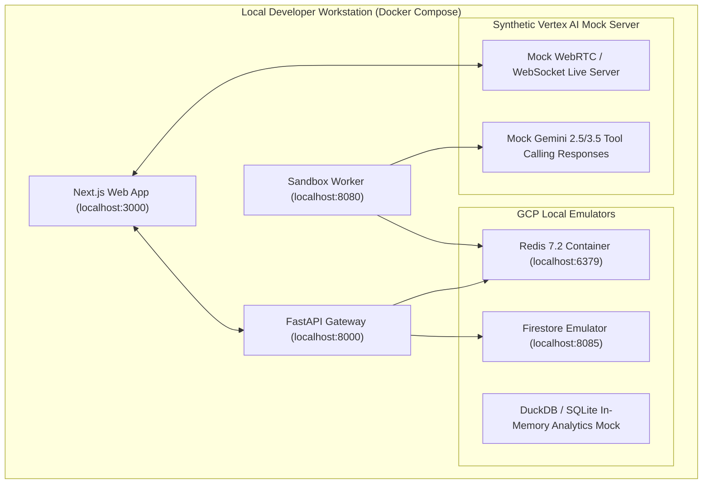

# Local Development Environment, Mocking & Docker Compose Setup

> **Document ID:** `BP-IMP-004`  
> **Status:** Approved / Production  
> **Target Track:** Developer Experience & Engineering Build • Google Cloud Hackathon (2026)

---

## 1. Local Offline Development Architecture

Benchpress provides a zero-cloud, 100% local development workflow using **Docker Compose v2**, local BigQuery/Firestore emulators, and synthetic foundation model mock responders.



---

## 2. Docker Compose Configuration (`docker-compose.yml`)

```yaml
# File: docker-compose.yml
version: '3.8'

services:
  redis:
    image: redis:7.2-alpine
    container_name: benchpress-local-redis
    ports:
      - "6379:6379"
    command: ["redis-server", "--appendonly", "yes"]

  firestore-emulator:
    image: google/cloud-sdk:emulators
    container_name: benchpress-local-firestore
    ports:
      - "8085:8085"
    command: ["gcloud", "beta", "emulators", "firestore", "start", "--host-port=0.0.0.0:8085"]

  mock-vertex-ai:
    build:
      context: .
      dockerfile: docker/Dockerfile.mock-vertex
    container_name: benchpress-mock-vertex
    ports:
      - "8090:8090"
    environment:
      - MOCK_RESPONSE_MODE=deterministic_pass
      - SIMULATED_LATENCY_MS=120

  api-gateway:
    build:
      context: .
      dockerfile: docker/Dockerfile.api
    container_name: benchpress-local-api
    ports:
      - "8000:8000"
    environment:
      - REDIS_HOST=redis
      - REDIS_PORT=6379
      - FIRESTORE_EMULATOR_HOST=firestore-emulator:8085
      - VERTEX_AI_BASE_URL=http://mock-vertex-ai:8090
    depends_on:
      - redis
      - firestore-emulator
      - mock-vertex-ai

  web:
    build:
      context: .
      dockerfile: docker/Dockerfile.web
    container_name: benchpress-local-web
    ports:
      - "3000:3000"
    environment:
      - NEXT_PUBLIC_API_URL=http://localhost:8000
      - NEXT_PUBLIC_LIVE_WEBRTC_URL=ws://localhost:8090/live
    depends_on:
      - api-gateway
```

---

## 3. Quickstart: Launching Local Environment

```bash
# 1. Start all container services and emulators
docker compose up -d

# 2. Seed synthetic benchmark fixtures into local Firestore and Redis
python scripts/seed_local_fixtures.py

# 3. Open browser at http://localhost:3000
# You now have a complete, fully functional Benchpress environment offline!
```
