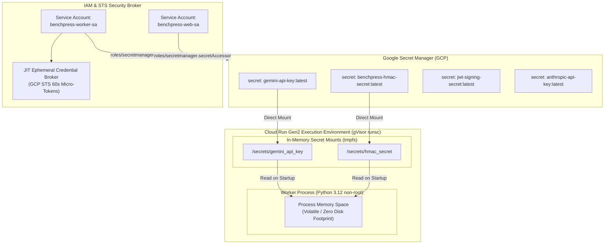
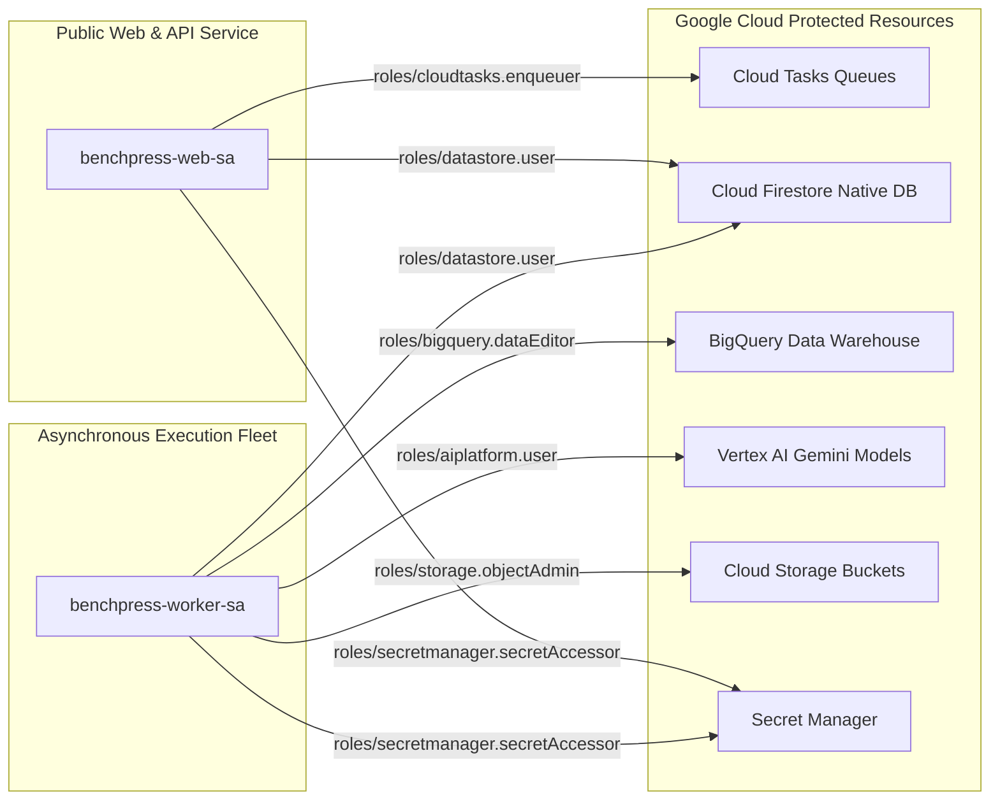

# Environment Variables, Secrets Management & IAM Permissions Matrix

> **Document ID:** `BP-IMP-005`  
> **Status:** Approved / Production-Grade Specification  
> **Target Track:** The Fortified Enterprise Fleet & The Taskmaster • Google Cloud All Things Agentic Hackathon (2026)  
> **Target Audience:** Lead Site Reliability Engineers, Enterprise Security Reviewers, Cloud Architects, DevSecOps

---

## 1. Exhaustive Configuration Reference Table

Benchpress follows the Twelve-Factor App methodology for configuration, separating code strictly from runtime credentials, networking endpoints, and FinOps budget thresholds.

Configurations are partitioned into three security classifications:
1. **Public Config:** Non-sensitive client-side parameters exposed to browsers (`NEXT_PUBLIC_*`).
2. **Internal Network / Infrastructure:** Non-secret operational settings (regions, dataset names, port numbers, queue identifiers).
3. **Secret Vault:** High-entropy credentials, cryptographic HMAC signing keys, and vendor API keys managed exclusively via **Google Secret Manager**.

| Variable Name | Target Service | Required? | Default Value | Description & Operational Purpose | Security Classification |
| :--- | :--- | :--- | :--- | :--- | :--- |
| `GCP_PROJECT_ID` / `GOOGLE_CLOUD_PROJECT` | `web`, `worker` | **Yes** | `benchpress-dev` | Google Cloud Project ID hosting Vertex AI, BigQuery, Cloud Tasks, and Cloud Run. | Internal Network |
| `GCP_REGION` / `GOOGLE_CLOUD_REGION` | `web`, `worker` | **Yes** | `us-central1` | Primary GCP multi-region deployment zone for Compute, Cloud Run, and Storage. | Internal Network |
| `VERTEX_AI_LOCATION` | `worker` | **Yes** | `us-central1` | Regional endpoint for Vertex AI Gemini 2.5 Pro, 3.5 Flash, and Multimodal Live APIs. | Internal Network |
| `GEMINI_API_KEY` | `web`, `worker` | Optional* | `None` (*Uses ADC in Cloud Run) | API key for direct Google AI Studio Gemini API calls or local development bypass. | **Secret Vault** |
| `ANTHROPIC_API_KEY` | `worker` | Optional | `None` | API key used for evaluating Claude 3.7 Sonnet benchmark comparison baselines. | **Secret Vault** |
| `OPENAI_API_KEY` | `worker` | Optional | `None` | API key used for evaluating OpenAI GPT-4o / o3-mini comparison baselines. | **Secret Vault** |
| `DEEPSEEK_API_KEY` | `worker` | Optional | `None` | API key used for evaluating DeepSeek R1 / V3 comparison baselines. | **Secret Vault** |
| `PLANNER_MODEL` | `worker` | No | `gemini-2.5-pro` | Default foundation model assigned to high-level reasoning and decomposition turns. | Public Config |
| `CODER_MODEL` | `worker` | No | `gemini-2.5-flash` | Default high-speed foundation model assigned to code synthesis and tool execution turns. | Public Config |
| `SUPERVISOR_MODEL` | `worker` | No | `gemini-2.5-pro` | Supervisory model used for AST error interception and dynamic wrapper synthesis. | Public Config |
| `BIGQUERY_DATASET` | `web`, `worker` | **Yes** | `benchpress_analytics` | BigQuery dataset name containing trajectories, turn telemetry, and aggregate rollups. | Internal Network |
| `BIGQUERY_TABLE_TRAJECTORIES` | `worker` | No | `trajectories` | BigQuery table name storing top-level trajectory run summaries and economic CPR scores. | Internal Network |
| `BIGQUERY_TABLE_TURN_TELEMETRY` | `worker` | No | `turn_telemetry` | BigQuery table name storing turn-by-turn token telemetry and state transitions. | Internal Network |
| `GCS_ARTIFACT_BUCKET` | `worker` | **Yes** | `benchpress-artifacts-dev` | Cloud Storage bucket storing raw unified git patches, execution logs, and evaluation traces. | Internal Network |
| `REDIS_HOST` | `web`, `worker` | Optional | `127.0.0.1` | Private IP address for Memorystore Redis 7.2 cluster. | Internal Network |
| `REDIS_PORT` | `web`, `worker` | No | `6379` | Port for Redis cluster (standard 6379 or TLS port 6378). | Internal Network |
| `REDIS_AUTH_ENABLED` | `web`, `worker` | No | `false` | Whether Redis AUTH password authentication is enforced. | Internal Network |
| `REDIS_PASSWORD` | `web`, `worker` | Conditional | `None` | AUTH password for Memorystore Redis when `REDIS_AUTH_ENABLED=true`. | **Secret Vault** |
| `REDIS_URL` | `web`, `worker` | Optional | `redis://127.0.0.1:6379/0` | Fully qualified connection URI format for Redis client. | Internal Network |
| `CLOUDTASKS_QUEUE_NAME` | `web` | **Yes** | `benchpress-trajectory-dispatch` | Cloud Tasks push queue name for managing asynchronous sandbox execution tasks. | Internal Network |
| `CLOUDTASKS_LOCATION` | `web` | **Yes** | `us-central1` | GCP region where Cloud Tasks queue is provisioned. | Internal Network |
| `CLOUDTASKS_WORKER_URL` | `web` | **Yes** | `https://worker-dot-benchpress-dev.a.run.app` | Target Cloud Run HTTPS endpoint invoked by Cloud Tasks push dispatches. | Internal Network |
| `HARD_BUDGET_CAP_USD` | `worker` | No | `5.00` | Absolute hard ceiling in USD per single trajectory run; worker halts if exceeded. | Public Config |
| `DEFAULT_BUDGET_LIMIT_USD` | `worker` | No | `2.00` | Standard default budget limit assigned to new benchmark task executions. | Public Config |
| `MAX_TURNS` / `MAX_TURNS_PER_TRAJECTORY` | `worker` | No | `20` | Maximum number of multi-turn FSM loops permitted before forced termination. | Public Config |
| `EARLY_HALT_TURN_THRESHOLD` | `worker` | No | `5` | Turn index at which the Markov Token Velocity Sentinel evaluates trajectory trajectory viability. | Public Config |
| `USE_LOCAL_MOCK` | `worker` | No | `false` | When `true`, enables offline mock stubs for Vertex AI, BigQuery, and Cloud Storage. | Public Config |
| `BENCHPRESS_HMAC_SECRET` | `web`, `worker` | **Yes** | `None` | 256-bit cryptographic secret key used to sign and verify tamper-evident audit traces. | **Secret Vault** |
| `JWT_SIGNING_SECRET` | `web` | **Yes** | `None` | Cryptographic secret used to sign short-lived (60s) client WebSocket authentication tokens. | **Secret Vault** |
| `GITHUB_WEBHOOK_SECRET` | `web` | Optional | `None` | Secret used to validate incoming GitHub `check_run` webhooks for CI/CD auto-remediation. | **Secret Vault** |
| `NEXT_PUBLIC_APP_URL` | `web` | **Yes** | `http://localhost:3000` | Canonical frontend domain URL for OAuth redirects, metadata, and OpenGraph tags. | Public Config |
| `NEXT_PUBLIC_WS_ENDPOINT` | `web` | **Yes** | `ws://localhost:8080` | Real-time WebSocket streaming endpoint for live trajectory visualization and DOM sync. | Public Config |
| `NEXT_PUBLIC_ENABLE_LIVE_AUDIO` | `web` | No | `true` | Feature flag enabling Vertex AI WebRTC Multimodal Live duplex audio assistant. | Public Config |
| `PORT` | `web`, `worker` | No | `8080` (worker) / `3000` (web) | Local HTTP listening port. Overridden automatically by Cloud Run environment. | Internal Network |
| `HOST` | `worker` | No | `0.0.0.0` | Network binding interface for the worker FastAPI / Uvicorn server. | Internal Network |

---

## 2. Google Secret Manager Integration & Zero-Static Secrets

Benchpress strictly prohibits hardcoded secrets, embedded `.env` files inside Docker images, or plaintext keys in source control. All production secrets are managed through **Google Secret Manager** and resolved at container runtime.



### 2.1 Cloud Run Secret Volume Mount Configuration
In Cloud Run Gen2, secrets are projected as files in an in-memory `tmpfs` volume (`/secrets/...`) rather than standard environment variables. This prevents environment variable inspection via `/proc/$PID/environ` or crash report leakage:

```yaml
# Cloud Run YAML Manifest Snippet
apiVersion: serving.knative.dev/v1
kind: Service
metadata:
  name: benchpress-sandbox-worker
  annotations:
    run.googleapis.com/launch-stage: GA
    run.googleapis.com/execution-environment: gen2
spec:
  template:
    metadata:
      annotations:
        run.googleapis.com/sandbox: gvisor
        autoscaling.knative.dev/maxScale: "100"
    spec:
      serviceAccountName: benchpress-worker-sa@benchpress-dev.iam.gserviceaccount.com
      containers:
        - image: gcr.io/benchpress-dev/sandbox-worker:v2.1.0
          resources:
            limits:
              cpu: "4"
              memory: "8Gi"
          volumeMounts:
            - name: gemini-secret-vol
              mountPath: /secrets/gemini
            - name: hmac-secret-vol
              mountPath: /secrets/hmac
      volumes:
        - name: gemini-secret-vol
          secret:
            secretName: gemini-api-key
            items:
              - key: latest
                path: api_key
        - name: hmac-secret-vol
          secret:
            secretName: benchpress-hmac-secret
            items:
              - key: latest
                path: hmac_key
```

### 2.2 Container Hardening & Immutability Rules
1. **Zero `.env` Files in Images:** `.dockerignore` strictly excludes `.env`, `.env.*`, `*.pem`, `*.key`, and `credentials.json`.
2. **Non-Root Execution:** All worker and web processes run under an unprivileged user (`UID 10001`, `GID 10001`).
3. **Read-Only Root Filesystem:** Cloud Run instances run with an immutable read-only root (`--read-only`), writing temporary workspace files strictly to ephemeral `/tmp` backed by in-memory `tmpfs`.
4. **Zero Disk Retention:** Upon trajectory completion or timeout, all workspace directories in `/tmp` are wiped using cryptographically secure zeroization.

---

## 3. Least-Privilege IAM Permissions Matrix

Benchpress enforces strict Least-Privilege access separation between the public-facing Web Service (`benchpress-web-sa`) and the isolated Execution Fleet (`benchpress-worker-sa`).



### 3.1 Service Account: `benchpress-worker-sa`
Dedicated identity for Cloud Run Gen2 sandbox workers executing agentic code, calling Vertex AI, and streaming telemetry to BigQuery.

| Predefined IAM Role | Role ID | Explicit Permissions Granted | Security Justification |
| :--- | :--- | :--- | :--- |
| **Vertex AI User** | `roles/aiplatform.user` | `aiplatform.endpoints.predict`, `aiplatform.models.get` | Required to invoke Gemini 2.5 Pro, 3.5 Flash, and Vertex AI Vector Search. |
| **BigQuery Data Editor** | `roles/bigquery.dataEditor` | `bigquery.tables.create`, `bigquery.tables.updateData`, `bigquery.tables.getData` | Required to append records via the BigQuery Storage Write API into `benchpress_analytics`. |
| **Storage Object Admin** | `roles/storage.objectAdmin` | `storage.objects.create`, `storage.objects.get`, `storage.objects.delete` | Required to read task fixtures and persist output patches/logs into `gs://benchpress-artifacts-*`. |
| **Secret Manager Secret Accessor** | `roles/secretmanager.secretAccessor` | `secretmanager.versions.access` | Required to read runtime credentials mounted in `/secrets/...`. Bound only to specific secret resources. |
| **Cloud Datastore User** | `roles/datastore.user` | `datastore.entities.create`, `datastore.entities.update` | Required to update live execution state in `live_runs/{trajectory_id}` for UI streaming. |
| **Monitoring Metric Writer** | `roles/monitoring.metricWriter` | `monitoring.metricDescriptors.create`, `monitoring.timeSeries.create` | Required to emit custom OpenTelemetry FinOps and token latency metrics. |
| **Logs Writer** | `roles/logging.logWriter` | `logging.logEntries.create` | Required to stream structured JSON diagnostic logs into Google Cloud Logging. |

### 3.2 Service Account: `benchpress-web-sa`
Dedicated identity for the Next.js 15 App Router web service handling user requests, rendering leaderboards, and enqueuing benchmark evaluation tasks.

| Predefined IAM Role | Role ID | Explicit Permissions Granted | Security Justification |
| :--- | :--- | :--- | :--- |
| **Cloud Tasks Enqueuer** | `roles/cloudtasks.enqueuer` | `cloudtasks.tasks.create`, `cloudtasks.tasks.get` | Required to push asynchronous benchmark evaluation requests into Cloud Tasks queues. |
| **Cloud Datastore User** | `roles/datastore.user` | `datastore.entities.get`, `datastore.entities.list`, `datastore.entities.query` | Required to read public leaderboards and stream live run state to web clients. |
| **Secret Manager Secret Accessor** | `roles/secretmanager.secretAccessor` | `secretmanager.versions.access` | Required to access `JWT_SIGNING_SECRET` and `BENCHPRESS_HMAC_SECRET`. |
| **Logs Writer** | `roles/logging.logWriter` | `logging.logEntries.create` | Required to stream Next.js edge route telemetry to Cloud Logging. |

---

## 4. Production IAM Provisioning Automation (Terraform / gcloud)

Below are the exact `gcloud` provisioning commands establishing least-privilege role bindings:

```bash
#!/usr/bin/env bash
# ==============================================================================
# Benchpress IAM & Service Account Least-Privilege Provisioning Script
# ==============================================================================
set -euo pipefail

PROJECT_ID="benchpress-dev"

echo "Provisioning Service Accounts for Project: ${PROJECT_ID}..."

# 1. Create Service Accounts
gcloud iam service-accounts create benchpress-worker-sa \
    --project="${PROJECT_ID}" \
    --display-name="Benchpress Sandbox Worker Service Account" \
    --description="Identity for Cloud Run sandbox worker fleet"

gcloud iam service-accounts create benchpress-web-sa \
    --project="${PROJECT_ID}" \
    --display-name="Benchpress Web Next.js Service Account" \
    --description="Identity for Next.js 15 Hub and API Handlers"

# 2. Bind Worker Roles
WORKER_SA="benchpress-worker-sa@${PROJECT_ID}.iam.gserviceaccount.com"
WORKER_ROLES=(
    "roles/aiplatform.user"
    "roles/bigquery.dataEditor"
    "roles/storage.objectAdmin"
    "roles/secretmanager.secretAccessor"
    "roles/datastore.user"
    "roles/monitoring.metricWriter"
    "roles/logging.logWriter"
)

for role in "${WORKER_ROLES[@]}"; do
    echo "Binding ${role} to ${WORKER_SA}..."
    gcloud projects add-iam-policy-binding "${PROJECT_ID}" \
        --member="serviceAccount:${WORKER_SA}" \
        --role="${role}" \
        --condition=None
done

# 3. Bind Web Roles
WEB_SA="benchpress-web-sa@${PROJECT_ID}.iam.gserviceaccount.com"
WEB_ROLES=(
    "roles/cloudtasks.enqueuer"
    "roles/datastore.user"
    "roles/secretmanager.secretAccessor"
    "roles/logging.logWriter"
)

for role in "${WEB_ROLES[@]}"; do
    echo "Binding ${role} to ${WEB_SA}..."
    gcloud projects add-iam-policy-binding "${PROJECT_ID}" \
        --member="serviceAccount:${WEB_SA}" \
        --role="${role}" \
        --condition=None
done

echo "✅ Least-privilege IAM configuration successfully established."
```
