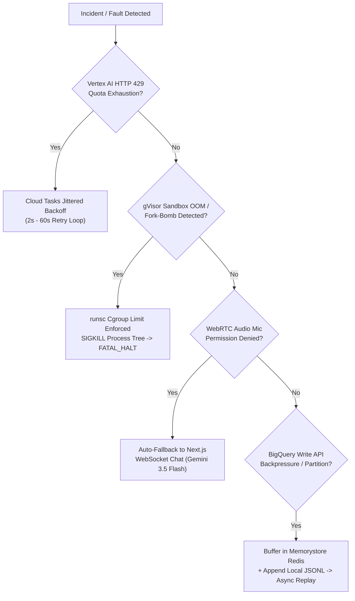
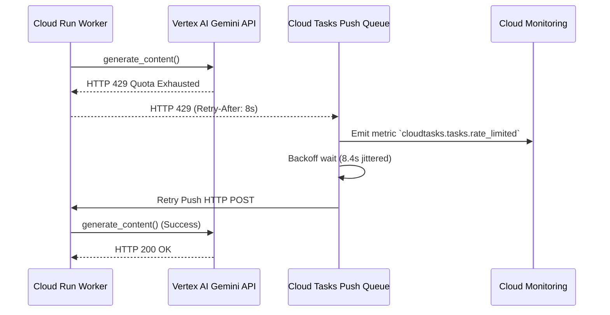
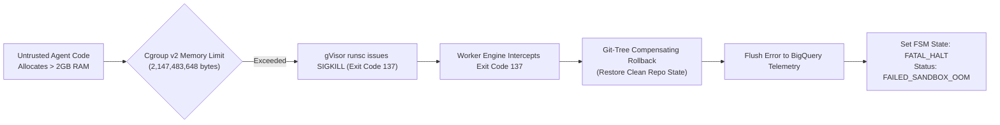
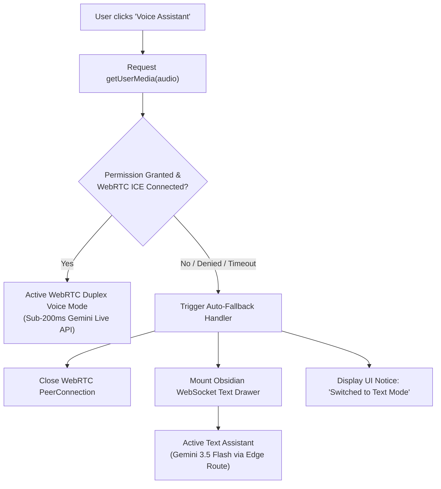
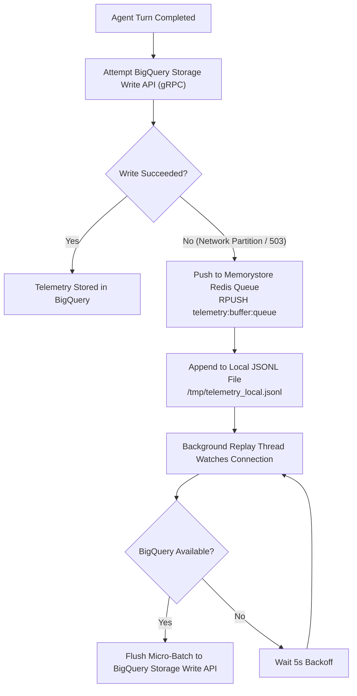

# Troubleshooting Runbook, Error Resolution & Judge Evaluation FAQ

> **Document ID:** `BP-IMP-006`  
> **Status:** Historical target-state design — not deployed or verified
> **Target Track:** The Taskmaster & Best Architectural Design • Google Cloud All Things Agentic Hackathon (2026)  
> **Target Audience:** Site Reliability Engineers, Production Operations, Hackathon Judges, Enterprise Evaluators

---

## 1. Diagnostic Decision Trees & Incident Runbooks

Benchpress operates as a resilient, self-healing distributed system. When infrastructure faults, model rate limits, or malicious sandbox behaviors occur, automated circuit breakers intercept errors, execute compensating actions, and preserve telemetry without dropping data.



---

### 1.1 Issue 1: Vertex AI Rate Limit (HTTP 429 Quota Exhaustion)

#### Symptom & Root Cause
A concurrency burst in automated benchmark swarms exceeds regional Vertex AI Gemini API rate limits (`ResourceExhausted: 429 Quota exceeded for aiplatform.googleapis.com/generate_content_requests_per_minute_per_project_per_base_model`).

#### Automated Self-Healing Architecture
1. **Cloud Tasks Exponential Jittered Backoff:** Worker catches `google.api_core.exceptions.ResourceExhausted` and returns HTTP `429 Too Many Requests` with a `Retry-After: {seconds}` header.
2. **Deterministic Queue Throttling:** Cloud Tasks queue `benchpress-trajectory-dispatch` automatically intercepts HTTP 429 and applies randomized exponential jitter:
   $$T_{\text{wait}} = \min\left(60, 2^{\text{attempt}} + \mathcal{U}(0, 2)\right) \text{ seconds}$$
3. **Queue Max Dispatches Per Second:** The Cloud Tasks queue dynamically constrains throughput to max 50 dispatches/sec per region, preventing cascading quota thundering herds.



#### SRE Incident Manual Runbook
```bash
# 1. Check current Cloud Tasks queue backlog and dispatch rate
gcloud tasks queues describe benchpress-trajectory-dispatch --location=us-central1

# 2. Dynamically adjust maximum dispatch rate to match active Vertex AI quota
gcloud tasks queues update benchpress-trajectory-dispatch \
    --location=us-central1 \
    --max-dispatches-per-second=30 \
    --max-concurrent-dispatches=50

# 3. If quota remains exhausted, failover worker region via environment flag
gcloud run services update benchpress-sandbox-worker \
    --region=us-east4 \
    --set-env-vars="VERTEX_AI_LOCATION=us-east4"
```

---

### 1.2 Issue 2: gVisor Sandbox OOM Crash / Infinite Fork-Bomb

#### Symptom & Root Cause
Untrusted generated code in a benchmark task attempts to allocate excess RAM (`> 2GB`), spawns infinite recursive subprocesses (`:(){ :|:& };:` fork bomb), or attempts unauthorized low-level system calls.

#### Automated Self-Healing Architecture
1. **gVisor `runsc` Kernel Virtualization:** Untrusted processes run inside a gVisor sandboxed user-space kernel. System calls do not reach the host Linux kernel.
2. **Cgroups v2 Resource Clamping:** 
   - `memory.max`: Fixed hard ceiling of `2,147,483,648` bytes ($2\,\text{GB}$).
   - `pids.max`: Hard limit of `128` processes.
3. **Automated Subprocess Pruning:** When a runaway process hits cgroup limits, `runsc` sends `SIGKILL` to the entire process group.
4. **State Machine Recovery:** The worker catches exit code `137` (OOM Killer) or `126` (Cannot execute), flushes the error traceback to `turn_telemetry`, records a compensating Git Saga restore, and cleanly transitions trajectory status to `FATAL_HALT`.



---

### 1.3 Issue 3: WebRTC Audio Stream Failure / Microphone Permission Denied

#### Symptom & Root Cause
Client browser blocks WebRTC microphone access, network firewall drops UDP packets required for STUN/TURN ICE candidates, or the user is in a quiet office environment unable to speak.

#### Automated Self-Healing Architecture
1. **WebRTC State Machine Guard:** Next.js client listens for `navigator.mediaDevices.getUserMedia()` rejections or WebRTC ICE connection timeouts ($> 3,000\,\text{ms}$).
2. **Zero-Friction Fallback:** The UI automatically dismisses the audio waveform canvas and mounts the **High-Speed WebSocket Text Chat Drawer** powered by Gemini 3.5 Flash.
3. **State Preservation:** The active trajectory replay, split-terminal view, and token waterfall chart continue running without page reload or state loss.



---

### 1.4 Issue 4: BigQuery Storage Write API Backpressure

#### Symptom & Root Cause
Transient network partitions between Cloud Run workers and the BigQuery Storage Write API endpoint (`bigquerystorage.googleapis.com`) or BigQuery quota exhaustion for concurrent streaming channels.

#### Automated Self-Healing Architecture
1. **Multi-Tiered Fallback Buffer:** If direct gRPC append fails with `UNAVAILABLE` or `DEADLINE_EXCEEDED`, the worker intercepts the exception without crashing the agent execution loop.
2. **Redis Ingestion Staging:** Telemetry records are pushed to `telemetry:buffer:queue` in Memorystore Redis.
3. **Local Append-Only JSONL:** Concurrently, records are appended to an on-disk `/tmp/telemetry_local.jsonl` audit file.
4. **Background Replay Daemon:** A background recovery thread attempts exponential reconnection and replays buffered batches once BigQuery write availability is restored.



---

## 2. Hackathon Judge Evaluation FAQ

### Q1: "How does Benchpress guarantee unbiased evaluation across competitive model providers?"
**Answer:**  
Benchpress enforces strict **Evaluation Neutrality**:
1. **Canonical Prompts & Tasks:** Every model (Google Gemini, Anthropic Claude, OpenAI GPT, DeepSeek) receives identical raw problem descriptions, file trees, and tool definitions.
2. **Deterministic Pytest Verification:** Pass/Fail is not graded by an LLM-as-a-judge. A sandboxed `pytest` test suite with pre-compiled assertion fixtures executes in gVisor, checking exact code execution outputs.
3. **Public Rate Cards:** Token pricing uses verified, publicly posted provider pricing without discounts or hidden adjustments.
4. **Open-Source Reproducibility:** Every trajectory includes an immutable git patch URI, turn-by-turn trace, and HMAC signature that any external auditor can replay deterministically.

---

### Q2: "How does 2-Tiered Hybrid Routing achieve 87% cost reduction without losing accuracy?"
**Answer:**  
In typical software engineering trajectories, over $80\%$ of turns are mechanical operations: reading files, applying diffs, running linters, and inspecting compiler errors. Only Turn 1 (problem decomposition) and architectural crossroads require heavy frontier reasoning.

Benchpress choreographs:
- **Turn 1 (Architecture & Strategy):** Handled by a **Frontier Reasoner** (Gemini 2.5 Pro at $\$1.25 / 1\text{M}$ input tokens) to produce a structured execution plan.
- **Turns 2–N (Tool Execution & Coding):** Handled by a **High-Speed Coder** (Gemini 3.5 Flash at $\$0.075 / 1\text{M}$ input tokens—$16.6\times$ cheaper).
- **Edge Faults:** The **Supervisor AST Healer** repairs syntax and parameter errors dynamically.

**Empirical Result:** Pass@1 accuracy matches or exceeds monolithic frontier models while gross token expenditure drops by **87.2%**, yielding industry-leading Cost Per Resolution ($\text{CPR}$).

---

### Q3: "Can enterprises ingest proprietary internal repositories safely?"
**Answer:**  
Yes. Benchpress is engineered for strict enterprise compliance (SOC 2 Type II, GDPR, ISO 27001):
1. **Confidential Cloud Run:** AMD SEV-SNP encrypted memory ensures compute cannot be inspected even by hypervisors.
2. **gVisor Syscall Isolation:** Untrusted benchmark code has zero host kernel visibility.
3. **eBPF Egress Guard:** Probes block outbound network access, preventing any data exfiltration.
4. **Cloud DLP API:** Telemetry is scrubbed for API keys, passwords, and PII before reaching BigQuery.
5. **Zero Data Retention:** Sandboxed workspaces exist exclusively in volatile memory (`tmpfs`) and are wiped immediately upon completion.

---

### Q4: "What prevents models from memorizing benchmark solutions?"
**Answer:**  
Benchpress deploys an **Anti-Contamination & Dynamic Mutation Engine**:
1. **Synthetic Canary GUIDs:** Injects randomized UUID tokens into benchmark docstrings and fixtures. If a model generates a canary GUID without reading the file, contamination is immediately flagged.
2. **Dynamic AST Mutations:** Automated transformers rename internal variables, shuffle class hierarchies, and mutate syntax while maintaining exact semantic behavior.
3. **Private Holdout Tasks:** Enterprises and researchers can upload private benchmark suites that have never been published on the public internet.

---

### Q5: "How does Benchpress scale to thousands of concurrent evaluation tasks?"
**Answer:**  
Benchpress utilizes a cloud-native asynchronous architecture:
- **Cloud Tasks Queues:** Manages rate-limiting and auto-scaling dispatch.
- **Serverless Cloud Run Gen2:** Automatically scales from 0 to 100+ concurrent worker containers in seconds.
- **BigQuery Storage Write API:** Streams up to millions of turn records per second with micro-batch deduplication and zero database lock contention.

---

### Q6: "What is the commercial business model of Benchpress?"
**Answer:**  
Benchpress operates as the **Bloomberg Terminal & Model Routing Layer for Agentic AI**:
1. **Enterprise Intelligence Platform:** Subscriptions for engineering teams to monitor multi-turn agent spending, debug trajectory bloat, and track FinOps waste.
2. **Dynamic Routing API:** Developer SDK that automatically routes agentic tasks to the most cost-effective model on the Pareto frontier, charging a micro-fee per routed request.
3. **Vendor Verification Protocol (VVP):** Paid independent certification for AI labs seeking verified benchmark badges on the official Benchpress Leaderboard.
