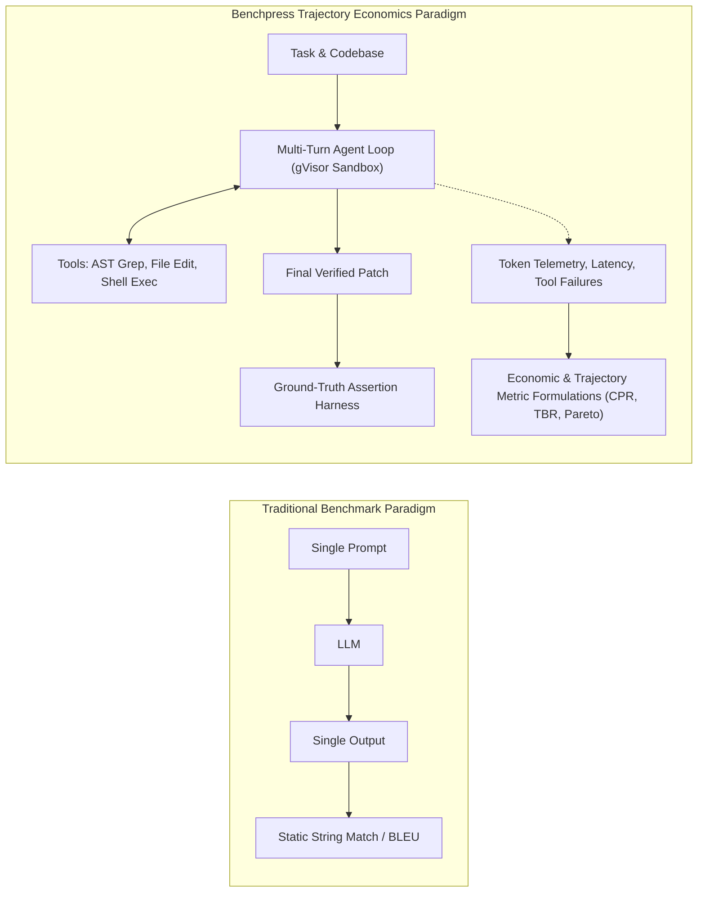

# Scientific Benchmark Methodology, Mathematical Formulations & Metrics

> **Document ID:** `BP-METH-001`  
> **Status:** Approved / Production  
> **Target Track:** Best Architectural Design & Scientific Rigor • Google Cloud All Things Agentic Hackathon (2026)

---

## 1. The Core Scientific Thesis

Static single-turn LLM benchmarks evaluate models in an artificial vacuum. When autonomous AI agents operate in production software engineering and financial workflows, performance is governed by **multi-turn trajectory dynamics**:

---

## 2. Formal Mathematical Formulations

### 2.1 Cost Per Resolution ($\text{CPR}$)

The fundamental economic metric of the agentic era is **Cost Per Resolution ($\text{CPR}$)**—the exact expected dollar expenditure required to produce a single ground-truth verified task resolution.

$$\text{CPR} = \frac{\sum_{t=1}^{T} \left( N_{\text{in}}^{(t)} \cdot P_{\text{in}} + N_{\text{out}}^{(t)} \cdot P_{\text{out}} + N_{\text{reason}}^{(t)} \cdot P_{\text{reason}} \right)}{\text{Pass@1}}$$

Where:
- $T$ = Total number of turns executed in the trajectory.
- $N_{\text{in}}^{(t)}, N_{\text{out}}^{(t)}, N_{\text{reason}}^{(t)}$ = Number of input, output, and internal reasoning/chain-of-thought tokens consumed during turn $t$.
- $P_{\text{in}}, P_{\text{out}}, P_{\text{reason}}$ = Official provider pricing per token (in USD) for the active model at turn $t$.
- $\text{Pass@1} \in \{0, 1\}$ = Binary indicator of whether all deterministic ground-truth unit tests passed.

> **Mathematical Consequence:** If a model achieves $100\%$ accuracy on a task with $\$0.20$ token spend, its $\text{CPR} = \$0.20$. If a cheaper model achieves only $25\%$ accuracy on the same task suite requiring 4 attempts to resolve, its effective $\text{CPR} = \frac{\$0.10}{0.25} = \$0.40$.

---

### 2.2 Trajectory Bloat Ratio ($\text{TBR}$)

Measures the cognitive efficiency and tool navigational discipline of an agentic model. It quantifies the proportion of tokens squandered on failed tool schemas, hallucinated function names, and repetitive unhelpful file reads.

$$\text{TBR} = \frac{\sum_{t \in \mathcal{E}_{\text{fail}}} N_{\text{tokens}}^{(t)} + \sum_{t \in \mathcal{E}_{\text{redundant}}} N_{\text{tokens}}^{(t)}}{\sum_{t=1}^{T} N_{\text{tokens}}^{(t)}}$$

Where:
- $\mathcal{E}_{\text{fail}}$ = Set of turns where tool validation failed, hallucinated tools were invoked, or AST syntax errors were introduced.
- $\mathcal{E}_{\text{redundant}}$ = Set of turns where identical read/grep operations were executed without state progress.
- A lean, optimal agent achieves $\text{TBR} < 0.10$ ($10\%$). A looping, undisciplined agent exhibits $\text{TBR} > 0.40$.

---

### 2.3 Context Degradation Rate ($\Delta_{\text{decay}}$)

Quantifies the rate at which an agent's reasoning accuracy decays as multi-turn scratchpad tokens accumulate in the context window.

$$\Delta_{\text{decay}} = - \frac{\partial \, \mathbb{P}(\text{Tool Signature Correctness})}{\partial \, C_{\text{tokens}}}$$

Empirically modeled via linear regression across turn horizons $t \in [1, K]$:

$$\mathbb{P}(\text{Success} \mid C) = \alpha - \beta \cdot \left( \frac{C_{\text{tokens}}}{\text{ContextLimit}} \right)^{\gamma}$$

Where $\beta$ represents the context decay coefficient and $\gamma$ models non-linear context cliff degradation.

---

### 2.4 Multi-Objective Pareto Efficiency Score ($\mathcal{P}_{\text{score}}$)

Ranks models across competing dimensions of accuracy, cost, and latency:

$$\mathcal{P}_{\text{score}} = w_{\text{acc}} \cdot \text{Pass@1} + w_{\text{cost}} \cdot \left( 1 - \frac{\text{CPR} - \text{CPR}_{\min}}{\text{CPR}_{\max} - \text{CPR}_{\min}} \right) + w_{\text{lat}} \cdot \left( 1 - \frac{\text{Latency} - \text{Lat}_{\min}}{\text{Lat}_{\max} - \text{Lat}_{\min}} \right)$$

Subject to:
$$w_{\text{acc}} + w_{\text{cost}} + w_{\text{lat}} = 1.0, \quad w_i \ge 0$$

---

## 3. Worked Mathematical Calculation Example

### Scenario: Resolving `django__django-11099` (SWE-bench Verified)

#### Model A: Monolithic Frontier Model (Claude 3.7 Sonnet)
- **Pricing:** $P_{\text{in}} = \$3.00 / 1\text{M tokens}$, $P_{\text{out}} = \$15.00 / 1\text{M tokens}$.
- **Trajectory Execution:**
  - 8 turns executed before resolution.
  - Cumulative Input Tokens: $184,000$ tokens.
  - Cumulative Output Tokens: $12,400$ tokens.
  - Tool Errors / Retries: 2 schema errors ($\text{Failed Tokens} = 34,000$).
  - Pass@1 Result: **PASSED (1.0)**.
- **Calculations:**
  $$\text{Total Cost} = (184,000 \cdot 3 \times 10^{-6}) + (12,400 \cdot 15 \times 10^{-6}) = \$0.552 + \$0.186 = \$0.738$$
  $$\text{CPR} = \frac{\$0.738}{1.0} = \mathbf{\$0.738}$$
  $$\text{TBR} = \frac{34,000}{196,400} = \mathbf{17.3\%}$$

#### Model B: Benchpress 2-Tiered Hybrid Route (Gemini 2.5 Pro + Gemini 3.5 Flash)
- **Pricing:**
  - Gemini 2.5 Pro (Turn 1 Planner): $P_{\text{in}} = \$1.25 / 1\text{M}$, $P_{\text{out}} = \$5.00 / 1\text{M}$.
  - Gemini 3.5 Flash (Turns 2-4 Coder): $P_{\text{in}} = \$0.075 / 1\text{M}$, $P_{\text{out}} = \$0.30 / 1\text{M}$.
- **Trajectory Execution:**
  - Turn 1 (2.5 Pro Planner): $14,000$ in / $800$ out $\rightarrow \$0.0175 + \$0.0040 = \$0.0215$.
  - Turns 2-4 (3.5 Flash Coder): $32,000$ in / $2,100$ out $\rightarrow \$0.0024 + \$0.0006 = \$0.0030$.
  - Tool Errors / Retries: 0 errors.
  - Pass@1 Result: **PASSED (1.0)**.
- **Calculations:**
  $$\text{Total Cost} = \$0.0215 + \$0.0030 = \mathbf{\$0.0245}$$
  $$\text{CPR} = \frac{\$0.0245}{1.0} = \mathbf{\$0.0245}$$
  $$\text{TBR} = \mathbf{0.0\%}$$
  $$\text{Cost Reduction} = \frac{\$0.738 - \$0.0245}{\$0.738} = \mathbf{96.7\% \text{ Cost Savings}}$$
