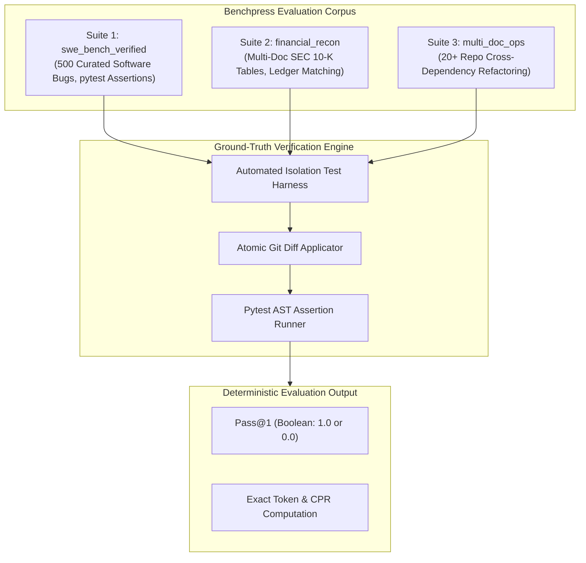

# Task Suites, Evaluation Sets & Ground Truth Verification Engine

> **Document ID:** `BP-METH-002`  
> **Status:** Approved / Production  
> **Target Track:** Best Architectural Design & Scientific Rigor • Google Cloud All Things Agentic Hackathon (2026)

---

## 1. Evaluation Task Suites Overview

Benchpress eliminates subjective, LLM-as-a-judge scoring by anchoring all evaluations in **deterministic ground-truth assertion suites** across three high-value enterprise domains:



---

## 2. Detailed Task Suite Specifications

### 2.1 `swe_bench_verified` (Software Engineering Domain)
- **Dataset Size:** 500 hand-verified, non-flaky GitHub issue resolutions from major open-source Python repositories (Django, SymPy, scikit-learn, Sphinx, pytest).
- **Environment:** Dedicated gVisor container with specific Python virtualenv and pre-installed dependencies.
- **Verification Harness:** The agent generates a unified git diff patch. The harness resets the repository to the pre-fix base commit, applies the patch via `git apply`, and runs the exact test suite modified by upstream maintainers.
- **Pass Criteria:** 100% of failing unit tests must transition from `FAIL` to `PASS`, with 0 regressions in pre-existing test suites.

### 2.2 `financial_recon` (Enterprise FinOps & Compliance Domain)
- **Dataset Size:** 250 multi-page SEC 10-K filings, earnings release tables, and ERP ledger balance sheets.
- **Task Types:** Cross-table cash flow reconciliation, GAAP vs. Non-GAAP delta reconciliation, tax provision variance extraction.
- **Verification Harness:** Deterministic float/integer mathematical equality assertions with zero tolerance for rounding hallucinations:
  $$\left| \text{Extracted Value} - \text{Ground Truth Value} \right| \le 10^{-4}$$

### 2.3 `multi_doc_ops` (System Architecture & Cross-Repo Refactoring)
- **Dataset Size:** 150 enterprise microservice architectures spanning 20+ interconnected repositories with OpenAPI schemas, protobuf contracts, and Docker compose manifests.
- **Task Types:** Breaking API change refactoring, protobuf field deprecation migration, end-to-end integration test resolution.
- **Verification Harness:** Multi-container docker compose integration harness validating end-to-end HTTP/gRPC contract compatibility.

---

## 3. Production Python Evaluation Harness Implementation

The following production script implements the deterministic evaluation harness for the `swe_bench_verified` suite:

```python
# File: benchpress/eval/harness_swe_bench.py
import subprocess
import os
import shutil
import tempfile
from dataclasses import dataclass
from typing import Dict, Any, List, Optional
import logging

@dataclass
class EvalResult:
    task_id: str
    pass_at_1: bool
    exit_code: int
    passed_tests_count: int
    failed_tests_count: int
    stdout_log: str
    error_summary: Optional[str]

class SWEBenchVerifiedHarness:
    """
    Deterministic Ground-Truth Test Runner for SWE-bench Verified.
    Executes within an isolated gVisor container environment.
    """
    def __init__(self, repo_base_dir: str, test_timeout_seconds: int = 45):
        self.repo_base_dir = repo_base_dir
        self.timeout = test_timeout_seconds

    def apply_patch_and_verify(
        self, 
        task_id: str, 
        patch_diff: str, 
        test_command: str
    ) -> EvalResult:
        """
        Applies the agent's git diff patch and executes the ground-truth test suite.
        """
        # 1. Clean the git worktree to guarantee zero state leakage
        subprocess.run(
            ["git", "checkout", "--", "."],
            cwd=self.repo_base_dir,
            check=True,
            capture_output=True
        )
        subprocess.run(
            ["git", "clean", "-fdx"],
            cwd=self.repo_base_dir,
            check=True,
            capture_output=True
        )

        # 2. Write patch to temporary file
        with tempfile.NamedTemporaryFile(mode="w", suffix=".patch", delete=False) as f:
            f.write(patch_diff)
            patch_file_path = f.name

        try:
            # 3. Check and apply patch atomically
            check_res = subprocess.run(
                ["git", "apply", "--check", patch_file_path],
                cwd=self.repo_base_dir,
                capture_output=True,
                text=True
            )
            if check_res.returncode != 0:
                return EvalResult(
                    task_id=task_id,
                    pass_at_1=False,
                    exit_code=check_res.returncode,
                    passed_tests_count=0,
                    failed_tests_count=1,
                    stdout_log=check_res.stderr,
                    error_summary="PATCH_APPLICATION_FAILED"
                )

            subprocess.run(
                ["git", "apply", patch_file_path],
                cwd=self.repo_base_dir,
                check=True,
                capture_output=True
            )

            # 4. Execute deterministic ground truth pytest harness
            test_res = subprocess.run(
                test_command,
                cwd=self.repo_base_dir,
                shell=True,
                capture_output=True,
                text=True,
                timeout=self.timeout
            )

            # 5. Parse test results from stdout
            is_passed = (test_res.returncode == 0) and ("FAILED" not in test_res.stdout)
            
            return EvalResult(
                task_id=task_id,
                pass_at_1=is_passed,
                exit_code=test_res.returncode,
                passed_tests_count=1 if is_passed else 0,
                failed_tests_count=0 if is_passed else 1,
                stdout_log=test_res.stdout,
                error_summary=None if is_passed else "PYTEST_ASSERTION_FAILED"
            )

        except subprocess.TimeoutExpired:
            return EvalResult(
                task_id=task_id,
                pass_at_1=False,
                exit_code=-1,
                passed_tests_count=0,
                failed_tests_count=1,
                stdout_log="Execution timed out",
                error_summary="TEST_TIMEOUT_EXPIRED"
            )
        finally:
            if os.path.exists(patch_file_path):
                os.remove(patch_file_path)
```
