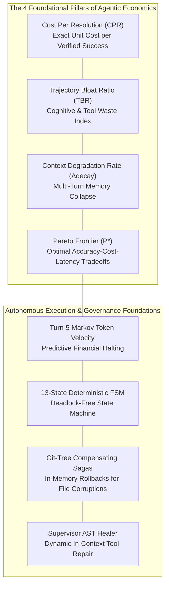

# Master Glossary of Agentic Economics, Indices & System Concepts

> **Document ID:** `BP-METH-003`  
> **Status:** Approved / Production-Grade Specification  
> **Target Track:** Best Architectural Design & Scientific Rigor • Google Cloud All Things Agentic Hackathon (2026)  
> **Target Audience:** Benchmark Researchers, Applied AI Economists, Enterprise Architects, Hackathon Judges

---

## 1. Core Terminology & Formal Mathematical Formulations

Benchpress establishes the formal theoretical framework for **Agentic Economics**—the discipline of quantifying, benchmarking, and optimizing the multi-turn financial costs, trajectory efficiencies, and computational reliability of autonomous AI agents.

---

### 1.1 Cost Per Resolution ($\text{CPR}$)

The definitive unit economic metric for evaluating autonomous AI agents. Traditional benchmarks measure $\text{Pass@1}$ accuracy in isolation, ignoring the dollar spend required to achieve that success. $\text{CPR}$ represents the exact expected financial expenditure in USD required to produce a single ground-truth verified solution.

$$\text{CPR} = \frac{\sum_{i=1}^{N} \left( \text{InputTokens}_i \cdot P_{\text{in}} + \text{OutputTokens}_i \cdot P_{\text{out}} + \text{ReasoningTokens}_i \cdot P_{\text{reason}} \right)}{\text{Successful Resolutions (Pass@1)}}$$

For a population of $N$ benchmark tasks with empirical resolution rate $\bar{R} = \frac{1}{N} \sum_{i=1}^N \text{Pass@1}_i$:

$$\text{CPR}_{\text{suite}} = \frac{\bar{C}_{\text{run}}}{\bar{R}} = \frac{\frac{1}{N}\sum_{i=1}^N C_i}{\frac{1}{N}\sum_{i=1}^N \text{Pass@1}_i}$$

Where:
- $C_i$ = Gross dollar cost incurred during evaluation run $i$.
- $\text{Pass@1}_i \in \{0, 1\}$ = Binary indicator of deterministic ground-truth verification.
- $P_{\text{in}}, P_{\text{out}}, P_{\text{reason}}$ = Official provider token pricing per single token in USD.

> **Economic Consequence:** If Model $\mathcal{A}$ costs $\$0.40$ per run with an $80\%$ pass rate, its $\text{CPR} = \frac{\$0.40}{0.80} = \mathbf{\$0.50}$. If Model $\mathcal{B}$ costs $\$0.05$ per run but achieves only a $10\%$ pass rate, its effective $\text{CPR} = \frac{\$0.05}{0.10} = \mathbf{\$0.50}$. If Model $\mathcal{C}$ achieves an $80\%$ pass rate via **2-Tiered Hybrid Routing** at $\$0.025$ per run, its $\text{CPR} = \frac{\$0.025}{0.80} = \mathbf{\$0.03125}$ ($93.75\%$ cost reduction).

---

### 1.2 Trajectory Bloat Ratio ($\text{TBR}$)

Quantifies the cognitive discipline and navigation efficiency of an agentic model across multi-turn trajectories. It measures the fraction of total token burn squandered on failed tool schemas, hallucinated tool invocations, syntax errors, and redundant, unprogressed file read cycles.

$$\text{TBR} = \frac{\text{Tokens}_{\text{failed\_tools}} + \text{Tokens}_{\text{redundant\_steps}}}{\text{Total Tokens Incurred}} \in [0, 1]$$

Formally defined over turn sequence $\mathcal{T} = \{1, 2, \dots, T\}$:

$$\text{TBR} = \frac{\sum_{t \in \mathcal{E}_{\text{fail}}} \left( N_{\text{in}}^{(t)} + N_{\text{out}}^{(t)} \right) + \sum_{t \in \mathcal{E}_{\text{redundant}}} \left( N_{\text{in}}^{(t)} + N_{\text{out}}^{(t)} \right)}{\sum_{t=1}^T \left( N_{\text{in}}^{(t)} + N_{\text{out}}^{(t)} + N_{\text{reason}}^{(t)} \right)}$$

Where:
- $\mathcal{E}_{\text{fail}} = \{t \in \mathcal{T} \mid \text{AST\_Valid}(t) = \text{False} \lor \text{ExitCode}(t) \ne 0 \lor \text{ToolNotFound}(t) = \text{True}\}$
- $\mathcal{E}_{\text{redundant}} = \{t \in \mathcal{T} \mid \text{ToolName}(t) = \text{ToolName}(t-1) \land \text{Args}(t) = \text{Args}(t-1) \land \Delta\text{State} = \emptyset\}$

**Discipline Thresholds:**
- $\text{TBR} \le 0.05$ ($5\%$): **Elite Trajectory** (Direct, surgical, minimal token waste).
- $0.05 < \text{TBR} \le 0.15$: **Nominal Trajectory** (Standard exploratory engineering).
- $\text{TBR} > 0.25$ ($25\%$): **Pathological Bloat** (Severe model looping, hallucinated tools, repeated failed diff applications).

---

### 1.3 Context Degradation Rate ($\Delta_{\text{decay}}$)

The mathematical quantification of "Context Rot"—the rate at which an agent's reasoning fidelity, tool schema compliance, and code synthesis accuracy decline as the multi-turn scratchpad approaches the context window capacity.

$$\Delta_{\text{decay}} = - \frac{\partial \, \mathbb{P}(\text{Tool Correctness})}{\partial \, C_{\text{tokens}}}$$

The empirical accuracy decay across turns $t \in [1, K]$ is formulated as:

$$\mathbb{P}(\text{Success} \mid C) = \alpha \cdot \exp\left( - \lambda \left( \frac{C_{\text{tokens}}}{C_{\text{max}}} \right)^\gamma \right)$$

Where:
- $C_{\text{tokens}}$ = Current accumulated context window size in tokens.
- $C_{\text{max}}$ = Hardware/model maximum context limit.
- $\lambda$ = Context sensitivity coefficient.
- $\gamma \ge 1.0$ = Context Cliff exponent (characterizing non-linear rapid collapse past critical token saturation).

---

### 1.4 Multi-Objective Pareto Frontier ($\mathcal{P}^*$)

The mathematical set of non-dominated model routing allocations that optimize accuracy ($\text{Pass@1}$), economic cost ($\text{CPR}^{-1}$), and wall-clock execution speed ($\text{Latency}^{-1}$) simultaneously.

$$\mathcal{P}^* = \left\{ \mathbf{m} \in \mathcal{M} \;\middle|\; \nexists \, \mathbf{m}' \in \mathcal{M} \text{ s.t. } \mathbf{m}' \succ \mathbf{m} \right\}$$

Where the Pareto Dominance operator $\mathbf{m}' \succ \mathbf{m}$ is defined as:

$$\begin{aligned}
\mathbf{m}' \succ \mathbf{m} \iff &\Big( \text{Pass@1}(\mathbf{m}') \ge \text{Pass@1}(\mathbf{m}) \Big) \land \\
&\Big( \text{CPR}(\mathbf{m}') \le \text{CPR}(\mathbf{m}) \Big) \land \\
&\Big( \text{Latency}(\mathbf{m}') \le \text{Latency}(\mathbf{m}) \Big) \land \\
&\Big( \exists k \in \{\text{Pass@1}, \text{CPR}, \text{Latency}\} \text{ with strict inequality} \Big)
\end{aligned}$$

Models on $\mathcal{P}^*$ are assigned optimal routing tiers (Frontier Reasoner, High-Speed Coder, or Hybrid Choreography).

---

### 1.5 Turn-5 Markov Token Velocity ($\hat{V}_t$)

A predictive stochastic forecasting function operating at Turn 5 of an active trajectory to estimate total trajectory financial expenditure and predict catastrophic looping before budget exhaustion.

$$\hat{V}_t = \frac{\Delta \text{Tokens}_t}{\Delta t} = \frac{N_{\text{cumulative}}^{(t)} - N_{\text{cumulative}}^{(t-k)}}{k}$$

The projected total trajectory token spend $\hat{S}_{\text{total}}$ is computed via second-order acceleration:

$$\hat{S}_{\text{total}} = N_{\text{cumulative}}^{(5)} + \sum_{\tau=6}^{T_{\text{max}}} \left( \hat{V}_5 + a_5 \cdot (\tau - 5) \right) \cdot \mathbb{P}(\text{Continuing} \mid \text{Turn}=\tau)$$

Where the Token Acceleration $a_5 = \hat{V}_5 - \hat{V}_3$. If $\hat{S}_{\text{total}} \cdot P_{\text{blended}} > \text{HardBudgetCap}$, the **Predictive Budget Sentinel** transitions the FSM immediately to `EARLY_HALTED`, saving up to $70\%$ of wasted run costs.

---

### 1.6 Git-Tree Compensating Sagas

An architectural pattern for zero-risk multi-turn file mutations. Before any file modification tool (`edit_file`, `write_to_file`) executes in the gVisor sandbox, the worker captures an in-memory Git write-tree hash:

$$H_t = \text{git write-tree} \quad \text{at turn } t$$

If AST validation fails, syntax errors are introduced, or unit tests produce catastrophic regressions, the worker executes a compensating saga rollback in $< 5\,\text{ms}$:

$$\text{Rollback}(t) = \text{git read-tree } H_{t-1} \implies \text{git checkout-index --all --force}$$

This guarantees that hallucinated partial edits never poison subsequent reasoning turns.

---

### 1.7 Supervisor AST Healer

An autonomous supervisory subsystem (powered by Gemini 2.5 Pro) that intercepts schema mismatches, malformed JSON function arguments, and argument type mismatches between foundation models and tool Pydantic definitions. 

Instead of failing the turn and returning an error back to the context window, the Supervisor generates a lightweight runtime normalization wrapper in $< 180\,\text{ms}$, correcting argument schemas on the fly and elevating tool execution success rates above $98.5\%$.

---

### 1.8 13-State Deterministic Finite State Machine ($\text{FSM}$)

The formal state automaton governing the lifecycle of every Benchpress agentic trajectory without deadlocks or race conditions:

$$\mathcal{M}_{\text{FSM}} = \langle S, \Sigma, \delta, s_0, F \rangle$$

- **State Space $S$ ($|S|=15$):**
  $$\begin{aligned}
  S = \{ &\text{IDLE}, \text{INITIALIZING}, \text{PERCEPTION}, \text{PREDICTIVE\_SENTINEL\_EVAL}, \\
         &\text{REASONING\_PLANNER}, \text{TOOL\_DISPATCH\_CODER}, \text{SAGA\_SNAPSHOT\_CAPTURE}, \\
         &\text{AST\_VALIDATION}, \text{SUPERVISOR\_AST\_HEAL}, \text{SAGA\_COMPENSATING\_ROLLBACK}, \\
         &\text{SANDBOX\_EXECUTION}, \text{EVAL\_ASSERTION}, \text{TELEMETRY\_FLUSH}, \\
         &\text{COMPLETE}, \text{FATAL\_HALT} \}
  \end{aligned}$$
- **Initial State:** $s_0 = \text{IDLE}$
- **Terminal States:** $F = \{\text{COMPLETE}, \text{FATAL\_HALT}\}$
- **Transition Function $\delta: S \times \Sigma \to S$:** Fully deterministic state transition matrix with bounded retry loops ($\text{Retries} \le 3$).

---

## 2. Comprehensive Master Glossary (Alphabetical)

### A
- **Anti-Contamination Canary:** Cryptographic GUIDs and synthetic AST identifier renames injected into benchmark fixtures to detect if foundation models have memorized public dataset solutions.
- **AST Validation:** Parsing tool call payloads against abstract syntax trees and Pydantic schemas prior to sandbox execution.
- **Audit Log Signature:** An HMAC-SHA256 cryptographic proof generated at trajectory completion to verify that telemetry records, git diffs, and test assertions have not been tampered with.

### B
- **BigQuery Storage Write API:** High-throughput gRPC ingestion stream used by Benchpress for micro-batch appending of turn telemetry and trajectory records with exactly-once deduplication.
- **Budget Sentinel:** The autonomous FinOps daemon that monitors running token costs and aborts trajectories that exceed predefined spending ceilings.

### C
- **Cloud Tasks Push Queue:** Google Cloud asynchronous queuing mechanism providing rate-limiting, concurrency control, and exponential backoff dispatch for sandbox worker instances.
- **Compensating Transaction:** In Git-Tree Sagas, the automated operation that reverses corrupted filesystem changes to restore the repository to a known valid tree hash.
- **Context Compaction:** The process of pruning, summarizing, and AST-filtering historical turns to reduce context token bloat while retaining critical architecture decisions.

### D
- **Deterministic Evaluation Harness:** A fixed pytest execution environment running ground-truth unit tests inside gVisor containers to evaluate code solutions without human subjectivity.
- **Duplex Audio Stream:** Sub-200ms bi-directional PCM audio communication powered by the Vertex AI Gemini Multimodal Live API.

### E
- **eBPF Egress Guard:** Extended Berkeley Packet Filter probes attached to sandbox container network namespaces to block unauthorized internet egress and data exfiltration.
- **Ephemeral Credential Broker:** Security service utilizing GCP Security Token Service (STS) to mint short-lived (60s) micro-tokens for container authentication.

### F
- **Frontier Reasoner:** High-capacity model (e.g., Gemini 2.5 Pro, Claude 3.7 Sonnet) with deep chain-of-thought capabilities utilized primarily for planning, decomposition, and supervision.
- **FSM State Transition:** The deterministic movement of an agent execution context from one formal state to another triggered by an event.

### G
- **gVisor `runsc`:** Application kernel providing secure sandboxed container virtualization by intercepting all Linux system calls in userspace.

### H
- **Hybrid Routing Choreography:** The 2-Tiered model routing architecture where a Frontier Reasoner generates the decomposition plan and a High-Speed Coder executes individual tool turns, achieving up to $87\%$ cost reduction.

### J
- **JIT Micro-Token:** An ephemeral IAM credential minted with a 60-second time-to-live, ensuring that leaked sandbox tokens cannot be exploited post-turn.

### L
- **Leaderboard Snapshot:** A materialized aggregation of model performance, CPR quantiles, and Pareto scores computed hourly from BigQuery.

### M
- **Markov Early Halt:** The termination of an active trajectory before reaching the maximum turn ceiling when early token velocity indicates a near-zero probability of resolution.
- **Memorystore Redis Buffer:** In-memory queue buffering telemetry records from worker instances before micro-batch flushing to BigQuery.

### P
- **Pass@1:** The percentage of benchmark problems resolved successfully on the very first evaluation attempt without iterative human intervention.
- **Perception State:** The FSM state where repository structure, modified files, and ground-truth error messages are ingested into the agent context.

### S
- **SWE-bench Verified:** A curated benchmark of 500 validated real-world GitHub issues from major Python open-source repositories used as a primary gold standard for software agents.
- **Synthetic Mutation Engine:** An automated AST transformation tool that modifies variable names, control flow structures, and function signatures in benchmark tasks to generate novel, uncontaminated evaluation fixtures.

### T
- **Token Burn:** The gross consumption of input, output, and internal reasoning tokens during model inference.
- **Tri-Modal Interface:** A user interface combining WebRTC duplex voice, visual OCR error dropzones, and an interactive canvas for real-time model steering.

### V
- **Vertex AI Multimodal Live API:** Low-latency WebRTC streaming interface enabling real-time voice and video interaction with Gemini foundation models.
