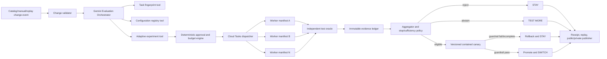
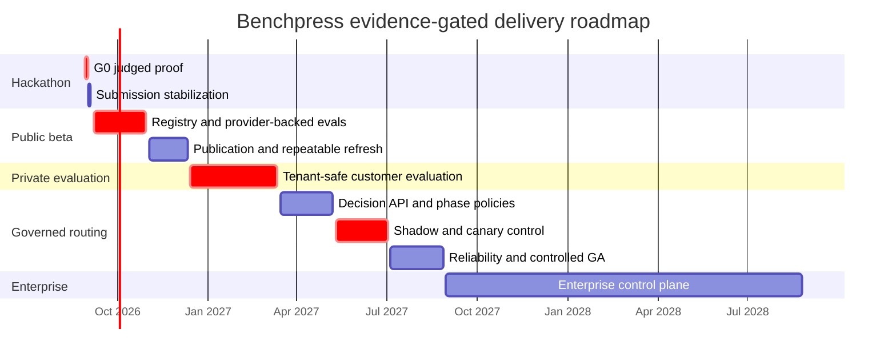

# Benchpress master build roadmap: autonomous model-change decisions

> **Document ID:** `BP-PLAN-000`  
> **Status:** Authoritative execution roadmap  
> **Created:** 2026-08-29  
> **Planning horizon:** Hackathon submission through 24 months after submission  
> **Supersedes for scheduling:** The dates, sprint ordering, and execution priorities in older planning documents  
> **Does not supersede:** The implementation-status inventory, hackathon rules, evaluation methodology, security requirements, or evidence/claims policy  
> **Hackathon deadline assumed from the repository:** 2026-08-31 17:00 PDT / 2026-09-01 02:00 SAST

## 1. Executive direction

Benchpress will be built around one outcome:

> **Benchpress autonomously detects AI model, reasoning, capability, and pricing changes; designs the smallest experiment needed to compare them with a team’s current configuration; rejects candidates that fail real workflows; and publishes a verifiable `STAY`, `TEST MORE`, or `SWITCH` decision—with contained canary promotion and rollback before engineering teams risk production quality or spend.**

This direction makes Benchpress an **evidence and policy-decision layer**, not a generic benchmark leaderboard, opaque router, coding-agent swarm, or FinOps dashboard.

The product loop is:

```text
Detect a relevant change
  -> identify the exact current baseline
  -> fingerprint the affected workload and workflow phase
  -> design the smallest discriminating experiment
  -> approve immutable manifests, budget, and stop rules
  -> execute controlled parallel runs
  -> verify with independent deterministic oracles
  -> reject, abstain, or create a candidate policy
  -> run a contained canary
  -> promote or roll back
  -> publish a signed/versioned decision receipt and replay
  -> monitor staleness and delayed regressions
```

Every terminal result becomes one public decision:

| Internal outcome | Public decision | Required behavior |
|---|---|---|
| Candidate fails quality/safety, is dominated, or rolls back; baseline remains eligible | `STAY` | Keep the current configuration and publish why the candidate lost |
| Evidence is insufficient, tied, stale, incompatible, or operationally incomplete | `TEST MORE` | Keep the current configuration and publish the smallest bounded next experiment |
| Candidate passes evidence thresholds and the contained canary | `SWITCH` | Publish the eligible candidate, scope, adoption conditions, and rollback receipt |

The smallest valuable release is not “a leaderboard with more models.” It is one trustworthy, replayable decision against a declared current configuration.

## 2. How to use this roadmap

This document is the execution layer that joins the repository’s product, architecture, evaluation, design, governance, implementation, telemetry, research, community, and commercialization material.

Planning rules:

1. **Gates override dates.** A calendar milestone is a forecast; its evidence gate is the release condition.
2. **Truth precedes polish.** A real narrow path outranks a broad simulated surface.
3. **The baseline is mandatory.** Benchpress cannot recommend a switch without naming the current model/configuration or compatible fresh evidence for it.
4. **The model proposes; deterministic code controls.** Gemini may design a bounded experiment and explain evidence. It may not set its own spend ceiling, rewrite test outcomes, force a winner, or promote itself.
5. **Workers are jobs, not peer agents.** One Evaluation Orchestrator owns the workflow; Cloud Tasks workers execute immutable manifests.
6. **Failure is a product result.** Rejection, abstention, staleness, and rollback must be visible, retained, and publishable.
7. **All incurred cost stays in the ledger.** Early stopping may cancel future work but never hide failed attempts, retries, or spent tokens/compute.
8. **Public facts and measured results remain separate.** Provider specifications never become Benchpress performance claims.
9. **No production traffic before Gate G3.** The hackathon canary is confined to a demo route and proves lifecycle mechanics only.
10. **Scope expands only after proof.** Multi-provider depth, private repositories, phase-aware routing, enterprise controls, multimodal UX, and specialist agents follow the core loop.

## 3. Baseline, target, and planning assumptions

### 3.1 Repository baseline on 2026-08-29

The repository is a substantial prototype with reusable components:

- Next.js web application with model, comparison, trajectory, Pareto, arbitrage, custom-evaluation, and live surfaces.
- Python worker with a formal FSM, tool registry, sandbox abstractions, telemetry hooks, safeguards, and tests.
- TypeScript and Python SDK shapes.
- Cloud Tasks and Firestore abstractions.
- BigQuery/telemetry designs and two competing Terraform trees.
- Evaluation fixtures, deterministic pytest checks, anti-contamination concepts, and a simulated continuous harvester.
- Detailed architecture, security, privacy, deployment, API, UX, research, and commercialization documentation.

The judged decision loop is not yet demonstrated end to end. Current blockers include simulated model behavior, fixture-backed model metrics, mock-fallback cloud scripts, incomplete authentication/durable ownership, unverified Cloud Run/Tasks/data-plane execution, one known rollback test failure, and a dependency-environment build issue.

### 3.2 Delivery assumptions

- Hackathon work uses a compressed, risk-first schedule ending before the documented submission deadline.
- Post-hackathon delivery uses two-week sprints, four-sprint release trains, and evidence-gated releases.
- The base capacity model is a small three-person product-engineering team:
  - **Product/Evaluation Lead:** product scope, experiment policy, task cohorts, claims, customer discovery.
  - **Platform/Cloud Lead:** orchestrator, workers, ledger, provider adapters, Cloud Run/Tasks, security and reliability.
  - **Product/Data Engineer:** web/API/SDK, decision UX, aggregation, replay, analytics, developer experience.
- Security, statistical review, design, and legal/compliance are explicit review responsibilities even when a founder temporarily carries them.
- A solo-founder schedule should preserve the gates and approximately double or triple post-hackathon elapsed time. It should cut parallel polish, provider breadth, and integrations before weakening evidence controls.
- Exact provider prices, model IDs, quotas, and hackathon requirements must be revalidated at implementation time; versioned official sources are part of the product record.

### 3.3 Planning status vocabulary

| Status | Meaning in this roadmap |
|---|---|
| **Demonstrated** | Executed end to end with retained evidence |
| **Implemented, unverified** | Code exists but cloud or real-provider evidence is missing |
| **Prototype** | Depends on fixtures, mocks, hard-coded choices, or incomplete controls |
| **Planned** | Approved for a named phase but not implemented |
| **Conditional** | Starts only if an explicit evidence or demand gate passes |
| **Rejected** | Must not be built in the described form |

## 4. Product boundaries and capability disposition

### 4.1 Core product—build in this order

1. Change intelligence and a source-backed model/configuration registry.
2. Mandatory current-baseline capture.
3. Workload and workflow-phase fingerprinting.
4. Adaptive minimum-experiment design.
5. Deterministic budget, compatibility, idempotency, and evidence approval.
6. Controlled provider-backed execution and independent verification.
7. Immutable run/evidence ledger and versioned aggregates.
8. Rejection, early stopping, abstention, and staleness policy.
9. Versioned candidate policy, contained canary, promotion, and rollback.
10. Public/private decision publication, receipt, replay, API, and Switch Decision Card.
11. Continuous monitoring and targeted refresh.
12. Customer-specific evaluation and, later, governed routing control.

### 4.2 Preserve, defer, or reject

| Existing idea or asset | Disposition | Earliest phase | Required proof before expansion |
|---|---|---:|---|
| Public model/configuration explorer | Core | Hackathon | Reads provenance-labelled official/fixture/measured records |
| Cost Per Resolution and full-attempt economics | Core | Hackathon | Actual usage, failure-inclusive denominator, price version, compute/tool costs |
| Pareto comparison | Core | Hackathon | Compatible cohorts and declared constraints |
| Switch Decision Card | Core | Hackathon | Reads a versioned decision against an explicit baseline |
| Trajectory replay | Core | Hackathon | Reconstructs state from stored events; no hidden chain-of-thought |
| Reasoning/thinking prescriber | Core | Hackathon–Beta | Exact provider-native configuration, not false cross-provider equivalence |
| Sequential stopping and “why not cheapest?” | Core | Hackathon | Predeclared rules and retained incurred cost |
| Budget/turn/retry/time breaker | Core safeguard | Hackathon | Deterministic negative tests |
| Phase-aware planner/executor/reviewer policies | Strategic extension | Months 6–12 | End-to-end handoff, repeated-context, replanning, escalation, and failure economics |
| IDE/SDK/gateway delivery | Strategic extension | Months 3–12 | Stable decision contract and customer demand |
| Private repository evaluation | Paid core | Months 3–6 | Isolation, retention, redaction, consent, customer-defined oracle |
| Model outage fallback | Later reliability feature | Months 6–12 | Compatibility and health tests; no unsupported predictive claim |
| Prompt caching and context optimization | Opt-in research | Months 6–12 | Provider-specific net-benefit experiment |
| Multimodal voice/vision | Deferred UX option | After Gate G2 | Demonstrated customer need and reliable real integration |
| Crash-to-PR remediation | Deferred adjacent product | After Gate G2 | Explicit repository authority, real PR proof, independent tests, no auto-merge |
| Specialist agents | Conditional architecture | After Gate G3 | Distinct permissions/context and measured advantage over one orchestrator |
| Trajectory distillation | Conditional research | After Gate G4 | Consent, licensing, privacy, provenance, reliable labels, customer need |
| Enterprise VPC/CMEK/appliance | Enterprise phase | Months 12–24 | Paid demand and deployed/audited controls |
| Automatic destructive Git rollback | Rejected | Never | Use isolated worktrees/snapshots and bounded policy rollback instead |
| Guaranteed zero-loss context pruning | Rejected | Never as a claim | Only measured, opt-in transformations with fallback |
| Universal automatic model substitution | Rejected | Never | Every route requires compatibility and evidence |
| Cross-tenant semantic answer reuse | Rejected by default | Research only | Tenant scope, authorization, provenance, freshness, consent |
| Generated tests proving generated patches | Rejected | Never | Independent existing/hidden/customer-approved oracles required |
| Undisclosed sponsored ranking influence | Rejected | Never | Funding disclosure and editorial/evaluation independence |

## 5. Target operating architecture

### 5.1 Demonstrated critical path



### 5.2 Authority boundaries

| Component | Owns | Cannot do |
|---|---|---|
| Evaluation Orchestrator | Interpret change, select tools, propose bounded experiment, explain final evidence | Override budgets/tests, invent results, mutate global policy directly |
| Registry collector | Fetch and version official facts | Infer benchmark quality from provider claims |
| Budget/policy engine | Compatibility, hard ceilings, idempotency, threshold approval | Let model-authored arithmetic bypass rules |
| Benchmark worker | Execute one immutable manifest and record raw evidence | Broaden tool scope, publish a recommendation, change active policy |
| Test oracle | Run frozen independent assertions | Use the evaluated model as its sole judge |
| Aggregator | Compute resolution, CPR, latency, confidence, Pareto membership | Hide attempts or mix incompatible evidence |
| Canary controller | Version candidate, route contained slice, compare guardrails, roll back | Change customer production traffic before Gate G3 |
| Publisher | Publish versioned decisions, receipts, replay, staleness | Replace measured evidence silently or overwrite history |

### 5.3 Canonical lifecycle

```text
RECEIVED
  -> VALIDATING_CHANGE
  -> FINGERPRINTING_TASK
  -> PLANNING_ADAPTIVE_EXPERIMENT
  -> CHECKING_BUDGET
  -> DISPATCHING
  -> WAITING_FOR_RESULTS
  -> APPLYING_STOP_RULES
  -> AGGREGATING
  -> CHECKING_EVIDENCE_SUFFICIENCY
  -> REJECTED | ABSTAINED | CANDIDATE_CREATED
  -> CANARY_RUNNING
  -> VERIFYING
  -> ROLLED_BACK | RECOMMENDED
  -> PUBLISHING_RECEIPT
  -> COMPLETE
```

Required terminal alternatives include unsupported configuration, invalid source, authentication failure, infrastructure failure, partial failure, budget exhaustion, quality/safety rejection, and insufficient evidence.

## 6. Work breakdown structure and epics

The IDs below are the canonical backlog prefixes for issues, commits, tests, and evidence artifacts.

| Epic | Outcome | Major deliverables | Exit evidence |
|---|---|---|---|
| `BP-01 Change Intelligence` | Detect relevant model/price/capability/reasoning changes | Source snapshots, checksums, parsers, diff events, review state | Replayed and one live/official-source diff produce immutable events |
| `BP-02 Registry` | Know exact provider/model/configuration/price versions | Provider, model, price, native-control schemas; source links; freshness | Unsupported native settings fail closed; alias/price version is traceable |
| `BP-03 Baseline & Fingerprint` | Compare the right thing to the team’s real current state | Baseline policy version, workload/task/repository/tool/risk/latency/workflow-phase fingerprint | Missing baseline is rejected; fingerprint is versioned and reproducible |
| `BP-04 Experiment Designer` | Buy the smallest useful evidence | Gemini structured tools, discriminating cohort selection, rationale, maximum matrix | Selected subset is smaller than supported domain and includes baseline |
| `BP-05 Deterministic Approval` | Bound cost and authority | Compatibility validation, worst-case budget, stop/evidence rules, unique run keys | Over-budget, duplicate, unsupported, and malformed plans fail closed |
| `BP-06 Execution Plane` | Run immutable experiments reliably | Authenticated Cloud Tasks, Cloud Run workers, provider adapter, retry taxonomy, sandbox scope | Correlation ID and manifest connect task, worker, provider call, and result |
| `BP-07 Outcome Oracle` | Reject configurations that fail real workflows | Frozen 3–10 task cohort, test commands, exit codes, hidden/independent assertions, failure taxonomy | Cheapest candidate can be rejected by a declared quality/safety boundary |
| `BP-08 Evidence Ledger` | Make every claim reproducible | Append-only events/runs, actual usage, all attempts, cost inputs, exclusions, hashes | One run reconstructs completely from retained artifacts |
| `BP-09 Decision Science` | Reject, stop, abstain, or advance without forcing winners | CPR, resolution, latency, confidence, Pareto, early stopping, evidence sufficiency | Deterministic tests cover `REJECT`, `ABSTAIN`, dominance, and incomplete cohort |
| `BP-10 Policy & Canary` | Protect the baseline before recommending change | Immutable policy versions, contained slice, quality/cost/latency/infra guardrails, atomic rollback | Both promotion and rollback paths are tested and replayable |
| `BP-11 Publisher & Replay` | Turn evidence into a verifiable decision | Decision receipt, public/private views, replay timeline, signed/exportable artifacts | Every terminal outcome publishes exactly one decision and preserves history |
| `BP-12 Decision UX/API/SDK` | Deliver evidence at research and adoption time | Switch Decision Card, “why,” “why not cheapest,” “what reverses it,” API and SDK envelope | UI and clients render all three decisions and truth labels |
| `BP-13 Staleness & Refresh` | Prevent obsolete recommendations from remaining current | Dependency graph, invalidation events, queued targeted refresh, delayed-regression handling | Alias/price/tool/task/harness/oracle change revokes default eligibility |
| `BP-14 Trust & Security` | Bound data, credentials, tools, tenants, and destructive action | Authentication, least privilege, redaction, audit, kill switch, retention/deletion, negative tests | No non-mock unauthenticated work; secrets absent from persisted/published evidence |
| `BP-15 Cloud & Reliability` | Operate a reproducible service | One Terraform source, environments, CI/CD, logs/metrics/traces, SLOs, backup/recovery | Clean deploy, smoke test, retry/idempotency proof, rollback runbook |
| `BP-16 Claims & Submission` | Make the judged product easy to verify | README, architecture diagram, demo, Devpost, evidence package, fixture labels | Claim audit passes and submission is frozen/tagged |
| `BP-17 Public Beta` | Expand trustworthy public measurement | Multi-provider adapters, certified cohorts, exports, methodology pages | One detected provider change completes a targeted refresh automatically |
| `BP-18 Private Evaluation` | Prove customer-specific value safely | Tenancy, BYOK/customer cloud, private repo/task ingestion, custom oracles, dashboards | Design partner gets a reproducible recommendation without production routing |
| `BP-19 Governed Routing` | Move from recommendation to bounded operational control | Gateway/framework adapters, shadow traffic, randomized canaries, drift/SLO rollback | Customer-approved policy survives shadow and staged rollout |
| `BP-20 Enterprise Control` | Support regulated multi-team use | Org policies, identity-scoped tools, residency, CMEK/private networking, audit/delete integrations | Controls are deployed, tested, and audited before claims or enterprise GA |

## 7. Master timeline and release gates



| Gate | Target window | Required evidence | Unlocks |
|---|---|---|---|
| `G0 Hackathon proof` | By 2026-09-01 02:00 SAST | One real, correlated, bounded loop from change/replay to published decision and canary outcome | Truthful public prototype and submission |
| `G1 Trusted public beta` | By 2026-12-11 | Provider-backed registry, real cohorts, provenance, staleness, repeatable targeted refresh | Public measurement product |
| `G2 Customer proof` | By 2027-03-12 | Tenant-safe private evaluation and evidence of design-partner value | Paid/private evaluation business |
| `G3 Safe policy control` | By 2027-08-27 | Shadow/canary evidence, policy versions, customer-approved rollback, operational SLOs | Bounded production routing/control |
| `G4 Enterprise readiness` | By 2028-08-25 | Tenant isolation, identity, privacy, residency, audit, recovery, deployed control evidence | Enterprise GA/contract claims |
| `G5 Data advantage` | Continuous after G2 | Large consented, versioned, outcome-labelled corpus and causal policy evaluation | Defensible learning and selective automation |

## 8. Phase H—hackathon critical path

### 8.1 Hackathon objective and non-negotiable cut line

The hackathon proves one narrow Taskmaster workflow. It does not prove universal provider coverage, production routing, a multi-agent fleet, formal compliance, live multimodal UX, or the historical savings percentages.

The build is eligible for submission only if the same correlation ID connects:

```text
event -> baseline/fingerprint -> Gemini tool decision -> approved plan
-> Cloud Tasks jobs -> Cloud Run worker/provider usage -> tests
-> aggregate/stop decision -> canary/promotion or rollback
-> receipt/replay -> public STAY, TEST MORE, or SWITCH
```

If time compresses, cut in this order:

1. Optional Gemma/public-content/social bonus.
2. Non-core visual polish and animations.
3. Extra task/configuration breadth beyond the minimum discriminating cohort.
4. BigQuery if Firestore can retain the complete judged record truthfully.
5. Automatic external change polling; retain an explicitly labelled replay event.

Never cut the real Gemini call, allowed Google framework evidence, cloud execution proof, baseline, actual usage, independent tests, cheapest-candidate rejection, abstention path, canary/rollback, receipt/replay, fixture labels, or claim audit.

### 8.2 Compressed hackathon mini-sprints

The timeboxes below are ordered by dependency. If work starts later, keep the order and use the cut list above.

| Mini-sprint | Target window (SAST) | Primary epics | Deliverable | Exit check |
|---|---|---|---|---|
| `H0 Scope and evidence freeze` | Aug 29, first 3 hours | BP-03, BP-16 | Freeze demo event, current baseline, 3–5 tasks, 2–3 native configurations, guardrails, max spend, correlation-ID format, evidence folder | Written demo manifest; all fixture pages identified; no unsupported submission claim |
| `H1 Contracts and real orchestrator` | Aug 29, next 8 hours | BP-02–05 | Schemas for change, fingerprint, configuration, plan, run manifest, stop/evidence rules; genuine Gemini 3.5+ structured-tool decision | Retained model ID, request metadata, usage, tool calls, and deterministic plan approval |
| `H2 Durable execution and ledger` | Aug 29–30, next 10 hours | BP-06–08 | Authenticated/idempotent Cloud Tasks dispatch, Cloud Run worker, provider call, test oracle, append-only run records | Duplicate delivery returns existing run; actual usage and test exit codes persist |
| `H3 Aggregation and safe decisions` | Aug 30, next 8 hours | BP-09 | Failure-inclusive CPR/resolution/latency, dominance/stop rules, sufficiency, reject/abstain mapping | Tests show cheapest candidate rejection, incomplete cohort protection, and `TEST MORE` |
| `H4 Candidate policy and canary` | Aug 30, next 8 hours | BP-10 | Immutable baseline/candidate versions, contained demo route, guardrails, compare-and-swap promotion, rollback | Passing canary promotes; failing/incomplete canary restores prior version atomically |
| `H5 Decision product surface` | Aug 30–31, next 8 hours | BP-11–13 | Switch Decision Card, receipt, replay, “why not cheapest,” reversal condition, limitations, staleness | Stored data—not fixtures—drives all three decisions; stale records lose default eligibility |
| `H6 Cloud proof and reliability` | Aug 31, next 6 hours | BP-14–15 | Deployed web/worker path, cloud logs, auth negative path, retry/idempotency tests, one Terraform source identified | Cloud Run/Tasks/data store/model call share correlation ID; clean smoke path passes |
| `H7 Release and claim audit` | Aug 31, next 5 hours | BP-16 | Clean build/test rerun, architecture diagram, README, evidence pack, fixture labels, Devpost draft | Definition-of-done checklist has evidence link for every checked item |
| `H8 Record, upload, submit` | Aug 31 evening–Sep 1 00:45 | BP-16 | 3:45–3:55 video, captions, public URLs, final Devpost, submission tag | Public video/repo/app work; submission entered before buffer |
| `H9 Safety buffer` | Sep 1 00:45–01:30 | BP-16 | Link verification, backup upload, screenshots, final submit confirmation | 30-minute minimum buffer remains before 02:00 SAST deadline |

### 8.3 Parallel work lanes

| Lane | Lead | Sequence | Must synchronize at |
|---|---|---|---|
| A—Orchestration/evaluation | Platform/Cloud | H1 schema -> real Gemini -> Cloud Tasks -> worker/provider -> stop/sufficiency -> canary | Shared schema freeze, end-to-end integration |
| B—Ledger/product surface | Product/Data | H0 truth labels -> run/aggregate reads -> card/receipt/replay -> staleness | Run schema freeze, real stored result |
| C—Evidence/release | Product/Evaluation | Frozen cohort/oracles -> claim audit -> architecture/demo/Devpost -> final package | Every gate; may block release |

No lane may invent substitute data to unblock another. The UI may show a fixture only with a persistent `DEMO FIXTURE` badge.

### 8.4 Hackathon acceptance scenarios

1. **Successful switch:** an eligible candidate beats or is non-inferior to the baseline under declared constraints, passes the contained canary, and publishes `SWITCH`.
2. **Cheapest candidate rejection:** the cheapest/lowest-thinking configuration fails a frozen correctness or safety assertion, remains in the cost ledger, and contributes to `STAY` or to selecting another candidate.
3. **Insufficient evidence:** a tied, partial, stale, or too-small cohort returns `ABSTAINED` internally and `TEST MORE` publicly with a bounded next experiment.
4. **Canary rollback:** a candidate violates a predeclared guardrail or produces incomplete canary evidence; the prior policy is restored and `STAY` is published.
5. **Duplicate delivery:** the same logical run key does not create a second billable logical evaluation.
6. **Budget failure:** a proposed plan above its worst-case ceiling is rejected before dispatch.
7. **Unsupported control:** an invalid native reasoning parameter is rejected rather than coerced.
8. **Staleness:** a changed price/model alias/tool schema/task/harness/oracle removes current-default eligibility but preserves history.

### 8.5 G0 definition of done

- Genuine Gemini 3.5+ decision through an allowed Google agent framework.
- Google Cloud service deployment and visible Cloud Run/Cloud Tasks proof.
- Exact baseline and candidate native configuration versions.
- Adaptive subset selection with deterministic approval and hard budget.
- Real provider usage, latency, attempts, failures, and tests.
- Complete immutable run manifest and correlated persisted record.
- Cheapest-candidate rejection and honest abstention.
- Versioned contained canary with tested automatic rollback.
- Stored-data-driven `STAY`, `TEST MORE`, or `SWITCH` card.
- Receipt and replay sufficient to reconstruct the decision without chain-of-thought.
- Fixture/stale/experimental/observed/projected/illustrative labels.
- Clean or explicitly bounded setup/test evidence.
- Accurate solid-versus-dashed architecture diagram.
- Sub-four-minute public video, public repository, Devpost entry, recorded commit/tag, limitations, and pre-existing-work disclosure.

## 9. Phase 1—trustworthy public beta, months 0–3

### 9.1 Phase objective

Turn the judged slice into a repeatable public measurement service that detects a change, refreshes only affected evidence, and publishes trustworthy model/configuration decisions.

### 9.2 Sprint plan

| Sprint | Dates | Outcome | Principal backlog | Evidence gate |
|---|---|---|---|---|
| `S0 Submission stabilization` | Sep 2–4, 2026 | Preserve the judged artifact | Freeze evidence, tag release, archive logs, create incident/defect list, remove temporary demo credentials | Submission remains reproducible from immutable artifacts |
| `S1 Registry foundation` | Sep 7–18 | Canonical provider fact layer | Consolidate model/price/control schemas; source snapshots; retrieval timestamps; checksums; lifecycle and region fields; manual-review queue | One official source snapshot reproduces a versioned Gemini registry slice |
| `S2 Provider adapters and truth isolation` | Sep 21–Oct 2 | Replace simulated harvester path | Google adapter first; OpenAI and Anthropic discovery adapters; exact native config hashes; fixture/measured storage separation | Demo fixture cannot enter measured aggregate; unsupported values fail closed |
| `S3 Evaluation harness v1` | Oct 5–16 | Stable real coding cohorts | Three task segments; pinned containers/toolchains; frozen prompts/tools/oracles; anti-contamination GUIDs; manifest and outcome taxonomy | Cohorts reproduce within documented tolerance; infrastructure/model failures are separate |
| `S4 Adaptive evidence engine` | Oct 19–30 | Spend evidence selectively | Task segmentation; screening/promotion cohorts; confidence intervals; sequential elimination; evidence sufficiency; budget reservation | Compared with a full-matrix baseline, selected plan is smaller and retains decision quality on validation fixtures |
| `S5 Publication and decision API` | Nov 2–13 | Stable public evidence contract | Versioned aggregates, receipt signature/checksum, replay events, decision endpoint, observed/projected/illustrative labels | Web/API/SDK return identical decision/version and provenance |
| `S6 Staleness and targeted refresh` | Nov 16–27 | Keep recommendations current | Dependency graph; alias/price/tool/task/harness/oracle/delayed-regression invalidation; refresh queue; compare-and-swap publication | One controlled price or alias change makes old evidence stale and triggers only affected work |
| `S7 Public beta hardening` | Nov 30–Dec 11 | Release G1 beta | CI/CD, one Terraform tree, auth/rate limits, downloadable JSON/Parquet snapshots, a11y, docs, SLO dashboards, public methodology | Fresh change-to-decision workflow repeats unattended; G1 checklist passes |

### 9.3 Public beta product slice

- Provider fact catalog for Google, OpenAI, and Anthropic, subject to source availability.
- Deep measured coverage only where budget and task relevance justify it.
- Exact model snapshot/alias, native controls, price version, service tier, region, and evaluation date.
- Public task-segment model/configuration pages.
- Current-versus-candidate decision explorer.
- Public receipts and historical replay for `STAY`, `TEST MORE`, and `SWITCH`.
- Cohort manifests, methodology, uncertainty, exclusions, known limitations, and downloadable aggregates.
- Automatic stale status and targeted refresh queue.
- Public browsing served from materialized/CDN snapshots rather than unrestricted warehouse queries.

### 9.4 G1 release criteria

- At least three coding workload segments with frozen, versioned oracles.
- At least two provider adapters produce source-backed registry facts; the third may remain registry-only until measured.
- All measured results carry complete run provenance and actual usage where the provider exposes it.
- A detected change completes targeted reevaluation and republishes or abstains without operator-written conclusions.
- Reproduction, stale, reject, abstain, partial-failure, and rollback paths are tested.
- No public default comes from fixture, stale, incompatible, or incomplete evidence.
- Public site, export, API, and SDK agree on version and decision.

## 10. Phase 2—private customer evaluation, months 3–6

### 10.1 Phase objective

Prove that teams will pay for trustworthy recommendations on their own workflows before Benchpress assumes authority over production routing.

### 10.2 Sprint plan

| Sprint | Dates | Outcome | Principal backlog | Evidence gate |
|---|---|---|---|---|
| `S8 Tenant and identity foundation` | Dec 14–24, 2026 | Safe tenant boundary | Organization/project/user model, RBAC, audit actors, encrypted secrets, API keys, retention/deletion controls | Cross-tenant access tests fail closed; audit links every private action to an actor |
| `Holiday/operational buffer` | Dec 25–Jan 3 | No risky launch | Dependency upgrades, documentation, support coverage, backlog refinement | No customer migration or irreversible control change |
| `S9 Private workload intake` | Jan 4–15, 2027 | Approved private task/repository ingestion | Consent, source/license metadata, scoped checkout, redaction, allowlisted paths/tools, repository fingerprint | Private code never enters public aggregate/export without explicit consent |
| `S10 Customer-defined oracles` | Jan 18–29 | Evaluate what the customer values | Existing/hidden tests, quality constraints, human-review checkpoints, delayed outcome hooks, oracle versioning | Generated output cannot certify itself; oracle changes invalidate dependent evidence |
| `S11 BYOK and customer-cloud execution` | Feb 1–12 | Bound credential and data trust | Just-in-time provider credentials, tenant budgets, provider scopes, customer project option, secret leakage tests | Worker gets only required credentials; secrets absent from logs/receipts |
| `S12 Private dashboard and scheduled regression` | Feb 15–26 | Recurring customer value | Private decision cards, segment dashboards, scheduled refresh, budget alerts, approval queue, exports | A provider/harness change generates a customer-specific `STAY`/`TEST MORE`/`SWITCH` draft |
| `S13 Design-partner proof` | Mar 1–12 | Pass G2 or learn why not | Onboard 3–5 design partners, measure time-to-first-value, recommendation usefulness, override reasons, net value | At least one repeatable customer workflow and willingness-to-pay signal; otherwise remain evaluation-only and iterate |

### 10.3 Customer safety boundary

During Phase 2, Benchpress may evaluate and recommend. It must not automatically change customer production routing. A human approves any external write or policy adoption.

Required controls:

- Explicit data-processing, retention, deletion, and aggregate-learning consent.
- Tenant-scoped encryption, identity, repositories, task cohorts, provider keys, and exports.
- Redaction before persistence or dispatch outside the approved trust boundary.
- Customer-controlled public-learning exclusion.
- Immutable receipts for recommendation, approval, rejection, and override.
- Source/license provenance and prohibited-content handling.

### 10.4 G2 release criteria

- Private evaluation setup completes in days, not quarters.
- Customer baseline, workload segment, oracle, constraints, and costs are explicit.
- Recommendation value includes evaluation, integration, review, failure, and switching cost.
- Design partners reproduce at least one decision and understand its reversal conditions.
- Security/privacy deletion and incident procedures are exercised.
- Pricing remains a tested hypothesis until paid behavior supplies evidence.

## 11. Phase 3—governed routing and policy control, months 6–12

### 11.1 Phase objective

Move from recommendations to customer-approved operational control using shadow traffic, phased canaries, non-inferiority guardrails, and automatic rollback.

### 11.2 Release train A—decision delivery and phase-aware policy

| Sprint | Dates | Outcome | Evidence gate |
|---|---|---|---|
| `S14 Stable recommendation API v1` | Mar 15–26, 2027 | Versioned request/response, baseline required, decision/receipt/replay URLs, expiry/staleness semantics | Contract tests across web, TypeScript, and Python clients |
| `S15 SDK and gateway adapters` | Mar 29–Apr 9 | Supported TypeScript/Python SDKs plus one gateway/framework adapter | Adapter fails safely to customer baseline and never hides an abstention |
| `S16 Task and phase classification` | Apr 12–23 | Approved prompt/event/workspace-metadata classifier for research, planning, specification, execution, review, refinement, whole workflow | Accuracy and privacy assessed on customer-labelled holdout; low confidence abstains |
| `S17 Phase-aware policy evaluation` | Apr 26–May 7 | Evaluate planner/executor/reviewer configurations and handoffs as one policy | Ledger includes handoff tokens, repeated context, replanning, escalation, tool and failure costs |

### 11.3 Release train B—shadow and canary control

| Sprint | Dates | Outcome | Evidence gate |
|---|---|---|---|
| `S18 Shadow mode` | May 10–21 | Compare candidate decisions without affecting production responses | Shadow produces complete counterfactual receipts and zero traffic mutation |
| `S19 Randomized/interleaved canaries` | May 24–Jun 4 | Reduce time/traffic confounding with approved allocation | Allocation is auditable, segment-balanced, and reversible |
| `S20 Promotion policy` | Jun 7–18 | Minimum samples, confidence/non-inferiority, expected value, switching cost, cooldown | Simulation/property tests prevent promotion on ties, partial data, or stale inputs |
| `S21 Automatic rollback` | Jun 21–Jul 2 | Quality/cost/latency/failure SLO breach restores prior version | Chaos tests prove rollback, previous-version retention, and publication of `STAY` |

### 11.4 Release train C—operational reliability and controlled GA

| Sprint | Dates | Outcome | Evidence gate |
|---|---|---|---|
| `S22 Drift and delayed outcomes` | Jul 5–16 | Detect behavior, spend, tool, and oracle drift; attach delayed regressions to policy evidence | A delayed regression marks decision stale and evaluates rollback eligibility |
| `S23 Per-workflow FinOps receipts` | Jul 19–30 | Customer sees quality-adjusted cost, retries, handoffs, compute, and net savings | Reconciles provider invoice sample and internal ledger within declared tolerance |
| `S24 Reliability and incident readiness` | Aug 2–13 | SLOs, alerts, provider degradation, rate-limit behavior, backup/recovery, support runbooks | Game day covers 429/5xx, duplicate jobs, queue backlog, partial cohort, publisher failure |
| `S25 Controlled routing GA gate` | Aug 16–27 | Limited customer-approved production rollout | Named customer passes shadow, canary, rollback, privacy, and operator-training gates |

### 11.5 G3 promotion requirements

A candidate policy may receive customer production traffic only when:

- The customer has authorized the policy scope and traffic ceiling.
- The baseline, candidate, task segment, provider versions, tool schema, and oracle are current.
- Minimum sample and confidence/non-inferiority thresholds pass.
- Quality and safety constraints pass before cost optimization.
- Expected value exceeds evaluation, integration, switching, and operational costs.
- Provider/data policy and tool compatibility allow the route.
- Shadow evidence is complete.
- Rollback is tested, automatic, and retains the previous policy.
- Cooldown, drift monitoring, kill switch, and human override are active.

## 12. Phase 4—enterprise control plane, months 12–24

### 12.1 Phase objective

Support regulated, multi-team operation only after customer demand, routing value, and core reliability are established. Documentation is treated as a control specification; compliance language is used only after deployment and audit evidence exists.

### 12.2 Enterprise sprint map

| Sprint | Target window | Outcome | Main deliverables |
|---|---|---|---|
| `E1` | Aug 30–Sep 10, 2027 | Enterprise requirements freeze | Control catalog, data-flow inventory, threat model refresh, buyer evidence |
| `E2` | Sep 13–24 | Organization policy hierarchy | Org/team/project inheritance, policy conflicts, break-glass process |
| `E3` | Sep 27–Oct 8 | Enterprise identity | SSO/OIDC/SAML option, SCIM plan, service identities, least privilege |
| `E4` | Oct 11–22 | Identity-scoped tools | JIT credentials, per-tool authorization, egress destinations, audit |
| `E5` | Oct 25–Nov 5 | Data residency | Region policy, model/provider availability constraints, storage boundaries |
| `E6` | Nov 8–19 | Encryption and key control | CMEK where supported, rotation, revocation, key-access evidence |
| `E7` | Nov 22–Dec 3 | Private networking | Customer-approved ingress/egress, private endpoints, DNS, connectivity tests |
| `E8` | Dec 6–17 | Tenant isolation hardening | Resource/data-plane isolation tests, quota containment, noisy-neighbor controls |
| `E9` | Jan 3–14, 2028 | Audit and evidence retention | Exportable audit events, immutability controls, retention schedules |
| `E10` | Jan 17–28 | Deletion and legal hold | Verified erasure workflows, exceptions, customer-visible completion receipt |
| `E11` | Jan 31–Feb 11 | Privacy operations | DSR workflow, data inventory, consent changes, redaction quality metrics |
| `E12` | Feb 14–25 | Security policy gates | Secret, PII, package, license, vulnerability and tool policy integrations |
| `E13` | Feb 28–Mar 10 | Enterprise observability | Customer SIEM/APM export, tenant SLOs, audit correlation |
| `E14` | Mar 13–24 | Reliability isolation | Regional failure strategy, queue evacuation, dependency circuit breakers |
| `E15` | Mar 27–Apr 7 | Backup and recovery | RPO/RTO targets, restore tests, policy/receipt integrity verification |
| `E16` | Apr 10–21 | Enterprise deployment model | SaaS vs customer-cloud decision, supported Terraform module, upgrade contract |
| `E17` | Apr 24–May 5 | Admin and governance UX | Approval queues, allowlists, policy diffs, override/reversal audit |
| `E18` | May 8–19 | Portfolio reporting | Team/model/provider spend, decision outcomes, rollback and stale-evidence reports |
| `E19` | May 22–Jun 2 | Support readiness | Severity model, on-call, escalation, runbooks, customer communications |
| `E20` | Jun 5–16 | Security assessment | Independent penetration test/remediation and dependency/supply-chain review |
| `E21` | Jun 19–30 | Control-evidence audit | Map implemented controls to SOC 2/ISO/GDPR needs without claiming certification |
| `E22` | Jul 3–14 | Enterprise pilot 1 | Controlled customer-cloud or isolated tenant deployment |
| `E23` | Jul 17–28 | Enterprise pilot 2 and hardening | Repeatability, upgrade, support, data deletion, failure recovery |
| `E24` | Jul 31–Aug 25 | G4 readiness review | GA decision, documented exceptions, pricing/support validation, claim audit |

### 12.3 G4 release criteria

- Organization/tenant policy hierarchy works across approved deployment models.
- Identity-scoped tools and credentials are demonstrably least-privileged.
- Residency, retention, deletion, audit, backup, and recovery are tested.
- Customer observability and incident communication are operational.
- Independent security findings are remediated or explicitly accepted.
- Enterprise packaging and pricing are supported by pilots, not older speculative tables.
- Formal certifications are claimed only when the corresponding external audit is complete.

## 13. Phase 5—conditional expansion after 24 months

These investments are optional and must compete against customer evidence:

- Additional workload domains beyond coding, each with independent outcome oracles.
- Community benchmark submissions and vendor verification with signed manifests and independent reproduction.
- Specialist catalog, benchmark-design, policy/security, or explanation agents with distinct permissions and measured benefit.
- Tenant-scoped verified artifact reuse.
- Context/prompt/cache optimization under provider-specific experiments.
- Open-weight evaluation economics including complete infrastructure accounting.
- Trajectory distillation only with explicit consent, provenance, licensing, privacy, reliable labels, and demonstrated demand.
- Marketplace/appliance expansion only where procurement evidence justifies operational cost.

The data moat is not “many traces.” It is a consented, versioned causal record connecting exact configuration, task segment, complete economics, verified outcome, decision, rollout, and delayed production effect.

## 14. Data and evidence roadmap

### 14.1 Canonical entities

The master data model must converge on these versioned entities:

| Entity | Minimum immutable fields |
|---|---|
| Source snapshot | URL/API endpoint, retrieval time, checksum, parser version, visibility/region, raw payload reference, validation status |
| Provider/model version | Provider ID, native model ID, alias/snapshot, lifecycle, limits, modalities/tools, source snapshot |
| Price version | Model, tier, region, currency, input/cache/output/reasoning/tool rates, effective interval, source |
| Native configuration | Exact request parameter paths and values, constraints/incompatibilities, configuration hash |
| Baseline policy | Active model/configuration/route, task segment, effective time, policy version, owner |
| Task fingerprint | Workload, language/framework, repo/context scale, tools, risk, latency, workflow phase, fingerprint version |
| Evaluation plan | Trigger, selected tasks/configs/repetitions, rationale, max spend/time, stop and evidence rules, approval |
| Run manifest | Provider/model/config, task/repo/prompt/tool/harness/oracle hashes, repetition, ceilings, logical run key |
| Run/attempt | Times, provider request metadata, usage, latency, tool/compute costs, failures, test commands/results, exclusions |
| Aggregate | Compatible cohort, sample counts, resolution, CPR, latency, uncertainty, Pareto status, sufficiency, version |
| Policy/canary | Previous/candidate/active versions, traffic scope, guardrails, observations, promotion/rollback event |
| Decision receipt | Trigger through outcome, public decision, reasons, limitations, reversal conditions, evidence links, checksum/signature |
| Staleness event | Changed dependency, detection time, affected artifacts, eligibility change, refresh status |

### 14.2 Truth classes

Every value shown or exported carries one of:

- `OFFICIAL_SPECIFICATION`
- `BENCHPRESS_MEASURED`
- `COMMUNITY_VERIFIED`
- `EXPERIMENTAL`
- `STALE`
- `PROJECTED`
- `ILLUSTRATIVE`
- `DEMO_FIXTURE`

Only compatible, current `BENCHPRESS_MEASURED` results and separately governed `COMMUNITY_VERIFIED` results may affect a default recommendation.

### 14.3 Measurement contract

A value is Benchpress-measured only when the ledger retains:

- Exact provider/model/configuration and price version.
- Task version, repository commit, harness/oracle version, prompt hash, and tool-schema hash.
- Start/end time, attempts, turns, usage, provider/tool/compute cost, latency, and failures.
- Deterministic outcome evidence.
- Correlation ID and immutable logical run key.
- Evaluation date, eligible sample, exclusions, uncertainty, and limitations.

### 14.4 Staleness graph

Recommendations depend on model snapshot/alias, price, native-control schema, prompt, tool schema, task suite, repository snapshot, harness, oracle, constraints, and policy version. A change to any referenced node creates a staleness event, removes current-default eligibility, preserves the historical receipt, and queues the smallest compatible refresh.

## 15. Evaluation and decision policy

### 15.1 Experiment stages

| Stage | Purpose | Typical action | Promotion condition |
|---|---|---|---|
| A—Capability smoke | Eliminate unsupported or structurally invalid configurations cheaply | One or few high-signal tasks | Valid native control, tool use, output, and oracle execution |
| B—Screening | Remove obviously failing or dominated candidates | Small discriminating cohort | No hard guardrail failure; credible chance to beat baseline |
| C—Promotion | Estimate decision metrics on representative segments | Larger balanced cohort | Predeclared sufficiency/non-inferiority and expected-value rules pass |
| D—Certification | Publish a stable public/private recommendation | Repetitions, holdouts, provenance review | Complete current evidence and reproducibility gate |
| E—Refresh | Re-evaluate only invalidated evidence | Targeted affected cohort | New version supersedes or retains baseline transparently |

### 15.2 Optimization order

The decision policy evaluates constraints in this order:

1. Supported and policy-compatible configuration.
2. Security and safety hard boundaries.
3. Verified workflow quality/non-inferiority.
4. Evidence sufficiency and freshness.
5. Reliability and latency constraints.
6. Total cost per verified resolution.
7. Switching/integration cost and expected value.

Cheapness cannot compensate for a failed hard boundary.

### 15.3 Cost accounting

For a compatible cohort:

```text
total_experiment_cost
  = provider input + cached input + cache writes + output/reasoning
  + provider tool fees
  + worker compute and material storage/egress
  + all eligible failed attempts and infrastructure retries

CPR = total eligible cost / verified resolutions
```

Observed counterfactual comparisons require compatible actual runs. Future-volume calculations are `PROJECTED` and disclose volume, horizon, price version, evaluation/switching cost, uncertainty, and assumptions.

### 15.4 Required reversal statement

Every decision receipt says what would reverse it, for example:

- More representative tasks or a larger sample.
- A model alias, price, or reasoning-control change.
- A tool-schema, prompt, harness, or oracle change.
- A delayed quality regression.
- Different customer quality, latency, privacy, or reliability constraints.
- Switching cost that exceeds the measured benefit.

## 16. Canary and rollout roadmap

### 16.1 Hackathon canary

- One contained demo task or fixed demo-only slice.
- Immutable baseline and candidate policy versions.
- Deterministic quality, cost, latency, and infrastructure guardrails.
- Compare-and-swap promotion.
- Automatic restoration of previous version on failure or incomplete verification.
- Explicit statement that customer production traffic is untouched.

### 16.2 Customer rollout ladder

| Level | Traffic effect | Required gate |
|---|---|---|
| `R0 Evaluation` | Offline tasks only | G1 |
| `R1 Private recommendation` | No routing change; human decision | G2 |
| `R2 Shadow` | Candidate observes mirrored/replayed work; baseline serves result | Early G3 |
| `R3 Contained canary` | Small approved segment; automatic rollback | G3 promotion policy |
| `R4 Staged rollout` | Increasing bounded slices with cooldowns | Stable canary and delayed checks |
| `R5 Governed default` | Candidate becomes default for named segment; baseline retained | G3 and customer approval |
| `R6 Enterprise policy` | Org-scoped governed policies | G4 |

Promotion never skips a level for a new task segment or incompatible configuration family.

## 17. Quality, testing, and release engineering

### 17.1 Test pyramid

| Layer | Required coverage |
|---|---|
| Schema/unit | Native config validation, hashes, run keys, price math, truth labels, state transitions |
| Property/statistical | No promotion on zero/insufficient sample, monotonic budget behavior, denominator integrity, confidence/stop-rule invariants |
| Contract | Orchestrator tools, worker manifest, publisher/API/SDK, registry adapters, event schemas |
| Integration | Cloud Tasks authentication/retries, Cloud Run worker, data persistence, provider usage normalization |
| Evaluation | Frozen task/oracle execution, contamination controls, model vs infrastructure failure taxonomy |
| End-to-end | All three public decisions, canary promotion, rollback, staleness, replay |
| Security/privacy | Auth bypass, tenant isolation, path/tool/egress restrictions, secret/PII leakage, deletion |
| Reliability/chaos | 429/5xx, timeout, duplicate delivery, queue backlog, partial cohort, publisher failure, rollback |
| UI/accessibility | Truth badges, card states, replay readability, keyboard/screen-reader behavior, responsive demo path |
| Claim audit | Every public number maps to source snapshot or retained measured artifact |

### 17.2 Definition of ready

A story enters a sprint only when it has:

- Named user/operational outcome.
- Data classification and authority boundary.
- Input/output schema and versioning impact.
- Acceptance and negative scenarios.
- Observability/evidence requirement.
- Budget and provider dependency.
- Rollback or safe-disable behavior.
- Documentation/claim impact.

### 17.3 Definition of done

A story is done only when:

- Code, migration, tests, telemetry, and documentation are complete.
- Failure paths and idempotency are tested in proportion to risk.
- No fixture is relabelled as measured.
- Security/privacy review is complete for new data/tool/credential scope.
- The feature can be disabled or rolled back safely.
- Evidence is attached to the issue/release record.
- User-facing copy describes current capability truthfully.

### 17.4 Branch and environment progression

```text
local mock/fixture development
  -> local real-provider smoke with spend cap
  -> shared dev cloud
  -> staging with frozen cohort
  -> demo/public beta
  -> private customer evaluation
  -> shadow
  -> canary
  -> governed production default
```

Mock fallback must be explicit and must never silently satisfy a release gate intended to prove a real service.

## 18. Reliability, security, privacy, and governance timeline

### 18.1 Controls by gate

| Control | G0 | G1 | G2 | G3 | G4 |
|---|---:|---:|---:|---:|---:|
| Authenticated non-mock worker requests | Required | Harden | Tenant-scoped | Continuous audit | Enterprise identity |
| Spend/turn/retry/time/concurrency ceilings | Required | Per cohort/provider | Per tenant | Per policy/segment | Org hierarchy |
| Idempotent logical runs and durable ownership | Required | Load-tested | Tenant quota | Production SLO | Regional recovery |
| Tool/path/egress boundaries | Demo scope | Pinned workers | Customer allowlists | Policy-aware | Identity-scoped/JIT |
| Secret and PII redaction | Prevent demo leakage | Pipeline tests | Required private path | Continuous monitoring | Enterprise workflow |
| Retention/deletion | Evidence package | Public policy | Tenant controls | Operational deletion | Legal hold/DSR |
| Human override/kill switch | Demo control | Operator control | Customer approval | Production break-glass | Org-level governance |
| Canary rollback | Contained demo | Regression-tested | Recommendation only | Customer production | Multi-team policy |
| Compliance mapping | No certification claim | Requirements | Control evidence | Operational evidence | External audit/certification when complete |

### 18.2 Required failure behavior

- Provider 429/5xx: bounded retry with recorded cost and final classification.
- Invalid native parameter: reject, never substitute silently.
- Timeout: terminate, preserve partial usage, mark terminal failure.
- Duplicate delivery: return existing logical run.
- Model-invalid output: count as evaluated outcome, not infrastructure retry.
- Test failure: preserve as model outcome.
- Partial matrix: label incomplete and block promotion.
- Tied/insufficient evidence: publish `TEST MORE`.
- Mid-run dependency change: mark affected evidence stale and abstain/refresh.
- Canary guardrail failure or incomplete verification: restore previous policy and publish rollback.
- Publisher failure: retry idempotently against the same aggregate/policy version.
- Budget exhaustion: stop undispatched work and preserve completed evidence.

## 19. Observability and target service objectives

These are release targets, not current performance claims.

| Signal | G0/G1 target | G2/G3 target | Why it matters |
|---|---|---|---|
| Correlation completeness | 100% of judged/measured workflows | 100% | A receipt is unverifiable without end-to-end lineage |
| Duplicate logical billing | 0 known duplicates | 0; alert on attempted conflict | Cloud retries must not create economic distortion |
| Fixture contamination | 0 | 0 | Protects public trust |
| Unauthorized promotion | 0 | 0 | Safety invariant |
| Incomplete-cohort promotion | 0 | 0 | Evidence invariant |
| Stale default detection | Demonstrate event-driven invalidation | SLA defined from customer need | Prevents silent obsolete policy |
| Receipt publication success | Retryable and observable | SLO after usage data | Every outcome must be available |
| Rollback completion | Demonstrated in test/demo | Customer-defined SLO by risk tier | Limits canary harm |
| Provider/infrastructure failure separation | 100% classified for demo | Error budget and alerts | Avoids blaming models for platform faults |
| Cost reconciliation | Exact provider usage retained | Reconcile sampled invoices within declared tolerance | Makes CPR credible |

Dashboards should cover queue depth/age, worker success/failure/timeout, provider rate limits, cost burn versus reservation, test outcomes, evidence sufficiency, decisions, canaries, rollbacks, stale artifacts, publisher lag, and tenant/security events.

## 20. FinOps and capacity plan

Older exact infrastructure, gross-margin, savings, and price tables are hypotheses or fixtures until sourced and measured. The operating model starts with budgets and unit evidence.

### 20.1 Budget hierarchy

```text
organization monthly cap
  -> provider/model family cap
  -> customer/project cap
  -> cohort/experiment reservation
  -> per-run provider + compute ceiling
  -> turn/tool/retry/time ceilings
```

### 20.2 Budget policy

- Estimate worst-case spend before dispatch and reserve it atomically.
- Include baseline evidence acquisition unless fresh compatible evidence is reused with a link.
- Release unused reservation when jobs reach terminal state.
- Count provider retries, failed attempts, tools, compute, storage, and material egress.
- Prefer batch/flex tiers for non-urgent public certification when semantics are compatible.
- Use progressive cohorts and sequential stopping to reduce spend without biasing reported evidence.
- Set a hard daily hackathon cap and alert at 50%, 75%, and 90%.
- Maintain per-provider concurrency/rate-limit controls.
- Do not use sponsorship to suppress results or alter ranking rules.

### 20.3 Unit metrics by phase

| Phase | Primary economic metric |
|---|---|
| Hackathon | Total cost of one complete decision and avoided full-matrix work |
| Public beta | Cost per fresh certified model/configuration/task-segment decision |
| Private evaluation | Cost and time to first customer-specific verified recommendation |
| Governed routing | Net quality-adjusted savings after evaluation, switching, failures, and operations |
| Enterprise | Gross margin by deployment model plus support/compliance cost |

## 21. Product UX and API delivery plan

### 21.1 Required Switch Decision Card

Every card shows:

- `STAY`, `TEST MORE`, or `SWITCH`.
- Exact current baseline and candidate configuration/policy versions.
- Workload segment and workflow-phase match.
- Quality, CPR, latency, failures, sample, uncertainty, freshness, and canary result.
- “Why this decision?”
- “Why not cheapest?” when applicable.
- “What would reverse this?”
- Truth labels: observed, projected, illustrative, fixture, stale, experimental.
- Receipt and replay links.
- Limitations and approval boundary.

### 21.2 Delivery surfaces by phase

| Surface | G0 | G1 | G2 | G3 |
|---|---|---|---|---|
| Public web explorer | Demo measured slice | Full public beta | Public/private split | Historical and current policy views |
| REST API | Prototype result | Stable read contract | Private auth/tenant context | Recommendation/control contract |
| TypeScript/Python SDK | Types/prototype | Read decision | Private evaluation client | Routing and approval helpers |
| IDE/gateway | Wireframe only | Research | One read-only integration | Supported adapter with fallback |
| PR/workflow receipt | Manual link | Export | Customer audit artifact | Automated per-workflow receipt |

### 21.3 API invariant

Every personalized request must provide or resolve an authorized, current baseline. The response must include decision, scope, evidence/receipt version, freshness/expiry, limitations, and fallback. It must never convert `TEST MORE` into a candidate recommendation.

## 22. Commercialization and go-to-market timeline

### 22.1 Market sequence

| Window | Product motion | Commercial motion | Success evidence |
|---|---|---|---|
| Hackathon | One transparent public proof | Judges, technical audience, waitlist | Credible demo completion and qualitative interest |
| Sep–Oct 2026 | Registry/evaluation build in public | 20–30 problem interviews with AI-native engineering/platform/FinOps teams | Repeated pain around model-change decisions and current-baseline comparisons |
| Nov–Dec 2026 | Public beta and methodology | Publish reproducible change reports; recruit 3–5 design partners | Useful organic engagement and qualified partners, not vanity traffic alone |
| Jan–Mar 2027 | Private evaluation | Design-partner onboarding; test run-based/subscription willingness to pay | At least one paid or strongly committed pilot and repeat use |
| Mar–Aug 2027 | Recommendation API, shadow, canary | Expand successful pilots; price operational control separately | Net customer value and safe rollback evidence |
| Sep 2027–Aug 2028 | Enterprise control plane | Enterprise pilots, cloud partnerships/marketplace only if demanded | Repeatable deployment, supportability, security review, contract expansion |

### 22.2 Ideal initial customer

Prioritize AI-native development teams that already:

- Use multiple models, reasoning settings, agent frameworks, or gateways.
- Have meaningful recurring inference spend.
- Can define deterministic success tests for important coding workflows.
- Feel provider-change and regression pain.
- Will begin with evaluation and evidence rather than demand immediate autonomous routing.

### 22.3 Business model experiments

Test rather than assume:

- Free public facts, methodology, selected measured cohorts, and historical public decisions.
- Usage/run-based private evaluation.
- Team subscription for continuous monitoring, private decisions, and receipts.
- Separate controlled-routing add-on after G3.
- Enterprise contract for customer-cloud/private networking, governance, audit, and support after G4.
- Sponsored public evaluation with conspicuous disclosure and no editorial control.

### 22.4 Customer discovery questions

- What model or reasoning change last caused a regression or surprise bill?
- What is the current baseline and who owns changing it?
- Which workflows have independent pass/fail or delayed success signals?
- What minimum evidence would authorize a switch?
- What quality, latency, privacy, and reliability constraints dominate cost?
- How much is a wrong switch worth relative to an evaluation?
- Where should the decision appear: web, PR, IDE, gateway, CI, or policy console?
- Who approves a canary and who owns rollback?

## 23. Risk register and mitigation roadmap

| Risk | Early warning | Prevention/mitigation | Contingency | Owner |
|---|---|---|---|---|
| Scope collapse before submission | Core path not real by H3 | Enforce P0 cut line; no bonus/multimodal/swarm work | Submit narrower honest demo if G0 core remains verifiable | Product Lead |
| Real Gemini/cloud eligibility gap | Missing request metadata or deployed logs | Make real invocation/deployment the first integration | Do not claim eligibility until visible proof exists | Cloud Lead |
| Fixture contamination | Fixture ID appears in measured query/export | Separate stores/labels and block at aggregation | Withdraw affected result, publish correction, rebuild cohort | Data Lead |
| Small-sample false switch | Wide interval, unstable rank, segment mismatch | Sufficiency/non-inferiority rules; abstain by default | `TEST MORE` with bounded next cohort | Eval Lead |
| Benchmark contamination | Unusually high known-task performance | Dynamic mutation, canary GUIDs, rolling holdouts | Remove suspect tasks and stale dependent decisions | Eval Lead |
| Provider pricing/control drift | Official source checksum changes | Versioned collectors and dependency graph | Mark stale immediately; targeted refresh | Registry Owner |
| Duplicate jobs and spend | Logical key conflict or repeated provider bill | Unique keys, durable task ownership, idempotent worker | Stop queue, reconcile ledger, refund/credit policy | Platform Lead |
| Partial cohort promotion | Missing terminal jobs near decision | Fail-closed sufficiency and publisher preconditions | Publish `TEST MORE`; retain baseline | Platform Lead |
| Canary harms production | Guardrail or delayed regression breach | Shadow first, small slices, baseline retained, cooldown | Automatic rollback and incident receipt | Policy Owner |
| Secret/private-code leakage | Sensitive pattern in logs/export | JIT credentials, path/tool/egress scope, redaction tests | Kill switch, revoke, purge, notify under incident plan | Security Owner |
| Model judges itself | Generated test mirrors output | Independent existing/hidden/customer oracle | Invalidate result and rerun | Eval Lead |
| Spend overrun | Reservation burn >75% | Hard hierarchy caps, stop rules, queue throttles | Stop undispatched jobs; preserve evidence | FinOps Owner |
| Provider outage/rate limits | 429/5xx and queue age | Bounded backoff, rate-aware concurrency, budgeted retries | Pause/abstain; never silently swap incompatible model | Platform Lead |
| Recommendation oscillation | Repeated switch/rollback on small changes | Cooldowns, hysteresis, minimum effect, switching cost | Hold baseline and publish `TEST MORE` | Policy Owner |
| Claim drift | Marketing number lacks receipt/source | Automated claim checklist and release review | Correct publicly; label historical/illustrative | Product Lead |
| Sponsor/vendor bias | Request to suppress or alter results | Written independence policy and disclosure | Refuse condition; publish methodology/version history | Product Lead |
| Enterprise scope too early | Appliance work before paid evaluation proof | Gate all enterprise work on G2/G3 demand | Keep requirements as roadmap, not implementation claim | Founder/Product |

## 24. Team cadence, ownership, and decision rights

### 24.1 Cadence

- Daily: 15-minute risk/evidence check; budget burn; blockers; one end-to-end smoke where practical.
- Twice weekly during hackathon: scope cut and claim audit.
- Per two-week sprint: planning, mid-sprint integration, demo from stored evidence, retrospective.
- Per four-sprint train: architecture/security/evaluation review and go/no-go release gate.
- Monthly after G1: product metrics, customer evidence, budget, stale-result coverage, incident review.
- Quarterly after G2: roadmap reset based on customer value and safety evidence.

### 24.2 Decision rights

| Decision | Accountable role | Mandatory reviewers |
|---|---|---|
| Change judged scope or public thesis | Product/Evaluation Lead | Platform and Product/Data |
| Change evidence threshold/metric | Evaluation Lead | Product and statistical reviewer |
| Change spend ceiling | FinOps/Product Owner | Platform |
| Expand model/tool/data scope | Platform/Security Owner | Product/Evaluation |
| Promote public recommendation | Deterministic policy | No manual override except hold/rollback |
| Approve customer canary | Customer policy owner | Benchpress operator/security as required |
| Change claim from target to demonstrated | Product Lead | Evidence owner |
| Add a new autonomous agent role | Architecture owner | Security, evaluation, product; measured-benefit gate |

## 25. Metrics and OKRs by gate

### G0

- One complete correlated workflow.
- Three public decision states testable.
- Zero unlabeled fixture claims in submission surfaces.
- One real canary promotion and one tested rollback replay.

### G1

- Provenance completeness and reproduction success rate.
- Time from detected change to stale marking and targeted refresh.
- Fraction of public results current versus stale/experimental.
- Evaluation cost per certified segment/configuration.
- Fixture contamination incidents: zero.

### G2

- Time to first customer-specific decision.
- Percentage of private workflows with independent outcome oracles.
- Decision usefulness/acceptance and documented override reasons.
- Net measured value after evaluation and switching costs.
- Design-partner-to-paid-pilot conversion.

### G3

- Shadow-to-canary and canary-to-promotion rates.
- Quality-adjusted cost change by customer segment.
- Rollback rate and rollback completion time.
- Delayed regression and policy-oscillation rate.
- Unauthorized or incomplete-evidence promotions: zero.

### G4

- Enterprise deployment lead time and upgrade success.
- Tenant/security incident rate.
- Deletion, recovery, audit-export, and key-rotation success.
- Support burden and gross margin by deployment model.
- Pilot-to-contract and expansion rates.

## 26. Documentation and claim migration plan

### 26.1 Source-to-roadmap traceability

| Documentation family | Material incorporated here | Required maintenance action |
|---|---|---|
| Implementation status | Prototype truth, blockers, verification snapshot | Update after each gate; never infer deployment from code |
| Hackathon | Taskmaster scope, mandatory technology, demo, checklist, claims | Freeze with submission evidence and tag |
| Architecture/ADRs | One orchestrator, workers, FSM, Cloud Tasks, ledger, canary, rollback | Mark speculative ADR results as hypotheses; update diagrams to demonstrated boundary |
| Evals/methodology | Registry, truth classes, fingerprints, manifests, CPR, staged cohorts, stopping, contamination | Version methodology with every decision-policy change |
| API/design | Decision contract, public explorer, card, replay, model profiles | Replace hard-coded metrics and obsolete hybrid-only response shapes |
| Telemetry/data schemas | Correlation IDs, event/run storage, cost analytics, SLOs | Converge duplicate schemas on canonical entities and migrations |
| Governance | Sandbox, privacy, injection defense, safeguards, compliance goals | Treat as requirements until controls are deployed/tested/audited |
| Implementation/deployment | Monorepo, worker/web, tests, IaC, secrets, runbooks | Consolidate Terraform and remove silent mock-success behavior |
| Research | CPR, trajectory/context, hybrid-routing hypotheses | Re-run with real evidence; retain historical numbers as illustrative only |
| Community | Submission and vendor-verification protocols | Activate after G1 with signed manifests and independent reproduction |
| Commercial planning | ICPs, free/paid boundary, GTM, cost/pricing hypotheses | Validate through interviews/pilots; retire unsupported exact figures |

### 26.2 Documentation work by phase

- Hackathon: authoritative README, implementation status, architecture, demo, Devpost, evidence package, fixture labels.
- S1–S3: canonical schemas, registry acquisition, harness/oracle, provider adapter runbooks.
- S4–S7: statistical policy, staleness, API/SDK, public methodology, incident and release runbooks.
- S8–S13: data processing, tenant/privacy/security, customer onboarding, deletion, BYOK/customer-cloud docs.
- S14–S25: routing policy, shadow/canary, SLO, rollback, operator and customer approval manuals.
- E1–E24: enterprise control evidence, deployment, identity, residency, recovery, audit, support, and external assessment artifacts.

## 27. Immediate next actions

The file-level execution specification for these actions is the [submission-critical implementation plan](./06-submission-critical-implementation-plan.md).

Execute these in order:

1. Freeze the exact hackathon event, baseline, native configurations, 3–5 task cohort, oracle, budget, stop rules, and decision thresholds.
2. Establish one shared schema module for change, fingerprint, plan, run manifest, aggregate, policy, receipt, and staleness event.
3. Replace the judged hard-coded tool sequence with a genuine Gemini structured-tool call and retain provider metadata/usage.
4. Make Cloud Tasks dispatch authenticated, durable, idempotent, and correlated.
5. Replace simulated execution on the judged path with exact provider configuration calls and deterministic tests.
6. Persist all attempts, actual usage, latency, cost inputs, failures, and outcome evidence.
7. Implement deterministic early stopping, cheapest-candidate rejection, evidence sufficiency, and abstention.
8. Implement versioned contained canary promotion and automatic rollback.
9. Connect stored aggregates/policies to the Switch Decision Card, receipt, replay, and staleness state.
10. Consolidate the demonstrated cloud path, test it, label all fixtures, and capture evidence.
11. Record the video, finalize Devpost, tag the commit, and submit with buffer.
12. After submission, begin S0 stabilization and do not carry demo shortcuts into the G1 architecture silently.

## 28. Final roadmap invariant

Benchpress succeeds when a team can ask:

> “A model, reasoning control, capability, or price changed. Should we alter our current configuration for this real workflow?”

and receive a decision that is:

- Specific to the declared baseline and workload.
- Based on the smallest sufficient real experiment.
- Able to reject cheap but failing candidates.
- Honest when evidence is insufficient.
- Complete in its cost and failure accounting.
- Reproducible from immutable provenance.
- Protected by contained rollout and rollback.
- Published in a form a human or system can verify.

Everything in the roadmap is subordinate to that invariant.
