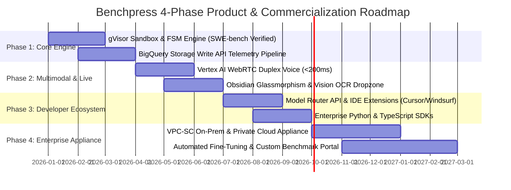

# Product Roadmap, Commercialization & Strategic Phases

> **Document ID:** `BP-PLAN-001`  
> **Status:** Approved / Production  
> **Target Track:** Venture Viability & Project Management • Google Cloud Hackathon (2026)

---

## 1. Executive Strategic Vision

Benchpress is positioned to become the **"Artificial Analysis for the Agentic Era"**—the definitive economic index, continuous evaluation network, and real-time routing layer for enterprise autonomous agents.

---

## 2. Phase-by-Phase Technical & Commercial Deliverables

### Phase 1: Evaluation Core & Telemetry Pipeline (Months 1–3)
- **Primary Objective:** Build the deterministic multi-turn evaluation engine and establish baseline economic metrics.
- **Key Deliverables:**
  - Cloud Run Gen2 gVisor micro-sandboxes with isolated git worktrees.
  - Deterministic 11-State FSM runtime with autonomous self-healing retries.
  - BigQuery partitioned data warehouse with Memorystore Redis streaming buffer.
  - Benchmark suites for `swe_bench_verified` (500 tasks) and `financial_recon` (250 tasks).

### Phase 2: Tri-Modal UX & Multimodal Live Streaming (Months 4–6)
- **Primary Objective:** Deliver industry-first voice/vision developer debugging co-pilot.
- **Key Deliverables:**
  - Vertex AI Gemini Multimodal Live integration over WebRTC with $< 200\,\text{ms}$ latency.
  - Computer Vision OCR dropzone matching terminal screenshots against BigQuery failure traces.
  - Obsidian Dark Glassmorphism tactile canvas with synchronized DOM updates and live audio waveforms.

### Phase 3: Model Routing API & Developer Ecosystem (Months 7–9)
- **Primary Objective:** Monetize routing intelligence and drive developer adoption in major IDEs.
- **Key Deliverables:**
  - High-throughput OpenAPI 3.0 REST endpoints (`POST /routing-recommendation`).
  - Drop-in React "Why Switch?" component displaying real-time dollar savings.
  - Native plugins and proxy adapters for Cursor, Windsurf, Claude Code, and LiteLLM.
  - Python (`benchpress-python`) and TypeScript (`@benchpress/sdk`) client SDKs.

### Phase 4: Enterprise Private Appliance & Custom Benchmarks (Months 10–12)
- **Primary Objective:** Scale enterprise annual contract value (ACV) with on-prem and private VPC deployments.
- **Key Deliverables:**
  - Single-tenant GCP Marketplace Terraform appliance with CMEK encryption and VPC-SC isolation.
  - Custom Enterprise Evaluation Portal allowing Fortune 500 teams to ingest private internal git repos.
  - Automated continuous fine-tuning pipelines using verified agentic execution traces.
