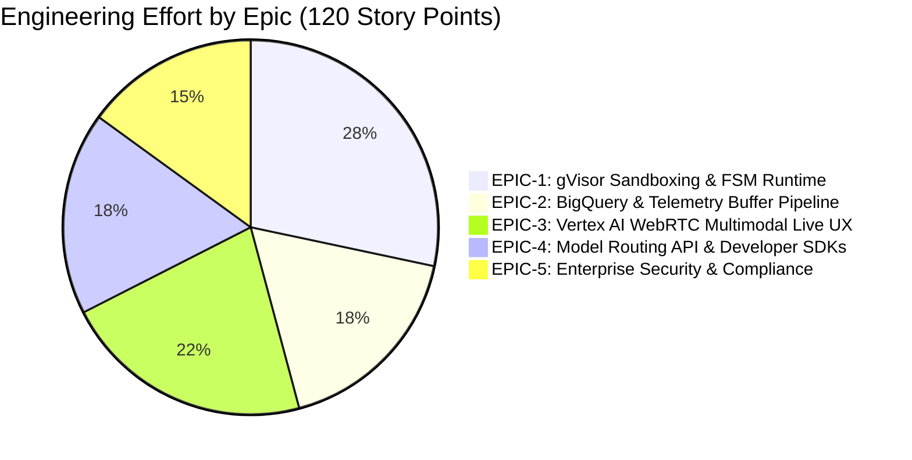

# Sprint Backlog, Epics & Gherkin Acceptance Criteria

> **Document ID:** `BP-PLAN-002`  
> **Status:** Historical target-state design — not deployed or verified
> **Target Track:** Venture Viability & Project Management • Google Cloud Hackathon (2026)

---

## 1. Epic Overview & Story Point Breakdown



---

## 2. Detailed Epics, User Stories & Gherkin Specifications

### EPIC-1: Deterministic Agent Execution & gVisor Sandbox Fleet
**Goal:** Provision isolated serverless containers to execute multi-turn coding loops safely.

#### Story BP-101: gVisor Kernel Isolation & Ephemeral Worktree
- **Estimate:** 8 Story Points | **Priority:** Blocker
- **Description:** As an enterprise engineer, I want agent code executed inside gVisor (`runsc`) so that untrusted benchmark code cannot escape to the host node.
```gherkin
Feature: gVisor Container Sandbox Isolation

  Scenario: Untrusted process attempts privilege escalation
    Given a benchmark task is dispatched to Cloud Run Gen2
    When the agent executes a shell command attempting "ptrace" or "insmod"
    Then the gVisor Sentry kernel traps the system call
    And returns an EPERM error without affecting the host operating system
    And the telemetry emitter records a SECURITY_INTERCEPTION event

  Scenario: Clean ephemeral worktree teardown
    Given an agent has completed 15 turns in `/workspace/repo`
    When the trajectory transitions to COMPLETE or FATAL_HALT
    Then the entire tmpfs memory volume is destroyed
    And subsequent tasks boot with a clean, unpolluted git base commit
```

---

### EPIC-2: Telemetry Ingestion & BigQuery Analytics
**Goal:** Ingest thousands of turn metrics per second into BigQuery with sub-second OLAP query performance.

#### Story BP-201: BigQuery Storage Write API Micro-Batch Buffer
- **Estimate:** 8 Story Points | **Priority:** High
- **Description:** As a data engineer, I want worker turn metrics buffered in Redis and flushed via Protobuf streams to BigQuery.
```gherkin
Feature: Micro-Batched Telemetry Streaming

  Scenario: High-throughput telemetry turn flush
    Given 50 concurrent worker nodes are pushing turn metrics to Memorystore Redis
    When the Redis queue depth exceeds 500 records or 2000ms elapses
    Then the Flush Daemon serializes records into Protocol Buffers
    And streams them to `benchpress_analytics.turn_telemetry` via Storage Write API
    And acknowledges commits with zero lost records
```

---

### EPIC-3: Tri-Modal UX & Multimodal Live Copilot
**Goal:** Implement sub-200ms WebRTC voice dialogue and drag-and-drop vision error matching.

#### Story BP-301: WebRTC Live Audio Voice Diagnostic Dialogue
- **Estimate:** 13 Story Points | **Priority:** High
- **Description:** As an AI engineer, I want to speak into my browser microphone to debug agent failures and see synchronized canvas highlights.
```gherkin
Feature: WebRTC Multimodal Live Trajectory Copilot

  Scenario: Spoken query triggers synchronized DOM canvas highlight
    Given an active WebRTC duplex audio session with Vertex AI Live API
    When the developer speaks "Why did turn 12 fail on regex validation?"
    Then the voice copilot synthesizes a spoken explanation within 200ms
    And simultaneously emits a WebSocket DOM_SYNC event
    And the client browser automatically scrolls to turn 12 and highlights the code diff in Crimson
```

---

### EPIC-4: Dynamic Model Routing API & Developer Integrations
**Goal:** Serve sub-150ms model routing recommendations with transparent cost-saving rationales.

#### Story BP-401: REST API Routing Recommendation Endpoint
- **Estimate:** 8 Story Points | **Priority:** High
- **Description:** As an IDE user in Cursor, I want to query `/routing-recommendation` to receive an optimal model choreography recipe.
```gherkin
Feature: Dynamic Model Routing Recommendation

  Scenario: Routing request returns 2-Tiered Hybrid Route
    Given a task request with language "python" and task_type "code_bug_fix"
    When the client posts to `/api/v1/routing-recommendation`
    Then the API returns HTTP 200 OK with recommended_strategy "HYBRID_CHOREOGRAPHY"
    And specifies planner_model "gemini-2.5-pro" and coder_model "gemini-3.5-flash"
    And returns a projected cost savings percentage greater than 70%
```
