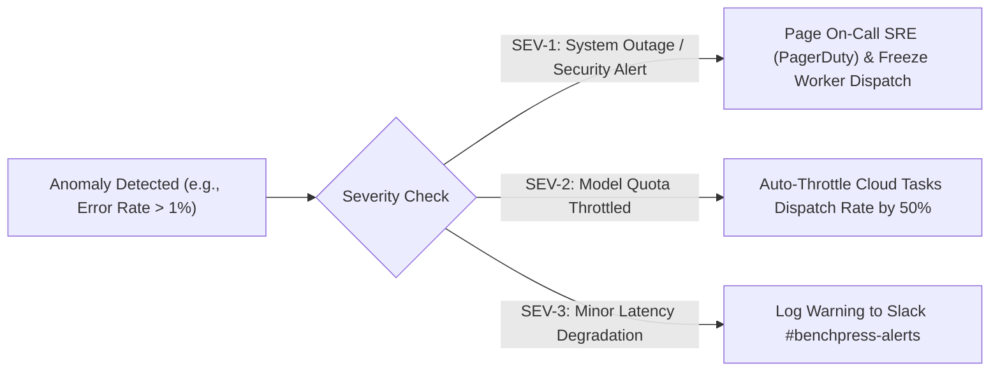

# Enterprise 4x4 Risk Matrix & Architectural Mitigations

> **Document ID:** `BP-PLAN-003`  
> **Status:** Historical target-state design — not deployed or verified
> **Target Track:** Venture Viability & Project Management • Google Cloud Hackathon (2026)

---

## 1. Enterprise Risk Governance Framework

Benchpress operates at the intersection of untrusted code execution, multi-vendor LLM inference, and real-time cloud data pipelines. We maintain an active **4x4 Enterprise Risk Matrix** evaluated across Impact ($1-4$) and Probability ($1-4$).

$$\text{Risk Score} = \text{Probability (1-4)} \times \text{Impact (1-4)}$$

```mermaid
quadrantChart
    title Benchpress 4x4 Enterprise Risk Matrix
    x-axis Low Impact --> Critical Impact
    y-axis Low Probability --> High Probability
    quadrant-1 High Risk (Immediate Action)
    quadrant-2 Moderate Risk (Mitigate)
    quadrant-3 Low Risk (Accept)
    quadrant-4 Significant Risk (Monitor)
    "LLM Upstream 429 Quotas": [0.75, 0.85]
    "Untrusted Sandbox Escape": [0.95, 0.25]
    "Token Spend Overruns": [0.65, 0.70]
    "Pre-Training Contamination": [0.80, 0.50]
    "WebRTC Audio Latency Drift": [0.55, 0.60]
    "BigQuery Write Throttling": [0.70, 0.30]
```

---

## 2. Comprehensive Risk Register & Action Plans

| Risk ID | Category | Risk Description | Prob (1-4) | Impact (1-4) | Score | Automated Mitigation & Architectural Controls | Owner |
| :--- | :--- | :--- | :---: | :---: | :---: | :--- | :--- |
| **RSK-01** | **Technical** | Upstream Vertex AI / LLM rate limits (HTTP 429) causing benchmark aborts. | 3 | 4 | **12** | Cloud Tasks token-bucket queue dispatch with jittered exponential backoff ($2\text{s} \dots 60\text{s}$). | Principal Systems Architect |
| **RSK-02** | **Financial** | Multi-turn agent runaway loops exhausting cloud budgets. | 3 | 3 | **9** | Hard token circuit-breakers ($T \le 25$ turns, max $\$2.00$ spend per task) enforced by the worker runtime. | FinOps Lead |
| **RSK-03** | **Security** | Untrusted benchmark repository code escaping container sandbox. | 1 | 4 | **4** | gVisor user-space kernel virtualization (`runsc`), seccomp-bpf, rootless user, and VPC Service Controls. | CISO / Security Lead |
| **RSK-04** | **Scientific** | Model providers scraping benchmark suites into pre-training data. | 2 | 4 | **8** | Canary GUID injections (`benchpress:canary:...`) + dynamic AST synthetic mutation engines. | Lead Research Scientist |
| **RSK-05** | **UX / Media** | High network jitter causing WebRTC audio/vision desynchronization. | 2 | 3 | **6** | Adaptive WebRTC jitter buffer + WebSocket fallback drawer with Gemini 3.5 Flash text chat. | Multimodal UX Designer |
| **RSK-06** | **Data / OLAP** | Redis buffer memory exhaustion during massive swarm benchmark runs. | 1 | 3 | **3** | Redis high-watermark alarms ($> 80\%$) + parallel BigQuery Storage Write API flush daemons. | Lead Data Engineer |
| **RSK-07** | **Legal** | Enterprise client data privacy concerns regarding source code leakage. | 1 | 4 | **4** | In-memory Cloud DLP PII sanitization pipeline + ephemeral in-memory `tmpfs` volume destruction. | Enterprise Compliance Lead |
| **RSK-08** | **Market** | Model vendors altering API pricing structures invalidating CPR indices. | 2 | 3 | **6** | Automated daily vendor price scrapers updating BigQuery price lookup tables continuously. | Product Manager |

---

## 3. Incident Escalation & Response Protocols


