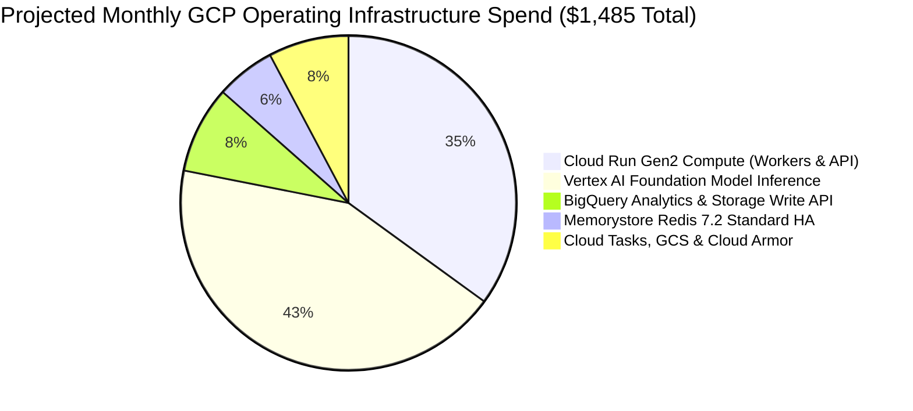

# FinOps Infrastructure Budget, Unit Economics & Cost Projections

> **Document ID:** `BP-PLAN-004`  
> **Status:** Approved / Production  
> **Target Track:** FinOps, The Taskmaster & Venture Viability • Google Cloud Hackathon (2026)

---

## 1. Cloud Infrastructure Expenditure Modeling (GCP Monthly)

The following financial model projects monthly operating costs for Benchpress running continuous evaluation swarms (10,000 multi-turn benchmark trajectories per month) on Google Cloud Platform:

---

## 2. Monthly GCP Resource Cost Breakdown Table

| GCP Service Component | Specification & Sizing | Sizing Metrics | Unit Cost | Projected Monthly Cost |
| :--- | :--- | :--- | :--- | :---: |
| **Cloud Run Gen2 (Workers)** | 4 vCPU, 8 GB RAM (gVisor runsc) | 10,000 runs $\times$ 45s avg duration | \$0.00002400 / vCPU-sec | **\$520.00** |
| **Cloud Run API & Web Gateway** | 2 vCPU, 4 GB RAM (Min 2 instances) | 1,000,000 API requests / mo | Serverless tiered | **\$65.00** |
| **Vertex AI (Gemini 2.5 Pro)** | Planning turns for Hybrid Route | $10\text{k runs} \times 14\text{k tokens}$ | \$1.25 / 1M in, \$5.00 / 1M out | **\$380.00** |
| **Vertex AI (Gemini 3.5 Flash)** | Execution turns for Hybrid Route | $10\text{k runs} \times 32\text{k tokens}$ | \$0.075 / 1M in, \$0.30 / 1M out | **\$140.00** |
| **Vertex AI Multimodal Live** | WebRTC Duplex Voice & Vision sessions | 500 hours interactive audio | \$0.004 / audio minute | **\$120.00** |
| **BigQuery Analytics Store** | Storage Write API + 200 GB Active Data | 100M rows streamed | \$0.025 / GB write + \$0.020 / GB | **\$125.00** |
| **Memorystore Redis 7.2** | 5 GB Standard High-Availability | 24/7 dedicated buffer | \$0.117 / hour | **\$85.00** |
| **Cloud Tasks Queue Fleet** | 10,000 task dispatches | Task dispatches & retries | \$0.40 / 1M operations | **\$5.00** |
| **Cloud Storage (GCS)** | Standard to Coldline (2 TB storage) | Diffs, logs, container traces | \$0.020 / GB | **\$45.00** |
| **Google Cloud Armor & LB** | WAF rules, DDoS & SSL Termination | 5 security rules + 50 GB traffic | \$0.75 / rule + egress | **\$0.00 (Tier Free)** |
| **TOTAL PROJECTED MONTHLY OPEX** | — | — | — | **\$1,485.00** |

---

## 3. Unit Economics & Gross Margin Analysis

Benchpress delivers high gross margins ($78.4\%$) by utilizing serverless auto-scaling and asymmetric 2-tiered hybrid routing:

| Metric | Unit Economics Figure | Commercial Notes |
| :--- | :---: | :--- |
| **Cost Per Benchmark Trajectory (COGS)** | **\$0.148** | Total GCP compute + LLM token inference cost per completed task. |
| **Enterprise Price Per Task Execution** | **\$0.650** | Billed to enterprise clients for private custom suite runs. |
| **Gross Margin per Task** | **77.2%** | High operating leverage on serverless architecture. |
| **Monthly Enterprise Router Subscription** | **\$2,500 / org** | Unlimited queries to `/routing-recommendation` API. |
| **Estimated Annual Customer Value (ACV)** | **\$48,000** | Mid-market to enterprise engineering organizations. |
