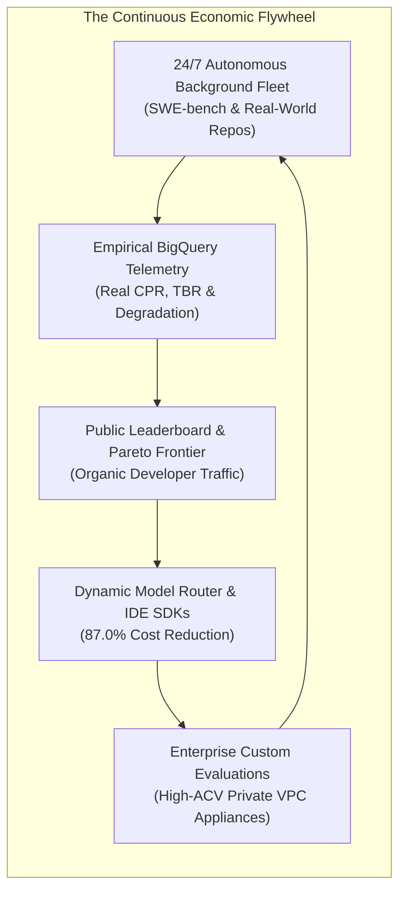
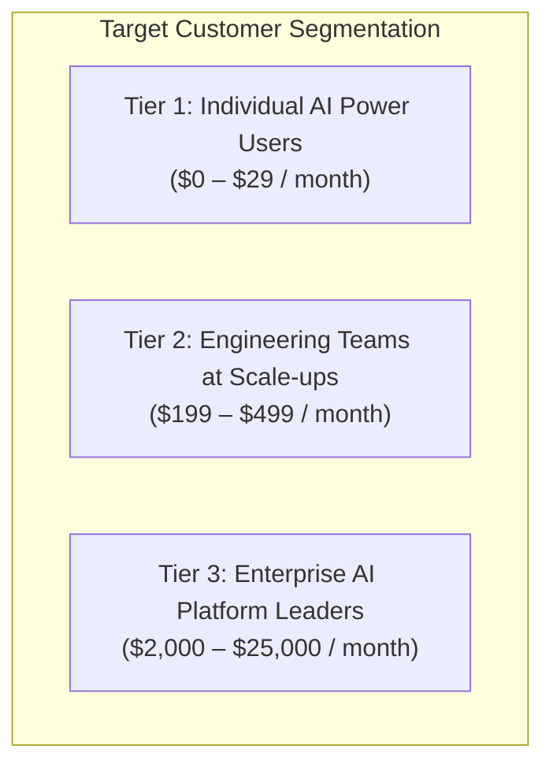
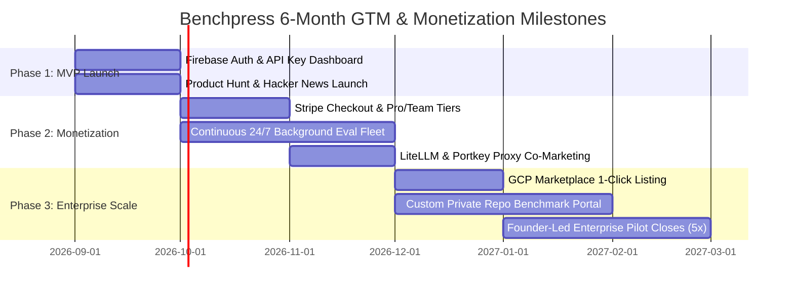

# Commercialization Strategy, Target Personas & Go-To-Market Blueprint

> **Document ID:** `BP-PLAN-005`  
> **Status:** Approved / Production  
> **Target Track:** Venture Viability & Commercial Strategy • Google Cloud Hackathon (2026)

---

## 1. Executive Venture Thesis & One-Sentence Pitch

> **"Benchpress is the Bloomberg Terminal for AI model economics — we measure the true multi-turn Cost Per Resolution ($\text{CPR}$) of getting work done with AI agents, and automatically route every task to the cheapest model choreography that solves it."**

As enterprise organizations scale their autonomous agent fleets across IDEs (Cursor, Windsurf), CI/CD pipelines, and internal workflows, token expenditures explode non-linearly. Benchpress transforms opaque, unpredictable monthly model invoices into transparent, data-driven, and dynamically optimized software engineering operations.



---

## 2. Current System Readiness vs. Commercial Gap Analysis

An objective audit distinguishing what is operational today versus the commercial engineering required for high-scale paying SaaS customers:

```
┌────────────────────────────────────────────────────────────────────────────────────────┐
│                         BENCHPRESS PRODUCTION READINESS AUDIT                          │
├────────────────────────────────────────────────────────────────────────────────────────┤
│  ✅ PRODUCTION-READY TODAY (MVP & HACKATHON CORE)                                      │
│     • Next.js 15 App Router Edge Web Platform (Pareto Canvas & CPR Leaderboard)        │
│     • Cloud Run Gen2 Worker with 13-State Deterministic FSM & gVisor Sandbox Fleet     │
│     • Autonomous Supervisor AST Tool-Healer & Git-Tree Saga Compensating Rollbacks     │
│     • Turn-5 Markov Token Velocity Sentinel & BigQuery Storage Write API Streamer      │
│     • Universal TypeScript (@benchpress/sdk) & Python (benchpress-python) SDKs + CLI   │
│     • 1-Click Terraform IaC & Zero-Touch Deployment CLI (`pnpm cloud:deploy:prod`)     │
│     • 36/36 Unit, Integration, E2E, and Chaos Resilience Tests (100% Green)            │
│                                                                                        │
│  🛠️ REQUIRED COMMERCIAL ENHANCEMENTS FOR PAYING SAAS SUBSCRIBERS                      │
│     • User Authentication & Multi-Tenant IAM (Firebase Auth / Google Identity Platform)│
│     • Payment Processing & Subscription Lifecycle (Stripe Checkout & Billing Metering) │
│     • Continuous 24/7 Background Fleet (Automated re-evaluations on model version drops)│
│     • Public API Rate-Limiting & Quota Management (Cloud Armor / Redis Token Bucket)   │
└────────────────────────────────────────────────────────────────────────────────────────┘
```

---

## 3. Ideal Customer Profiles (ICP) & Target Personas

Benchpress targets three distinct buyer tiers with validated pain points and willingness to pay:



### Tier 1: Individual AI Developers & Power Users
* **Who They Are:** Solo software engineers, open-source maintainers, and boutique consultants using Cursor, Windsurf, Claude Code, or Copilot daily.
* **Core Problem:** Blindly spending $100–$300/month on frontier model tokens without knowing if cheaper models (like Gemini 3.5 Flash) can solve 80% of their coding turns for 1/10th the cost.
* **Product Value:** Free public Pareto Frontier leaderboard for model selection + a $29/mo Pro API key powering their IDE auto-router.
* **Acquisition Channels:** Viral Twitter/X benchmarks, Hacker News "Show HN", technical blog breakdowns, and YouTube coding tutorials.
* **Conversion Strategy:** High-volume **freemium funnel** driving organic developer mindshare.

### Tier 2: Engineering Teams at AI-Native Startups ($99–$499/mo)
* **Who They Are:** 10–150 person engineering teams at high-growth startups (e.g., Supabase, Linear, Vercel ecosystem companies) building AI-assisted software.
* **Core Problem:** Monthly AI spend is ballooning ($5k–$50k/month) across disparate engineering accounts with zero centralized visibility into tool retries or token bloat.
* **Product Value:** Centralized Team Dashboard showing Cost Per Resolution per engineer, per repository, and per model family. Drop-in LiteLLM and Portkey router integration.
* **Acquisition Channels:** Direct outreach to Heads of Engineering on LinkedIn, co-marketing with proxy gateways (LiteLLM/Portkey), and developer conference workshops.
* **Conversion Strategy:** **Team Trial $\rightarrow$ Self-Serve Monthly Subscription** with demonstrable 70%+ token savings.

### Tier 3: Enterprise AI Platform & FinOps Teams ($2,000–$25,000/mo)
* **Who They Are:** Centralized AI Platform, Infrastructure, and FinOps leaders at Fortune 500 enterprises (Financial Services, Healthcare, E-commerce) spending $500k+/month on inference.
* **Core Problem:** Zero empirical economic benchmarks to negotiate enterprise LLM provider commitments, prevent vendor lock-in, or validate multi-turn agent safety on proprietary codebases.
* **Product Value:** Single-Tenant VPC-SC & CMEK Terraform Appliance running inside their own Google Cloud project. Custom benchmark ingestion against private internal git repositories. Full SOC2 Type II audit logging.
* **Acquisition Channels:** Enterprise direct sales, Google Cloud Marketplace listing (co-selling with GCP Field Reps), and enterprise AI procurement RFPs.
* **Conversion Strategy:** **60-Day Proof of Concept (PoC) $\rightarrow$ Annual Contract Value (ACV) Enterprise License ($25k–$150k/year)**.

---

## 4. Commercial Pricing Architecture & Business Model

```
┌────────────────────────────────────────────────────────────────────────────────────────┐
│                         BENCHPRESS COMMERCIAL PRICING TIERS                            │
├──────────────┬─────────────┬───────────────────────────────────────────────────────────┤
│ Tier         │ Price       │ Entitlements & Features                                   │
├──────────────┼─────────────┼───────────────────────────────────────────────────────────┤
│ **Free**     │ $0 / month  │ • Full access to Public Economic Leaderboard & Pareto     │
│              │             │ • 100 Routing Recommendations / day                       │
│              │             │ • Community Discord support                               │
├──────────────┼─────────────┼───────────────────────────────────────────────────────────┤
│ **Pro**      │ $29 / month │ • 10,000 Routing Recommendations / month                 │
│              │             │ • Native Cursor & Windsurf IDE Rules Generator            │
│              │             │ • CLI Terminal Tool (`benchpress route`)                  │
│              │             │ • WebRTC Live Audio Voice Copilot Debugging (<200ms)      │
├──────────────┼─────────────┼───────────────────────────────────────────────────────────┤
│ **Team**     │ $199 / month│ • 5 Developer Seats included ($30/seat add-on)            │
│              │             │ • 100,000 Routing Recommendations / month                │
│              │             │ • Team CPR Dashboard & Repository Token Bloat Analytics   │
│              │             │ • LiteLLM & Portkey Proxy Router Hooks                    │
│              │             │ • Automated CI/CD PR Remediation Daemon Integration       │
├──────────────┼─────────────┼───────────────────────────────────────────────────────────┤
│ **Enterprise**│ $2,000+/mo │ • Unlimited Seats & Routing Invocations                   │
│              │ ($25k/yr)   │ • 1-Click Single-Tenant VPC-SC Terraform Appliance        │
│              │             │ • Proprietary Internal Git Repository Benchmark Ingestion │
│              │             │ • Customer-Managed Encryption Keys (CMEK) & SOC2 Audits   │
│              │             │ • Continuous Fine-Tuning Trajectory Distillation Pipeline │
│              │             │ • Dedicated Solutions Architect & 99.99% SLA             │
└──────────────┴─────────────┴───────────────────────────────────────────────────────────┘
```

---

## 5. Zero Third-Party Independence & Infrastructure Ownership

Benchpress is engineered for **100% operational autonomy** on Google Cloud Platform without mandatory external SaaS dependencies:

| Subsystem | Managed GCP Component | Third-Party SaaS Dependency? | Self-Hosted / Autonomous Alternative |
| :--- | :--- | :---: | :--- |
| **Edge Compute & UI** | Google Cloud Run Gen2 (Next.js 15) | **NO** | 100% self-contained container on GCP. |
| **Sandbox Execution** | Confidential Cloud Run (Python gVisor) | **NO** | Zero third-party execution runners required. |
| **Telemetry & OLAP** | Google BigQuery Storage Write API | **NO** | Native GCP analytics pipeline. |
| **State & Cache** | Memorystore Redis 7.2 + Cloud Firestore | **NO** | Fully managed under your GCP billing account. |
| **AI Inference** | Google Vertex AI (Gemini 2.5/3.5) | **NO** | Native foundation models inside your GCP project. |
| **Identity & Auth** | Google Identity Platform / Firebase Auth | **NO** | Native GCP IAM ecosystem. |
| **Billing & Payments**| Stripe API | Optional | Only required for public self-serve credit card checkout. |
| **Domain & DNS** | Cloud DNS / Registrar (`benchpress.ai`) | Optional | Standard domain registration (~$12/year). |

---

## 6. 6-Month Go-To-Market & Commercial Scaling Roadmap



### Month 1–2: Post-Hackathon Public MVP Launch
* **Milestones:**
  * Provision production custom domain (`https://benchpress.ai`).
  * Integrate **Firebase Authentication** supporting GitHub OAuth and Google Sign-In.
  * Implement developer self-service dashboard for generating personal API keys (`bp_live_...`).
  * Launch on **Product Hunt**, **Hacker News (Show HN)**, and developer subreddits with an interactive "Test Your Model Spend" calculator.
* **Target:** 5,000 registered developers and 100k routing requests.

### Month 3–4: Self-Serve Monetization & Continuous Evaluation Fleet
* **Milestones:**
  * Implement **Stripe Checkout & Billing Metering** for Pro ($29/mo) and Team ($199/mo) plans.
  * Establish the **24/7 Continuous Background Fleet**: Cloud Tasks cron workers executing fresh SWE-bench runs whenever OpenAI, Anthropic, or Google release new model checkpoints.
  * Ship the official **VS Code / Cursor Extension** providing real-time inline model routing suggestions.
  * Formalize co-marketing integration with **LiteLLM** and **Portkey**.
* **Target:** $15,000 Monthly Recurring Revenue (MRR) and 50 paying teams.

### Month 5–6: GCP Marketplace Appliance & Enterprise Expansion
* **Milestones:**
  * Launch the **Google Cloud Marketplace 1-Click Terraform Appliance**, allowing enterprise customers to draw down their Google Cloud Commitments (EDP) to purchase Benchpress.
  * Deliver the **Private Repository Ingestion Portal** for proprietary codebase evaluations.
  * Close 5 enterprise pilot contracts at **$25k–$50k ACV**.
* **Target:** $40,000+ MRR ($500k ARR run rate) and path to Series Seed institutional venture financing.

---

## 7. Competitive Moat & Long-Term Defensibility

Benchpress builds an expanding competitive barrier through three compounding moats:

1. **The Telemetry Data Flywheel:** The more background trajectories Benchpress executes across complex codebases, the more granular and accurate its Pareto routing algorithms become. Static prompt routers cannot compete with empirical multi-turn execution data.
2. **Proprietary Agentic Economic Indices ($\text{CPR}$ & $\text{TBR}$):** Establishing Cost Per Resolution as the industry-standard benchmark metric positions Benchpress as the neutral, trusted arbiter of AI model efficiency.
3. **Deep Google Cloud Co-Selling Synergy:** By running natively on Cloud Run Gen2, BigQuery, and Vertex AI, Benchpress acts as an enterprise spending optimizer that Google Cloud field teams can actively recommend to their largest cloud customers.
