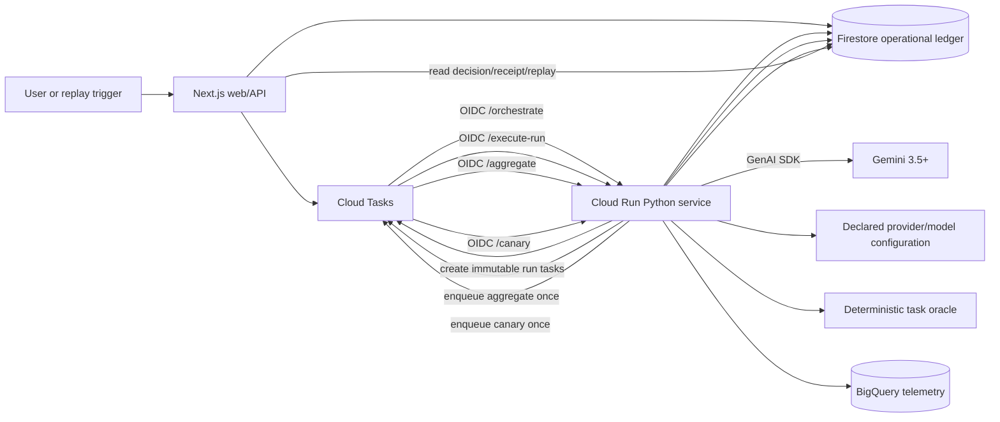

# Submission-critical implementation plan

> **Document ID:** `BP-PLAN-006`  
> **Status:** Execution-ready plan  
> **Scope:** Complete the Google Cloud All Things Agentic hackathon `G0` judged path  
> **Track:** The Taskmaster  
> **Deadline:** 2026-08-31 17:00 PDT / 2026-09-01 02:00 SAST  
> **Primary source of truth:** [Authoritative submission plan](../hackathon/00-authoritative-submission-plan.md)  
> **Roadmap dependency:** [Master build roadmap, Phase H](./00-master-build-roadmap.md#8-phase-hhackathon-critical-path)  
> **Release gate:** [Final submission checklist](../hackathon/04-final-submission-checklist.md)

> **2026-08-29 audit note:** The repository did not yet satisfy this plan end to end. Use the [G0 audit-remediation implementation plan](./07-g0-remediation-implementation-plan.md) as the current execution sequence; this document remains the original specification.

## 1. Purpose and required outcome

This document converts the submission plan into an implementation specification. It deliberately narrows work to one real, replayable Taskmaster workflow and defines the code changes, contracts, persistence semantics, security controls, tests, deployment gates, evidence artifacts, and operating sequence needed to finish it.

The required outcome is one correlated workflow:

```text
replay/change event
  -> immutable baseline and task fingerprint
  -> genuine Gemini 3.5+ structured-tool planning decision
  -> deterministic plan and budget approval
  -> authenticated, idempotent Cloud Tasks dispatch
  -> synchronous Cloud Run worker execution
  -> exact provider configuration and actual usage
  -> deterministic outcome oracle
  -> failure-inclusive aggregate and evidence-sufficiency decision
  -> contained candidate canary
  -> promotion or automatic rollback
  -> stored decision receipt and replay
  -> public STAY, TEST MORE, or SWITCH card
```

The path is complete only when the same `correlation_id` can be used to reconstruct every arrow from retained records without relying on application memory, model chain-of-thought, fixture metrics, or an operator's recollection.

## 2. Delivery principles

1. **Eligibility first.** A genuine Gemini 3.5-or-newer call through Google GenAI SDK or ADK is non-negotiable.
2. **One orchestrator, controlled workers.** Gemini designs a bounded experiment. Deterministic services approve it, and workers execute immutable run manifests. Workers are not agents.
3. **Fail closed.** Missing authentication, unsupported model controls, incomplete evidence, exceeded budgets, stale inputs, and failed canaries must stop publication or produce `TEST MORE`; they must not silently fall back.
4. **Acknowledge only durable work.** A Cloud Tasks handler returns success only after its owned state transition and result are durably stored.
5. **At-least-once delivery, exactly-once logical effects.** Cloud Tasks may retry. Logical run keys, transactions, leases, and compare-and-swap publication prevent duplicate provider spend and duplicate decisions.
6. **Deterministic policy owns promotion.** Gemini may propose and explain, but it cannot approve budgets, declare test success, calculate final metrics, promote policy, or suppress a rollback.
7. **Observed means observed.** Usage, cost, latency, test outcomes, and failures shown as measured must come from the retained run. All other values are marked `OFFICIAL_SPECIFICATION`, `PROJECTED`, `ILLUSTRATIVE`, or `DEMO_FIXTURE`.
8. **Preserve incurred evidence.** Rejection and early stopping cancel only future work. Completed and failed attempts remain in the denominator and cost ledger.
9. **No destructive Git fallback.** The judged path must never run `git reset --hard`, auto-merge, or alter a customer repository.
10. **Submission work is a release, not a feature expansion.** Swarm, multimodal, enterprise appliance, distillation, extra providers, and optional bonus integrations stay out until every `G0` gate passes.

## 3. Current repository baseline

### 3.1 Reusable implemented pieces

- A deployed Next.js Cloud Run web service.
- A deployed Python Cloud Run worker service.
- A Cloud Tasks queue with retry and rate-limit configuration.
- Firestore and BigQuery adapters.
- A Python FSM, tool registry, sandbox utilities, deterministic Pytest runner, safeguards, telemetry code, and local tests.
- Web routes for trajectory submission/status, benchmark data, recommendations, replay-style pages, and decision-oriented widgets.
- Primary infrastructure in `infra/terraform` and an alternate legacy tree in `terraform`.
- Google GenAI dependency and Gemini-related configuration placeholders.

### 3.2 Blocking gaps to close

| Gap | Current behavior | Required behavior |
|---|---|---|
| Gemini eligibility | The worker declares Gemini model names but the judged FSM uses a hard-coded tool sequence and estimated usage | Make a real Gemini 3.5+ structured-tool call and retain exact model/usage metadata |
| Durable execution | `/execute-task` schedules an in-process background task and returns success | Execute owned work synchronously or persist a durable lease before response; Cloud Tasks receives non-2xx while retryable work is incomplete |
| Worker authentication | HMAC is checked only when the header is present; Cloud Run OIDC is configured separately | Make one explicit fail-closed authentication design and test missing, invalid, and valid requests |
| Idempotency | A random trajectory ID is stored, but no canonical logical run key or transactional lease governs provider invocation | Derive deterministic task names/run keys and claim them transactionally before spend |
| Provider execution | The FSM replays a fixed Django edit and estimates tokens/cost | Invoke the frozen native configuration and store provider-returned usage and response metadata |
| Aggregate and policy | Prototype routing rules and fixture benchmark rows decide the displayed answer | Calculate a versioned aggregate from eligible stored runs and map policy outcome to `STAY`, `TEST MORE`, or `SWITCH` |
| Canary and rollback | Governance designs and tests exist, but no correlated contained policy lifecycle drives publication | Add immutable policy versions, contained canary evidence, compare-and-swap promotion, and exact prior-version rollback |
| Public evidence | Benchmark and recommendation endpoints contain hard-coded metrics | Read a stored receipt/aggregate; label fixture routes and prevent fixtures entering measured publication |
| Release gate | Python suite has two failures, SDK dependencies are not installed in the active environment, and the JS dependency tree is mixed across Windows/WSL | Establish one clean build environment and pass the scoped build, test, security, and smoke gates |
| Evidence package | Cloud resources exist but no single retained run proves the whole path | Store sanitized manifests, logs, records, URLs, screenshots, and commit/revision identifiers under one evidence index |

### 3.3 Immediate configuration inconsistencies

Resolve these before using configuration as evidence:

- `.env.example` sets `SANDBOX_WORKER_URL` to a path, while the TypeScript adapter treats it as a service base URL and appends `/execute-task`.
- Worker defaults still name Gemini 2.5 models; production must require an explicit eligible planner model.
- BigQuery environment-variable names/default table names differ between `.env.example`, worker settings, and Terraform.
- Local mock mode defaults to true. Deployed environments must set it explicitly to false and fail startup if required production settings are missing.
- The Terraform formatting test asserts whitespace rather than HCL meaning.
- The Git rollback test exposes Windows-path handling defects and the implementation still includes a destructive fallback.

## 4. Frozen judged scope

### 4.1 Build exactly this

- One explicit `REPLAY_EVENT` representing a model, reasoning-control, capability, or price change.
- One declared current baseline policy.
- One versioned task fingerprint including workflow phase.
- One Gemini 3.5+ planner call producing a typed experiment proposal.
- One deterministic plan approval policy.
- A frozen cohort of three to five small coding tasks.
- Two or three exact native configurations, always including the baseline.
- One planned cheapest-but-failing configuration.
- One sufficient switch/stay scenario and one insufficient-evidence scenario.
- One contained canary task or fixed demo slice.
- Firestore as operational source of truth; BigQuery as telemetry/evidence if stable.
- One public decision page with receipt and replay.
- A four-minute demo and a sanitized evidence package.

### 4.2 Explicit non-goals

- General multi-provider discovery or universal leaderboards.
- Production customer traffic routing.
- Multi-agent or peer-agent orchestration.
- Real GitHub pull-request creation, auto-merge, package installation, or destructive repository recovery.
- gVisor, VPC-SC, CMEK, eBPF, compliance, or enterprise claims unless directly demonstrated.
- Voice, vision, WebRTC, distillation, self-tuning, predictive outage detection, and optional Google-model bonuses.
- Statistical generalization beyond the frozen demo cohort.

## 5. Target architecture and ownership

### 5.1 Service boundary



For deadline simplicity, orchestration, run execution, aggregation, and canary handlers may live in the same Python Cloud Run image, but they must be separate endpoints and modules with separate state transitions. This preserves the one-orchestrator architecture while avoiding a third deployable service.

### 5.2 Component responsibilities

| Component | May do | Must not do |
|---|---|---|
| Web/API | Validate trigger input, create event/experiment shell, enqueue orchestrator task, read and render stored records | Call a result measured, calculate hidden fixture recommendations, invoke worker without durable record |
| Gemini orchestrator | Interpret change, fingerprint workload, select bounded tasks/configurations, propose stop rules, provide evidence-grounded explanation | Approve its own budget, invent results, write final metrics, promote policy |
| Deterministic plan policy | Validate schema, supported controls, baseline inclusion, budget, cohort bounds, stop/sufficiency rules | Rewrite unsupported provider controls or relax thresholds after results arrive |
| Cloud Tasks dispatcher | Create deterministic task names, attach OIDC, configure deadlines/retries, preserve correlation metadata | Generate random retry identities or acknowledge a task that has no durable owner |
| Run worker | Claim one immutable run, invoke exact configuration, execute approved tools/oracle, persist terminal outcome | Select a different model, silently retry billable model failures outside manifest policy, publish recommendations |
| Aggregator | Select eligible attempts, include failures/costs, apply frozen stop/sufficiency/decision policy | Exclude inconvenient failures or change thresholds after seeing results |
| Canary controller | Compare candidate to baseline in contained scope, atomically promote or restore prior policy | Route real customer production traffic |
| Publisher/UI | Render stored decision, receipt, replay, badges, limitations, and reversal conditions | Recalculate an alternative result in the browser or conceal fixture/stale status |

## 6. Canonical identifiers, hashes, and records

### 6.1 Identifier rules

All IDs are lowercase where practical, URL-safe, immutable, and included in structured logs.

| Identifier | Format | Derivation/purpose |
|---|---|---|
| `correlation_id` | `corr_<ULID>` | Created once at trigger ingestion; joins the whole workflow |
| `event_id` | `evt_<ULID>` | One detected or replayed change |
| `experiment_id` | `exp_<ULID>` | One approved evaluation plan and its lifecycle |
| `plan_id` | `plan_<sha256-prefix>` | Hash of canonical approved plan JSON |
| `fingerprint_id` | `fp_<sha256-prefix>` | Hash of canonical task fingerprint JSON |
| `configuration_id` | `cfg_<sha256-prefix>` | Hash of provider, exact model ID, and native configuration |
| `logical_run_key` | `run_<sha256-prefix>` | Hash of experiment, task version, configuration, repetition, harness, and oracle |
| `attempt_id` | `att_<ULID>` | One physical provider attempt under a logical run |
| `aggregate_id` | `agg_<sha256-prefix>` | Hash of eligible run-set plus aggregation-policy version |
| `policy_version` | `pol_<ULID>` | Immutable baseline/candidate policy version |
| `decision_id` | `dec_<ULID>` | One terminal public decision |
| `receipt_id` | `rcpt_<sha256-prefix>` | Content hash of canonical receipt JSON |

Canonical JSON hashing must sort object keys, preserve array order, encode UTF-8, use normalized numeric/string representations, and exclude mutable timestamps only where the record definition explicitly says so.

### 6.2 Required contracts

Create a versioned contract directory:

```text
packages/contracts/
  schemas/
    change-event.v1.json
    task-fingerprint.v1.json
    native-configuration.v1.json
    experiment-plan.v1.json
    run-manifest.v1.json
    run-result.v1.json
    aggregate.v1.json
    policy-version.v1.json
    canary-result.v1.json
    decision-receipt.v1.json
    replay-event.v1.json
    staleness-event.v1.json
  src/
    index.ts
    zod.ts
  package.json
  tsconfig.json
```

Add Python Pydantic projections under `apps/sandbox-worker/src/contracts/` and a parity test that validates representative fixtures against both JSON Schema and Pydantic/Zod. JSON Schema is the interchange source of truth; language models must not maintain independent field semantics.

### 6.3 Minimum fields by contract

#### Change event

- `schema_version`, `event_id`, `correlation_id`, `event_type`, `source_kind`, `source_reference`.
- `replay: boolean` and `replay_label` when applicable.
- `target_provider`, `target_model_family`, changed fields, source checksum, effective/retrieval timestamps.
- Declared baseline `policy_version` and exact baseline configuration.
- Maximum spend, wall-clock deadline, initiator, and creation timestamp.

#### Task fingerprint

- `fingerprint_id`, version, task family, workflow phase, language/framework.
- Repository scale/context class; never raw private code in the public receipt.
- Input/output intensity, required tools, risk class, latency sensitivity.
- Cohort compatibility requirements and feature vector provenance.

#### Native configuration

- Provider, exact request model, resolved response model/snapshot where returned.
- Provider-native reasoning/thinking controls with no cross-provider coercion.
- Temperature/top-p/output limits only if supported and intentionally set.
- Tool declarations/schema hash, system/prompt template hash, region/service tier.
- Price-source version used for post-run cost calculation.

#### Experiment plan

- Event, baseline, fingerprint, selected configurations, selected task versions, repetitions.
- Selection rationale and discarded alternatives, clearly marked as planning output rather than result.
- Per-run timeout/retry policy, maximum turns, concurrency, rate limit.
- Maximum matrix spend and reserved budget.
- Frozen quality/safety boundaries, evidence-sufficiency rule, stop rules, canary rule.
- Plan-policy version, orchestrator model metadata, plan hash, approval result and reasons.

#### Run manifest and result

- Immutable logical run key and all upstream IDs/hashes.
- Task fixture/oracle/harness/container/repository commit versions.
- Exact configuration and approved tool/path/command allowlists.
- Attempt policy and budget allocation.
- Claimed/started/finished timestamps and lease owner/version.
- Provider request/response identifiers where available, actual usage, latency, finish reason.
- Test command, exit code, structured assertion results, failure taxonomy.
- Incurred cost inputs, calculated observed cost, and price version.
- Terminal state and whether eligible for aggregation, with exclusion reason if not.

#### Aggregate and decision receipt

- Exact eligible/ineligible run keys and exclusion reasons.
- Successes, failures, resolution rate, total cost, CPR, latency summaries where sample size permits.
- Uncertainty method and values, or explicit `not_computed_small_sample`.
- Failed guardrails, dominance/rejection/stop results, sufficiency status.
- Baseline and candidate policy versions, canary result, prior policy restored/promoted.
- Internal outcome and exactly one public decision.
- `why`, `why_not_cheapest`, `what_would_reverse_it`, limitations, next bounded plan.
- Freshness state and dependencies.
- Receipt checksum, created timestamp, code commit, Cloud Run revisions, and public URLs.

## 7. State machines and transactional invariants

### 7.1 Experiment state

```text
RECEIVED
  -> PLANNING
  -> PLAN_REJECTED | PLAN_APPROVED
  -> DISPATCHING
  -> RUNNING
  -> AGGREGATING
  -> REJECTED | ABSTAINED | CANARY_PENDING
  -> CANARY_RUNNING
  -> ROLLED_BACK | RECOMMENDED
  -> PUBLISHED

Any non-terminal state may enter FAILED_TERMINAL only with a retained failure reason.
```

No transition may skip required evidence. Use a transition table and compare-and-swap update that checks `state` and `state_version` in a Firestore transaction.

### 7.2 Logical run state

```text
PENDING -> CLAIMED -> PROVIDER_RUNNING -> VERIFYING
  -> SUCCEEDED | FAILED_MODEL | FAILED_ORACLE | FAILED_INFRA
  -> TIMED_OUT | BUDGET_EXCEEDED | CANCELLED_BEFORE_START
```

Rules:

- Only `PENDING` or an expired retryable lease may become `CLAIMED`.
- A terminal run cannot return to a non-terminal state.
- Model/tool/test failure is a billable result and is not automatically treated as an infrastructure retry.
- `CANCELLED_BEFORE_START` has zero provider usage and is excluded from completed attempts but retained in the matrix manifest.
- A retry after an ambiguous provider response must create a new `attempt_id`, preserve the previous attempt, and remain inside the manifest's retry/spend limits.

### 7.3 Policy publication invariant

The current policy document contains `active_policy_version`, `decision_id`, and `state_version`. Promotion uses a Firestore transaction:

1. Read current policy.
2. Verify it still equals the baseline version used by the experiment.
3. Verify the aggregate, canary, freshness, and receipt are complete.
4. Write candidate as active and increment `state_version`.
5. Otherwise abort promotion and publish `TEST MORE` or `STAY` with `concurrent_policy_change`.

Rollback performs the same comparison and restores the exact prior immutable policy version. It does not reconstruct settings from defaults.

## 8. Storage design

### 8.1 Firestore operational source of truth

Use these collections for the judged path:

```text
change_events/{event_id}
experiments/{experiment_id}
experiments/{experiment_id}/replay/{sequence_id}
run_manifests/{logical_run_key}
run_manifests/{logical_run_key}/attempts/{attempt_id}
aggregates/{aggregate_id}
policies/{policy_version}
active_policies/{task_segment_id}
canary_results/{canary_id}
decisions/{decision_id}
receipts/{receipt_id}
idempotency_keys/{key_hash}
```

Each document stores `schema_version`, `correlation_id`, `created_at`, `updated_at`, `state_version`, `truth_class`, and relevant content hash. Denormalize only fields needed for bounded reads; immutable canonical JSON remains in the document or versioned Cloud Storage artifact.

### 8.2 BigQuery telemetry

BigQuery is append-only analytical evidence, not the task ownership lock. Align Terraform and worker names, then store:

- one row per physical provider attempt;
- one row per tool/test turn where useful;
- one terminal logical-run row;
- one aggregate/decision row;
- correlation, experiment, run, attempt, configuration, task, commit, and policy identifiers;
- actual provider usage and explicit `usage_unavailable` flags;
- timestamps as UTC and numeric costs without presentation rounding.

If BigQuery blocks the deadline, retain complete canonical records in Firestore/Cloud Storage and describe BigQuery accurately as telemetry scaffolding. Never lose evidence merely to keep BigQuery in the diagram.

### 8.3 Evidence artifacts

Store full non-public raw artifacts in the versioned Cloud Storage bucket under:

```text
evidence/{correlation_id}/
  event.json
  fingerprint.json
  planner-request.sanitized.json
  planner-response.sanitized.json
  approved-plan.json
  runs/{logical_run_key}/manifest.json
  runs/{logical_run_key}/attempts/{attempt_id}.json
  aggregate.json
  canary.json
  decision-receipt.json
  replay.json
  checksums.txt
```

Commit only a sanitized, size-bounded submission sample under `docs/hackathon/evidence/`. Never commit secrets, raw credentials, private prompts/code, or unbounded logs.

## 9. Implementation workstreams

Every task below has a concrete deliverable and acceptance gate. Task IDs are stable references for commits, test names, and the final evidence index.

### 9.1 `IMP-00` Freeze the demo manifest and evidence policy

**Objective:** prevent late scope drift and freeze every threshold before real results are observed.

Create `docs/hackathon/demo-manifest.yaml` containing:

- replay event and human-readable label;
- declared baseline policy and exact native configuration;
- candidate configurations and provider-supported controls;
- three to five frozen task IDs and task-version hashes;
- workflow phase and task fingerprint inputs;
- deterministic test/oracle commands and expected assertion categories;
- repetitions, maximum turns, timeout, concurrency, provider-attempt policy;
- per-run and matrix spend ceilings;
- quality/safety floor, cheapest-candidate rejection condition;
- evidence-sufficiency and abstention rules;
- early-stop conditions;
- contained canary task/slice and promotion/rollback thresholds;
- expected demo branches, without inventing expected numeric results;
- truth labels and known limitations.

Add `scripts/validate_demo_manifest.py` to schema-validate the file, compute its checksum, verify referenced fixtures exist, and reject missing thresholds. The script must not call a provider.

**Acceptance:**

- The manifest validates and has a recorded SHA-256.
- The baseline is included in every approved plan.
- Every threshold is frozen before the first retained run.
- The maximum theoretical spend can be calculated deterministically.
- All tasks are small enough to complete inside the remaining cloud/demo window.

**Evidence:** manifest, validation output, checksum, reviewer sign-off in the evidence index.

### 9.2 `IMP-01` Implement canonical contracts

**Objective:** make the web, orchestrator, worker, aggregator, UI, and evidence package agree on one versioned vocabulary.

**Create:**

- `packages/contracts` files listed in section 6.
- `apps/sandbox-worker/src/contracts/models.py` for Pydantic models.
- `apps/sandbox-worker/src/contracts/hashing.py` for canonical JSON and IDs.
- `apps/sandbox-worker/src/contracts/states.py` for state enums and transition tables.
- `tests/contracts/test_json_schema_examples.py`.
- `tests/contracts/test_cross_language_contracts.py` or a script invoked by both Python and TypeScript gates.
- `tests/fixtures/contracts/{valid,invalid}/` representative records.

**Modify:**

- Root `pnpm-workspace.yaml`, `tsconfig.base.json`, and package dependencies.
- `packages/telemetry/src/index.ts` to import/re-export canonical identifiers rather than maintain conflicting run-status semantics.
- Existing web types and Python FSM state projections to map explicitly to the new contract.

**Rules:**

- Unknown fields are rejected on security- and spend-sensitive inbound contracts.
- Public response contracts may be forward-compatible only through a declared extension object.
- Monetary values are decimal strings or carefully defined integer micros in interchange records; never binary floating-point hashes.
- All timestamps are RFC 3339 UTC.
- Enum changes require a schema-version change or a backward-compatible migration.

**Acceptance:**

- Valid fixtures pass JSON Schema, Zod, and Pydantic validation.
- Invalid native control, missing baseline, negative cost, impossible transition, unknown truth label, and malformed ID fixtures fail.
- Canonical hashing returns identical IDs in Python and TypeScript.
- Current API routes compile against the shared package.

### 9.3 `IMP-02` Build the genuine Gemini 3.5+ evaluation orchestrator

**Objective:** replace the judged hard-coded plan with a real, bounded agent decision.

**Create:**

```text
apps/sandbox-worker/src/orchestrator/
  __init__.py
  gemini_client.py
  prompts.py
  tools.py
  planner.py
  plan_policy.py
  service.py
```

**Modify:**

- `apps/sandbox-worker/pyproject.toml` to pin a tested compatible Google GenAI SDK range.
- `apps/sandbox-worker/src/config.py` to require an explicit eligible `PLANNER_MODEL` outside mock mode.
- `apps/sandbox-worker/src/main.py` to expose `POST /orchestrate`.
- Terraform and `.env.example` to provide model, location/API mode, timeouts, and maximum plan limits.

**Typed tools exposed to Gemini:**

1. `get_change_event(event_id)` — returns the sanitized frozen event.
2. `get_current_baseline(segment_id)` — returns exact immutable policy/configuration.
3. `list_supported_configurations(provider, model_family)` — returns only pre-verified native configurations.
4. `get_task_fingerprint(fingerprint_id)` — returns the frozen fingerprint.
5. `list_candidate_tasks(cohort_version)` — returns task descriptors, discriminating tags, and cost estimates, not outcomes hidden from the planner.
6. `propose_experiment(plan)` — submits one structured proposal for deterministic validation.

The planner may call read-only tools multiple times but may submit at most the configured number of proposals. `propose_experiment` does not dispatch work; it invokes deterministic `plan_policy` validation.

**Planner request requirements:**

- State the product question and the exact current baseline.
- Require a smaller discriminating subset rather than a full matrix.
- Require inclusion of the baseline.
- Require native configurations exactly as provided by registry tools.
- Require maximum spend and stopping rules.
- Forbid result claims and chain-of-thought storage.
- Request a concise rationale and structured tool call only.

**Provider evidence captured:**

- requested and returned model identifier;
- SDK name/version and API surface used;
- request ID/response ID where exposed;
- response timestamp and finish reason;
- prompt, candidate, cached, reasoning, and total token usage where exposed;
- latency and retry attempts;
- sanitized tool-call name/arguments and tool-schema hash;
- configuration and prompt-template hashes;
- any provider safety/block reason.

**Retry policy:**

- Retry bounded transient transport, 429, and 5xx failures with jitter inside the orchestration deadline.
- Do not retry invalid requests, unsupported models/controls, safety blocks, schema failures, or exhausted budgets as infrastructure failures.
- Preserve every attempt's metadata.
- If the planner cannot produce an approved plan, terminate as `PLAN_REJECTED` with public `TEST MORE` only if a meaningful bounded next step exists; otherwise retain a terminal internal failure and do not fabricate a recommendation.

**Deterministic plan-policy checks:**

- exact eligible planner model is returned by the provider;
- baseline and workflow phase are present;
- configuration IDs exist and controls match the registry;
- cohort size/configuration count/repetitions are within manifest bounds;
- task and harness versions match the frozen manifest;
- worst-case provider and worker cost is within reservation;
- stop, sufficiency, rejection, timeout, retry, and canary rules are complete;
- no logical run keys conflict with incompatible manifests.

**Acceptance:**

- A retained cloud request proves Gemini 3.5+ emitted a valid structured proposal.
- A malformed/over-budget proposal is rejected deterministically and is not dispatched.
- The approved plan is content-hashed, immutable, and linked to the provider usage record.
- No code path in the judged workflow substitutes the old fixed three-turn sequence.

### 9.4 `IMP-03` Redesign Cloud Tasks dispatch, authentication, and idempotency

**Objective:** make at-least-once cloud delivery safe, durable, and attributable.

**Create or refactor:**

- `apps/web/src/lib/task-dispatcher.ts` for orchestrator-task creation.
- `apps/sandbox-worker/src/queue/cloud_tasks.py` for server-side fan-out of immutable run, aggregate, and canary tasks.
- `apps/sandbox-worker/src/security/task_auth.py` for defense-in-depth request validation.
- `apps/sandbox-worker/src/ledger/firestore.py` for transactional claims and state updates.
- `apps/sandbox-worker/src/idempotency/service.py` for logical keys and response replay.

**Endpoint split:**

| Endpoint | Cloud task name | Success acknowledgment |
|---|---|---|
| `POST /orchestrate` | `orchestrate-{experiment_id}` | Approved/rejected plan and fan-out are durably stored |
| `POST /execute-run` | deterministic sanitized `logical_run_key` | Terminal run result is durably stored |
| `POST /aggregate` | `aggregate-{experiment_id}-{run_set_version}` | Aggregate and next transition/enqueue are durable |
| `POST /canary` | `canary-{candidate_policy_version}` | Canary and promotion/rollback transaction are durable |
| `POST /publish` if separate | `publish-{decision_id}` | Receipt and current public pointer are durable |

**Authentication decision:**

- Primary control: Cloud Run service is private; Cloud Tasks attaches an OIDC token from the dedicated invoker service account with audience equal to the service base URL.
- IAM grants only `roles/run.invoker` on the worker service to the task invoker identity.
- The web service account receives only queue-enqueue and required Firestore roles.
- Worker code checks expected Cloud Tasks headers as defense in depth but does not treat spoofable headers as sole identity proof.
- If HMAC is retained, Cloud Tasks must send a versioned signature covering method, path, timestamp, body digest, and logical key. Missing/invalid/stale signatures fail. Otherwise remove the misleading optional HMAC branch and document OIDC as the enforced boundary.
- Local mock authentication is allowed only when `USE_LOCAL_MOCK=true` and the process binds to the configured local environment.

**HTTP response semantics:**

- `2xx`: owned logical effect is terminal/durable, or duplicate delivery found the identical existing terminal effect.
- `409`: non-retryable idempotency collision with different content hash.
- `400/401/403/422`: permanent invalid/auth/schema failure; log sanitized reason and prevent redelivery storms.
- `429/500/503`: retryable infrastructure failure while no terminal logical effect exists.
- Never return `2xx` merely because an in-process background task was scheduled.

**Transactional claim algorithm:**

1. Parse and schema-validate payload.
2. Recompute payload hash and logical key.
3. Begin Firestore transaction and read manifest/idempotency record.
4. If terminal with matching hash, return the stored idempotent result without invoking provider.
5. If claimed with unexpired lease, return retryable conflict/accepted semantics chosen for Cloud Tasks without a second invocation.
6. If pending or retryable lease expired, claim with owner, deadline, attempt budget, and incremented state version.
7. Commit claim before any billable call.
8. Execute and atomically write terminal result plus replay event.

**Cloud Tasks configuration:**

- Use deterministic task names.
- Set dispatch deadlines appropriate to each endpoint and below Cloud Run request timeout.
- Keep retry count/backoff bounded.
- Use separate queues for orchestration/control and provider-run work if queue starvation appears; otherwise document one-queue priority limits.
- Carry correlation ID, logical key, payload hash, schema version, and trace context.
- Configure dead-letter/terminal handling through retained failure documents if Cloud Tasks does not provide a native DLQ for the chosen mode.

**Acceptance:**

- Missing/invalid identity cannot reach handler logic in cloud; negative tests prove it.
- Delivering the same task twice causes at most one provider invocation and returns the same logical result.
- Different payloads with the same idempotency key fail closed.
- Killing a request before completion yields a retryable state or an expired recoverable lease, not silent success.
- Cloud Tasks logs and worker logs share correlation and logical run identifiers.

### 9.5 `IMP-04` Implement exact run execution and deterministic verification

**Objective:** replace simulated token/cost/tool behavior with exact provider execution and independent outcome evidence.

**Create:**

```text
apps/sandbox-worker/src/execution/
  provider_adapter.py
  gemini_adapter.py
  run_service.py
  attempt_policy.py
  usage.py
  cost.py
  failure_taxonomy.py
apps/sandbox-worker/src/evaluation/
  fixture_loader.py
  oracle.py
  result_parser.py
```

Refactor reusable sandbox and tool code behind explicit interfaces. The old FSM may remain for prototype pages, but the judged route must use `run_service` and the immutable run manifest.

**Execution sequence:**

1. Claim logical run transactionally.
2. Verify manifest/configuration/task/harness hashes.
3. Provision an allowlisted temporary workspace.
4. Verify fixture checksum and protect independent tests from model modification.
5. Invoke exact declared model/configuration through the supported provider adapter.
6. Validate all tool calls against the approved schema, command, path, turn, and timeout limits.
7. Apply allowed edits only inside the temporary workspace.
8. Run the frozen independent oracle.
9. Capture exit code and structured assertions.
10. Calculate observed cost from actual usage plus the frozen price version; mark unavailable fields honestly.
11. Persist attempt and terminal run before returning success.
12. Clean up the temporary workspace without destructive operations outside it.

**Sandbox constraints:**

- Resolve every path and verify it remains under the per-run workspace.
- Allowlist file extensions, commands, and test paths.
- No network egress except the declared provider endpoint unless a fixture explicitly requires it.
- No package installation, external writes, Git push, PR creation, or access to repository secrets.
- Tests/oracles live outside the model-writable path or are checksum-verified immediately before and after execution.
- Replace `git reset --hard` fallback with `git read-tree --reset -u <known-tree>` only inside a verified temporary Git worktree, or discard/recreate the temporary workspace.

**Failure taxonomy:**

- `QUALITY_ASSERTION_FAILED`
- `SAFETY_ASSERTION_FAILED`
- `INVALID_TOOL_CALL`
- `TURN_LIMIT_EXCEEDED`
- `RUN_BUDGET_EXCEEDED`
- `PROVIDER_RATE_LIMIT`
- `PROVIDER_TRANSIENT`
- `PROVIDER_PERMANENT`
- `PROVIDER_USAGE_UNAVAILABLE`
- `ORACLE_INFRA_FAILURE`
- `WORKER_INFRA_FAILURE`
- `TIMEOUT`
- `CANCELLED_BEFORE_START`

Only failures classified by frozen policy as infrastructure failures may be excluded from quality denominators, and their incurred cost still remains visible.

**Acceptance:**

- Each retained run proves the exact native configuration and actual provider response usage.
- The frozen tests are independent and cannot be edited by the model.
- The planned cheap configuration visibly fails the declared correctness/safety boundary.
- Provider/model failures do not become invisible infrastructure retries.
- No judged-path code uses estimated tokens as observed usage.

### 9.6 `IMP-05` Implement aggregation, stopping, sufficiency, and public decision mapping

**Objective:** create a deterministic, failure-inclusive decision from stored runs.

**Create:**

```text
apps/sandbox-worker/src/decision/
  aggregator.py
  stopping.py
  sufficiency.py
  dominance.py
  policy.py
  receipt.py
```

**Aggregation inputs:** only manifests and terminal attempts matching the approved plan, task/harness/oracle/configuration hashes, freshness dependencies, and eligibility policy version.

**Metrics:**

- verified successes and eligible attempts;
- failure count by taxonomy;
- resolution rate;
- total observed provider cost including failed billable attempts;
- cost per verified resolution; undefined with explicit reason when successes are zero;
- wall-clock/provider latency summaries appropriate to the tiny cohort;
- prompt/output/cached/reasoning tokens as exposed;
- tool-call/invalid-call counts;
- sample count and exclusions;
- uncertainty or explicit small-sample limitation;
- Pareto/dominance result under frozen constraints.

**Stop evaluation after each terminal run:**

- `REJECT_CONFIGURATION` when a frozen safety or correctness boundary is irrecoverably violated.
- `STOP_DOMINATED` only when the remaining planned runs cannot restore eligibility under the frozen rule.
- `STOP_SUFFICIENT` when the predeclared evidence rule is met.
- `STOP_BUDGET` when remaining reservation is insufficient; cancel only undispatched work.
- `CONTINUE` otherwise.

Every stop record includes the evaluated run set, policy version, reason, cancelled run keys, and remaining budget. It never deletes evidence.

**Sufficiency outcomes:**

- `SUFFICIENT_CANDIDATE` — candidate passes all hard gates and meets the frozen comparison rule.
- `SUFFICIENT_BASELINE` — baseline remains preferred; candidate rejected or dominated.
- `INSUFFICIENT_SAMPLE`
- `STATISTICAL_TIE`
- `EXCESS_INFRA_FAILURE`
- `STALE_DURING_RUN`
- `INCOMPATIBLE_EVIDENCE`
- `BUDGET_EXHAUSTED_INCOMPLETE`

**Public mapping:**

| Internal outcome | Public decision |
|---|---|
| Candidate rejected/dominated, or canary rolled back while baseline remains current | `STAY` |
| Any insufficiency, tie, staleness, incompatibility, incomplete budget, or concurrent policy change | `TEST MORE` |
| Sufficient candidate plus passing contained canary and successful compare-and-swap promotion | `SWITCH` |

**Acceptance:**

- Unit fixtures cover all outcomes and mappings.
- Incomplete cohorts cannot overwrite a valid current recommendation.
- The cheap failed route appears in total costs and `why_not_cheapest`.
- Zero-success and tiny-sample cases do not divide by zero or claim false precision.
- Re-running aggregation over the identical run set produces the same aggregate hash and decision.

### 9.7 `IMP-06` Implement immutable policy versions, canary, promotion, and rollback

**Objective:** demonstrate a safe adoption lifecycle without implying customer production control.

**Create:**

- `apps/sandbox-worker/src/policy/repository.py`
- `apps/sandbox-worker/src/policy/canary.py`
- `apps/sandbox-worker/src/policy/promotion.py`
- `apps/sandbox-worker/src/policy/rollback.py`
- fixed contained-canary fixture and oracle.

**Policy record:** exact native configuration, task segment/fingerprint compatibility, aggregate and receipt references, status, previous policy version, created/activated timestamps, guardrail version, and content hash.

**Canary procedure:**

1. Create immutable candidate linked to active baseline.
2. Verify aggregate sufficiency and freshness again.
3. Execute baseline and candidate on the same fixed contained canary input where budget permits, or compare candidate against a fresh compatible baseline observation.
4. Apply predeclared quality, safety, latency, cost, and infrastructure completeness gates.
5. On pass, compare-and-swap active pointer to candidate.
6. On fail/incomplete, compare-and-swap/verify active pointer remains or returns to the exact prior version.
7. Persist canary observations, transaction result, and replay events.

The UI must label this as `CONTAINED DEMO CANARY` and explicitly state that no customer production traffic was changed.

**Acceptance:**

- Passing fixture promotes exactly once.
- Failed/incomplete fixture restores or retains the exact prior version.
- Repeated canary delivery is idempotent.
- Concurrent policy change blocks stale promotion.
- Rollback evidence includes prior/candidate versions and the violated guardrail.

### 9.8 `IMP-07` Replace fixture recommendation paths with stored decision APIs

**Objective:** make the judged UI a read model over the same stored receipt used by the system.

**Create:**

```text
apps/web/src/app/api/v1/experiments/route.ts
apps/web/src/app/api/v1/experiments/[id]/route.ts
apps/web/src/app/api/v1/decisions/[id]/route.ts
apps/web/src/app/api/v1/receipts/[id]/route.ts
apps/web/src/app/api/v1/replays/[id]/route.ts
apps/web/src/app/decisions/[id]/page.tsx
apps/web/src/components/decision/switch-decision-card.tsx
apps/web/src/components/decision/evidence-summary.tsx
apps/web/src/components/decision/why-not-cheapest.tsx
apps/web/src/components/decision/replay-timeline.tsx
apps/web/src/components/decision/provenance-panel.tsx
apps/web/src/components/decision/truth-badge.tsx
```

**Refactor:**

- Replace `trajectory-run` submission with experiment/event submission or keep a compatibility wrapper that creates the canonical event.
- Expand `firestore.ts` into repositories for experiments, runs, decisions, receipts, and replay events, using server-only modules.
- Replace the prototype `routing-recommendation` result with the authoritative published decision envelope.
- Make the judged benchmark/decision page query stored aggregate/receipt data.
- Keep the static benchmark catalog only behind a persistent `DEMO FIXTURE` badge and response metadata such as `truth_class: DEMO_FIXTURE`.

**API behavior:**

- `POST /api/v1/experiments` validates the frozen trigger, stores `RECEIVED`, and enqueues deterministic orchestration.
- `GET /api/v1/experiments/{id}` returns state/progress and terminal references, never hidden model reasoning.
- `GET /api/v1/decisions/{id}` returns the authoritative `STAY | TEST_MORE | SWITCH` contract.
- `GET /api/v1/receipts/{id}` returns provenance, metrics, limitations, checksum, and artifact links.
- `GET /api/v1/replays/{id}` returns ordered state events with sanitized summaries.
- Cache immutable terminal resources by ID; do not cache mutable experiment status as immutable.

**Decision page requirements:**

- headline decision and current/candidate exact configurations;
- truth/freshness badges;
- observed success/cost/CPR/latency with sample counts and precision appropriate to cohort;
- failed attempts and exclusions;
- why this decision;
- why not cheapest;
- what would reverse it;
- next bounded experiment for `TEST MORE`;
- contained canary and rollback/promotion result;
- replay timeline and downloadable sanitized receipt;
- limitations and code/harness/cohort versions.

**Acceptance:**

- The same `decision_id` and receipt version appear in API, UI, and replay.
- Stored fixtures exercise all three public decisions in tests.
- Real measured view contains no imports from `mock-data.ts`, `models-data.ts`, or `pareto-router.ts`.
- Static/demo pages are unmistakably labelled and cannot be selected as current policy evidence.

### 9.9 `IMP-08` Align telemetry, configuration, and observability

**Objective:** make each workflow debuggable and evidential without leaking secrets.

**Configuration changes:**

- Use `SANDBOX_WORKER_URL` only as a service base URL.
- Add explicit endpoint paths in dispatch code.
- Add `PLANNER_MODEL`, provider mode, API location, orchestration/run deadlines, lease duration, schema/policy versions, maximum spend/concurrency, and allowed audience.
- Align `BIGQUERY_DATASET`, trajectory/attempt/turn/aggregate table names across `.env.example`, settings, Terraform, and streamer.
- Outside mock mode, fail startup if project, planner model, credential mode, Firestore, queue, or required policy settings are missing.
- Never ship a realistic-looking default secret.

**Structured log envelope:**

```json
{
  "severity": "INFO",
  "event": "run_terminal",
  "correlation_id": "corr_...",
  "experiment_id": "exp_...",
  "logical_run_key": "run_...",
  "attempt_id": "att_...",
  "state": "SUCCEEDED",
  "duration_ms": 0,
  "truth_class": "BENCHPRESS_MEASURED"
}
```

Never log API keys, authorization headers, raw private prompts, complete model responses containing code, or unredacted environment dumps.

**Required events:** event received, planner attempt, plan approved/rejected, task enqueued, run claimed, provider attempt, oracle complete, run terminal, stop evaluated, aggregate created, candidate created, canary complete, promotion/rollback, receipt published, stale invalidation, and every error/negative auth result.

**Acceptance:**

- Searching one correlation ID reconstructs ordered cloud logs.
- Provider usage totals reconcile with the receipt within declared rounding.
- Secret scanner passes against source and sanitized evidence.
- Log records distinguish model, oracle, worker, authentication, and policy failures.

### 9.10 `IMP-09` Consolidate and harden the demonstrated infrastructure

**Objective:** make `infra/terraform` the only demonstrated source of truth and reproduce the deployed path safely.

**Terraform changes:**

- Declare `infra/terraform` as primary in README and add a deprecation notice to `terraform` without deleting user/history state during the deadline window.
- Separate service accounts for web, worker, and Cloud Tasks invoker instead of relying on the default compute identity.
- Grant least-privilege Firestore, Cloud Tasks, logging, Secret Manager access, and any BigQuery writer roles.
- Ensure worker Cloud Run ingress/auth configuration is private and task OIDC audience is correct.
- Add explicit request timeouts, concurrency, CPU/memory, max instances, and environment variables.
- Pass service account emails explicitly to Cloud Run services.
- Add Firestore API/database assumptions to the deployment preflight.
- Keep Secret Manager references, never secret values, in Terraform state/configuration.
- Add outputs for service/revision identifiers needed by the evidence script.
- Replace whitespace-sensitive Terraform tests with `terraform fmt -check`, `terraform validate`, and semantic assertions.

**Deployment scripts:**

- Make all prerequisite failures fatal in real mode.
- Never substitute mock URLs or mock secrets during real smoke/deploy commands.
- Build immutable image tags containing the Git SHA; do not deploy `latest` as submission evidence.
- Apply infrastructure in a documented order: APIs/repository/service identities, images, complete stack, migrations/indexes, smoke.
- Print sanitized outputs and an evidence directory path.

**Acceptance:**

- `terraform fmt -check` and `terraform validate` pass.
- `terraform plan` contains no unintended destructive changes.
- Deployed services use dedicated identities and immutable image digests/tags.
- Direct unauthenticated worker access fails while OIDC Cloud Tasks delivery succeeds.
- Terraform output, Cloud Run revision, queue, and data-store identifiers are captured.

### 9.11 `IMP-10` Repair the build and test release gate

**Objective:** establish reproducible green verification in one environment.

**Environment decision:** use one clean environment end to end—prefer WSL/Linux or the same Linux container used for Cloud Run builds. Remove/recreate only dependency directories after resolving and verifying the target path; do not mix Windows-created and WSL-created `node_modules`.

**Required fixes:**

- Install with the lockfile and correct package-manager version.
- Fix the Terraform test to assert semantics rather than column spacing.
- Fix Windows/portable temporary Git path handling in test setup.
- Remove the `git reset --hard` fallback and test safe worktree discard/recreation.
- Install `packages/sdk-python` with dev dependencies so `rich` and test dependencies are present.
- Add TypeScript tests for contracts, API decision mapping, task naming, truth labels, and read models.
- Add Python tests described in section 10.
- Add a clean-build script that fails on any skipped required check.

**Minimum release commands:**

```bash
pnpm install --frozen-lockfile
pnpm build
python -m pip install -e 'apps/sandbox-worker'
python -m pytest tests apps/sandbox-worker/tests -q
python -m pip install -e 'packages/sdk-python[dev]'
python -m pytest packages/sdk-python/tests -q
terraform -chdir=infra/terraform fmt -check -recursive
terraform -chdir=infra/terraform validate
python scripts/secret_scanner.py
```

Add any new contract/web test command to the root scripts and release evidence. Lint must use a supported command for Next.js 15 rather than an obsolete wrapper.

**Acceptance:** clean install/build/tests pass in the chosen environment, or any environment-specific non-core limitation is explicitly documented and the cloud/container release gate remains green. No required check may report success after silently skipping work.

### 9.12 `IMP-11` Build the evidence, demo, and submission package

**Objective:** make every checked submission claim traceable to a retained artifact.

**Create:**

- `docs/hackathon/evidence/README.md` as the evidence index.
- `scripts/export_submission_evidence.py` to fetch/sanitize canonical records and compute checksums.
- `scripts/verify_submission_evidence.py` to ensure required artifacts and identifier joins exist.
- Final architecture diagram with demonstrated components solid and roadmap components dashed.
- Final run-specific demo input and operator checklist.

**Evidence index columns:** checklist item, claim, artifact/link, correlation ID, commit, Cloud Run revision, captured time, owner/reviewer, redaction status.

**Required artifacts:**

- submission commit/tag and public repository URL;
- demo manifest checksum;
- Gemini requested/returned model and SDK evidence;
- planner tool call and approved plan;
- Cloud Run service/revision/image digest;
- Cloud Tasks queue and task identifiers;
- run manifests, provider usage, tests, failures, aggregate;
- cheapest-candidate rejection;
- insufficient-evidence/`TEST MORE` proof;
- canary promotion and rollback evidence;
- public decision, receipt, replay URLs;
- auth-negative, duplicate-delivery, budget, and stale tests;
- build/test output;
- known limitations and pre-existing-work disclosure;
- public video and final Devpost URLs.

**Demo run rules:**

- Rehearse with a labelled fixture/replay, but record the final planner, tasks, provider calls, persistence, and decision from the deployed real path.
- Keep a previously completed sanitized replay ready in case live provider latency threatens the four-minute recording, while clearly distinguishing replayed trigger from real downstream action.
- Do not expose Cloud console secrets, full environment variables, private prompts, billing identifiers not needed for proof, or personal account details.
- Show one controlled failure and the final receipt, not every prototype feature.

**Acceptance:** evidence verifier passes; every checked line of the final checklist has an artifact; video is under four minutes; all URLs work in a signed-out/private-browser check where public access is required.

## 10. Verification strategy and test matrix

### 10.1 Test layers

| Layer | Purpose | External spend | Required gate |
|---|---|---:|---|
| Pure unit | Hashing, validation, transitions, budget, metrics, mapping | None | Every commit affecting logic |
| Contract | JSON Schema/Zod/Pydantic parity and API compatibility | None | Before integration |
| Repository/transaction emulator | Claims, leases, compare-and-swap, duplicate delivery | None | Before cloud deploy |
| Provider-adapter fake | Retry/failure/usage parsing with recorded sanitized shapes | None | Before real provider call |
| Local integration | Web -> mock queue -> worker -> local/emulated ledger -> decision | None | Before cloud deploy |
| Cloud integration | Cloud Tasks OIDC -> Cloud Run -> Firestore/BigQuery | Small | Before retained cohort |
| Retained provider cohort | Real Gemini configurations and deterministic tasks | Bounded by manifest | Submission evidence |
| End-to-end UI | Stored decision -> API -> page/receipt/replay | None beyond stored run | Release gate |
| Security/negative | Auth, injection, paths, secrets, unsupported controls | None/minimal | Release gate |
| Evidence verification | Cross-artifact joins and claim traceability | None | Before recording/submission |

### 10.2 Contract and identifier tests

- Same canonical JSON produces identical hash in Python and TypeScript.
- Key-order changes do not change the hash; semantically relevant array-order changes do.
- Mutable display timestamps excluded by a given identity rule do not change that identity.
- Different task, configuration, repetition, harness, oracle, or experiment changes `logical_run_key`.
- Unknown native configuration fields fail closed.
- Missing baseline, workflow phase, threshold version, truth class, or correlation ID fails validation.
- Decimal monetary encoding is stable and rejects NaN/infinity.
- Old schema fixture either migrates explicitly or fails with a version error.

### 10.3 Orchestrator tests

- Valid structured proposal passes schema and deterministic plan policy.
- Missing baseline is rejected.
- Unsupported reasoning control is rejected without substitution.
- Full matrix above allowed scope is rejected or returned for bounded replanning.
- Worst-case budget above the event cap is rejected before run-task creation.
- Unknown task/harness version is rejected.
- Planner cannot write results, aggregate, policy, or active recommendation directly.
- Malformed tool call consumes only the allowed proposal attempts.
- 429/5xx retry is bounded and all attempts are retained.
- 400/safety/schema/provider-model mismatch is terminal, not endlessly retried.
- Provider usage absent is marked absent; it is not estimated as observed.
- Real-cloud evidence test verifies an eligible returned model ID.

### 10.4 Queue, authentication, and idempotency tests

- Missing Cloud Run/OIDC authentication fails.
- Wrong audience, wrong service account, expired token, invalid optional HMAC, stale signed timestamp, and body-digest mismatch fail.
- Valid Cloud Tasks delivery reaches the handler.
- Same task name/payload delivered twice results in one provider invocation.
- Same idempotency key with different payload hash returns collision and invokes nothing.
- Active unexpired lease prevents concurrent provider execution.
- Expired retryable lease can be claimed once by a new owner.
- Terminal result is replayed idempotently.
- Process termination before claim causes safe retry.
- Process termination after claim but before provider call recovers through lease.
- Ambiguous termination after provider call creates a distinct retained attempt and obeys the attempt budget.
- Handler never returns success while only an in-memory background task owns the work.

### 10.5 Worker, sandbox, and oracle tests

- Fixture checksum mismatch aborts before provider call.
- Model cannot modify hidden/independent assertions.
- Path traversal, symlink escape, disallowed command, package installation, network command, and external Git write fail.
- Timeout and turn limit are enforced.
- Per-run spend reservation and actual-spend ceiling are enforced.
- Exact native controls reach the provider adapter unchanged.
- Unsupported parameters are rejected, not dropped.
- Actual usage and finish reason parse correctly for all retained provider response variants.
- Test exit code and assertion detail persist.
- Cheap candidate fails the frozen quality/safety oracle as designed.
- Failed billable attempts remain in observed total cost.
- Safe rollback/discard works on Windows and Linux without `git reset --hard`.

### 10.6 Aggregation and decision tests

- Success-rate, total-cost, and CPR calculations use eligible stored runs.
- Zero successes produce undefined CPR with a reason, not zero or infinity in public JSON.
- Failed billable attempt stays in total cost.
- Infrastructure exclusions preserve cost and include exclusion reason.
- Early stop cancels only undispatched work and records all incurred evidence.
- Cheapest configuration with failed hard guardrail is never selected.
- Sufficient baseline maps to `STAY`.
- Insufficient sample, tie, stale input, partial cohort, incompatible evidence, excessive infra failure, and budget-incomplete map to `TEST MORE`.
- Sufficient candidate without completed canary cannot map to `SWITCH`.
- Passing candidate and canary map to `SWITCH` only after promotion transaction.
- Failed/incomplete canary maps to `STAY` when baseline remains valid.
- Re-aggregation is deterministic.
- An incomplete later experiment cannot overwrite an earlier valid recommendation.

### 10.7 Policy, canary, and staleness tests

- Candidate policy is immutable after creation.
- Passing canary promotes once.
- Failed canary retains/restores exact prior policy.
- Duplicate canary delivery does not create a second version.
- Concurrent active-policy change blocks stale compare-and-swap.
- Alias, price, tool schema, task suite, harness, oracle, prompt template, or delayed regression change marks dependent evidence stale.
- Stale decision remains historical but loses current-default eligibility.
- Staleness never rewrites old receipts.

### 10.8 API and UI tests

- Trigger validation rejects arbitrary unbounded cohorts and budgets.
- Status route shows durable state and correct terminal links.
- Decision response matches shared schema and public mapping.
- Receipt checksum matches downloaded content.
- Replay events are ordered and contain no hidden chain-of-thought.
- Measured decision page has no mock-data imports.
- Fixture pages and fixture API responses contain persistent labels.
- All three decisions render with baseline, candidate, evidence, limitations, reversal condition, and correct canary state.
- `TEST MORE` renders a bounded next evidence plan.
- Accessibility checks cover badge contrast, table/graph alternatives, keyboard navigation, headings, and readable video/demo text.
- Public immutable pages pass signed-out browser checks.

### 10.9 Infrastructure and smoke tests

- Terraform format, validate, and semantic tests pass.
- Required APIs and Firestore database exist.
- Dedicated service-account permissions are sufficient and not broader than planned.
- Web service can enqueue; arbitrary public caller cannot invoke worker.
- Cloud Tasks OIDC dispatch succeeds.
- Queue retry settings and Cloud Run timeouts are compatible.
- Firestore indexes required by status/decision reads exist.
- BigQuery schema matches emitted rows, or BigQuery is explicitly removed from the demonstrated critical path.
- Secret Manager versions resolve without values appearing in logs.
- Deployment uses immutable Git SHA/image digest.
- Smoke trigger reaches a terminal receipt with the same correlation ID.

### 10.10 Release evidence tests

- Evidence directory contains every required canonical artifact.
- All JSON validates against its declared schema version.
- IDs and hashes join from event through receipt.
- Receipt totals reconcile to run attempts.
- Decision maps to aggregate and canary outcome.
- Commit, image, Cloud Run revision, and public URL are recorded.
- Sanitized files contain no secret patterns or authorization headers.
- Every exact numeric submission claim has a source artifact or is removed/relabeled.

## 11. File-level change map

This map is intentionally explicit so implementation can be divided into reviewable commits.

| Area | Create | Modify | Retire/isolate |
|---|---|---|---|
| Contracts | `packages/contracts/**`, Python projections, fixtures | workspace and telemetry exports | conflicting hand-written API/run enums |
| Demo freeze | `docs/hackathon/demo-manifest.yaml`, validator | checklist/evidence index | mutable thresholds in prose only |
| Orchestrator | `src/orchestrator/**` | worker config/main, Python dependencies | hard-coded judged planner branch in FSM |
| Queue | Python queue module, TypeScript dispatcher | web submission route, Terraform queue/env | in-process background acknowledgement |
| Auth/idempotency | `security/task_auth.py`, `idempotency/**`, ledger repository | Cloud Run IAM, task requests | optional-header-only HMAC behavior |
| Execution | `execution/**`, `evaluation/**` | tools/sandbox adapters | simulated tokens/costs on judged route |
| Decision | `decision/**` | metrics/telemetry integration | fixture Pareto result as public truth |
| Policy/canary | `policy/**`, canary fixture | Firestore repositories | implicit/global mutable recommendation |
| Web/API | experiment/decision/receipt/replay routes and components | Firestore adapter, routing route, pages | mock imports from measured decision view |
| Telemetry | structured logging helpers, evidence exporter | BigQuery streamer, settings/Terraform | inconsistent column/env names |
| Infrastructure | dedicated IAM/resources/index declarations as needed | `infra/terraform/**`, scripts | `terraform` as a second claimed source of truth |
| Tests | contract, orchestration, queue, decision, policy, cloud, UI tests | existing infra/Git/SDK tests | whitespace assertions and destructive fallback expectations |
| Submission | evidence index, diagram, sanitized sample, verifier | README, Devpost narrative, demo script, implementation status | unsupported exact claims |

## 12. Commit and integration strategy

Use small, reversible commits and keep `main` demoable. Suggested order:

1. `docs: freeze judged demo manifest and thresholds`
2. `feat(contracts): add canonical experiment and decision schemas`
3. `feat(orchestrator): add Gemini structured experiment planner`
4. `feat(queue): add authenticated deterministic Cloud Tasks fanout`
5. `feat(ledger): add transactional run claims and idempotency`
6. `feat(worker): execute immutable provider run manifests`
7. `feat(decision): add aggregate stopping and sufficiency policy`
8. `feat(policy): add contained canary promotion and rollback`
9. `feat(web): publish stored decision receipt and replay`
10. `fix(release): align telemetry config infrastructure and tests`
11. `docs(submission): add evidence package and claim audit`
12. `chore(release): tag submission artifact`

Each commit must include its relevant tests. Do not combine infrastructure identity changes, schema changes, and UI redesign into one unreviewable commit.

## 13. Execution order, dependencies, and critical path

```text
IMP-00 demo freeze
  -> IMP-01 contracts
      -> IMP-02 orchestrator
      -> IMP-03 queue/auth/idempotency
          -> IMP-04 exact execution
              -> IMP-05 aggregation/decision
                  -> IMP-06 canary/policy
                      -> IMP-07 stored-data UI

IMP-08 telemetry/config supports IMP-02 through IMP-07
IMP-09 infrastructure supports IMP-03 onward
IMP-10 tests gate every merge/deploy
IMP-11 evidence begins at IMP-00 and closes after IMP-10
```

The first vertical slice should not wait for every UI component. Complete one event -> planner -> one run -> stored result first, then expand to the frozen matrix, aggregate, canary, and publisher.

## 14. Deadline-oriented execution schedule

The schedule is relative to plan approval because exact remaining hours can change. Preserve sequence even if timeboxes compress.

| Window | Focus | Exit condition |
|---|---|---|
| Hours 0–2 | `IMP-00`, contract decision, environment choice | Frozen demo manifest/checksum and no unresolved threshold choices |
| Hours 2–6 | `IMP-01`, Firestore state/ID skeleton | Cross-language contracts and transaction model tests pass |
| Hours 4–10 | `IMP-02` genuine planner | One real eligible Gemini structured proposal retained and approved |
| Hours 7–14 | `IMP-03` queue/auth/idempotency | OIDC task completes; duplicate delivery invokes provider once |
| Hours 10–18 | `IMP-04` frozen task execution | Baseline and candidate real run results persist with actual usage/tests |
| Hours 16–23 | `IMP-05` aggregate/stopping/sufficiency | Cheap candidate rejection and `TEST MORE` fixtures pass |
| Hours 20–27 | `IMP-06` canary/policy | Passing and failing canary paths pass transaction tests |
| Hours 23–31 | `IMP-07` decision/receipt/replay page | Stored record drives all three decision render tests |
| Hours 0–34 | `IMP-08`/`IMP-09` continuous integration | Deployed revisions and correlated cloud smoke pass |
| Hours 30–38 | `IMP-10` clean release gate | Clean build/test/security/infra suite passes |
| Hours 34–42 | `IMP-11` retained final runs/evidence | Evidence verifier passes; claims frozen |
| Hours 42–46 | Record/upload/Devpost | Public video, repo, app, diagram, narrative ready |
| Final buffer | Signed-out link audit and submit | Submission confirmation retained before deadline |

If multiple people work concurrently, safe lanes are:

- **Lane A:** contracts, orchestrator, execution, decision policy.
- **Lane B:** Firestore repositories, queue/IAM, Terraform, cloud smoke.
- **Lane C:** UI, fixture labels, evidence index, architecture, video/Devpost.

All lanes synchronize at contract freeze, first stored real run, first final decision, and release freeze. No lane may invent values while waiting for another.

## 15. Budget and resource controls

### 15.1 Hierarchical budget

Enforce budgets at four levels:

1. Submission/cloud-account ceiling monitored externally.
2. Experiment matrix reservation in the approved plan.
3. Logical-run allocation in each manifest.
4. Provider-attempt/turn/output limit in the adapter.

The plan validator calculates worst-case spend from the number of configurations, tasks, repetitions, maximum attempts, maximum input/output usage assumptions, and worker compute allowance. The worst-case value is a planning bound, labelled `PROJECTED`; actual provider usage becomes `OBSERVED` after execution.

### 15.2 Reservation and reconciliation

- Reserve matrix budget transactionally before task fan-out.
- Deduct or reconcile observed cost after each terminal attempt.
- Do not reuse released budget until the corresponding task is terminal or cancelled-before-start.
- Reject new attempts when remaining reservation cannot cover their declared maximum.
- Record evaluation cost separately from projected switching/operational savings.
- Never hide the cost of the planner, failed attempts, canary, or rollback verification.

### 15.3 Operational limits

- Small fixed Cloud Tasks concurrency for the demo.
- Per-endpoint Cloud Run timeout below task dispatch deadline.
- Maximum model calls and tool turns per run.
- Maximum response tokens and bounded prompt size.
- Bounded transient retry count and jitter.
- Kill switch that stops future dispatch without deleting evidence.

## 16. Security and privacy implementation checklist

### 16.1 Identity and secrets

- Dedicated service accounts; no downloaded long-lived keys in deployed services.
- Secrets only through Secret Manager or local untracked environment files.
- Private worker with OIDC invocation.
- Least-privilege queue, Firestore, BigQuery, storage, logging, and secret roles.
- Rotate any demo secret that may have appeared on screen; never use placeholder secrets in real mode.

### 16.2 Input and prompt safety

- Treat event/source/task text as untrusted data, not instructions.
- Delimit untrusted content in planner prompts.
- Typed tools expose only necessary structured fields.
- Plan policy rejects tool/config/task values outside registries.
- Public replay stores summaries and tool outcomes, not chain-of-thought.

### 16.3 Workspace safety

- Temporary per-run directory with verified absolute root.
- Literal/normalized path containment checks and symlink defense.
- Read/write/command allowlists.
- Independent oracle isolation.
- No destructive Git fallback, external Git remote write, package installation, or arbitrary egress.
- Cleanup targets are verified temporary directories only.

### 16.4 Data and evidence safety

- Truth class on every public/analytic record.
- Redaction before logs, BigQuery, Cloud Storage, or evidence export.
- Private/raw and public/sanitized artifacts are separate.
- Checksums prove sanitized evidence corresponds to the canonical record without publishing secrets.
- Retention/lifecycle policy is documented; deletion is not claimed beyond configured behavior.

## 17. Failure handling and recovery runbook

| Failure | System response | Operator response | Public effect |
|---|---|---|---|
| Planner invalid/over budget | Reject proposal; optionally bounded replan | Inspect validation reasons | No result or `TEST MORE` with bounded next step |
| Gemini unavailable/rate-limited | Bounded retry; retain attempts | Verify quota/model/region | No fabricated decision |
| Cloud Tasks duplicate | Return identical terminal effect or active lease response | None unless hash collision | No duplicate spend |
| Worker crash before terminal store | Non-2xx/timeout; lease recovery and retry | Inspect correlation logs | Experiment remains running/failed, never published incomplete |
| Provider ambiguous timeout | Preserve attempt; obey ambiguous retry policy | Reconcile provider usage if possible | May cause `TEST MORE` |
| Oracle infrastructure failure | Separate from model quality; bounded rerun if policy permits | Fix fixture/toolchain | No winner from incomplete evidence |
| Hard quality/safety failure | Reject configuration and cancel future undispatched runs | None | `STAY` or another eligible candidate proceeds |
| Matrix budget exhausted | Stop future dispatch and aggregate existing evidence | Review reservation math | Usually `TEST MORE` |
| Staleness during run | Mark aggregate ineligible for current promotion | Decide whether bounded refresh fits | `TEST MORE`; prior decision remains historical/current as appropriate |
| Canary fail/incomplete | Restore/retain prior policy atomically | Inspect violated guardrail | `STAY` with rollback receipt |
| Concurrent policy update | Block stale compare-and-swap | Rerun against new baseline | `TEST MORE` |
| BigQuery write failure | Keep Firestore canonical result; retry telemetry separately | Repair streamer/schema | No evidence loss; disclose telemetry gap |
| UI/publication failure | Decision remains durable; retry idempotent publication | Roll back web revision if needed | API/receipt may remain accessible |

## 18. Deployment and migration runbook

### 18.1 Pre-deploy

1. Confirm clean Git state and record commit.
2. Run contract, unit, integration, secret, and Terraform gates.
3. Verify the exact planner model is available in the configured API/region/account with a minimal non-retained preflight.
4. Validate demo manifest and budget.
5. Review Terraform plan for destructive actions and identity changes.
6. Confirm Secret Manager versions exist without printing values.
7. Confirm artifact bucket and Firestore database/indexes.

### 18.2 Deploy

1. Build web and worker images tagged with Git SHA.
2. Push and record image digests.
3. Apply primary Terraform with exact environment variables and dedicated identities.
4. Verify Cloud Run revisions are ready.
5. Verify worker is unauthenticated-inaccessible.
6. Run an authenticated no-spend health/control task.
7. Run one bounded cloud integration event.
8. Query Firestore/logs by correlation ID and verify expected transitions.

### 18.3 Retained demo cohort

1. Create evidence directory/prefix for the final correlation ID.
2. Submit the frozen replay event once.
3. Observe planner and deterministic approval.
4. Observe task fan-out and terminal runs.
5. Verify aggregate, rejection/abstention behavior, canary, and publication.
6. Export sanitized evidence and run verifier.
7. Do not rerun merely to obtain prettier numbers. Rerun only for a documented invalid/infra reason and retain prior attempts.

### 18.4 Rollback

- Application rollback: restore prior known-good Cloud Run revision/image through normal deployment controls.
- Policy rollback: use the contained policy transaction to restore exact prior policy version.
- Data rollback: do not delete immutable evidence; append correction/superseding status.
- Infrastructure rollback: avoid destructive Terraform rollback during the submission window unless the exact change and state are reviewed.

## 19. Evidence capture sequence for the video

Target 3:45–3:55 total:

1. **0:00–0:20 — Problem and baseline.** Show the current configuration and the replayed model/configuration change.
2. **0:20–0:55 — Real agent decision.** Trigger event; show Gemini 3.5+ model metadata and its bounded structured plan, plus deterministic budget approval.
3. **0:55–1:35 — Cloud action.** Show Cloud Tasks fan-out, Cloud Run worker logs, and the shared correlation ID.
4. **1:35–2:10 — Outcome evidence.** Show exact configurations, actual usage, deterministic tests, and the cheapest configuration failing a declared boundary.
5. **2:10–2:40 — Decision policy.** Show aggregate/sufficiency or explicit abstention and retained failed costs.
6. **2:40–3:10 — Safe adoption.** Show contained canary promotion or automatic rollback to the exact prior policy.
7. **3:10–3:40 — Product result.** Show `STAY`, `TEST MORE`, or `SWITCH`, why not cheapest, what would reverse it, receipt, and replay.
8. **3:40–3:55 — Architecture and limitation.** State one orchestrator plus controlled workers, the Google technology, and bounded cohort limitation.

Keep console/browser tabs pre-positioned, zoomed for legibility, and free of secrets. The demo must show action, not merely slides.

## 20. Scope cuts if schedule slips

Cut in this order:

1. Optional Gemma/content/social bonuses.
2. Animation, extra charts, secondary pages, and visual polish.
3. BigQuery from the critical proof if Firestore/Cloud Storage retain complete truth.
4. Extra tasks beyond the minimum discriminating cohort.
5. Extra configurations beyond baseline, cheap-fail candidate, and one eligible candidate.
6. Automatic external polling; use a clearly labelled replay event.
7. Separate publish task; publish transactionally from canary/decision handler if simpler.
8. Separate queues; retain one carefully bounded queue if starvation is not observed.

Never cut:

- real eligible Gemini call and allowed SDK/framework proof;
- explicit baseline and workflow phase;
- real cloud action;
- exact provider configurations and actual usage;
- deterministic independent tests;
- authentication and logical idempotency;
- hard budget;
- cheap-candidate rejection;
- honest abstention;
- contained canary plus rollback;
- stored decision/receipt/replay;
- fixture labels, limitations, and claim audit;
- final evidence and submission buffer.

## 21. Risk register

| Risk | Probability | Impact | Early signal | Mitigation | Fallback |
|---|---:|---:|---|---|---|
| Eligible Gemini model ID/API differs from assumptions | Medium | Critical | Preflight model/request fails | Verify exact current model before coding freeze; make ID explicit | Switch supported API mode/region, never claim an uncalled model |
| Cloud Tasks retries cause duplicate provider spend | High without fix | Critical | Repeated attempt IDs/logs | Transactional claim, deterministic names, leases, terminal replay | Reduce concurrency and pause queue while repairing |
| Background execution dies after 2xx | High in current code | Critical | Queue says complete; no terminal record | Synchronous handlers/durable ownership | Shorten cohort/tasks to fit request timeout |
| Auth hardening breaks task delivery | Medium | High | 401/403 from queue | Test audience/identity in no-spend smoke | Use documented OIDC-only design; do not open worker publicly |
| Tiny cohort cannot justify switch | High | Medium | Tie/wide uncertainty | Make `TEST MORE` a first-class successful demo outcome | Demonstrate honest abstention and bounded next plan |
| Cheap candidate does not fail as planned | Medium | High | Oracle passes unexpectedly | Use frozen discriminating safety/correctness task, not result manipulation | Report observed result; choose another predeclared task only through new manifest version |
| Canary result unstable | Medium | High | Latency/provider variance | Use deterministic correctness/safety primary gates and generous predeclared infra rule | Demonstrate rollback/incomplete canary truthfully |
| Mixed local environments block JS build | High | Medium | pnpm purge/EISDIR errors | Clean install in one WSL/Linux/container environment | Treat container build as release gate and document host limitation |
| Terraform change damages deployed dev state | Low/medium | High | Destructive plan | Review plan; target identity/image changes carefully; retain state backup | Use existing resources and imperative image revision only if documented truthfully |
| Evidence leaks secrets/private data | Medium | Critical | Scanner/redaction hit | Sanitized exporter, allowlisted fields, manual review | Remove artifact and rotate exposed credentials before publication |
| Video/upload consumes buffer | High | High | Recording not final several hours before deadline | Rehearse early, keep backup capture, upload before final polish | Submit valid concise version; do not miss deadline for polish |

## 22. Definition of done

### 22.1 Eligibility

- [ ] Exact Gemini 3.5+ request and returned model metadata are retained.
- [ ] Google GenAI SDK or ADK is visibly and genuinely used.
- [ ] Cloud Run and Cloud Tasks are genuinely used and shown.
- [ ] One Taskmaster workflow acts asynchronously beyond a chat response.

### 22.2 Orchestration and execution

- [ ] Frozen event, baseline, fingerprint, cohort, native configurations, thresholds, and budget exist.
- [ ] Gemini proposes a bounded discriminating experiment through typed tools.
- [ ] Deterministic policy approves or rejects before dispatch.
- [ ] Every task has immutable manifest, logical key, correlation ID, and payload hash.
- [ ] Worker delivery is authenticated and durable.
- [ ] Duplicate delivery does not duplicate logical/provider effects.
- [ ] Exact provider calls, actual usage, latency, attempts, and deterministic tests persist.
- [ ] Failed attempts remain in cost and outcome evidence.

### 22.3 Decision safety

- [ ] Budget, retry, timeout, turn, command, path, and concurrency boundaries are enforced.
- [ ] Cheap failed configuration is rejected by a predeclared boundary.
- [ ] Early stopping cancels only future work and is replayable.
- [ ] Insufficient/tied/stale/incompatible evidence produces `TEST MORE`.
- [ ] Candidate cannot reach `SWITCH` without complete aggregate and canary.
- [ ] Contained canary promotion and exact prior-version rollback are tested.
- [ ] Concurrent policy updates and incomplete cohorts cannot overwrite valid decisions.

### 22.4 Product and truth

- [ ] API/UI/receipt/replay read the same stored decision.
- [ ] Every terminal path publishes exactly one `STAY`, `TEST MORE`, or `SWITCH`.
- [ ] Why, why not cheapest, what would reverse it, limitations, and next evidence are shown.
- [ ] Measured and fixture data are visually and structurally distinct.
- [ ] Stale evidence remains historical but cannot remain silently current.
- [ ] No unsupported exact performance, savings, security, or compliance claim remains.

### 22.5 Release and submission

- [ ] Clean install/build, Python suites, contract tests, infrastructure validation, secret scan, and cloud smoke pass.
- [ ] Primary Terraform source is documented and deployed revisions are recorded.
- [ ] Evidence verifier passes and every checked submission item links to proof.
- [ ] Architecture diagram matches the demonstrated boundary.
- [ ] Public repository/app/video/receipt links pass signed-out checks.
- [ ] Video is under four minutes and shows unedited action, controlled failure, and final decision.
- [ ] Devpost narrative, pre-existing-work disclosure, known limitations, commit/tag, and submission confirmation are retained before the deadline buffer.

## 23. Final release decision

Use this rule immediately before recording and submission:

- **GO:** every eligibility item, durable/authenticated execution, one real correlated terminal decision, canary/rollback proof, truth labels, and evidence index are complete. Non-core host limitations may be disclosed only when the deployed/container path is reproducible and green.
- **CONDITIONAL GO:** the real path is complete but a non-critical presentation or secondary telemetry feature is unavailable. Cut it, update the architecture/claims, and submit the narrower truth.
- **NO GO for the claimed capability:** the Gemini call is not real/eligible, work is acknowledged without durable ownership, results are fixtures presented as measured, authentication is bypassed, no deterministic oracle exists, or no stored receipt reconstructs the decision. Do not conceal the gap; narrow or correct the submission.

## 24. Post-submission stabilization

After the submission is frozen:

1. Tag the exact submission commit and archive evidence/checksums/log references.
2. Remove or rotate temporary demo credentials and reduce idle cloud spend safely.
3. Record every deadline shortcut as technical debt.
4. Remove obsolete prototype recommendation paths or isolate them permanently as fixtures.
5. Converge duplicate schema and Terraform trees through reviewed migrations.
6. Expand from the frozen cohort only after reproducibility and truth-class isolation remain green.
7. Begin the roadmap's `S0 Submission stabilization`; do not silently promote hackathon shortcuts into the public beta architecture.

## 25. First action after approving this plan

Create and approve `docs/hackathon/demo-manifest.yaml`, then implement the canonical contracts and a single real `POST /orchestrate` vertical slice. The first milestone is not a polished page; it is a retained Gemini 3.5+ structured proposal, deterministically approved and joined to one durable Cloud Tasks run by a shared correlation ID.
